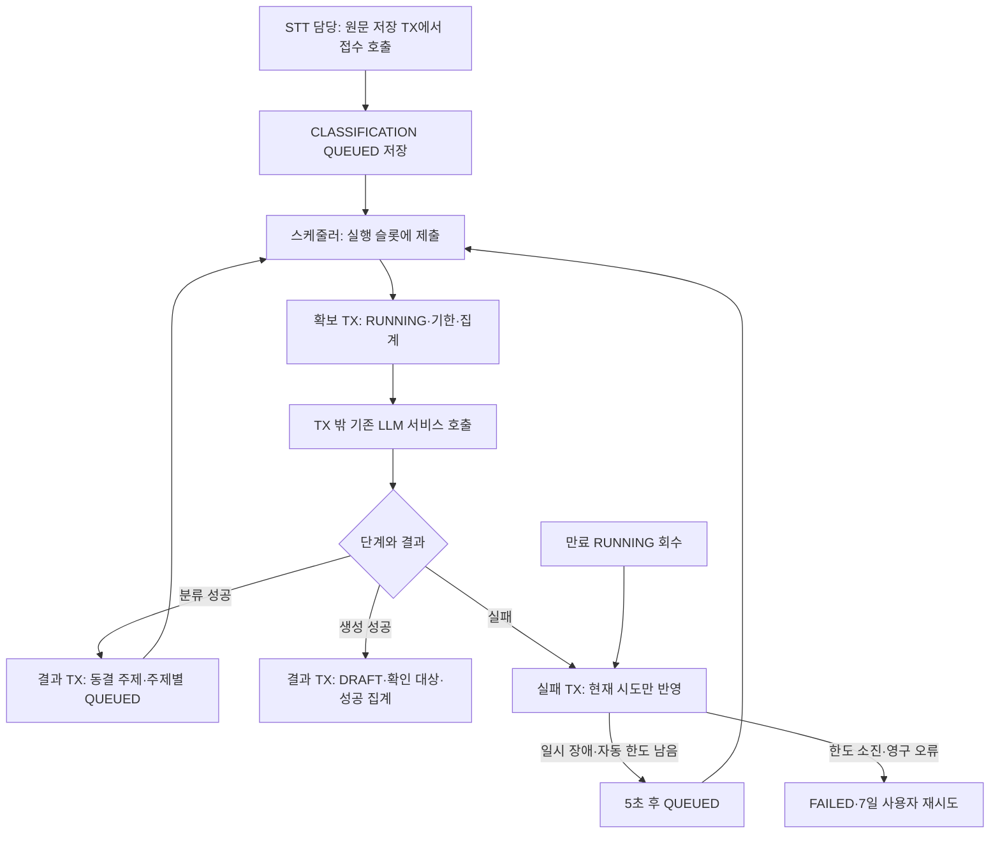

# 문서 생성 실행기 운영·연동 계약 (#525)

저장된 QUEUED Job을 읽어 분류와 주제별 문서 생성을 자동으로 실행한다. 실행기 활성화는 기본 false다. 실제 STT 완료 저장에서 원문 접수를 호출하는 연결과 녹음 상세 HTTP 응답 매핑은 각 담당 작업에서 수행한다.

## 활성화와 초기 설정

기존 LLM 공급자 설정과 인증값은 배포 환경에서 주입한다. 인증값·원문을 저장소나 실행 로그에 기록하지 않는다.

| 환경 변수 | 기본값 | 의미 |
| --- | --- | --- |
| `LLM_ENABLED` | false | 기존 LLM 전략·분류·생성 서비스 활성화 |
| `DOCUMENT_GENERATION_WORKER_ENABLED` | false | 스케줄러와 실행 pool 활성화; LLM도 활성화되어야 한다 |
| `DOCUMENT_GENERATION_WORKER_CONCURRENCY` | 2 | 한 애플리케이션 인스턴스의 최대 실행 스레드; 1–16 |
| `DOCUMENT_GENERATION_WORKER_CANDIDATE_LIMIT` | 20 | 한 번에 조회하는 후보 수; concurrency 이상, 최대 100 |
| `DOCUMENT_GENERATION_WORKER_POLL_INTERVAL` | PT1S | 대기 작업 조회 간격 |
| `DOCUMENT_GENERATION_WORKER_RECOVERY_INTERVAL` | PT5S | 기한이 지난 실행 회수 간격 |
| `DOCUMENT_GENERATION_WORKER_EXECUTION_LEASE` | PT150S | 확보부터 결과 저장까지 허용 시간; LLM request timeout보다 10초 이상 길어야 한다 |
| `DOCUMENT_GENERATION_AUTOMATIC_RETRY_BACKOFF` | PT5S | 일시 장애 재접수까지 대기; 스레드를 sleep하지 않고 DB에 예약 시각 저장 |

Duration은 양수이며 1ms 이상이어야 한다. executor 메모리 큐는 0이다. 포화되면 Job을 확보하지 않으며 DB의 QUEUED 상태를 다음 조회에 다시 발견한다. LLM 기본 timeout은 기존 120초 설정을 사용한다. 위 값은 초기 기술값이며 실제 서버의 최적 처리량이나 응답 시간 보장이 아니다. 여러 인스턴스는 각각 pool을 가지므로 모델 서버 총 동시 요청은 인스턴스 수도 고려해야 한다.

## 트랜잭션·중복·실패

- 확보는 Workspace → Job → Transcript → Batch 순서로 잠근다. 같은 후보를 여러 실행기가 제출해도 현재 QUEUED를 확보한 하나만 호출한다. 확보 자체는 attemptCount를 증가시키지 않는다.
- 외부 LLM 호출은 DB 트랜잭션 밖이다. 결과 저장은 다른 서비스 Bean의 트랜잭션에서 현재 시도·기한을 다시 검사한다. 문서·생성 시점 확인 대상·Job 성공·Batch 집계를 함께 저장한다.
- 실패/만료 회수는 Workspace → Job → Batch를 잠근다. 입력 원문이 없어도 실행 실패를 종료할 수 있다. 확보·결과 저장·실패/회수의 내부 잠금에는 트랜잭션 한정 PostgreSQL 잠금 대기 3초를 적용한다. 결과 저장에서는 삭제된 Workspace를 여전히 거절한다.
- 현재 RUNNING·시도 번호가 일치하는 실패만 처리한다. 반복 회수와 이전 시도의 응답/실패는 새 실행을 변경하지 않는다. 기한과 같은 시각도 만료다. 이미 저장된 성공의 동일 시도 replay는 기존 결과를 사용한다.
- timeout·중단·429·연결/5xx·저장 장애·실행 만료는 자동 재시도 후보이며 Job 생애 누적 최대 1회다. 인증/설정·입력·입출력 한도·응답 검증 오류는 자동으로 반복하지 않는다. Retry-After는 현재 통신 계약에 없어 고정 backoff다.
- 최초 `attempt=1/user=0/automatic=0` → 자동 접수 `2/0/1` → 사용자 접수 `3/1/1`. 사용자 재시도는 기존 본인 권한·최대 3회·마지막 실패 후 7일을 유지하며 자동 한도를 초기화하지 않는다.
- 호출/저장 오류 뒤 실패 기록도 DB 장애로 실패하면 RUNNING이 남는다. 이후 lease 회수가 처리한다. 로그는 jobId/stage/attempt/cause만 남기며 예외 원문이나 HTTP body를 출력하지 않는다.
- 삭제된 Workspace의 작업은 `WORKSPACE_DELETED`로 종료하고 재접수하지 않는다. 녹음자의 탈퇴만으로 기존 정상 접수를 중단하지 않는다.

## 녹음 상세에서 읽을 내부 계약

`DocumentGenerationProgressService.findProgress(workspaceId, recordingSessionId)`는 범위에 맞는 Batch가 없으면 empty를 반환한다. HTTP 인증·현재 Workspace 권한 확인과 화면 상태 매핑은 녹음 상세 유스케이스에서 수행한다. 반환 DTO는 batchId, recordingSessionId, status, queuedCount, runningCount, succeededCount, failedCount, finishedAt, cleanupRequestedAt이다.

| 내부 status | 해석 |
| --- | --- |
| QUEUED | 분류 또는 주제별 생성 대기 |
| RUNNING | 분류 또는 하나 이상의 주제 생성 실행 중 |
| SUCCEEDED | 등록된 주제의 생성 모두 성공 |
| FAILED | 대기·실행 작업 없이 분류 실패 또는 하나 이상의 주제 실패 |
| NO_CONTENT | 정상 분류 결과가 비었거나 입력 자체가 비어 문서 생성 대상 없음 |

분류 단계의 네 개수는 모두 0이며 status로 진행을 표시한다. 주제 등록 후 개수는 주제별 GENERATION Job 전이를 반영한다. 2개 성공/1개 실패 중 실패 Job을 재접수하면 `2/1/0/0`(success/queued/running/failed)이 되고, 성공하면 succeededCount=3이다. 성공 문서는 다른 작업을 기다리지 않고 기존 문서 API로 조회할 수 있다.

Batch는 종료 결과를 보존한다. #526에서 만료 실패 Job을 삭제해도 failedCount를 줄이거나 최종 결과를 재계산하지 않는다. 일부 실패 Job 삭제 후 다른 실패 Job의 재시도는 살아 있는 해당 Job의 전이만 반영한다. Job 목록에서 사라지는 것을 성공으로 해석하지 않는다. 외부 HTTP의 PROCESSING/COMPLETED 등 이름은 #380에서 이 계약에 맞춰 매핑한다.

## 스키마 이행·관측 범위

V33은 V32 다음에 적용하며 기존 versioned migration을 수정하거나 outOfOrder를 켜지 않는다. 기존 RUNNING은 회수 가능한 만료 기한, QUEUED는 updatedAt 예약, 과거 FAILED는 LEGACY_FAILURE로 이행한다. 동결 주제·Job·성공 문서가 불일치하면 이행을 중단하고 데이터를 보존한다.

배포 순서는 worker 비활성 → 이행 및 모든 결과 writer의 새 lease/집계 동작 배포 → worker 활성이다. 옛 결과 writer와 새 회수기가 함께 실행되는 혼합 배포는 피한다. 실제 운영 데이터와 이행은 이번 로컬 작업에서 관측하지 않았다.

로컬 실제 PostgreSQL 테스트는 동시 확보, 트랜잭션 밖 호출, 부분 성공·재시도, 만료와 이전 결과 차단, 집계 롤백, 실패 Job 삭제 후 결과 보존, 이행 보존·거절을 확인한다. 활성 Spring 스케줄러 테스트는 접수만으로 분류→두 주제 문서·확인 대상 저장→전체 성공까지 자동 실행됨을 확인한다. LLM 응답은 Mockito이며 실제 모델 성능 검증은 아니다. 중단 복구는 DB 상태·Clock으로 재현했으며 OS 프로세스 강제 종료 시험은 수행하지 않았다.
