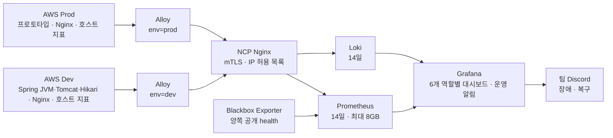

# 스프린트 1 백엔드 운영 관찰과 대응

작성일: 2026-10-01

최신화: 2026-10-02 Grafana 간헐적 502의 OOM 원인 확인 및 메모리 제한 조정(이전 Prod 배포 확인 기록 유지)
검증 대상: AWS Dev Spring API와 AWS Prod 프로토타입 API

AWS Dev·Prod의 호스트 지표, Nginx 요청 로그와 애플리케이션 로그를 NCP로 수집하고,
Grafana 대시보드와 Discord 장애·복구 알림을 구성했다. 양쪽 실제 데이터 조회와
Grafana 알림 평가·발송은 확인했다. 19시대에는 Cloudflare를 통한 팀 공용 HTTPS
주소와 개인 계정 로그인 설정까지 적용했다. 이후 사용자가 로그인한 화면을 제공해
6개 대시보드의 주요 패널, 양쪽 RDS 지표와 Discord TEST 복구 메시지 수신을 확인했다.
에이전트의 직접 브라우저 검증과 사용자 제공 화면 증거는 구분한다.
Prod의 기존 배포 경로는 현재 공개 서비스와 불일치하므로 스프린트 전체 완료로 판정하지 않는다.
아래 수치는 해당 시점의 관측값이며 부하 시험 결과나 장기 운영 안정성 보증이 아니다.

## 제출 요약

기술 요구사항 이름은 **운영 관찰과 대응**이다. 사용한 도구는 Grafana, Prometheus,
Loki, Grafana Alloy, Blackbox Exporter와 Nginx다. AWS 두 환경의 데이터를 기존
NCP 서버에 모으고, 사용자가 제공한 팀 Discord Webhook으로 알림을 보낸다.

| 완료 조건 | 확인한 근거 | 판정 |
| --- | --- | --- |
| 로그 보존 | Loki Docker volume과 14일 retention 설정. Dev Spring·Nginx, Prod 프로토타입·Nginx의 실제 로그 조회 | 수집 확인. 14일이 실제 경과한 보존 시험은 미실시 |
| 핵심 지표 대시보드 | 6개 화면의 사용자 캡처. 양쪽 health·호스트·Nginx·RDS와 Dev Spring·JVM·풀 지표 표시 | 주요 화면·RDS 표시 확인. 모든 확장 패널의 설치·조회 성공을 일괄 검증한 것은 아님 |
| 장애 알림 전달 | 연락처 테스트 성공, Dev·Prod TEST firing → inactive 발송 기록, 사용자 Discord 캡처에 양쪽 [RESOLVED] 메시지 | 팀 채널 테스트 복구 알림 수신 확인. 실제 API 중단 훈련은 별도 |
| 양쪽 관측 | env=dev/prod 지표·로그와 각각의 헬스체크 결과 확인 | 확인 |
| 양쪽 배포 파이프라인 | Dev develop 배포 성공 기록. Prod CodeDeploy 앱·그룹·S3 revision·설치 JAR과 현재 Nginx/Docker 대조 | Prod 기존 파이프라인은 Spring 배포 경로이며 현재 프로토타입 자동 배포 증거가 없음. 미완료 |
| 실제 장애 사례 | 구축 중 TLS 인증서 선택 오류로 수집 실패, 조치 후 양쪽 지표·로그 복구 | 아래 사례에 기록 |

이 문서는 기존 [AWS Dev·Prod 배포 구성 기록](../../../docs/operations/aws-dev-and-prod-environments.md)의
9/30 관측을 지우지 않고 10/1 실제 런타임 확인과 관측 구성을 추가한다.
9/30에 Prod의 Spring 경로가 404였다는 기록은 당시 사실이지만, 그 경로만으로
현재 Prod 서비스 장애를 판정하지 않는다.

## 실제 서비스와 배포 위치

| 구분 | AWS Dev | AWS Prod |
| --- | --- | --- |
| EC2 | knot-backend-dev (리소스 ID 비공개 관리) | knot-backend-ec2 (리소스 ID 비공개 관리) |
| 현재 공인 IP | 운영자 비공개 설정에서 확인 | 운영자 비공개 설정에서 확인 |
| 실제 서비스 | knot-backend.service, Spring | knot-prototype-ec2-api-1 Docker 프로토타입 |
| 앱 실행 관측 | systemd active | Docker running. Spring systemd는 inactive |
| 헬스체크 | [Dev health](https://dev-api.knoted.kr/actuator/health) | [Prod health](https://api.knoted.kr/health) |
| 소스 브랜치 | develop | 기존 AWS 파이프라인은 main |
| 파이프라인 | [knot-backend-dev-pipeline](https://ap-northeast-2.console.aws.amazon.com/codesuite/codepipeline/pipelines/knot-backend-dev-pipeline/view?region=ap-northeast-2) | [knot-backend-pipeline](https://ap-northeast-2.console.aws.amazon.com/codesuite/codepipeline/pipelines/knot-backend-pipeline/view?region=ap-northeast-2) |
| 빌드·배포 | knot-backend-dev-build → CodeDeploy knot-backend-dev | 기존 knot-backend-build → CodeDeploy knot-backend |

Dev는 9/30에 Source·Build·Deploy 및 health 200 UP을 확인했다.
Prod의 현재 Nginx는 실행 중인 프로토타입 API의 4310 포트에 연결한다.
따라서 Prod 관측은 /health와 Docker 로그를 기준으로 구성했다.
현재 공개 서비스와 기존 Spring 배포 경로의 불일치는 아래 실측으로 확인했다.
과거 CodeDeploy 성공을 현재 프로토타입의 자동 배포 성공으로 해석하지 않는다.

### 20:32~20:35 KST Prod 배포 경로 대조

기존 SSH 키로 Prod EC2에 접속해 읽기 전용 명령과 인스턴스 역할 `ec2-project`의
CodeDeploy 조회 권한을 사용했다. 서비스·Nginx·IAM 변경이나 새 배포는 실행하지 않았다.

| 단계 | 확인한 대상과 결과 | 증거 구분 |
| --- | --- | --- |
| 소스 | `knot-backend-pipeline`의 `main`, 빌드 프로젝트 `knot-backend-build` | 9/30 콘솔 기록. 이번 `codepipeline:GetPipeline`, `codebuild:BatchGetProjects`는 권한 거부되어 최신 설정·source commit을 재확인하지 못함 |
| 빌드 계약 | 루트 `buildspec.yml`: Java 25 Gradle 빌드 → `app.jar`·`appspec.yml`·`scripts` | 현재 로컬 저장소 원본. 원격 빌드가 현재 파일과 동일하다는 증거는 별도 |
| 실제 배포 revision | `d-4YH31QHVK`, 앱 `knot-backend`, 그룹 `knot-backend-deployment-group`, `Succeeded` | 실시간 `get-deployment`·`get-deployment-group`. 그룹의 마지막 시도·성공 모두 이 배포, 완료 9/18 15:19:54 KST |
| 배포 산출물 | S3 `techcourse-project-2026-artifacts/knot-backend-pipelin/BuildArtif/WAzzouv`, ZIP, eTag `4caed672093f932e489e76bc1c205e87-3` | CodeDeploy revision 실측 |
| 배포 대상 | EC2 태그 `Name=knot-backend-ec2`. 해당 호스트 역할 세션의 instance ID는 비공개 관리 | 배포 그룹 selector·호스트 STS 세션·호스트의 마지막 성공 설치 기록 |
| 설치 동작 | 배포 archive의 AppSpec는 JAR을 `/opt/knot-backend/app.jar`에 설치. hook은 `knot-backend.service`를 시작하고 `127.0.0.1:8080/actuator/health`를 검사 | 실제 `d-4YH31QHVK/deployment-archive` 파일과 hook |
| 현재 Spring | `inactive`, ExecStart `/usr/bin/java -jar /opt/knot-backend/app.jar` | 호스트 `systemctl show` |
| 현재 공개 서비스 | Nginx `api.knoted.kr` → `127.0.0.1:4310` → `knot-prototype-ec2-api-1`, image `knot-prototype-api:09c8394`, healthy | 호스트 Nginx 설정·Docker inspect. 이미지 태그만으로 Git commit 동일성을 확정하지 않음 |
| 실제 응답 | 호스트 `4310/health`와 공개 `https://api.knoted.kr/health` 각각 HTTP 200 | 호스트 curl, Grafana API 우회 조회가 아님 |

배포 archive의 JAR과 현재 `/opt/knot-backend/app.jar`의 SHA-256은 모두
`073cfac8f52e1451603e11f5ca01679ff38345f1c21ceb749d6d44d34c6f47b5`다.
즉 마지막 성공 Spring 산출물은 디스크에 남아 있지만 현재 공개 요청을 처리하지 않는다.
프로토타입의 Compose 경로는 `/opt/knot-prototype/compose.ec2.host-proxy.yml`이며
현재 API 컨테이너 시작 시각은 10/1 10:49:37 KST다. 이 Compose를 위 CodeDeploy
hook이 갱신·기동하는 동작은 확인되지 않는다.

현재 프로토타입의 Compose는 API DB를 같은 스택의 `postgres:5432/knot_prototype`에
연결한다. 실행 중인 `knot-prototype-ec2-postgres-1`은 `postgres:17-alpine`이다.
따라서 아래 Prod RDS `knot-database` 지표 수집 완료를 현재 프로토타입의 RDS 사용
완료로 해석하지 않는다. DB 비밀번호와 런타임 비밀 환경변수는 조회·기록하지 않았다.

판정: **기존 Prod Spring 파이프라인은 존재하지만 현재 공개 프로토타입의 배포
파이프라인으로 볼 수 없다.** 최신 파이프라인 source commit과 9/30에 보였던 rollback
commit의 연결은 여전히 미확인이다. 프로토타입을 유지해 자동 배포 경로를 연결할지,
공개 서비스를 Spring으로 전환할지는 별도 배포 결정·검증이 필요하다.

NCP의 기존 knot-backend.service는 inactive/masked이며, GitHub의
Backend Dev CD workflow는 disabled_manually다. NCP의 앱·DB 파일을 삭제하지 않았고,
NCP 서버 자체도 종료하지 않았다. NCP는 이제 관측 수집·조회 서버로 사용한다.

## 수집 구조



설정 원본은 [backend/ops/observability](../../ops/observability)에 있다.
NCP 배포 경로는 /opt/knot-observability, AWS 수집기 경로는
/opt/knot-observability-agent다. 이미지 버전은 compose.yml의 digest로 고정했다.

호스트 지표는 30초마다 수집하고 project=knot, env=dev/prod 라벨을 붙인다.
Spring 로그는 journald에서 knot-backend.service만 읽는다. 최초 읽기 범위는
7시간이며 이후 새 로그를 계속 수집한다. Prod는 지정한 프로토타입 컨테이너만 읽는다.

Nginx 로그에는 시각, 호스트, 메서드, URI 경로, 상태 코드, 전체·upstream 응답 시간을
남긴다. 요청 body, Cookie, Authorization과 query string은 이 포맷에 넣지 않는다.
기존 앱이 출력하는 로그 자체에 민감정보가 없는지를 전부 감사한 것은 아니다.

## 접근과 보존

Grafana·Prometheus·Loki 포트는 NCP loopback에만 바인딩한다.
외부 수집은 Nginx의 HTTPS 경로로 제한하며, Dev·Prod별 client 인증서,
client CN과 AWS IP 허용 목록을 검사한다. 수집 경로는 POST만 허용한다.
인증된 GET이 HTTP 403으로 거부되는 것도 두 환경에서 확인했다.

팀 공용 주소는 [Grafana](https://grafana.knoted.kr/)다. Cloudflare 프록시 A 레코드는
NCP 원 서버를 가리키며(주소는 비공개 관리), 해당 호스트에만 TLS strict 구성 규칙을 활성화했다.
다른 호스트의 SSL/TLS 모드는 변경하지 않았다. 전용 Origin CA 인증서의 SAN,
CA 신뢰와 개인키 일치를 검증했고 개인키는 NCP에만 저장했다.

로그인 전에는 데이터 조회를 허용하지 않는다. 공용 구성에서 auth proxy와 anonymous를
끄고 로그인 폼과 Secure cookie를 활성화했다. Nginx는 고정 Viewer 헤더를 제거하며,
원본 연결은 Cloudflare IP와 loopback만 허용한다. 미인증 사용자·검색·데이터 소스·
대시보드 API와 위조 Viewer/Admin 헤더 요청은 HTTP 401, 원본 직접 HTTPS 접속은
HTTP 403으로 확인했다. login 경로만 HTTP 200이다.

초기 localhost SSH 터널은 개인 PC 전용 주소였다. 공용 구성 적용 뒤 자동 Viewer
로그인은 비활성화됐으므로 기존 127.0.0.1:33000 주소를 팀 공유 주소로 쓰지 않는다.
SSO와 팀원별 계정 초대는 아직 구성하지 않았다. 임의 팀원 계정이나 공유 비밀번호를
생성하지 않았고 기존 관리 계정의 로컬 API 인증만 확인했다.

공용 구성 재시작에는 override를 반드시 함께 사용한다.

```sh
docker compose -f /opt/knot-observability/compose.yml \
  -f /opt/knot-observability/compose.team.yml up -d
```

Nginx reload 직후의 TLS 검증은 이전 인증서로 실패했고 2초 뒤 같은 요청은 200이었다.
배포 스크립트에 인증서 검증을 유지한 제한된 준비 대기를 추가한 뒤 전체 인가 검증을
통과했다. 적용 전 설정은 /opt/knot-observability/team-backup.Xazynt에 보관했다.
당시 에이전트의 브라우저 접근은 권한 거부로 멈췄다. 이후 사용자가 공용 주소에서
로그인한 대시보드·알림 화면을 제공했다. HTTP 검증과 사용자 제공 화면 확인을 구분한다.

| 항목 | 현재 설정 |
| --- | --- |
| Prometheus | Docker volume, 14일 또는 8GB 도달 시 더 이른 데이터부터 제거 |
| Loki | Docker volume, retention 336시간 |
| 수집기 상태·전송 큐 | AWS Alloy Docker volume |
| 관측 컨테이너 자체 로그 | 파일당 10MB, 최대 3개 |
| NCP 메모리 한도 | Prometheus 768MiB, Loki 768MiB, Grafana 1GiB(10/2 조정), Blackbox 128MiB |
| AWS 수집기 한도 | 환경마다 256MB, 0.25 CPU |

Webhook과 관리자 비밀번호는 원격 secrets 디렉터리에만 둔다.
Discord 환경변수 파일은 root 전용 0600이며 저장소에는 값을 넣지 않았다.
개인키·인증서와 런타임 환경변수는 .gitignore 대상이다. 전달에 쓴 로컬 Webhook
임시 파일은 삭제했다. 인증서는 만료 전 갱신하고, 자동 공인 IP 변경 시 허용 목록과
인증서·DNS의 적용 범위를 다시 확인해야 한다.

## 대시보드의 실제 조회 결과

### 18시대 추가 검증과 내부 지표 연결

사용자가 관측성 변경만 추가한 Dev 재배포를 승인했다. 별도 OS 임시 작업 공간의
develop 기준 b5db27736465a17e133cfac3f1e8a89333a1a95a를 빌드해 설치 JAR과 비교했다.
기준본의 BOOT-INF/classes 클래스·리소스 133개가 설치본과 전부 동일했다.
최종 산출물에서 달라진 앱 항목은 SecurityConfig.class와
application-observability.properties뿐이다. Micrometer Prometheus 1.17.0과
전이 Prometheus 라이브러리 7개가 추가됐다. 인증 작업 브랜치의 기능·migration을
배포하지 않았으며 현재 CodePipeline 자체를 실행한 배포도 아니다.

- 이전 JAR SHA-256: 328ab142e1125d8df149773383258213ecd9a466898041a1dadcb1f65961e0ea
- 배포 JAR SHA-256: 4f6eb7881b22ecda0c2d32e2853fa5fc2dce3907bb21e177fbf80c74146fea97
- 이전 JAR·Nginx·Alloy 백업: Dev /opt/knot-observability-agent/backup-dev-metrics-20261001
- 기존 health: HTTP 200 유지. 서비스 재시작 중 짧은 불가용 구간은 있었으며 초 단위 길이는 계측하지 않았다.
- 로컬 /actuator/prometheus: 실제 JVM·Tomcat·Hikari 지표 출력.
- 공용 HTTPS /actuator/prometheus: HTTP 403. EC2 공인 IP의 8080 직접 접근: HTTP 401.
- NCP Prometheus: up{env="dev",job="spring"}=1, JVM 메모리 시계열 8개.
- 실제 Dev Hikari: active=0, pending=0, max=10. Tomcat max threads=200.
- 재생성 뒤 Dev Alloy: running, OOM=false, 재시작 0회. 한 시점에 약 50MiB/256MiB.
- 공개 /api/v1/auth/csrf GET 시나리오 12건: 전부 HTTP 200. 쿠키와 응답 body는 기록하지 않았다.

observability profile을 systemd drop-in에서 추가했다. 기존 공개 health 경로를
유지하며 앱 인가는 GET 지표 요청의 실제 remote address를 loopback으로 제한한다.
Nginx는 지표 경로를 403으로 차단해 공용 프록시 요청이 loopback 인가를 통과하지
못하게 한다. Forwarded 헤더 spoofing과 실제 JWT로 인증된 외부 사용자도 차단되는
acceptance test를 수행했다. 향후 trusted proxy 설정을 바꾸면 이 경계를 다시 검증한다.

등록한 화면은 다음과 같다. 모두 동일 env=dev/prod 선택을 사용한다.

| 화면 | 적용 범위 | 실제 검증 |
| --- | --- | --- |
| [01 Overview](https://grafana.knoted.kr/d/knot-operations) | 양쪽 health·호스트·Nginx·로그 | 양쪽 데이터 조회 성공 |
| [02 Spring Boot](https://grafana.knoted.kr/d/knot-spring) | Dev API 요청률·p95·JVM·GC·uptime | Dev 지표 조회. Prod Spring 지표 없음은 예상 결과 |
| [03 Tomcat & Hikari](https://grafana.knoted.kr/d/knot-pools) | Dev 요청 처리·DB 연결 풀 | Dev 8개 지표 쿼리 성공. Prod에는 적용하지 않음 |
| [04 Infrastructure](https://grafana.knoted.kr/d/knot-infra) | 양쪽 CPU·메모리·디스크·네트워크·load | 양쪽 데이터 조회 성공 |
| [05 RDS](https://grafana.knoted.kr/d/knot-rds) | 환경별 RDS CloudWatch 지표 | 18시대에는 안내만 있었음. 이후 연결·사용자 화면 확인 결과는 아래 최신 검증 참고 |
| [06 PROD vs DEV](https://grafana.knoted.kr/d/knot-compare) | 양쪽 공통 지표 비교 | 양쪽 데이터 조회 성공 |

18시대에는 6개 대시보드와 총 51개 패널이 Grafana API에 등록된 것을 확인했다.
45개 데이터 패널을 dev/prod 각각 조회한 90개 요청에서 쿼리 오류가 없었다.
Prod Spring 전용 16개 요청의 결과가 비어 있는 것은 런타임 차이를 반영한 것이다.
당시 RDS 화면은 안내 text뿐이었으며 그 초기 등록을 RDS 수집 완료로 세지 않았다.
API 차트는 Actuator 자체 요청을 제외하고, 실제 트래픽이 없는 구간의 비율·p95를
정상 0으로 대체하지 않는다. 환경 런타임이 다르므로 비교 화면으로 성능 우열을 단정하지 않는다.

19시대 공용 로그인 설정 적용 뒤에도 관리자 API에서 같은 대시보드 6개, 데이터 소스
Prometheus/Loki 2개와 알림 7개가 유지됐다. 알림은 모두 health=ok/state=inactive이며
Dev Spring up=1, 양쪽 공개 API probe_success=1, Loki env=dev/prod를 확인했다.

### 20시대 사용자 화면 및 RDS 연결 확인

사용자가 공용 Grafana에서 로그인한 뒤 제공한 화면을 근거로 최신화했다.
그래프의 시간 범위는 주로 최근 30분, 마지막 시점은 20:15~20:17 KST다.
아래 값은 화면의 순간 관측이며 에이전트가 전체 화면을 자동 재검사한 결과가 아니다.

| 확인 범위 | 사용자 캡처에서 확인한 내용 |
| --- | --- |
| 01 Overview / 06 PROD vs DEV | Dev·Prod 외부 API 정상·HTTP 200, 호스트 수집 중, 양쪽 CPU·메모리·루트 디스크·Nginx 그래프 |
| 02 Spring Boot | Dev 요청률·p95, JVM heap/non-heap, GC, live threads. 화면의 heap 102 MiB, non-heap 144 MiB, live threads 29 |
| 03 Tomcat & Hikari | Dev busy 1 / max 200, active 0 / idle 10 / pending 0 / max 10. Prod 선택 시 Spring 전용 데이터 없음은 현재 프로토타입 런타임에 따른 결과 |
| 04 Infrastructure | Prod CPU 약 1.8~4.8%, 메모리 약 65~67%, 루트 디스크 약 43.4%, 네트워크 RX/TX 그래프 |
| 05 RDS / Overview 하단 | Prod `knot-database` CPU·DB connections·가용 메모리/스토리지·read/write latency. Overview에 Dev `knot-dev-database`와 Prod 양쪽 CPU·connections·write latency |
| RDS 표본 | Dev connections 10, Prod 0. Prod CPU 약 4%, 가용 메모리 약 160 MiB, 가용 스토리지 약 17 GiB. 값이 존재하는 0과 데이터 없음은 구분 |
| 최근 서비스 로그 | `env=prod` Nginx JSON `/health`, status 200, duration 0.002초와 `env=dev` 로그 표시 |
| 전체 API 집계 | 5xx 최근 값 Dev·Prod 0%, p50 Dev 15 ms / Prod 6.50 ms, p95 15 ms / 491 ms, p99 15 ms / 611 ms. 서로 다른 트래픽·런타임의 성능 우열 근거로 사용하지 않음 |
| Alert rules | 사용자 캡처에 Dev·Prod API·수집 중단, CPU·메모리, Dev Spring, 양쪽 5xx·p95, 디스크, Hikari saturation 규칙과 보이는 항목의 Normal/Provisioned 표시 |

RDS 수집 설정은 기존 EC2 IAM 역할을 사용하는 Alloy CloudWatch exporter다.
`DBInstanceIdentifier`는 Dev `knot-dev-database`, Prod `knot-database`로 정적 매핑했다.
CPU, connections, freeable memory, free storage, read/write latency, read/write IOPS,
disk queue depth의 9개 지표를 5분마다 조회하며 최근 10분 검색·5분 Average를 사용한다.
기존 mTLS remote-write → NCP Prometheus → Grafana 경로를 재사용한다.
Hikari 연결 풀이나 실시간 DB 순간값으로 대체하지 않으며 별도 AWS 키를 저장하지 않는다.
설정 근거는 [RDS 수집 결정 초안](../../decisions/draft/rds-cloudwatch-alloy.md)이다.

현재 로컬 대시보드 JSON은 6개, 안내 포함 122개 패널·116개 target이며 알림 규칙은 15개다.
이는 로컬 파일 집계다. 초기 51개/90쿼리 검증을 확장판 전체 검증으로 바꾸지 않는다.
화면에 잘리지 않은 패널·규칙만 직접 확인한 것으로 기록한다.

화면 확인 중 10/1 20:08:24 KST Grafana 공용 주소에서 Cloudflare 502 Host Error가
발생했고, 일부 패널은 일시적으로 No data/확인 불가/수집 없음이었다가 이후 표시됐다.
원인·조치를 특정하지 못했으므로 정상 화면 복귀만으로 이 문제의 해결을 선언하지 않는다.
Prod 4xx 비율도 일부 구간 높게 나타났으며 해당 요청 URI·상태 코드 분석은 별도다.

### 2026-10-02 Grafana 간헐적 502: 컨테이너 메모리 제한 초과

- 문제: 사용자 화면에서 10:03:59 KST Cloudflare 502 Host Error 발생. 새로고침 뒤 접속이 복구됐다.
- 원인 근거: NCP 커널이 10:03:49와 10:05:41에 해당 Grafana 컨테이너의 프로세스를 OOM kill했다. 커널의 `usage 524288kB, limit 524288kB`와 Docker `HostConfig.Memory=536870912`가 일치한다.
- 연결 근거: 같은 시각 Nginx의 `127.0.0.1:3000` upstream premature close/reset/refused 오류가 발생했고, 컨테이너 재시작 횟수는 8이었다. 자동 재시작 정책 `unless-stopped`가 접속 복구를 설명한다. 마지막 `OOMKilled=false`만으로 과거 OOM을 배제하면 안 된다.
- 서버 자원: 총 약 15.4GiB, 사용 가능 13,777MiB, 루트 디스크 12% 사용. 이번 오류는 서버 전체 메모리 고갈이 아니라 Grafana 컨테이너의 512MiB 제한 초과다.
- 조치: 사용자 승인 후 10:10:51 KST `docker update --memory 1g --memory-swap 2g`로 실행 중 컨테이너 제한을 1GiB로 조정했다. 호스트 swap은 0이며 swap 파일을 추가하지 않았다. 컨테이너를 재시작하거나 데이터를 삭제하지 않았다.
- 영속 설정: 로컬 및 `/opt/knot-observability/compose.yml`에서 Grafana `mem_limit`만 512m → 1g로 변경했다. `compose.team.yml`과 병합한 실제 Docker Compose 검증이 통과했다. 변경 전 Compose 백업은 `/opt/knot-observability/compose.yml.before-grafana-memory-20261002-1009`에 보존했다.
- 초기 검증: 실제 로그인된 브라우저에서 Overview를 열고 수동 새로고침했다. 양쪽 API 정상, CPU·메모리 시계열 표시와 Grafana 데이터 쿼리 HTTP 200을 확인했다. 브라우저 요청 91개에 오류가 없었으며 최근 데이터 쿼리 응답 20개가 200이었다.
- 초기 자원 표본: 대시보드 조회 중 868.4MiB/1GiB를 사용하면서 재시작 횟수 8을 유지했다. 512MiB를 초과하는 실제 사용량이 기존 제한으로 수용되지 못함을 보여준다. 메모리가 많이 필요한 쿼리인지 누수인지는 별도 분석이며, 증설만으로 장기 안정성을 보증하지 않는다.
- 최종 관찰: 10:10:51~10:16:12 KST(5분 21초) restart=8 유지, 새 Grafana OOM kill=0, 10:11 이후 Nginx Grafana upstream 오류=0, health database=ok. 메모리 표본은 868.4 → 839.1 → 840.9MiB였다. 전체 페이지 재로딩 및 자동 갱신 후 추가 데이터 쿼리 32개가 모두 HTTP 200이었다. 페이지 전환 중 아이콘 요청 1건의 ERR_ABORTED는 있었으며 502 응답과 구분한다.
- 브라우저 정상 화면 증거: `/private/tmp/grafana-memory-qa-20261002.png`. 실제 렌더링과 서버 검증을 구분해 보존한다.
- 안전 범위: 비밀번호·인증 헤더·Webhook은 기록하지 않았다. AWS 서비스, DB, Nginx 인증/TLS 정책, 대시보드 및 알림 규칙을 변경하지 않았다.

## 첨부 목표 구성과의 최신 대조

사용자가 첨부한 6개 Dashboard 권고 문서는 최종 목표이며 현재 구현의 완료 증거가 아니다.
로컬 설정·실제 화면·미검증 범위를 아래와 같이 구분한다.

| 첨부 목표 | 현재 상태 | 남은 범위 또는 차이 |
| --- | --- | --- |
| 동일 Dashboard의 환경·인스턴스 전환 | env·instance 선택 화면 확인 | instance는 Prometheus 패널에만 적용. host·Spring·probe의 instance 값은 서로 다르며 Loki는 env로 선택 |
| Overview·Spring HTTP/JVM | 주요 지표와 전체 API 집계 화면 확인 | p50/p95/p99·4xx/5xx·heap 비율 표시. 추가 JVM·GC·상태 코드 패널은 로컬 JSON에 있으며 모든 확장 패널의 실측은 미완료 |
| Tomcat·Hikari | Dev 주요 지표 화면 확인, 추가 패널 로컬 구성 | busy/max, active/idle/pending/max 확인. current threads/connections·usage/acquire 등 확장 패널 전체 실측은 미완료. Prod Spring 지표 없음 |
| Infrastructure | 양쪽 주요 지표 화면 확인, 세부 패널 로컬 구성 | CPU mode·cache/swap·disk I/O/latency·packets/errors/drops·load5/15가 JSON에 있음. 전체 패널 실측은 미완료 |
| RDS CloudWatch | 양쪽 RDS 표시 확인 | EC2 역할·Alloy 방식의 9개 지표 구성. IOPS·queue depth는 이번 캡처 범위 밖. 현재 Prod 프로토타입 DB는 별도 Docker PostgreSQL |
| 로그 보존 | 수집기 방식 구현 | Alloy→Loki와 14일 retention. application.log+logrotate 방식은 채택하지 않음. 실제 14일 경과 검증은 미실시 |
| 알림 | 로컬 15개 규칙, 운영 목록 화면 확인 | 5xx·p95·디스크·Hikari와 Dev 정책 차등 구성. 전체 규칙별 실제 장애 발생 시험은 미실시. Prod DOWN 문구와 for 불일치는 아래 기록 |
| Discord 팀 수신 | Dev·Prod TEST 복구 메시지 수신 캡처 확인 | Firing은 서버 발송 기록, Resolved는 실제 채널 화면. 실제 API 중단 시험과 구분 |
| 양쪽 배포 | Prod 현재 서비스와 불일치 확인 | 같은 EC2지만 기존 경로는 Spring JAR, 공개 서비스는 Docker 프로토타입. 현재 서비스용 자동 배포 완료로 판정하지 않음 |
| 장애·성능 문제 1건의 조치 전후 비교 | 수집 장애 복구 사례만 기록 | DEV DB pool 부하 재현, 원인 분석, 같은 부하의 조치 전후 지표 비교는 미실시 |
| 배포 Annotation | 미구현 | 선택적 권고 항목이며 현재 자동 주석 없음 |

따라서 관측 기반과 6개 화면 구조는 만들어졌지만 첨부 문서 전체를 완료했다고 판정하지 않는다.

공통 인가가 바뀌어 로컬 현재 브랜치의 전체 Gradle check도 실행했다.
unit 217, integration 66, acceptance 111로 총 394개 실패·오류 0개,
Spotless와 git diff --check가 통과했다. 별도 Dev 기준 작업 공간의 관련
공개 API·보안·지표 회귀 테스트도 통과했다. 로컬 테스트와 실제 호스트 검증을 구분한다.

변경은 아직 commit/push하지 않았다. 다음 develop CodePipeline 배포는 저장소에
없는 이 관측성 JAR을 원래 버전으로 덮어쓸 수 있다. 지속 반영에는 별도 검토·게시가 필요하다.
도입 근거와 검토한 대안은 [Dev 내부 지표 결정 초안](../../decisions/draft/dev-prometheus-metrics.md)에 기록했다.

### 최초 17시대 관측값

Grafana의 Prometheus·Loki 데이터 소스 health 검사는 모두 OK였다.
아래 값은 10/1 17시대의 한 시점이며 쿼리마다 조회 시각에 작은 차이가 있다.

| 패널 | Dev | Prod |
| --- | --- | --- |
| 공개 API 정상 여부 | probe_success=1 | probe_success=1 |
| HTTP 상태 | 200 | 200 |
| 외부 health 소요 시간 | 약 0.238초 | 약 0.057초 |
| CPU 사용률 | 약 2.84% | 약 3.78% |
| 메모리 사용률 | 약 62.65% | 약 65.12% |
| 루트 디스크 사용률 | 약 44.86% | 약 43.38% |
| 최근 호스트 지표 수집 | 1 | 1 |
| Nginx 요청률 | 약 0.125건/초 | 약 0.333건/초 |
| Nginx 응답 시간 p95 | 약 0.010초 | 약 0.425초 |
| HTTP 5xx 요청률 | 0 | 0 |
| 서비스 로그 | Spring·Nginx 로그 확인 | 프로토타입·Nginx 로그 확인 |

네트워크 수신량 패널도 양쪽에서 조회됐다. 별도의 시나리오로 Dev·Prod에
각각 health 요청 12건을 보냈고 24건 모두 HTTP 200이었다. 이는 관측 데이터가
흐르는지 확인한 소량 요청이며 성능 부하 시험은 아니다.

상태 패널은 순간값으로 조회하여 과거 정상값을 현재 상태로 보여 주지 않도록 했다.
API는 0=장애, 1=정상으로 표시한다. 호스트 수집 패널은 최근 2분 내 CPU 지표 존재를
보며 데이터가 없으면 수집 없음으로 표시한다. 이것만으로 EC2 전원이 꺼졌다고
단정하지 않는다. 정확한 running/stopped 상태는 AWS EC2 콘솔의 별도 정보다.

HTTP 5xx가 없을 때는 Nginx 전체 로그가 있는 환경에 한해 0으로 표시한다.
전체 요청 로그까지 끊긴 상태를 정상 0으로 대체하지 않는다.

## 장애 및 복구 알림

아래 조건은 현재 로컬 provisioning 파일의 15개 규칙을 기준으로 한다.
사용자 알림 목록 캡처는 보이는 항목의 등록·Normal 상태를 확인하는 근거이며,
모든 운영 규칙의 설치된 식·지속 시간을 API로 재조회한 결과는 아니다.

| 규칙 | 조건 |
| --- | --- |
| Dev API unavailable | Dev probe_success가 5분 이상 1 미만 |
| Prod API unavailable | 로컬 for=1분. 화면·annotation 문구는 2분으로 서로 불일치 |
| Dev metrics missing | Dev CPU 지표가 최근 3분 동안 없고 그 상태가 1분 지속 |
| Prod metrics missing | Prod CPU 지표가 최근 3분 동안 없고 그 상태가 1분 지속 |
| Host CPU high | 환경별 CPU 사용률 85% 초과가 10분 지속 |
| Host memory high | 환경별 메모리 사용률 90% 초과가 5분 지속 |
| Dev Spring metrics unavailable | 최근 3분 Spring scrape 성공이 없거나 데이터가 없고 1분 지속 |
| DEV / PROD API 5xx high (각 1개) | health·actuator 제외, 최근 5분 최소 20요청 조건에서 5xx 비율 5% 초과가 5분 지속 |
| DEV / PROD API p95 high (각 1개) | health·actuator 제외, 전체 요청 p95 1초 초과가 5분 지속 |
| Root disk high / critical (각 1개) | 루트 사용률 85% 초과 5분 / 95% 초과 2분 |
| Dev Hikari saturation | active/max 90% 초과가 5분 지속 |
| Dev Hikari waiting | pending > 0이 2분 지속 |

30초마다 규칙을 평가한다. API 규칙에서 데이터 없음과 조회 오류도 알림 상태로
처리한다. Discord 정책은 alertname·env별로 묶고, 첫 그룹 대기는 10초,
변경 묶음 간격은 1분, 반복 알림은 4시간이다. 로컬 Dev route는 첫 그룹 대기 1분,
변경 묶음 간격 5분, 반복 12시간으로 구분했다. 실제 전송 시각에는 평가와 그룹
대기 시간이 더해진다. 복구 메시지도 활성화했다.
구성은 [Grafana 파일 provisioning 형식](https://grafana.com/docs/grafana/latest/alerting/set-up/provision-alerting-resources/file-provisioning/)을 따른다.

다음 순서로 서버를 중지하지 않고 알림 경로를 검증했다.

1. 설치된 Grafana 13.2.3의 연락처 테스트 API로 Discord 발송을 요청했다.
   HTTP 200, status=success, duration=384ms를 받았다.
2. 실제 서비스와 분리된 TEST 규칙을 Dev·Prod 각각 생성하고 firing/health=ok를 확인했다.
   Discord 전송 카운터가 2건이었다.
3. TEST 규칙의 식을 0으로 바꿔 inactive/health=ok를 확인했다.
   Discord 전송 카운터가 4건으로 늘었다.
4. TEST 규칙을 각각 HTTP 204로 삭제하고 당시 운영 규칙 6개만 남은 것을 확인했다.
   18시대 Dev Spring 지표 수집 규칙 1개를 추가해 당시 운영 규칙은 7개였다.

연락처 테스트는 Grafana 13의
[현행 receiver test API](https://grafana.com/docs/grafana/latest/upgrade-guide/upgrade-v13.0/)를 사용했다.
이 시험은 실제 Grafana 평가·발송 경로를 검증하지만, 서버 중단에 의해
Blackbox가 0으로 변하는 전체 장애 훈련을 대신하지 않는다.
이후 사용자 Discord 화면에서 `[RESOLVED] TEST Knot dev alert routing`과
`[RESOLVED] TEST Knot prod alert routing`을 모두 확인했다. `test=true`이며
실제 장애가 아니라 전달 경로 검증이라는 annotation도 표시됐다.
따라서 양쪽 테스트 복구 메시지의 채널 도착은 확인됐고, Firing 단계는 앞선 서버 발송
기록으로 확인한다. 실제 서비스 중단·복구로 발생한 메시지라고 제출하지 않는다.

해당 TEST 캡처의 Source·Silence 링크는 `http://127.0.0.1:33000`으로 남아 있다.
팀원이 클릭할 운영 링크로는 적합하지 않다. 현재 로컬 `compose.team.yml`의 root_url은
`https://grafana.knoted.kr/`이지만, 이 설정이 반영된 이후의 새 메시지 링크는 별도
수신 확인이 필요하다. 오래된 TEST 메시지인지 현재 설치 설정 오류인지는 확정하지 않았다.
Prod DOWN의 실제 for=1분과 2분 안내 문구도 정합을 맞춰야 한다.
이번 요청은 배포 대조·기록 최신화이므로 알림 설정 변경·추가 발송은 수행하지 않았다.

NCP 관측 서버 자체가 꺼지면 이 서버의 Grafana도 알림을 보낼 수 없다.
관측 서버 장애까지 감지하려면 외부 감시가 별도로 필요하다.

## 실제 장애 사례 TLS 인증서 선택 오류

2026-10-01 오후 관측 수집기 구축 중 AWS Dev·Prod의 NCP 첫 연결이 실패했다.
인증된 HTTPS 점검에서 다음 오류와 HTTP 000을 관측했다.

```text
curl: (60) SSL: no alternative certificate subject name matches target ipv4 address '<비공개 원 서버 IP>'
NCP authenticated route HTTP 000
```

수집기는 NCP IP로 접속했지만, IP 접속 요청에서 기존 Nginx HTTPS 서버의 인증서가
선택됐다. 새 관측 서버 인증서의 IP SAN이 아니라 기존 인증서를 받으면서 검증이
실패했다. 사용자 API 장애가 아니라 로그·메트릭 수집 경로의 실제 초기 연결 장애다.

조치는 관측 수집용 server block을 443의 default_server로 선택되게 하고,
NCP IP SAN을 가진 서버 인증서와 Dev·Prod client 인증서를 사용하도록 한 것이다.
Nginx 설정 검사 후 reload했고 TLS 검증을 끄거나 insecure 옵션을 쓰지 않았다.

조치 뒤 Prometheus에서 env=dev와 env=prod 각각의 node_cpu_seconds_total 시계열
16개가 조회됐다. Loki의 env 라벨에도 두 환경이 나타났고 실제 Nginx·앱 로그를
조회했다. 양쪽 외부 API probe_success=1도 확인했다. 인증서를 제시한 GET은
각각 403으로 거부되어 수집 API의 POST 제한도 유지됐다.

최초 실패 시 데이터 조회 건수를 따로 계측하지 않았으므로 실패 전 건수를 0으로
단정하지 않는다. 장애의 시작·종료 초 단위 시각과 사용자 영향 시간도 계측하지 않았다.

## 추가로 발견한 앱 로그 초기 수집 문제

Dev Alloy의 journal 초기 범위가 1시간이었다. 당시 journald의 최근 1시간
앱 로그는 0건이었지만 24시간에는 1,219건이 있었고, 마지막 앱 로그 시각은
15:17경이었다. 수집기 journal read 카운터가 0이고 Loki spring 조회도 비어 있었다.

초기 범위를 7시간으로 늘리고 Alloy 설정 검증 후 수집기만 재시작했다.
journal read 카운터가 13으로 증가하고 Loki에서 실제 Dev Spring 로그가 조회됐다.
Spring 서비스는 active를 유지했다. 이는 기본 7시간 초기 범위를 설명한
[Alloy journal 문서](https://grafana.com/docs/alloy/latest/reference/components/loki/loki.source.journal/)와도 일치한다.

Prod는 실제 앱 로그가 이미 저장돼 있었다. 명시적인 start/end 24시간 쿼리로
프로토타입 startup 로그 2건을 확인했다. 좁은 최근 조회 구간에 새 로그가 없다는
사실을 수집기 장애로 해석하지 않는다. API·요청 관측에는 새로 쌓이는 Nginx 로그를
함께 사용한다.

## 대응 방법

Dev 지표 연결 중 Alloy 표현식의 지원되지 않는 삼항 연산자 문법으로 수집기가
재시작 루프에 들어간 문제도 수정했다. discovery.relabel의 env=dev keep 규칙으로
대체하고 새 one-off 컨테이너에서 validate한 뒤 수집기를 force-recreate했다.
파일을 install로 교체해도 기존 파일 bind mount가 이전 inode를 읽을 수 있으므로
기존 컨테이너 내부 validate만으로 새 호스트 파일을 검사했다고 판단하지 않는다.
조치 뒤 up{job="spring"}=1, JVM 지표 8개, running·재시작 0회를 확인했다.
검증 순서와 파일 mount 재생성 방식은 배포 스크립트에도 반영했다.

Discord 알림에서 env와 규칙 이름을 확인한 뒤, 같은 환경의 대시보드와 로그를
조회한다. API 실패지만 호스트 수집이 살아 있으면 앱·Nginx·DB 또는 외부 요청
경로를 확인한다. API 실패와 수집 중단이 함께 나타나면 EC2 전원, 수집기와
네트워크를 각각 확인한다. 수집 중단만으로 서버 전원이 꺼졌다고 판정하지 않는다.

| 확인 대상 | 명령 또는 위치 |
| --- | --- |
| AWS 앱 | Dev systemctl status knot-backend.service, Prod docker ps |
| AWS 수집기 | docker compose -f /opt/knot-observability-agent/compose.yml ps |
| NCP 관측 서비스 | docker compose -f /opt/knot-observability/compose.yml ps |
| 수집기 오류 | docker logs --since 10m knot-observability-agent-alloy-1 |
| NCP 프록시 설정 | nginx -t |
| 정확한 EC2 전원 상태 | AWS EC2 인스턴스 콘솔 |
| 초기 앱 로그 조회 | Grafana 시간 범위를 startup 시각까지 넓혀 env·job로 조회 |

## 남은 확인

- **제출 완료를 막는 배포 정합성:** 현재 Prod 공개 프로토타입의 반복 가능한 배포
  파이프라인을 확인하거나 연결해야 한다. 기존 main → CodeDeploy Spring 경로는
  현재 Docker 프로토타입을 배포하지 않는다. 최신 main source/rollback commit은
  파이프라인·빌드 조회 권한 거부로 미확인이다.
- Dev 관측성 변경을 develop 소스에 영속 반영해야 다음 자동 배포에도 유지된다.
- RDS 연결·양쪽 화면 확인은 완료했다. 확장 패널 전체, 특히 RDS IOPS·queue depth와
  추가 Infrastructure 지표의 설치·조회 결과는 이번 사용자 캡처만으로 전부 보증하지 않는다.
- 사용자 제공 대시보드·로그·알림·Discord 화면 증거는 확보했다. Explore 전체 흐름이나
  다른 팀원 계정 접근은 독립 검증하지 않았다.
- 팀원 개인 계정 초대와 Viewer/Editor/Admin 역할 배정이 필요하다. 현재 계정을 임의 생성하지 않았다.
- Discord TEST Dev·Prod 복구 수신은 확인했다. 새 알림의 공용 Source·Silence 링크와
  Prod DOWN 안내 문구/for 정합은 추가 확인·수정 대상이다.
- 20:08 Grafana 502, 일시적 패널 데이터 부재와 일부 Prod 4xx 증가는 원인을 확정하지 못했다.
- DEV 부하 조치 전후 비교는 미실시다. 현재 제출 장애 사례는 실제 TLS 수집 장애와
  원인·조치·복구 지표 기록이며, 성능 개선 사례로 바꾸지 않는다.
- 실제 서비스를 중지하는 장애 훈련, 14일 경과 보존, 장기 부하와 OOM 여부는 미검증이다.
  Dev Alloy는 한 시점에 약 225MB/256MB를 사용했고 OOM·자동 재시작은 없었다.
- diskstats 수집기는 udev 메타데이터 경로가 없다는 오류를 냈다.
  루트 디스크 사용률은 실제 조회됐지만 디바이스 메타데이터 전체 수집은 확인하지 않았다.
- 스택은 단일 NCP 서버이며 volume 백업과 외부 관측 서버 장애 알림은 아직 구성하지 않았다.

## 2026-10-02 후속: 환경별 화면·알림 표시 개선 (운영 반영 전)

혼합 화면의 해석 어려움에 대응해 로컬 설정에 최상위 폴더 `Knot-dev` 7개와 `Knot-prod` 5개 대시보드를 추가했다. 전체 상태 / API 요청·오류 / 로그 / 서버 자원을 공통으로 나누고 Spring·Tomcat·Hikari는 Dev에만 둔다. 현재 상태는 Stat, 사용률은 Gauge, 변화는 Time series, health 이력은 State timeline, 경로별 오류는 Table, 원문은 Logs, Dev Spring 실제 bucket 분포는 Heatmap이다.

Discord는 환경·짧은 한국어 문제 이름·감지·확인 순서·KST 시각·바로가기를 표시하도록 구성했다. 기존 쿼리·임계값·대기 시간·라우팅은 변경하지 않았다. Spring 지표 수집 실패와 API 장애를 구분하며 알림 해제를 실제 복구 완료로 단정하지 않는다.

로컬 검증은 16개 테스트, JSON·datasource·YAML 검사, 실행 스크립트 구문 검사로 통과했다. 저장된 사이트 접근 차단으로 운영 설치·실제 쿼리·시각 QA·Go 템플릿 Preview·새 Discord 발송은 아직 확인하지 않았다. 이 후속 변경은 제출의 운영 완료 증거로 계산하지 않는다. 구성 및 설치 후 확인 순서는 [환경별 대시보드와 알림 읽는 법](../../ops/observability/environment-dashboards.md)에 기록했다.


## 2026-10-02 환경별 화면·Discord 표시·AWS Dev 지표 복원 후속

운영에 환경 고정 Dev 7개·Prod 5개와 새 Discord 템플릿을 설치하고, 사용자 추가 요청 17175를 Dev에만 추가하여 최종 Dev 8개·Prod 5개·공통 6개를 확인했다. 기존 알림 15개의 조건·쿼리·대기·라우팅·Webhook·기존 패널 연결은 동일하다. NCP Grafana는 재시작하지 않았다(restart 8 유지).

현재 AWS Dev 배포본의 registry/properties 누락을 실측한 뒤 사용자 별도 승인으로 현 기능을 보존한 관측성 후보 JAR을 백업·재배포했다. localhost metrics 200·public metrics 403·직접 EC2 metrics 401·health 200, NCP Spring up 1·JVM·Tomcat·Hikari·histogram 도착을 확인했다. 부모 클라우드 UI에서 Spring·풀 실제 값도 확인했다.

실제 Preview 8개 통과, 기존 수신처를 검증하고 Dev/Prod test 요청을 전송했다. Prod success 확인·Dev HTTP 200 본문 상태 미확인·새 사람 수신 화면 미확인을 구분한다. 17175의 Tempo/OTel/exemplar 연결은 미구축이며 화면에 표시했다. 원본 revision 2·출처·호환 조정과 KST·30s·time override 제거를 기록했다. Git 쓰기와 Prod 앱·파이프라인 설정 변경은 하지 않았다.

구체적인 백업 위치·변경 파일·전체 UID/링크·테스트·운영 증거와 다음 배포 소스 반영 한계는 [운영 검증 기록](../../ops/observability/environment-deployment-20261002.md)을 따른다. 과거 수신 캡처나 이전 설치 결과를 이번 증거로 바꾸지 않았다.
