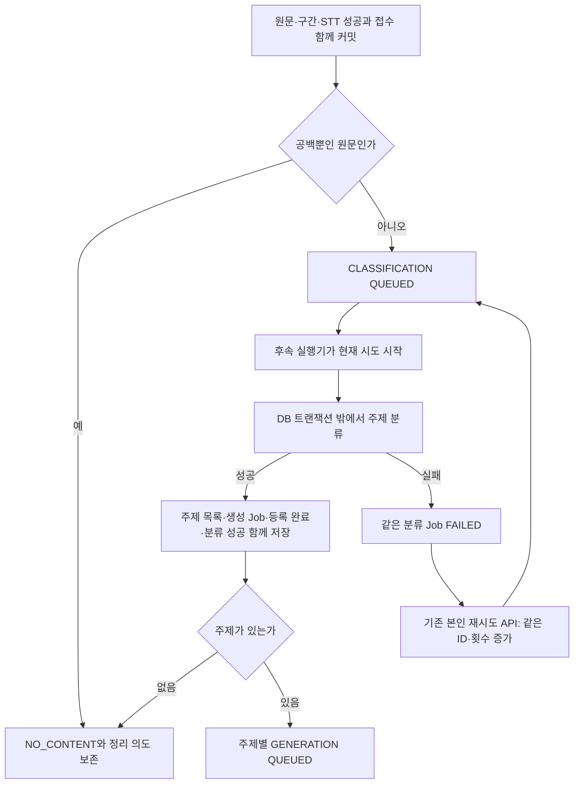

# 문서 생성 접수·주제 등록 연결 계약

#523 로컬 구현 기준이다. 실제 STT 완료 서비스·Job 소비기·Document 저장·정리는 후속 작업이다.

## 생산자 호출

STT 외부 호출이 성공한 뒤 짧은 DB 저장 트랜잭션을 시작한다. **Workspace → RecordingSession → Transcript** 순서로 잠그고 원문·구간·STT 성공을 저장한 뒤 다른 Bean의 `DocumentGenerationIntakeService.acceptCompletedTranscript(workspaceId, recordingSessionId, transcriptId)`를 호출한다.

접수는 `MANDATORY`로 생산자 트랜잭션에 참여한다. 어느 쪽이 실패해도 모두 롤백된다. 예외를 삼키거나 별도 트랜잭션으로 접수하지 않는다. STT·LLM 네트워크 호출은 이 저장 트랜잭션 밖에서 실행한다.

자동 접수에는 로그인 멤버 검사를 하지 않는다. 정상 종료한 녹음은 녹음자가 탈퇴해도 처리할 수 있으며 삭제된 Workspace는 거절한다. 사용자 목록·재시도 API의 현재 멤버·녹음 소유자 조건은 유지한다.

반환값은 Batch ID, 등록 상태, 분류 Job ID, 생성 Job ID 목록이다. 같은 입력의 반복 통지는 기존 결과를 반환한다. 동일 녹음의 다른 살아 있는 원문으로 교체하지 않는다. 현재 음성 도메인에는 이 계약을 호출하는 STT 완료 서비스가 없으므로 실제 운영 자동 접수를 주장하지 않는다.

## 실행기 호출

#525가 짧은 트랜잭션에서 대기 작업을 선점하고 `startRunning(now)` 후 커밋한다. 시작 자체는 접수 횟수를 증가시키지 않는다. 선점 당시 `attemptCount`를 외부 요청과 결과 저장 사이에 유지한다.

성공 시 `completeClassification(workspaceId, jobId, expectedAttemptCount, classificationResult)`, 실패 시 `failClassification(workspaceId, jobId, expectedAttemptCount)`를 호출한다. Workspace → Job → Transcript 순서로 잠그며 성공 저장은 Batch도 잠근다. 이 서비스는 LLM을 호출하지 않는다.

같은 시도의 같은 결과 재전달은 주제 Job을 늘리지 않는다. 다른 목록·이전 회차·생성 단계 Job의 분류 결과는 거절한다. 반복 실패는 최초 실패 시각과 7일 기한을 유지하며 성공한 작업에 실패를 덮어쓰지 않는다.

실행 중단 회수·내부 재시도는 #525에서 **attemptCount·automaticRetryCount를 함께 증가**시켜야 한다. 같은 회차를 재사용하면 지연 응답을 구분하지 못한다. 사용자 retryCount와 분리하고 DB 합계 제약을 지킨다.

## 저장 결과와 후속 범위

- Batch는 녹음당 하나다. 입력·확정 주제 순서·WAITING_CLASSIFICATION/TOPICS_REGISTERED/NO_CONTENT를 보존한다. 등록 완료가 문서 생성 완료를 뜻하지 않는다.
- 분류 Job은 Batch당 하나, 생성 Job은 Batch·주제당 하나다. 주제는 순서가 있는 값 컬렉션이며 별도 폴더 엔티티가 아니다.
- 주제 목록·모든 생성 Job·등록 완료·분류 성공은 한 트랜잭션이다. 주제 FK를 위해 목록을 먼저 flush하지만 별도 commit하지 않는다.
- 빈 성공 원문은 분류 Job 없이 NO_CONTENT, 정상 분류 `[]`는 분류 Job 성공과 NO_CONTENT로 기록한다. LLM 오류·비활성 상태를 내용 없음으로 바꾸지 않는다.
- #524는 GENERATION 단계·동결 주제를 검사한 뒤 DRAFT·생성 시점 확인 대상·Job 성공을 함께 저장한다. CLASSIFICATION Job으로 문서를 저장하지 않는다.
- #525가 실제 QUEUED 소비·자동 재시도·RUNNING 회수·녹음 전체 상태를 연결한다.
- #526은 성공 Document·실행 중 Job 참조를 보호한다. 만료 Job 제거 후 종료 Batch의 transcript_id를 해제하고 구간→원문 순서로 정리한다. Batch·확정 주제·NO_CONTENT는 지연 통지의 중복 방지를 위해 보존한다. WAITING 입력은 제거할 수 없다.
- 생성 Job이 남아 있으면 FK가 주제 삭제·Batch 입력 교체를 거절한다. 실제 보존 정리는 포함하지 않는다.

## V32 적용 조건

V32는 빈 Job 테이블에 적용한다. 기존 Job이 있으면 단계·주제를 추정하지 않고 이행을 중단하며 행을 보존한다. 배포 전 실제 기존 데이터 존재 여부를 확인하고, 존재하면 검증된 이행 방안을 먼저 정해야 한다. 테스트 DB의 적용 성공은 운영 DB 적용 증거가 아니다. 기존 V27·V28·V30·V31은 변경하지 않았다.
