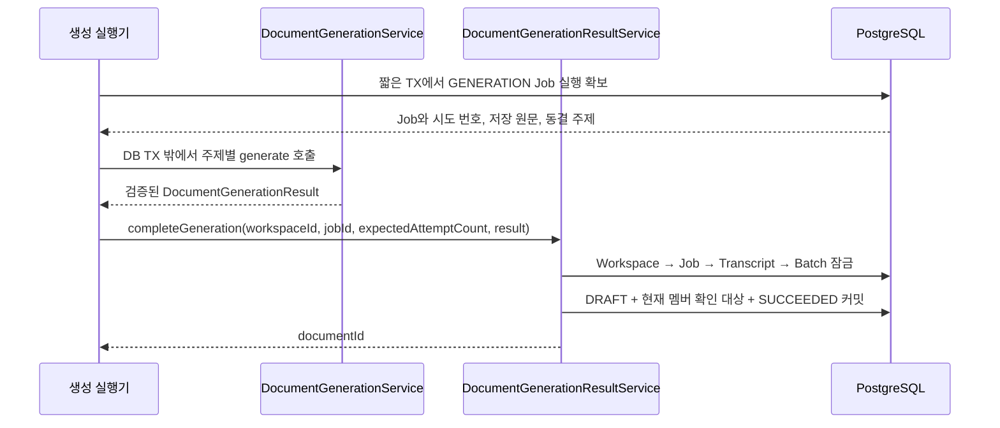

# 생성 문서 결과 저장 연결 계약

#524 구현 기준이다. 생성 실행기는 #525에서 연결한다. 새 사용자 HTTP endpoint는 없다.

## 호출 순서



실행 확보 때 읽은 `attemptCount`를 그대로 전달한다. 응답 도착 때 새로 읽은 번호로 대체하면 과거 실행을 현재 시도로 오인할 수 있다. 재시도·중단 복구는 이전 결과를 무효화하도록 시도 번호를 증가시켜야 한다.

## 저장 유스케이스

```java
long documentId = resultService.completeGeneration(
        workspaceId,
        jobId,
        capturedAttemptCount,
        generatedResult
);
```

- `READ_COMMITTED` 쓰기 트랜잭션이다. Workspace 활성 상태, Job 소속·GENERATION 단계·현재 시도를 검사한다. 첫 성공은 RUNNING일 때만 반영한다.
- 입력 원문·Batch의 입력/녹음/동결 주제를 확인한다. 주제와 출처 ID는 저장 데이터에서 가져오며 LLM 결과에는 title/summary/content만 있다. title/content는 필수, summary는 nullable이다.
- `Document.createDraft`, 현재 활성 멤버별 `DocumentConfirmation.require`, Job 성공 갱신은 모두 같은 트랜잭션이다. 중간 실패는 모두 롤백한다.
- #522가 JSON·Markdown 규칙을 검증한다. 이 저장 서비스는 LLM 인프라 validator를 의존하지 않고 필수 텍스트와 저장 규칙을 검사한다.
- 같은 성공 시도의 재전달은 기존 documentId를 반환하고 본문·시각·대상을 다시 만들지 않는다. ARCHIVED도 유지한다. 시도가 다르거나 성공 Job에 문서가 없으면 등록 충돌이다.

## 확인 대상과 공개 시점

가입·탈퇴 서비스와 같은 Workspace 잠금을 먼저 잡는다. 먼저 커밋한 멤버 변경은 생성 대상에 반영한다. 생성 뒤 가입자는 NOT_REQUIRED, 기존 대상의 탈퇴는 제외 집계다. 재전달로 새 멤버를 대상에 추가하지 않는다.

주제 문서는 자기 Job의 성공 저장이 커밋되는 즉시 기존 목록·상세·확인 API에서 사용한다. 다른 주제 실패로 성공 문서를 취소하지 않는다. 녹음 전체 집계는 #525 책임이다.

## 오류와 재실행

| 상황 | 저장 결과 | 실행기 연결 |
| --- | --- | --- |
| 삭제 Workspace, 없는/다른 소속 Job | Workspace 접근 오류 또는 Job 없음 | 다른 범위로 결과를 저장하지 않는다 |
| 이전 시도, 다른 단계, RUNNING 아님 | 등록 충돌 | 과거 결과로 현재 Job을 실패로 덮어쓰지 않는다 |
| 입력 없음/빈 원문 | 원문 없음/생성 입력 오류 | 사용할 수 없는 입력을 거절한다 |
| 결과 없음/빈 제목·본문 | 생성 응답 오류 | 해당 시도의 실패 처리와 연결한다 |
| 저장소/제약 오류 | 전체 롤백 | 저장 TX 종료 뒤 현재 시도를 검사하는 별도 TX에서 실패 기록 |

중복 완료는 Workspace/Job 잠금 후 기존 성공 문서로 수렴한다. V27의 Job UNIQUE·녹음/주제 UNIQUE를 유지하며 migration은 추가하지 않는다. 실패한 트랜잭션에서 제약 오류를 삼키고 기존 문서를 조회하지 않는다.

## 검증 근거

- 2026-10-09 로컬 전체 단위 806·통합 353·인수 389 = 1,548개, failures/errors/skipped 0. Spotless·check·bootJar 통과.
- 신규 생성 단계 단위 2개·결과 저장 PostgreSQL 통합 29개다. 실제 가입·탈퇴 서비스와 두 트랜잭션을 실행하고 `pg_blocking_pids`로 잠금 대기를 관측했다.
- 문서 삽입 후·확인 대상 저장 후·Job flush 후 오류는 spy로 주입하고 실제 PostgreSQL 롤백을 확인했다. 입력 없음은 조회 경계 실패 주입이며, 성공 원문 삭제 보호는 실제 FK로 확인했다.
- 실제 원격 LLM·STT 생산자·#525 실행기·운영 DB·FE 화면은 이번 검증에 포함하지 않는다.
