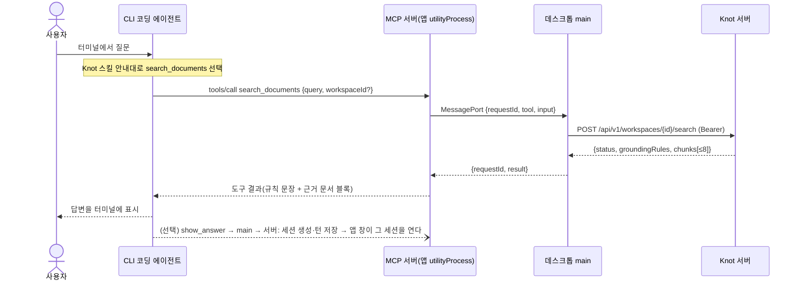
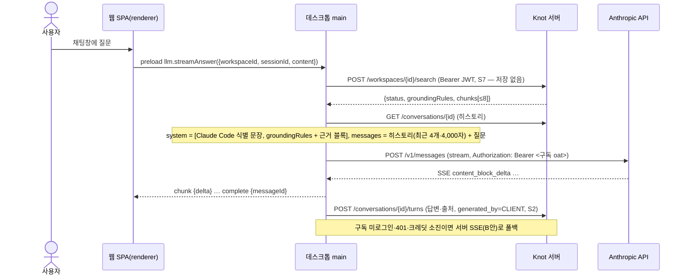

# Knot 데스크톱 앱(Electron) 기술 기획서

- 문서 상태: Draft (팀 검토 전)
- 기준일: 2026-09-04 (인증 설계는 2026-09-06 개정 — 3절 `D11`, 5.1. 탐색 설계는 2026-09-09 개정 — 3절 `D3`, 6.4)
- 기준 커밋: `develop` `b1d4801` (`[BE] 채팅 답변 출처 조회 API 구현 (#351)`)
- 선행 문서: [`llm-electron-subscription-architecture-review.md`](./llm-electron-subscription-architecture-review.md) (이하 "검토 문서")
- 근거 자료: [`electron-desktop-app-knowledge.md`](./electron-desktop-app-knowledge.md) (이하 "지식 문서"). 본문에서 `지식 §n`으로 참조한다.
- 실행 정본: [`electron-desktop-app-roadmap.md`](./electron-desktop-app-roadmap.md) — 작업 목록·상태·게이트·미결 결정은 이 기획서가 아니라 로드맵이 정본이다.
- 관련 ADR: [`232`](./adr/232-shared-subscription-token-local-ai-review.md), [`254`](./adr/254-notion-public-oauth-connection-policy.md), [`271`](./adr/271-llm-search-architecture-benchmark.md), [`314`](./adr/314-auth-entry-redirect-branching.md)

이 문서는 기획 초안이며 ADR이 아니다. 여기 적힌 결정은 Knot 공통 Issue 계약(`docs/harness/issue-planning.md`)에 따라 Issue 기획 → 인터뷰 → Grill → 구현 브랜치의 `Proposed` ADR로 확정한다(14절).

## 1. 배경과 결론

검토 문서는 "Electron + 사용자 Claude 구독 OAuth + 백엔드 검색 전용" 제안을 세 층위(정책 차단, 대규모 신규 개발, 백엔드 계약 역전)에서 적용 불가로 판정했었다. **2026-09-10 개정**: 사용자가 그 정책 차단 판정을 넘어서기로 결정하고(로드맵 불변 계약 3번 삭제·2번 개정), 탐색의 답변 생성을 **데스크톱 앱이 사용자 본인의 Claude 구독으로 앱 안에서** 하도록 지시했다. 방식은 Aside가 실제로 출시·운영 중인 것과 같은 **Claude Code OAuth 흐름**을 앱이 재현하는 것이다(6.5, 트랙 L, 로드맵 Q61). 이 형태는 `legal-and-compliance`가 명시적으로 금지하는 것(서드파티 앱의 claude.ai 로그인 제공·구독 자격증명 대리 호출·자격증명 저장/중개)에 해당하며, Anthropic이 재량으로 허용하고 서드파티 사용량은 별도 extra usage 크레딧에서 per-token 차감되는 구간에서 운영한다. 이 정책 해석과 그 위험은 사용자 결정이다(검토 문서 5.1·7절 G안, 로드맵 R28·R29). 서버는 여전히 하이브리드 검색·근거·게이트·Workspace 격리·저장을 소유한다. 데스크톱이 로컬 MCP 서버로 터미널 CLI 에이전트에 검색 도구를 제공하는 경로(6.4, `S8`~`S10`)는 선택적 부가 진입점으로 남는다.

한 줄 결론:

> Knot 데스크톱 앱은 `https://knoted.kr` 웹 앱을 원격 로드하는 Electron 셸이다. 탐색(채팅)의 답변은 **앱이 사용자 본인의 Claude 구독으로 앱 안에서 만든다**(2026-09-10 개정, 6.5·트랙 L). 데스크톱 main이 Claude Code OAuth 흐름으로 사용자의 Claude 구독 자격증명을 받아 `POST api.anthropic.com/v1/messages`를 직접 호출하고, 서버는 하이브리드 검색·청크 상위 8개·규칙 문장·문서 준비 게이트·Workspace 격리·저장을 맡는다. 웹 브라우저 단독 실행과 구독이 없는 사용자는 서버 SSE 경로(B안, 로드맵 Q22)를 폴백으로 쓴다. 데스크톱이 터미널 CLI 에이전트에 로컬 MCP 서버로 검색 도구를 제공하는 경로(6.4)는 선택적 부가 진입점이다. 데스크톱이 더하는 것은 상시 실행, 딥링크, 알림, 퀵 질문 창, 자동 업데이트, 그리고 이 앱 안 구독 탐색이다. 인증은 웹·데스크톱 모두 `Authorization: Bearer <JWT>`를 쓰고 쿠키를 쓰지 않는다. 토큰은 웹이 `localStorage`, 데스크톱이 main의 `safeStorage`에 둔다(`D11`, 5.1). 사용자 Claude 구독 자격증명도 main의 `safeStorage`에 둔다(6.5). 2단계에서 시스템 브라우저 로그인 + 리프레시 토큰(디바이스 세션)을 얹는다. 이 형태의 정책 리스크는 사용자가 감수한다(로드맵 R28).

제안 대비 무엇이 달라졌는지:

| 제안(검토 대상) | 본 기획 | 이유 |
| --- | --- | --- |
| Electron Main이 Agent SDK로 사용자 구독으로 모델 호출 | 모델 호출은 **데스크톱 main이 사용자 본인의 Claude 구독으로 직접** 한다(6.5, 2026-09-10 개정). Agent SDK 대신 Claude Code OAuth 흐름을 재현해 구독 토큰을 받고 `POST api.anthropic.com/v1/messages`를 부른다(Aside식). 서버는 검색·근거·게이트·저장을 소유한다 | 사용자 지시로 정책 차단 판정을 넘어서기로 결정(로드맵 계약 3 삭제). Aside가 같은 방식으로 출시·운영 중이다. 위험은 사용자 감수(R28) |
| in-process MCP `search_knowledge` 툴 + `POST /v1/search` | 데스크톱 앱이 띄운 **로컬 MCP 서버**의 `search_documents` 툴 + 서버 `POST /api/v1/workspaces/{id}/search`(6.4, 2026-09-09 개정). 툴 루프는 에이전트가 자기 판단으로 돈다 | 제안의 이 부분은 형태가 거의 그대로 채택됐다. 차이는 MCP 서버가 Agent SDK 안(in-process)이 아니라 앱이 띄운 로컬 HTTP 서버이고, 호출 주체가 사용자의 CLI라는 것. 규칙 문장·선별·게이트·저장 검증은 서버가 소유해 정책 분기를 막는다(로드맵 Q24·Q25) |
| SDK `resume`로 세션 관리 | `chat_sessions`·`chat_messages` DB가 세션 진실 | 다기기·재설치 복원 요구(기능 기획서 12절) |
| 서비스 JWT Bearer 가정 | 1단계부터 Bearer JWT로 전환(`D11`), 2단계에서 디바이스 세션·리프레시 추가 | 현행 필터가 쿠키만 읽는 것(지식 §1.2)을 `D11`에서 Bearer만 읽도록 바꾼다 |
| 로컬 번들 또는 원격 URL | 원격 URL 고정 | 로컬 번들은 `__Host-`·SameSite=Lax·CORS에서 구조적으로 깨짐(지식 §2.4, §4.7) |

## 2. 목표와 비목표

### 2.1 목표

| ID | 목표 | 완료 판정 |
| --- | --- | --- |
| G1 | 데스크톱 앱에서 웹과 같은 기능(GitHub 로그인, 워크스페이스, 초대, Notion 연결·동기화, 채팅, 출처)을 쓸 수 있다 | 웹 E2E 시나리오를 Electron에서 통과 |
| G2 | 탐색 계약(6.4: Workspace 검색·턴 저장·출처 API, 문서 준비 게이트, Workspace 격리, 규칙 문장)을 서버가 소유하고, 데스크톱은 LLM·LLM 자격증명을 다루지 않는다 | 계약 테스트 통과, 웹 채팅 SSE 경로 회귀 없음(2026-09-09 개정) |
| G3 | macOS(arm64·x64)와 Windows(x64)에 서명된 설치본을 배포하고 자동 업데이트한다 | 서명·공증 통과, 업데이트 종단 테스트 |
| G4 | `knot://` 딥링크로 초대 링크와 로그인 콜백을 앱이 받는다 | 패키징된 앱에서 콜드·웜 스타트 모두 동작 |
| G5 | Electron 공식 보안 체크리스트 20항목과 권장 Fuses를 모두 충족한다 | 8절 체크리스트 리뷰 통과 |
| G6 | 웹 사용자에게 회귀가 없다 | 웹 배포 워크플로우·E2E 무변경 통과 |
| G7 | 앱 셸 릴리스 없이 웹 배포만으로 기능 변경이 반영된다 | 셸 릴리스 주기 ≥ 4주, 웹 배포는 현행 유지 |

### 2.2 비목표

- (2026-09-10 개정) 이전 판의 비목표였던 "앱이 사용자 구독으로 모델을 호출/앱이 자격증명을 저장"은 사용자 지시로 **목표로 전환**됐다(2.1·6.5, 로드맵 계약 3 삭제·트랙 L). 아래는 여전히 비목표다.
- `claude`·`codex`·`gemini` **바이너리를 자식 프로세스로 실행**하는 것(검토 문서 E안 — 사용자 반복 거부). 앱은 바이너리를 실행·동봉하지 않고, 구독 자격증명은 Claude Code OAuth 흐름을 앱이 직접 재현해 받는다(6.5).
- 서버 검증 없이 답변·출처를 저장하는 것. 앱이 만든 답변·출처도 서버 검증(세션 소유자·Workspace JOIN·rank ≤ 8)을 거쳐 `generated_by=CLIENT`로만 저장한다(6.5).
- OpenAI·Google 등 Claude 외 제공자의 구독·로그인을 앱이 다루는 것. 트랙 L은 Claude 구독만 대상이며, 그 외는 서버 SSE(B안)·BYO 키(C안)로 둔다.
- 오프라인 사용. 원격 로드 구조의 한계이며 별도 결정으로 분리한다(지식 §5.2).
- Tauri·PWA로의 전환. 비교는 지식 §5.1에 두고 재검토 조건만 15절에 남긴다.
- 모바일, Linux 코드 서명·스토어 배포(Linux는 빌드만 제공).
- 웹 UI에 없는 데스크톱 전용 탐색 화면. 데스크톱이 더하는 화면은 CLI 에이전트 연결 안내(9.3, 로드맵 `S9`) 하나이고, 채팅 화면은 웹과 같다.

## 3. 핵심 결정 요약

| ID | 결정 | 선택 | 실제로 검토한 대안 | 선택 이유 | ADR |
| --- | --- | --- | --- | --- | --- |
| D1 | 데스크톱 셸 | **Electron 44** | Tauri 2, PWA | 웹과 동일한 Chromium 렌더링, main·preload·renderer 전부 TypeScript, Playwright 지원, 채택 사례(지식 §5.1). PWA는 트레이·글로벌 단축키·자동 시작이 없음 | 필요 |
| D2 | 콘텐츠 로드 | **원격 URL `https://knoted.kr`** | 로컬 번들(`app://`) | CORS·라우터·SSE를 웹과 동일하게 유지, 웹 배포로 즉시 반영(Slack 하이브리드 모델). 로컬 번들을 막던 쿠키 제약(`__Host-`·SameSite)은 `D11`로 사라졌으므로 전환 검토(`A12`)는 열려 있다(지식 §2.4, §4.7) | D1과 함께 |
| D3 | 모델 호출 위치 | **데스크톱 앱(main)이 사용자 본인의 Claude 구독으로 앱 안에서 직접 호출(6.5, 트랙 L, 2026-09-10 개정)**. 서버는 검색·근거·게이트·저장. 구독 없음·브라우저 단독은 서버 SSE(B안) 폴백(로드맵 Q22) | G안(사용자 구독 직접 호출, Aside식 Claude Code OAuth — **채택**), B안(백엔드 어댑터, 폴백으로 유지), C안(Workspace BYO 키), F안(로컬 MCP + CLI 에이전트, 선택적 부가 진입점으로 유지 — `S8`~`S10`), D안(Agent SDK 내장), E안(CLI 바이너리 자식 프로세스 — 사용자 거부) | 사용자 지시(2026-09-10 `불변 계약 3번 제거해 … 이렇게 구현하기 위해서 모든 문서를 다 다시 작성해`). "앱에서 질문하면 내 구독으로 답한다"가 제품 목표. Aside가 같은 방식으로 운영 중임을 실측([[aside-claude-subscription-mechanism]]). 정책 금지 조항 해당·재량 허용 구간이며 위험은 사용자 감수(로드맵 R28). 검색·게이트·규칙 문장·저장 검증을 서버에 남겨 검토 문서 5.4의 무결성 문제를 좁힌다 | 필요(로드맵 `L1`, 계약 2 개정·3 삭제 포함) |
| D4 | 인증 | **1단계: 앱 창 GitHub 로그인 + Bearer JWT(`D11`) → 2단계: 메인 창 안 로그인 뷰 + 디바이스 토큰(재개정 2026-09-10), Device flow(D)는 fallback** | 시스템 브라우저 로그인(패턴 A·B, 2026-09-09까지의 설계), 처음부터 2단계, 1단계에서 멈추기 | 사용자 지시(2026-09-09 `데탑 앱에서 로그인 버튼 누르면 앱에서 뜨는게 아니라 웹 브라우저로 이동하는데 수정해`, 로드맵 Q68). 2단계가 실제로 더하는 값(리프레시 토큰·기기 세션 폐기·토큰을 renderer 밖 `safeStorage`에 두기)은 로그인 창 위치와 무관하므로 **창만 앱 안으로 되돌리고 나머지 계약은 그대로 둔다**. 앱 창 로그인은 GitHub 2FA까지 종단 통과가 실측돼 있다(로드맵 U1). 대가는 RFC 8252 §8.12 위반이 남는 것(5.1·5.3, 로드맵 R30). **재개정 2026-09-10**(사용자 지시 `깃허브 로그인 부분 누르면 앱 내에서만 떠야 해 새로운 창을 띄우거나 그러면 진짜 죽을 수도 있어`): 자식 `BrowserWindow`도 OS 창이 하나 더 뜨는 것이라 지시에 어긋난다. 로그인 화면은 메인 창 안 `WebContentsView`로 띄우고 **창은 하나도 만들지 않는다**(5.2, 로드맵 Q68·Q69) | 필요(ADR 314 재논의) |
| D11 | 인증 자격증명 전달·저장 | **`Authorization: Bearer <JWT>` + 클라이언트 저장(웹 `localStorage`, 데스크톱 main `safeStorage`). 쿠키·CSRF 폐기** | 현행 `HttpOnly` 쿠키 유지, 쿠키+Bearer 이중 경로, 메모리 전용 저장 | 쿠키는 저장 위치를 브라우저가 정해 데스크톱이 `safeStorage`를 쓸 수 없고, `app://` 로컬 번들에서 깨진다(지식 §2.4·§4.7). 이중 경로는 필터·CSRF 매처·CORS가 두 경로를 동시에 지탱해야 한다. 메모리 전용은 새로고침마다 재로그인이라 리프레시 토큰(2단계) 없이는 못 쓴다. 대가로 `HttpOnly`의 XSS 격리를 잃는다(5.1·5.3) | 필요(ADR 314 보완) |
| D5 | 빌드·패키징 도구 | **Electron Forge 7.x** | electron-builder 26, electron-vite | Electron 공식 권장, Fuses·ASAR 무결성·서명·공증·publisher 통합, Squirrel + update.electronjs.org 무료 경로. electron-builder는 NSIS·차등 업데이트·스테이지 롤아웃·프라이빗 업데이트가 필요할 때 유리(지식 §3.2). 상세는 10절 | D1과 함께 |
| D6 | 자동 업데이트 채널 | **GitHub Releases + `update-electron-app`(update.electronjs.org)** | electron-updater + generic 서버, 자체 서버(Hazel 등) | 저장소가 공개(PUBLIC)라 무료 서비스 조건(공개 저장소 + macOS 서명) 충족. 자체 서버는 2년 이상 정체. 상세는 10절 | D5와 함께 |
| D7 | 저장소 위치 | **루트 `desktop/` 독립 pnpm 패키지, 브랜치 area `fe`** | `frontend/desktop/` 하위 패키지 | `deploy-frontend-*.yml`이 `frontend/**`를 감시하므로 분리해야 웹 배포가 불필요하게 돌지 않음. Governance area는 `be|fe`뿐이라 `fe`를 쓴다(지식 §1.6) | 불필요(메모) |
| D8 | 세션 진실 | **DB(`chat_sessions`·`chat_messages`)** | SDK 로컬 JSONL | 다기기 복원·서버 계측 요구 | 불필요(현행) |
| D9 | 프롬프트 정책·게이트·계측 | **규칙 문장·게이트·저장 검증은 서버, 프롬프트 조립·모델 호출은 main(6.5)**. main이 서버가 준 `groundingRules` + 근거 블록을 `system`으로 조립해 사용자 구독으로 호출한다 | 서버 전체 고정, 앱 내 systemPrompt 전체, 개정 전 "에이전트가 자기 방식으로"(2026-09-09판) | 규칙 문장을 서버가 돌려주고 main이 `system` 앞머리에 그대로 실으므로 앱 버전별 정책 분기가 없다. 앱 안 호출이라 TTFT를 앱에서 계측할 수 있다(`L2`, `S5`) | D3과 함께 |
| D10 | 관측 | **`electron-log` 파일 로그 + Electron `crashReporter`(수집 서버는 미결)** | Sentry Electron SDK | 개인정보·비용 결정이 필요해 15절 미결로 둠 | 필요 시 |

## 4. 시스템 아키텍처

### 4.1 구성도

```text
┌──────────────────────────── 사용자 PC ────────────────────────────────┐
│ 터미널: CLI 코딩 에이전트 (Claude Code · Codex CLI · Gemini CLI)         │
│   로그인·모델 호출은 전부 이 안에서 일어난다(Knot 무관).                │
│   Knot 스킬(SKILL.md)이 "문서 검색" 도구 사용을 안내한다.               │
│          │ MCP Streamable HTTP  http://127.0.0.1:<port>/mcp  연결 토큰   │
│          ▼                                                             │
│ Electron 앱 (desktop/)                                                 │
│ ┌ MCP 서버 (utilityProcess) ┐        ┌ main (Node) ──────────────────┐ │
│ │ search_documents          │ Message│ 창 · 메뉴 · 트레이 · 딥링크 ·  │ │
│ │ list_workspaces           │  Port  │ 네비게이션 허용 목록 · 권한 ·  │ │
│ │ show_answer(선택, S10)    │◀──────▶│ 로그/크래시 ·                  │ │
│ │ 연결 토큰·Origin·Host 검사 │  (IPC) │ 액세스 토큰 보관(safeStorage) ·│ │
│ │ 서버 토큰을 모른다         │        │ 검색 API·목록·턴 저장 호출 ·   │ │
│ └───────────────────────────┘        │ 연결 토큰 발급 · MCP 서버 수명 │ │
│                                      └─────┬──── contextBridge/IPC ──┘ │
│ ┌ preload ─────────────────┐  ┌ renderer (sandbox) ─┴───────────────┐  │
│ │ window.knotDesktop 노출  │  │ https://knoted.kr SPA               │  │
│ │ (auth · agent, sender 검증)│ │ React 19 · axios · 채팅은 서버 SSE  │  │
│ └──────────────────────────┘  └──────────────┬──────────────────────┘  │
└────────────┬─────────────────────────────────┼─────────────────────────┘
      main HTTPS│Bearer                         │ HTTPS (웹과 동일, Bearer)
                │   ┌──────────────────┐   ┌────▼───────────────────────────┐
                │   │ Cloudflare Workers│   │ Spring Boot 4.1 (api.*)         │
                │   │ 정적 자산 · SPA   │   │ auth · workspace · chat ·       │
                │   │ fallback          │   │ search · notion import ·        │
                │   └──────────────────┘   │ Workspace 검색 API(청크 8) ·     │
                └─────────────────────────▶│ 턴 저장 API · LlmClient(웹 SSE)  │
                                           └──────┬─────────────────────────┘
                                                  ▼
                                           PostgreSQL + pgvector
```

main도 같은 Bearer 토큰으로 Spring의 Workspace 검색·워크스페이스 목록·턴 저장 API를 부른다. LLM 호출은 어디에도 없다 — 답변은 사용자의 CLI 에이전트가 자기 계정·모델로 만든다(6.4, 2026-09-09 개정). MCP 서버 프로세스는 액세스 토큰을 갖지 않고 main에 요청을 넘길 뿐이다.


### 4.2 프로세스별 책임

| 프로세스 | 책임 | 하지 않는 것 |
| --- | --- | --- |
| main | `BrowserWindow` 생성·복원, 애플리케이션 메뉴, 트레이, 단일 인스턴스 락, 딥링크 파싱, `will-navigate`·`setWindowOpenHandler`·`setPermissionRequestHandler`, 자동 업데이트, 로그·크래시, **액세스 토큰 보관(`safeStorage`, 1단계)**, **CLI 에이전트 연결(6.4): MCP 서버 `utilityProcess` 기동·종료, 연결 토큰 발급·보관, `MessagePort`로 받은 도구 요청을 서버 API(Workspace 검색·워크스페이스 목록·턴 저장)로 실행해 결과 반환, 등록 스니펫 클립보드 복사**, **앱 안 구독 탐색(6.5, 2026-09-10): 사용자 Claude 구독 OAuth 로그인·토큰 `safeStorage` 보관·갱신, 서버 검색으로 `system` 조립, `api.anthropic.com/v1/messages` 스트리밍 호출, 답변·출처 서버 저장, 폴백 판정**, [2단계] 리프레시·갱신·`onBeforeSendHeaders` Bearer 주입 | 검색·선별·저장 검증 자체(서버가 한다), 쿠키 값 읽기(`cookies.get`을 쓰지 않는다), 토큰·구독 토큰·질문·답변·문서 본문 로깅, CLI 바이너리 실행·탐색(2.2 비목표), 구독 토큰을 renderer·IPC 응답에 싣는 것 |
| MCP 서버(`utilityProcess`) | Streamable HTTP 서버를 `127.0.0.1:<port>`에 열고 `Origin`·`Host`·연결 토큰을 검사, 도구 정의(`search_documents`·`list_workspaces`·선택 `show_answer`)와 입력 검증, 요청을 `MessagePort`로 main에 위임하고 결과를 MCP 도구 결과로 변환 | 서버 API 직접 호출(액세스 토큰을 갖지 않는다), LLM 호출, main 위임 밖의 파일·네트워크 접근 |
| preload | `contextBridge.exposeInMainWorld('knotDesktop', …)`로 4.4의 API만 노출(`auth`·`agent` 포함). CJS 단일 번들, sandbox 유지 | `ipcRenderer` 원본 노출, Node API 노출 |
| renderer | 웹 SPA 그대로. `window.knotDesktop` 존재 여부로 데스크톱을 감지해 외부 링크·딥링크·로그아웃 UX와 **토큰 저장소**, **CLI 에이전트 연결 안내 화면**(9.3, `S9`)만 분기. 채팅은 브라우저와 같은 서버 SSE | Electron 모듈 직접 접근, 토큰을 `localStorage`에 두는 것(데스크톱에서는 preload 경유), LLM 직접 호출, 연결 토큰 보관 |
| 백엔드 | 현행 전부 + **Bearer 인증(`D11`)** + **Workspace 검색 API·턴 저장 API·출처 8건(6.4)** + [B안] Anthropic 어댑터(웹 채팅 UI SSE 경로) + [2단계] 디바이스 토큰 API | CLI 에이전트 경로의 LLM 호출, 인증 쿠키 발급 |
| CLI 코딩 에이전트(사용자 소유) | 사용자 질문 수신, Knot 스킬에 따라 `search_documents` 호출, 답변 생성·터미널 표시, 선택적으로 `show_answer` 호출. 로그인·모델·과금은 전부 사용자와 그 도구 제공자 사이의 일 | Knot이 실행·설정·관측하지 않는다 |


### 4.3 주요 흐름

**탐색(앱 안 구독 — 데스크톱 셸 기본, 2026-09-10 개정 — 6.5)**: renderer가 `window.knotDesktop.llm.streamAnswer(sessionId, content)` 호출 → main이 `POST /api/v1/conversations/{sessionId}/search`(`Authorization: Bearer <JWT>`, `S1`)로 근거 청크 8개 + 규칙 문장을 받음 → main이 `system`(규칙 + 근거 블록)·`messages`(히스토리 + 질문)를 조립해 `safeStorage`의 사용자 구독 토큰으로 `POST https://api.anthropic.com/v1/messages`(stream) 호출(Q61) → SSE `text_delta`를 preload `chunk {delta}`로 renderer에 흘림 → `complete {messageId}` 전에 답변·출처를 `POST /api/v1/conversations/{sessionId}/turns`(`generated_by=CLIENT`, `S2`)로 저장 → renderer가 `GET /messages/{id}/sources`로 "찾은 문서" 표시. 구독 미로그인·401·크레딧 소진이면 아래 서버 SSE로 폴백.

**탐색(서버 SSE — 브라우저 단독·구독 폴백, 로드맵 Q22)**: renderer의 `streamChatMessageApi`가 `POST /api/v1/conversations/{sessionId}/messages`를 `Authorization: Bearer <JWT>`로 호출 → 백엔드 파이프라인(게이트 → 검색(청크 8) → `LlmClient` → SSE → 저장) → `complete(messageId)` → `GET /messages/{id}/sources`. Electron renderer는 Chromium이므로 fetch 스트리밍·`TextDecoder`·`parseSseEvents`가 브라우저와 동일하게 동작한다(지식 §2.5). 두 경로가 renderer에 주는 이벤트 모양(`chunk`·`complete`·`error`)은 같다(불변 계약 1번).

**탐색(CLI 에이전트 — 선택적 부가 진입점, 6.4)**: 사용자가 터미널에서 에이전트에 질문 → 에이전트가 Knot 스킬 안내대로 `search_documents` 호출 → `http://127.0.0.1:<port>/mcp`(연결 토큰)로 데스크톱 MCP 서버 → `MessagePort`로 main → main이 `POST /api/v1/workspaces/{id}/search`(`S7`) → 규칙 + 근거 블록을 도구 결과로 반환 → 에이전트가 터미널에 답 표시 → (선택, `S10`) `show_answer`로 세션 저장·앱 창이 그 세션을 연다.

**로그인 1단계(`D11`)**: SPA의 `GithubLoginButton`이 `window.location.href = {API}/oauth2/authorization/github` → main의 `will-navigate`·`will-redirect` 허용 목록(웹 오리진, API 오리진, `github.com`)을 통과 → GitHub 로그인 → `api.*`의 성공 핸들러가 **쿠키를 심지 않고** 설정된 프론트 URL에 토큰을 URL 프래그먼트로 붙여 302(`{success-redirect-uri}#access_token=…&expires_in=3600`, 신규 가입은 `{nickname-redirect-uri}#onboarding_token=…`) → SPA 부팅 코드가 프래그먼트를 읽어 저장소에 넣고 `history.replaceState`로 주소창에서 지운다 → `EntryRedirect`가 분기. 세션 파티션은 `persist:knot`을 유지하지만 이제 인증 쿠키는 담기지 않는다.

프래그먼트를 쓰는 이유: `#` 뒤는 서버로 전송되지 않아 액세스 로그·`Referer`에 남지 않는다. 쿼리스트링(`?access_token=`)은 Cloudflare·백엔드 로그와 `Referer`에 그대로 찍힌다. 남는 노출은 브라우저 히스토리 한 곳뿐이고 SPA가 즉시 지운다(로드맵 Q14).

**로그인 2단계(패턴 A·B)**: 5.2 참조.

**딥링크 초대**: 웹 초대 링크 `https://knoted.kr/invite/<token>`은 그대로 두고, 데스크톱 설치 사용자를 위해 `knot://invite/<token>`을 추가로 지원한다. main이 URL을 파싱해 `{type:'invite', token}`을 preload를 거쳐 renderer로 전달하고, SPA는 `getRouterPath({routeKey:'INVITE', params:{token}})`로 이동한다. 앱이 꺼져 있었으면 main이 링크를 보관했다가 SPA가 `getPendingDeepLink()`로 가져간다.

**업데이트**: 앱 시작 후 백그라운드 확인 → 다운로드 → "다시 시작" 안내(사용자 선택). 웹 콘텐츠는 Cloudflare 배포로 즉시 반영되므로 업데이트 대상은 셸(main·preload·Electron 런타임)뿐이다.

### 4.4 preload API 계약 (`window.knotDesktop`)

```ts
// desktop/src/shared/api.ts — preload와 SPA가 같은 타입을 공유한다
export type KnotDeepLink =
  | { type: 'invite'; token: string }
  | { type: 'chat'; workspaceId: string; sessionId?: string };

export interface KnotDesktopApi {
  readonly version: string;                 // 앱 버전(semver)
  readonly platform: 'darwin' | 'win32' | 'linux';
  readonly env: 'prod' | 'dev' | 'local';
  openExternal(url: string): Promise<void>; // https:·mailto:만 허용, 그 외 reject
  onDeepLink(handler: (link: KnotDeepLink) => void): () => void; // 구독 해제 함수 반환
  getPendingDeepLink(): Promise<KnotDeepLink | null>;
  // 1단계(D11): SPA가 액세스 토큰을 둘 곳. 웹에서는 이 객체가 없고 localStorage를 쓴다
  auth?: {
    getToken(): Promise<string | null>;     // 없으면 null
    setToken(token: string): Promise<void>; // safeStorage로 암호화해 userData에 저장
    clearToken(): Promise<void>;            // 로그아웃·401
    // 2단계(A7). 2026-09-09 구현: 셸이 셋 다 노출하며 SPA는 로드맵 Q60대로 쓴다
    startLogin?(): Promise<void>;           // 메인 창 안 로그인 뷰를 붙인다(재개정 2026-09-10 — 창을 새로 만들지 않는다)
    cancelLogin?(): Promise<void>;          // 로그인 뷰 헤더의 "취소"(2026-09-10). 대기 중인 로그인이 없으면 무시
    logout?(): Promise<void>;               // 폐기 API 호출 + 로컬 삭제
    onSessionChanged?(handler: (state: 'signed-in' | 'signed-out') => void): () => void;
    // 로그인 뷰가 붙고 떨어질 때(2026-09-10). 열려 있는 동안 SPA가 상단 헤더 띠(제목·취소)를 그린다
    onLoginPromptChanged?(handler: (p: { open: boolean; headerHeight: number }) => void): () => void;
  };
  // 앱 안 구독 탐색(6.5, 2026-09-10, 트랙 L). 데스크톱 셸에서 채팅 화면이 쓴다
  llm?: {
    getStatus(): Promise<LlmSubscriptionStatus>;      // 로그인·토큰 만료·폴백 여부
    signIn(): Promise<void>;                           // claude.ai OAuth(시스템 브라우저). 토큰은 main safeStorage
    signOut(): Promise<void>;                          // subscription-auth.bin 삭제
    onStatusChanged(handler: (s: LlmSubscriptionStatus) => void): () => void;
    // 질문을 사용자 구독으로 스트리밍. main이 서버 검색 근거로 system을 조립해 호출한다
    streamAnswer(
      // workspaceId는 라우트 값. 세션에서 Workspace를 되찾는 API가 없다(로드맵 Q65, 2026-09-09)
      input: { workspaceId: string; sessionId: string; content: string },
      on: {
        chunk(delta: string): void;
        complete(res: { messageId: string }): void;
        // fallback=true면 renderer가 서버 SSE 경로로 다시 보낸다(구독 미로그인·401·크레딧 소진)
        error(err: { code: string; message: string; fallback: boolean }): void;
      },
    ): () => void;                                     // 반환값은 취소 함수
    // 설정(L3, 2026-09-09 추가). 모델·effort는 main의 subscription-settings.json에 있고 허용 목록도 main이 준다(Q62)
    getSettings(): Promise<LlmSettingsView>;
    // 목록 밖 값은 reject. 바뀌면 onStatusChanged(model)도 온다
    updateSettings(input: { model: string; effort: string }): Promise<LlmSettingsView>;
  };

  // CLI 에이전트 연결(6.4, 2026-09-09, 선택적 부가 진입점). 데스크톱 전용 연결 안내 화면(S9)이 쓴다
  agent?: {
    getStatus(): Promise<AgentBridgeStatus>;
    // 등록 스니펫(연결 토큰 포함)을 main이 클립보드에 쓴다. renderer에는 토큰을 가린 미리보기만 돌려준다
    copyRegistration(target: 'claude-code' | 'codex' | 'gemini' | 'skill'): Promise<{ preview: string }>;
    rotateToken(): Promise<void>;          // 연결 토큰 재발급. 기존 CLI 등록은 무효가 된다
    setPort(port: number): Promise<void>;  // 1024~65535. MCP 서버를 다시 연다(재시작 없음)
  };

  notifications?: { show(input: { title: string; body: string; link?: KnotDeepLink }): Promise<void> };
}

export interface AgentBridgeStatus {
  running: boolean;
  port: number;
  url: string;                    // http://127.0.0.1:<port>/mcp
  error: string | null;           // 포트 충돌 등 기동 실패 사유
  tokenIssuedAt: string;          // ISO 8601
  lastToolCallAt: string | null;  // 마지막 도구 호출 시각(연결 확인용)
  skillPath: string;              // 앱 리소스 안 SKILL.md 절대 경로(복사 명령용)
}

export interface LlmSubscriptionStatus {
  signedIn: boolean;              // 사용자 Claude 구독 로그인 여부
  expiresAt: string | null;      // access 토큰 만료(ISO 8601). 만료 전 자동 갱신
  model: string;                 // 현재 모델(Q62 기본 claude-fable-5-1)
  lastError: string | null;      // 마지막 호출 오류 코드(401·크레딧 소진 등)
  // 마지막 질문이 어느 경로로 응답됐는지(구독=subscription, 폴백=server-sse)
  lastAnsweredBy: 'subscription' | 'server-sse' | null;
}

// L3(2026-09-09). 설정 화면이 고를 수 있는 값은 main이 준다 — SPA가 모델 목록을 하드코딩하지 않는다(Q62)
export interface LlmSettingsView {
  model: string;
  effort: string;
  models: readonly string[];       // 선택 가능한 모델 ID(Q62·지식 §6.2)
  efforts: readonly string[];      // output_config.effort 값
}

```

규칙:

- preload는 `ipcRenderer.invoke`/`ipcRenderer.on`을 래핑한 함수만 노출한다. `event` 객체를 renderer 콜백에 넘기지 않는다.
- main의 모든 `ipcMain.handle`은 `event.senderFrame`의 origin이 허용된 웹 오리진일 때만 처리한다(`senderFrame`이 `null`이면 거부).
- `auth.callback` 같은 로그인 콜백 데이터는 main에서만 소비하고 renderer로 보내지 않는다.
- `auth.getToken`/`setToken`/`clearToken`은 **저장소만** 노출한다. 값은 renderer가 들고 있다가 `Authorization` 헤더에 직접 넣는다. 2단계에서 main이 `onBeforeSendHeaders`로 주입하게 되면 `getToken`은 `null`을 돌려주도록 바꾸고 SPA는 헤더를 붙이지 않는다(옵셔널 접근이라 하위 호환이 유지된다).
- 토큰 값은 로그·크래시 리포트에 절대 쓰지 않는다. IPC 인자 로깅도 금지한다.
- `auth.startLogin`·`logout`·`onSessionChanged`는 IPC 채널 `knot:auth-start-login`·`knot:auth-logout`·`knot:auth-session-changed`, `notifications.show`는 `knot:notifications-show`로 구현한다(2026-09-09, `A7`·`A10`). 로그인 콜백의 `code`·`state`는 main에서만 소비하고 renderer에는 성공(resolve)·실패(reject 메시지)만 전달한다. 알림 입력은 main이 `isNotificationInput`으로 다시 검사한다(제목 1~200자, 본문 ≤200자, 링크는 `KnotDeepLink` 모양).
- `agent.*`는 IPC 채널 `knot:agent-status`·`knot:agent-copy-registration`·`knot:agent-rotate-token`·`knot:agent-set-port`로 구현한다. 연결 토큰 값은 어떤 IPC 응답에도 싣지 않는다(main이 `clipboard.writeText`로 쓴다). MCP 서버 프로세스와 main 사이의 `MessagePort` 메시지는 `{requestId, tool, input}` / `{requestId, result}` 또는 `{requestId, error: {code, message}}`이며 액세스 토큰·연결 토큰을 담지 않는다(2026-09-09, `S8`).
- `llm.*`는 IPC 채널 `knot:llm-status`·`knot:llm-sign-in`·`knot:llm-sign-out`·`knot:llm-status-changed`(`L1`)와 `knot:llm-stream`(invoke — `{requestId, workspaceId, sessionId, content}`로 스트림 시작, 입력 검사 뒤 바로 resolve)·`knot:llm-stream-event`(main → 호출한 renderer만 — `{requestId, event: "chunk", delta}`·`{requestId, event: "complete", messageId}`·`{requestId, event: "error", code, message, fallback}`)·`knot:llm-stream-cancel`(invoke — `{requestId}`)로 구현한다(2026-09-10 초안, 2026-09-09 `L2` 구현에서 채널 3개로 구체화). `requestId`는 preload가 만든다. 설정은 `knot:llm-settings`(invoke → `LlmSettingsView`)·`knot:llm-update-settings`(invoke `{model, effort}` → `LlmSettingsView`, main이 허용 목록으로 재검사)이다(2026-09-09, `L3`). **사용자 구독 access·refresh 토큰(`sk-ant-oat…`·`sk-ant-ort…`)은 어떤 IPC 응답·이벤트에도 싣지 않는다** — main의 `safeStorage`(`subscription-auth.bin`)만 읽고, renderer에는 `LlmSubscriptionStatus`와 스트림 `chunk`·`complete`·`error`만 준다. OAuth `code`·PKCE `verifier`는 main에서만 소비한다. 스트림 로깅은 세션 id·모델·상태·지연·토큰 사용량만, 질문·답변 본문과 구독 토큰은 남기지 않는다.
- 도구 호출 로깅은 requestId·도구 이름·workspaceId·상태·지연 ms만. 질문·문서 본문·답변·토큰은 남기지 않는다.
- 개정 전 `chat`·`llm` API(2026-09-07·08판)는 폐기됐다(로드맵 `S3`·`S6`). 남아 있던 코드는 2026-09-09 `S8`에서 제거했고(`desktop/test/s3Residue.test.ts`가 잔재 0건을 지킨다), 웹 사본(`frontend/src/shared/types/desktop.ts`)에는 처음부터 넣지 않았다.

- API 추가는 이 인터페이스 파일의 변경으로만 하며, 웹 SPA는 `window.knotDesktop?.xxx` 옵셔널 접근으로 하위 호환을 지킨다(셸 업데이트가 웹 배포보다 느리다).

### 4.5 오리진·환경 정책

| 환경 | 웹 오리진(로드 URL) | API 오리진 | 비고 |
| --- | --- | --- | --- |
| prod | `https://knoted.kr` | GitHub vars `API_BASE_URL_PROD` 값(저장소에 없음). 빌드 환경변수로 주입한다(Q3) | 서명 빌드 |
| dev | `https://dev.knoted.kr` | `https://dev-api.knoted.kr` (정정 2026-09-06, `A1` 실측) | 내부 테스트 빌드 |
| local | `http://localhost:3000` | `http://localhost:8080` (정정 2026-09-07) | 프론트 `pnpm dev`(`API_MOCKING=false`) + 백엔드 `bootRun`과 함께 |

- 환경은 빌드 시 상수로 고정한다(`KNOT_DESKTOP_ENV`). 런타임 전환 UI는 두지 않는다(피싱 표면).
- **`local`은 실 백엔드를 본다**(정정 2026-09-07). 처음에는 `API_MOCKING=true`인 mock 프론트 단독 구동을 전제해 웹과 API를 같은 오리진(`:3000`)으로 뒀다. 그 조합으로는 셸 안에서 실제 GitHub OAuth가 한 번도 지나가지 않는다 — devServer의 302 미들웨어가 로그인을 대신하므로 백엔드로 나가는 홉 자체가 없고, 따라서 허용 목록도 검증되지 않는다. 실 로그인은 SPA가 `http://localhost:8080/oauth2/authorization/github`로 이동하면서 시작하므로 이 오리진이 목록에 있어야 한다. 없으면 `will-navigate`에서 차단된 뒤 대체 경로인 `shell.openExternal`마저 `http:`라 거부해 **로그인 버튼이 무반응**이 된다(2026-09-07 실측). mock 구동을 막지는 않는다 — 그때는 `:8080` 홉이 없어 목록에 있어도 지나가지 않는다.
- **API 오리진을 추정하지 않는다**(정정 2026-09-06). dev의 실제 값이 `dev-api.knoted.kr`로 확인되면서 `api.<env>.knoted.kr` 대칭 가정이 깨졌다. prod 값은 `A3` 배포 시점에 사람이 `KNOT_API_ORIGIN`으로 주입한다.
- 네비게이션 허용 목록: 웹 오리진, API 오리진, `https://github.com`(1단계 로그인), GitHub 소셜 로그인 IdP(`https://accounts.google.com` — 추가 2026-09-07), Notion OAuth 경유 도메인(`https://api.notion.com`, `https://app.notion.com` — 추가 2026-09-08 `A1` 실측, `https://www.notion.so` — 미관측이나 로그인 홉 가능성으로 유지), Notion 로그인 팝업 IdP(`https://login.microsoftonline.com`·`https://appleid.apple.com` — 추가 2026-09-08 curl 302 실측, `https://login.live.com` — Microsoft 개인 계정 홉 가능성으로 유지, 미관측). 목록 밖 URL은 `preventDefault` 후 `shell.openExternal`.
- **GitHub 로그인 폼이 제공하는 소셜 로그인(Google·Apple) 경유 도메인도 목록에 있어야 한다**(추가 2026-09-07, `A1` 실측). GitHub 계정 자체를 Google로 만든 사용자는 `github.com/login`에서 "Sign in with Google"을 누르고, 체인이 `github.com/sessions/social/google/initiate` → `accounts.google.com/o/oauth2/v2/auth`로 나간다. 이 홉을 외부 브라우저로 넘기면 Google 인증만 다른 브라우저에서 끝나고, GitHub이 소셜 로그인 `state`를 심어둔 세션 쿠키는 앱 세션에 남아 있으므로 콜백에서 대조가 실패한다(관측 문구: "We could not validate the response from your social login provider"). **로그인 체인은 한 브라우저 세션 안에서 끝나야 한다** — 중간 홉만 외부로 빼면 흐름이 깨진다.
- Apple(`https://appleid.apple.com`)은 2026-09-08 Notion 로그인 팝업 실측(`applepopupredirect` → 302 `appleid.apple.com/auth/authorize`)을 근거로 목록에 추가했다. GitHub 로그인 폼의 Apple 경로가 실제로 지나가는지는 아직 미검증이다(2026-09-07 미해소 → 2026-09-08 목록 추가, 검증 대기).
- **Notion OAuth의 동의 화면은 `app.notion.com`에 있다**(추가 2026-09-08, `A1` 실측, 로드맵 U2). SPA가 `https://api.notion.com/v1/oauth/authorize?…`로 이동하면 Notion이 302로 `https://app.notion.com/install-integration?…`에 보낸다. 이 오리진이 목록에 없으면 `will-redirect`에서 차단돼 외부 브라우저로 빠지고, 동의를 거기서 마치면 백엔드 연결은 성공하지만 결과 화면(`?result=connected`)도 외부 브라우저로 돌아가며, 앱 창의 SPA는 이동 대기 상태에 갇혀 **연결 버튼이 무한 로딩**이 된다(R21). 동의 이후 홉(Notion 로그인·콜백 복귀)은 아직 앱 창 안에서 실측되지 않았다 — 새 도메인이 나오면 같은 근거로 추가한다. **2026-09-08 23:21 재측정**: 추가 뒤 동의 화면까지의 홉(`install-integration` → `api/v3/sessionSync?returnUrl=…` → `api/v3/sessionSyncCallback?status=unauthenticated` → `install-integration?…&session_sync_attempted=1`)은 모두 `app.notion.com`이라 차단 없이 지나간다. 미로그인 사용자에게는 여기서 Notion 로그인 화면이 뜬다(아래 팝업 항목). **2026-09-08 23:41 종단 통과**: 로그인 뒤 동의 → `http://localhost:8080/api/v1/notion/oauth/callback?code=…&state=…` → 302 `http://localhost:3000/workspace/6/notion-connection?result=connected`가 앱 창 안에서 차단 없이 끝났다. 체인 전체 도메인은 `api.notion.com`·`app.notion.com`·IdP(`login.microsoftonline.com`)뿐이다.
- **loopback 콜백 오리진(`http://127.0.0.1:{port}`)은 로그인 뷰에만 한시로 허용한다**(추가 2026-09-09, 재개정 2026-09-10 — 대상이 자식 창에서 메인 창 안 `WebContentsView`로 바뀌었다). 2단계 로그인을 앱 안에서 진행하므로, 백엔드가 마지막에 302로 보내는 `http://127.0.0.1:{port}/callback`이 그 뷰의 네비게이션을 통과해야 한다. 포트는 로그인마다 새로 잡고 허용은 **그 뷰(webContents)에만** 걸며 뷰를 떼면 사라진다. 빌드 상수 허용 목록(위)에는 넣지 않는다 — 메인 창·퀵 질문 창·자식 창은 이 오리진으로 이동할 수 없다. `localhost` 이름과 다른 포트도 허용하지 않는다.
- **차단은 `will-navigate`와 `will-redirect` 두 이벤트 모두에 건다**(정정 2026-09-06, `A1`). `will-navigate`는 링크 클릭·`window.location` 변경 같은 네비게이션 *시작*에서 발화하고, 그 네비게이션 도중의 서버 302는 `will-redirect`로 발화한다. OAuth 로그인은 302 체인이므로 `will-navigate`만 막으면 허용 오리진에서 시작한 뒤 목록 밖으로 넘어가는 경로가 통과한다. `did-start-navigation`·`did-redirect-navigation`은 취소할 수 없어 **기록 전용**으로 쓴다(U2 체인 수집).
- **새 창(`window.open`, `target=_blank`)은 URL 오리진이 허용 목록 안이면 자식 창으로 허용하고, 밖이면 `deny` + 검증된 `https:`만 외부 브라우저**(개정 2026-09-08, 로드맵 Q46). 자식 창은 `overrideBrowserWindowOptions.webPreferences`로 `sandbox: true`·`contextIsolation: true`·`nodeIntegration: false`·`webviewTag: false`를 다시 명시하고 preload를 주지 않는다 — Electron은 보안 관련 webPreferences만 부모에서 상속하고 preload는 상속하지 않는다(`DidCreateWindowDetails.options` 문서). 자식 창은 opener의 세션(`persist:knot`)을 그대로 쓰고(Chromium이 opener의 BrowserContext로 자식 WebContents를 만든다), `web-contents-created`로 같은 네비게이션·리다이렉트 정책을 받아 허용 목록 밖으로는 나가지 못한다. 개정 전 규칙("전부 `deny`")은 로그인 팝업을 깨뜨렸다(아래 항목). **이 허용은 메인 창·퀵 질문 창에만 적용하고 2단계 로그인 뷰는 제외한다**(추가 2026-09-10, 로드맵 Q69) — 로그인 뷰에서는 창을 하나도 만들지 않는다. 뷰 안의 `window.open`은 URL이 허용 목록 안이면 **같은 뷰에서 이동**시키고, 밖이면 거부한다. GitHub 로그인 체인의 소셜 로그인 홉은 팝업이 아니라 전체 네비게이션이라(2026-09-07 `A1` 실측) 이 규칙으로 깨지지 않는다. Notion 연결의 IdP 팝업(아래 항목)은 메인 창에서 시작하므로 자식 창 허용을 그대로 받는다.
- **Notion 로그인 화면은 IdP 인증을 팝업으로 연다**(추가 2026-09-08, `A1` 실측, 로드맵 U27). 미로그인 사용자가 동의 화면에서 "Continue with Microsoft/Google/Apple"을 누르면 `window.open("https://app.notion.com/verifyNoPopupBlockerHtmlAndRedirect?redirectUri=https://app.notion.com/<idp>popupredirect?callbackType=popup&redirectToAuth=true&popupFlowId=…")`이 열린다. 이 검증 페이지는 `window.opener`가 있을 때만 `redirectUri`로 `location.replace`하고 없으면 `window.close()`한다(curl로 본문 확인). 따라서 새 창을 거부하고 외부 브라우저로 넘기면 팝업이 즉시 닫히고 Notion 화면에는 "팝업이 차단됨" 문구가 남는다(2026-09-08 23:21 앱 로그 `새 창 요청 거부` 3건). `<idp>popupredirect`의 302 목적지(curl 실측): microsoft → `https://login.microsoftonline.com/common/oauth2/v2.0/authorize`(redirect_uri `app.notion.com/microsoftpopupcallback`), google → `https://accounts.google.com/o/oauth2/v2/auth`(`googlepopupcallback`), apple → `https://appleid.apple.com/auth/authorize`(`response_mode=form_post`, `applepopupcallback`). **2026-09-08 23:41 실측**: 자식 창으로 연 뒤 Microsoft 경로(`microsoftpopupredirect` → `login.microsoftonline.com/common/oauth2/v2.0/authorize` → `…/common/login` → `app.notion.com/microsoftpopupcallback?code=…`)가 차단·거부 없이 지나갔고 메인 창이 동의 화면으로 이어졌다(U27 해소). Google·Apple 팝업 경로는 미실측.
- CORS: 원격 로드이므로 백엔드 `AUTH_CORS_ALLOWED_ORIGINS` 변경이 없다. 2단계 Bearer 요청도 renderer 오리진이 웹 오리진이라 동일하다.

## 5. 인증 설계

### 5.1 1단계: 웹·데스크톱 공통 Bearer JWT (`D11`, 2026-09-06 개정)

**요지**: 인증 자격증명을 `__Host-KNOT_ACCESS_TOKEN` 쿠키에서 `Authorization: Bearer <JWT>` 헤더로 옮긴다. 웹과 데스크톱이 같은 경로를 쓰고, 인증 쿠키와 CSRF는 폐기한다. 이전 판의 "웹 쿠키 세션을 데스크톱이 그대로 재사용한다"는 설계는 여기서 폐기된다.

**왜 바꾸나**

| 이유 | 내용 |
| --- | --- |
| 저장 위치를 클라이언트가 고를 수 있다 | 쿠키는 저장 위치를 브라우저가 정하므로 데스크톱이 `safeStorage`(macOS Keychain·Windows DPAPI)에 넣을 수 없었다. Bearer는 웹이 `localStorage`, 데스크톱이 main의 암호화 파일에 각각 둘 수 있다 |
| 2단계와 전송 방식이 같아진다 | 2단계 디바이스 토큰도 Bearer다. 1단계를 쿠키로 두면 필터·CSRF 매처·CORS가 두 경로를 동시에 지탱해야 한다. 이제 2단계와의 차이는 **로그인 창 위치와 리프레시**뿐이다 |
| 로컬 번들(`app://`) 전환이 열린다 | `__Host-`·SameSite=Lax는 `app://` 오리진에서 구조적으로 깨진다(지식 §2.4, §4.7). Bearer는 오리진에 의존하지 않으므로 `A12`의 선행 조건이 사라진다 |
| CSRF가 통째로 필요 없어진다 | CSRF는 브라우저가 자동으로 붙이는 자격증명(쿠키)을 노린 공격을 막는 장치다. 자동 첨부가 사라지면 토큰·쿠키·403 재시도 경로가 전부 불필요하다 |

**대가**: `HttpOnly`가 주던 XSS 격리를 잃는다. 웹 번들이 토큰을 읽을 수 있으므로 XSS 하나가 곧 토큰 유출이다. 이를 받는 대신 CSP(9.4)·1시간 만료·리프레시 부재를 유지하고, 2단계에서 데스크톱 토큰을 renderer 밖으로 옮긴다. 이 교환은 로드맵 `Q14`에 결정으로 남긴다.

**계약**

| 항목 | 내용 |
| --- | --- |
| 전송 | `Authorization: Bearer <JWT>`. 인증이 필요한 모든 요청(axios·SSE fetch 공통) |
| 토큰 | 현행 access JWT 그대로. HS256, `token_type=ACCESS`, issuer `https://knoted.kr`, audience `knot-api`, 만료 1시간. **발급 로직·클레임은 바꾸지 않는다** |
| 로그인 전달 | 성공 핸들러가 쿠키 대신 리다이렉트 URL의 **프래그먼트**에 실어 보낸다. 기존 회원 `{success-redirect-uri}#access_token=<jwt>&token_type=Bearer&expires_in=3600`, 신규 가입 `{nickname-redirect-uri}#onboarding_token=<jwt>&expires_in=600` |
| 온보딩 | `POST /api/v1/auth/nickname`이 온보딩 토큰을 `Authorization: Bearer`로 받고, 응답 본문 `200 {accessToken, tokenType, expiresIn}`으로 액세스 토큰을 돌려준다(기존 204 + 쿠키에서 변경) |
| 저장(웹) | 액세스 토큰은 `localStorage`의 `knot.accessToken`. 탭·새로고침·재시작을 넘겨 로그인이 유지되던 기존 쿠키 동작과 같게 맞춘다. 온보딩 토큰은 슬롯을 나눠 `sessionStorage`의 `knot.onboardingToken`에 둔다(로드맵 Q19) |
| 저장(데스크톱) | preload `window.knotDesktop.auth`(4.4) → main `safeStorage.encryptString` → `userData/auth.bin`. `isEncryptionAvailable()`이 false면 저장하지 않고 메모리로만 들고 있다가 앱 종료 시 잃는다(Linux `basic_text`) |
| 로그아웃 | 클라이언트가 저장소에서 지우는 것이 실제 로그아웃이다. `POST /api/v1/auth/logout`은 204만 돌려주는 훅으로 남긴다(2단계에서 서버 폐기가 붙을 자리) |
| 만료 | access 1시간, 리프레시 없음. 401을 받으면 클라이언트가 토큰을 지우고 `AuthGuard`가 `/login`으로 보낸다 |
| 회원 확인 | 서명·만료·issuer·audience·`token_type` 검사를 통과한 뒤 subject의 회원이 `members`에 있는지 **요청마다** 확인한다(PK 조회 1회). 없으면(탈퇴·DB 초기화) 인증하지 않아 401 `UNAUTHENTICATED`가 되고, 클라이언트는 만료와 같은 경로로 토큰을 지운다(로드맵 Q41). 발급 로직·클레임은 그대로다 |
| CSRF | 폐기. `CookieCsrfTokenRepository`·`GET /api/v1/auth/csrf`·`X-XSRF-TOKEN`을 제거한다 |
| CORS | 허용 헤더에 `Authorization` 추가, `X-XSRF-TOKEN` 제거, `allowCredentials=false`(더 이상 쿠키를 싣지 않는다) |
| Fuse | `EnableCookieEncryption`은 그대로 켠다. 인증 쿠키는 없어졌지만 남는 쿠키(OAuth 세션 등)의 디스크 암호화에 여전히 유효하다 |

**호환 기간을 두지 않는다.** 쿠키 경로와 Bearer 경로를 동시에 지탱하면 필터가 두 자격증명을 받아들이게 되고, 그 상태에서는 CSRF도 켜 둔 채로 남겨야 한다. 프론트·백엔드를 같은 시점에 배포하고, 배포 순간 살아 있던 세션은 만료된다(재로그인 1회). 배포 순서는 백엔드 먼저이며, 그 사이 구버전 SPA는 401을 받아 `/login`으로 간다(로드맵 `Q17`).

**남는 위험(쿠키 시절과 동일)**: (1) RFC 8252 §8.12 — GitHub 로그인 페이지를 앱 창(embedded user-agent)에 띄운다. GitHub은 차단하지 않는다(정정 2026-09-07 `A1` 실측, 로드맵 U1 해소). Google은 임베디드 UA를 차단하므로(지식 §4.3) GitHub 계정을 Google로 만든 사용자의 소셜 로그인 홉은 여전히 미확인이다(로드맵 U21). (2) 앱 창은 브라우저의 GitHub 세션을 공유하지 못한다. (3) WebAuthn(패스키) 로그인이 제한될 수 있다.

**개정 2026-09-09, 재개정 2026-09-10**: 이전 판은 "이 셋은 2단계에서 로그인 창을 시스템 브라우저로 옮겨야 해소된다"였다. 사용자 지시로 2단계도 앱 안에서 로그인하므로(2026-09-10부터는 메인 창 안 뷰다 — 5.2, 로드맵 Q68) (1)은 그대로 남고, (2)는 앱 세션 파티션(`persist:knot`)에 GitHub 세션 쿠키가 남아 재로그인 빈도만 줄며(로그아웃 때 삭제한다), (3)은 `A1` 실측에서 2FA(webauthn 화면 → 모바일 승인)까지 앱 창에서 끝나 실효 문제가 관측되지 않았다(U1).

### 5.2 2단계: 메인 창 안 로그인 뷰 + 디바이스 토큰 (재개정 2026-09-10)

목표: 1시간마다 재로그인하지 않고, 기기별로 세션을 관리·폐기하며, 액세스·리프레시 토큰을 renderer가 읽지 못하는 곳(main `safeStorage`)에 둔다. `D11` 이후 1단계도 Bearer이므로 **2단계가 더하는 것은 리프레시 토큰·기기 세션 폐기·토큰 보관 위치 세 가지**다.

**로그인 화면은 메인 창 안에서만 띄우고 창을 새로 만들지 않는다**(재개정 2026-09-10, 사용자 지시 `깃허브 로그인 부분 누르면 앱 내에서만 떠야 해 새로운 창을 띄우거나 그러면 진짜 죽을 수도 있어` — 로드맵 Q68). 2026-09-09 판은 시스템 브라우저(`shell.openExternal`, RFC 8252 §8.12 권고) 대신 메인 창의 **자식 `BrowserWindow`**를 열었는데, 그것도 OS 창이 하나 더 뜨는 것이라 지시에 어긋난다. 이제 인가 URL은 메인 창 `contentView`에 붙는 `WebContentsView`가 연다.

바뀌는 것은 여전히 **인가 URL을 여는 표면뿐**이며 PKCE·`device_code`·loopback 콜백·토큰 교환·refresh rotation·기기 세션은 그대로다 — 아래 API 계약·토큰 규격·백엔드 변경은 하나도 바뀌지 않는다. 뷰에는 preload를 주지 않고 보안 webPreferences 4종을 다시 명시하며 웹 세션(`persist:knot`)을 공유한다. 콜백을 받거나 실패하면 셸이 뷰를 떼고, 사용자가 취소하면 대기 중인 로그인을 취소한다. 대가(RFC 8252 §8.12 위반 유지·앱 안 자격증명 입력·IdP 임베디드 차단 가능성)는 5.3과 로드맵 R30·U21에 남긴다.

**시퀀스**

```text
앱(main)                      메인 창 안 로그인 뷰            백엔드(api.*)                     GitHub
  │ verifier·state 생성           │                              │                                │
  │ loopback 127.0.0.1:P 열기     │                              │                                │
  │─ 로그인 뷰 붙이기 → API/oauth2/authorization/github?client=desktop │                      │
  │     &code_challenge=S256(v)&state=s&return=loopback:P ──────▶│ resolver가 attributes에 보관     │
  │                               │◀──── 302 github.com/login/oauth/authorize ──────────────────▶│
  │                               │      사용자 로그인·승인(앱 세션 쿠키. 2FA 종단 통과 — U1)      │
  │                               │──── /login/oauth2/code/github?code&state ───▶│               │
  │                               │      성공 핸들러: client=desktop → 프래그먼트 전달 대신       │
  │                               │      일회용 device_code 발급(TTL 120s, S256 challenge 바인딩)  │
  │◀ loopback 수신 ◀── 302 http://127.0.0.1:P/callback?code=dc&state=s ◀─────────│                │
  │  (fallback: knot://auth/callback?code=dc&state=s)            │                                │
  │ state 검증, 포트 닫기         │  뷰는 셸이 바로 뗀다          │                                │
  │─ POST /api/v1/auth/device/token {code: dc, code_verifier: v, device: {name, platform}} ──────▶│
  │◀─ {access_token(JWT 1h), refresh_token(opaque), expires_in} ─│                                │
  │ refresh·access 모두 safeStorage 암호화 후 userData 파일(1단계와 같은 저장소) │                  │
  │ onBeforeSendHeaders: API 오리진 요청에만 Authorization: Bearer 주입 │                          │
```

**API 계약(초안)**

| 메서드 | 경로 | 요청 | 응답 | 오류 |
| --- | --- | --- | --- | --- |
| GET | `/oauth2/authorization/github?client=desktop&code_challenge=…&code_challenge_method=S256&state=…&return=loopback:{port}` | 쿼리 | 302 → GitHub | `return`·`challenge` 형식 오류 400 |
| (콜백) | `/login/oauth2/code/github` | Spring 기본 | `client=desktop`이면 302 → `http://127.0.0.1:{port}/callback?code&state` 또는 `knot://auth/callback?code&state` | 실패 시 `knot://auth/callback?error=…` |
| POST | `/api/v1/auth/device/token` | `{code, code_verifier, device:{name, platform, appVersion}}` | `{accessToken, refreshToken, expiresIn, session:{id, deviceName}}` | 코드 만료·재사용·verifier 불일치 → 400 `DEVICE_CODE_INVALID`, 재사용 감지 시 연관 토큰 폐기 |
| POST | `/api/v1/auth/device/refresh` | `{refreshToken}` | 새 access + **새 refresh**(rotation), 이전 refresh 즉시 무효 | 재사용 감지 → family 전체 폐기, 401 |
| POST | `/api/v1/auth/device/revoke` | `{refreshToken}` 또는 Bearer로 현재 세션 | 200(무효 토큰이어도 200, RFC 7009) | — |
| GET | `/api/v1/auth/sessions` | Bearer | 기기 목록 `{id, deviceName, platform, createdAt, lastUsedAt, current}` | — |
| DELETE | `/api/v1/auth/sessions/{id}` | Bearer | 204 | CORS 허용 메서드에 DELETE가 없으므로 웹에서 쓰려면 `SecurityConfig` CORS 메서드 추가 필요 |

**토큰 규격**

- access: 기존 HS256 키·issuer·audience 재사용, `typ=DEVICE_ACCESS`, `sid=<device_session_id>`, 만료 1시간(`auth.jwt.expiration`). 기존 `JwtProvider`의 타입 열거(`ACCESS`, `ONBOARDING`)에 추가.
- refresh: 256-bit 난수 opaque. DB에는 해시만(ADR 254의 HMAC·AES-GCM 관행 재사용), 6개월 미사용 시 만료, rotation + family 폐기(RFC 9700 §4.14.2).
- device_code: 256-bit 난수, TTL 120초, 1회용, `code_challenge`·`state`·`return`과 함께 서버 세션에 보관(`D11` 이후 인증 쿠키가 없으므로 서명 쿠키 대안은 쓰지 않는다).

**데이터**: Flyway `V14__create_device_sessions.sql` — `device_sessions(id, member_id, device_name, platform, app_version, refresh_token_hash, family_id, created_at, last_used_at, expires_at, revoked_at)` + `device_authorization_codes`(또는 인메모리 TTL 캐시, 단일 인스턴스 전제는 ADR 212·328과 동일).

**Spring Security 변경**(지식 §4.6)

- `D11`의 `JwtAuthenticationFilter`(Bearer)에 `typ=DEVICE_ACCESS`·`sid` 유효성(폐기 여부) 검증을 더한다. 자격증명 위치가 이미 `Authorization` 헤더라 필터를 하나 더 두지 않는다.
- CSRF: `D11`에서 이미 제거됐다. 2단계에서 되살릴 이유가 없다(U14 `CsrfFilter.DEFAULT_CSRF_MATCHER` 확인 항목도 함께 사라진다).
- `OAuth2AuthorizationRequestResolver` 커스터마이즈로 `client`·`code_challenge`·`return`을 attributes에 보관, 커스텀 `AuthenticationSuccessHandler`가 `client=desktop` 분기. 이 분기는 ADR 314("백엔드는 고정 리다이렉트 3개")의 재논의 조건("로그인 이후 목적지가 외부에서 지정되는 흐름 추가 시")에 해당하므로 ADR 314를 보완하는 ADR로 기록한다.
- `state`에는 URL이나 민감 정보를 넣지 않고 서버 저장 키만 쓴다(open redirector 방지). `return`은 `loopback:{port}`·`deeplink` 두 값만 허용한다.

**Electron 측**

- **로그인 뷰**(재개정 2026-09-10): 메인 창 `contentView`에 붙이는 `WebContentsView`다. **`BrowserWindow`를 새로 만들지 않는다** — 자식 창·모달·시스템 브라우저 전부 금지다(로드맵 Q68). preload 없음, 웹 세션 `persist:knot` 공유, 보안 webPreferences 4종. 여는 URL은 빌드 상수 API 오리진으로 조립한 인가 URL만이며 다른 오리진은 열지 않는다. 콜백을 받으면 즉시 떼고, 사용자가 취소하면 `LOGIN_CANCELLED`, 5분이 지나면 `LOGIN_TIMEOUT`이다. 로그인이 진행 중일 때 다시 로그인을 부르면 뷰를 새로 만들지 않고 기존 뷰에 포커스만 준다. 메인 창이 없거나 파괴됐으면 `LOGIN_OPEN_FAILED`로 실패한다 — 다른 창을 대신 만들지 않는다.
- **뷰 크기**: 메인 창 content 영역에서 상단 헤더 띠(`LOGIN_HEADER_HEIGHT` = 44px)만 남기고 나머지를 덮는다. 창 크기·최대화가 바뀌면(`resize`) bounds를 다시 계산한다.
- **취소 수단은 둘**이다. (1) 헤더 띠는 메인 창의 SPA가 그린다 — 셸이 `knot:auth-login-prompt`(`{open, headerHeight}`)를 보내면 SPA가 제목과 "취소"를 띄우고, 버튼은 `knotDesktop.auth.cancelLogin()`을 부른다. (2) 뷰 안에서 `Esc`를 눌러도 같은 취소가 된다 — 웹이 옛 버전이라 헤더를 그리지 않아도 빠져나올 수 있다(15절 R31).
- **로그인 뷰는 새 창을 만들지 않는다**(로드맵 Q69). 뷰 안의 `window.open`은 허용 목록 안이면 같은 뷰에서 이동시키고, 밖이면 거부한다. 4.5의 자식 창 허용(Q46)은 Notion 팝업 흐름 전용이라 이 뷰에는 적용하지 않는다.
- loopback 콜백 오리진은 그 로그인 뷰에만 한시로 허용한다(4.5). 뷰를 떼면 허용도 사라진다.
- loopback을 1차, 딥링크를 2차로 둔다. loopback은 요청 시작 시 임의 포트에 `127.0.0.1`만 바인딩하고 응답 직후 닫는다(RFC 8252 §8.3). 딥링크 스킴은 `knot`(단순) 또는 `kr.knoted.app`(reverse-domain, OAuth 2.1 권고) 중 하나를 D4 ADR에서 정한다.
- 토큰 저장: `safeStorage.encryptString` → `userData/auth.bin`. `isEncryptionAvailable()`이 false(Linux `basic_text`)면 저장하지 않고 매 실행 로그인.
- Bearer 주입: `session.webRequest.onBeforeSendHeaders({urls:[`${API_ORIGIN}/*`]})`에서만. 다른 오리진에는 절대 붙이지 않는다.
- 만료 5분 전 백그라운드 refresh, 실패 시 `signed-out` 이벤트 → SPA가 `/login`으로.
- SPA는 1·2단계 중 어느 쪽인지 알 필요가 없다. 두 단계 모두 `Authorization: Bearer`이고, 데스크톱에서 토큰의 출처만 preload 뒤로 숨는다(4.4).

### 5.3 위협 모델·완화

| 위협 | 완화 |
| --- | --- |
| 딥링크 스킴 탈취(다른 앱이 `knot://` 등록) | 코드 1회용·TTL 120초, S256 verifier 바인딩(코드만으로 교환 불가), 앱 내 state 매칭, loopback 1차 |
| loopback 포트 가로채기 | 동일(PKCE), 응답 즉시 포트 닫기, `127.0.0.1` 전용 바인딩 |
| renderer XSS (`D11`으로 커진 표면) | 1단계에서는 토큰을 renderer가 읽으므로 XSS 하나로 토큰이 유출된다. `HttpOnly` 쿠키가 주던 격리는 없다. 완화: CSP(9.4)·sandbox·contextIsolation·최소 preload API·sender 검증·1시간 만료. 근본 해소는 2단계에서 토큰을 main으로 옮기고 `onBeforeSendHeaders`로 주입하는 것 |
| CSRF | `D11`으로 **소멸**. 브라우저가 자동으로 붙이는 인증 자격증명이 없으므로 교차 사이트 요청은 인증되지 않는다 |
| 토큰이 URL 프래그먼트로 지나감 | 프래그먼트는 서버로 전송되지 않아 로그·`Referer`에 남지 않는다. 브라우저 히스토리에는 남으므로 SPA가 읽는 즉시 `history.replaceState`로 지운다. 확장 경로(일회용 코드 교환)는 2단계 `device_code`와 같은 방식으로 열려 있다 |
| 토큰 파일 탈취 | macOS Keychain·Windows DPAPI(같은 계정의 다른 앱은 복호화 가능 → 위협 모델에 명시), refresh rotation·재사용 감지·기기 목록 폐기 |
| 피싱(가짜 로그인 화면) | **개정 2026-09-09, 재개정 2026-09-10**: 2단계도 앱 안에서 자격증명을 받으므로 "앱 안에서 받지 않음"은 더 이상 완화가 아니다(로드맵 Q68·R30). 남는 완화는 (1) 인가 URL을 빌드 상수 API 오리진으로만 조립해 웹 페이지·사용자가 로그인 뷰의 주소를 정하지 못하게 하는 것, (2) 로그인 뷰에도 같은 네비게이션 허용 목록을 거는 것, (3) 환경 전환 UI 없음, (4) 서명된 배포본이다. 2026-09-10 재개정으로 로그인이 메인 창 안에서 끝나 **떠 있는 창이 하나뿐**이라는 점이 완화 하나를 더한다 — 자격증명 폼이 별도 창으로 뜨지 않으므로 "앱이 띄운 창"과 "웹 페이지가 띄운 창"을 구분할 필요 자체가 없다(R24). 주소 표시줄이 없어 사용자가 도메인을 확인할 수 없다는 한계는 메인 창과 같이 남는다 |
| 백엔드 리다이렉트 오용 | `return` 값 화이트리스트, `state`에 URL 미포함 |
| 로컬 MCP 서버(같은 PC의 다른 프로세스, DNS 리바인딩) | `127.0.0.1`에만 바인딩, `Origin` 헤더가 있으면 403, `Host` 검사, 연결 토큰 필수(로드맵 Q47·Q48·R25). 토큰 파일 `agent-bridge.json`은 `auth.bin`과 같은 위협 모델(같은 계정의 다른 앱은 읽을 수 있음) |
| **사용자 Claude 구독 토큰 탈취**(2026-09-10, 트랙 L) | main `safeStorage`(`subscription-auth.bin`)에만 두고 renderer·IPC 응답·로그·크래시 리포트에 싣지 않는다. 같은 계정의 다른 앱은 복호화 가능하다는 점은 `auth.bin`과 같은 위협 모델(6.5). 유출 시 사용자가 claude.ai에서 세션을 폐기해야 하며 앱의 로그아웃은 로컬 삭제만 한다 — 이 한계를 연결 화면(`L3`)에 적는다 |
| **구독 토큰으로 앱이 임의 프롬프트를 보내는 것**(사용자 신뢰 경계) | `system`은 서버가 준 `groundingRules` + 근거 블록으로만 조립하고, `messages`는 세션 히스토리 + 사용자 질문뿐이다(6.5). 앱이 사용자 모르게 별도 모델 호출을 하지 않는다. 호출 로그(세션 id·모델·토큰 사용량)를 남겨 `L3` 화면에서 확인할 수 있게 한다 |

## 6. 채팅·LLM

### 6.1 데스크톱 관점

2026-09-10 개정. 데스크톱에서 채팅 화면(웹 SPA)에 질문하면 **앱이 사용자 본인의 Claude 구독으로 앱 안에서 답을 만든다**(6.5, 트랙 L). renderer가 preload `llm.streamAnswer`로 질문을 넘기면 main이 서버 검색(`S1`)으로 근거를 받아 `system`을 조립하고, Claude Code OAuth 흐름으로 받아 둔 구독 토큰으로 Anthropic Messages API를 스트리밍 호출해 `chunk`·`complete`·`error` 이벤트를 renderer로 돌려준다. 답변·출처는 서버 턴 API(`S2`)로 저장한다. `CHAT_DOCUMENTS_NOT_READY` 게이트·Workspace 격리·규칙 문장·저장 검증은 서버가 유지한다. 구독 미로그인·크레딧 소진·`401`이면 서버 SSE 경로(B안, 6.2)로 폴백한다 — 이 폴백과 브라우저 단독 실행은 서버가 `LlmClient`로 모델을 부른다. 데스크톱 퀵 질문 창(7절 P2)도 같은 SPA 화면·같은 경로를 쓴다. 이 형태는 `legal-and-compliance`가 금지하는 것에 해당하며 위험은 사용자가 감수한다(로드맵 R28). 데스크톱이 터미널 CLI 에이전트에 로컬 MCP 서버로 검색 도구를 제공하는 경로(6.4)는 선택적 부가 진입점으로 남는다.

### 6.2 백엔드 Anthropic 어댑터(B안, 웹 채팅 UI SSE 경로 — 로드맵 Q22)

| 항목 | 설계 |
| --- | --- |
| 활성화 | `llm.chat.provider=anthropic` 분기를 `LlmClientConfig`에 추가. provider 키 분리와 HTTP 클라이언트 빈 분리는 `B0`에서 끝났다(정정 2026-09-06, 지식 §1.4). 임베딩은 정정 2026-09-08(`B5`): `llm.embedding.provider=gemini`가 실제 임베딩의 기본 선택이며 아래 `임베딩(B5)` 행이 설계다. `openai-compatible`(LM Studio Qwen)·`fake`는 되돌리기용으로 남는다 |
| 임베딩(`B5`) | `search/infrastructure/gemini/GeminiEmbeddingClient implements DocumentEmbeddingClient`가 `POST {llm.gemini.base-uri}/v1beta/models/{llm.gemini.embedding-model}:batchEmbedContents`를 JDK `HttpClient`로 직접 호출한다(헤더 `x-goog-api-key`, 로드맵 Q34). 요청 `requests[]`의 각 항목은 `{model: "models/<모델>", content.parts[].text, taskType, outputDimensionality}`이며 `taskType`은 색인 `RETRIEVAL_DOCUMENT`·질의 `RETRIEVAL_QUERY`(Q36 — `DocumentEmbeddingClient.embed(texts, EmbeddingTask)`로 용도를 넘긴다), `outputDimensionality`는 `llm.embedding.dimensions`(1,024, Q35)다. `gemini-embedding-001`은 3,072 미만을 정규화해 주지 않으므로 어댑터가 응답 `embeddings[].values`를 L2 정규화한 뒤 돌려준다. 설정 키: `llm.gemini.base-uri`(`GEMINI_BASE_URI`, 기본 `https://generativelanguage.googleapis.com`), `llm.gemini.api-key`(`GEMINI_API_KEY`, 필수), `llm.gemini.embedding-model`(`GEMINI_EMBEDDING_MODEL`, 기본 `gemini-embedding-001`), `llm.gemini.request-timeout`(`GEMINI_REQUEST_TIMEOUT`, PT30S). 배치는 `llm.search.embedding-batch-size`(16 — 정정 2026-09-08: 64는 Gemini 429 `RESOURCE_EXHAUSTED`, Q37·U25)다. 오류: 401·403 → `SEARCH_CONFIGURATION_INVALID`, 그 외 비 2xx·건수/차원 불일치·파싱 실패 → `SEARCH_PROVIDER_FAILED`, 키 공백은 기동 실패(Q38). 색인 배치의 429·503은 `llm.gemini.retry-initial-delay`(PT5S)부터 2배씩 `llm.gemini.retry-max-attempts`(6)회 재시도하고 질의는 재시도하지 않는다(Q42, 정정 2026-09-08 — 무료 티어가 분당 약 32청크만 받는 실측). 기존 색인은 자동 변환하지 않고 동기화 재실행으로 재색인한다(Q39). 키·본문은 로그에 남기지 않는다 |
| 설정 | `llm.anthropic.api-key`(`ANTHROPIC_API_KEY`), `llm.anthropic.model`(기본 `claude-opus-5`), `llm.anthropic.effort`(기본 `medium`, 채팅 QA 측정 후 조정), `llm.anthropic.max-tokens`(기본 4096), `llm.anthropic.request-timeout`(PT30S — SSE 타임아웃과 정합), `llm.anthropic.base-uri`(기본 `https://api.anthropic.com`, 테스트·프록시용 — 추가 2026-09-07). `research-loop.enabled`는 `B1`에서 만들지 않는다(로드맵 `B4`로 분리, 정정 2026-09-07) |
| 클래스 | `chat/infrastructure/anthropic/AnthropicLlmClient implements LlmClient`, `AnthropicLlmStream implements LlmStream`(pull형: `hasNext`/`next`가 `content_block_delta.text_delta`만 돌려주고 `message_stop`에서 종료), `AnthropicRequestMapper`(`SearchContext.groundingPrompt` → `system`, 히스토리 → `messages`) |
| HTTP | 옵션 1: `com.anthropic:anthropic-java`(`client.messages().createStreaming`) 도입. 옵션 2: 기존 JDK `HttpClient`로 `POST /v1/messages`(`x-api-key`, `anthropic-version`, `stream:true`) 직접 호출 + SSE 파서 재사용. → **옵션 2로 확정**(로드맵 Q20, 2026-09-07). 의존성 추가 없이 `chat/infrastructure/anthropic/` 안에서 끝나고 기존 어댑터와 구조가 같다 |
| 파라미터 | `thinking` 생략(Opus 5 기본 adaptive. 명시하지 않는 쪽이 모델을 바꿔도 400이 나지 않는다 — 확정 2026-09-07), `output_config.effort`. `temperature`는 넘기지 않는다(Opus 5에서 400). assistant prefill 금지 |
| 캐시 | **`B1`에서는 미적용(정정 2026-09-07)**. Opus 5의 캐시 최소 프리픽스는 512 토큰이고, 그보다 짧은 프리픽스는 `cache_control`이 있어도 조용히 캐시되지 않는다. 고정 부분(`SearchContext.GROUNDING_INSTRUCTION`, 약 330자)이 이를 넘는지 실측 전(로드맵 U18)이라 `B1`은 `system`을 문자열 하나로 보낸다. 넘는 것이 확인되면 `[근거 규칙(cache_control ephemeral)] + [근거 문서]` 두 블록으로 나눈다. **`B2`(2026-09-09)에서도 나누지 않았다** — 실측에는 실제 API 키가 필요한데(Q6) 아직 없어 U18이 그대로 미확인이다. `B2`는 사용량 저장까지만 하고, 캐시 표시는 U18 실측 뒤 별도로 켠다 |
| 오류 매핑 | 401/403 → `LLM_CONFIGURATION_INVALID`, 429·529(overloaded) → `LLM_RATE_LIMITED`(SSE `error`. `Retry-After`는 로그로만 남긴다 — SSE 응답 헤더는 이미 전송돼 실을 수 없다, 정정 2026-09-07), 타임아웃 → 기존 `LLM_STREAM_TIMEOUT`, `stop_reason=refusal` → 기존 "정보 없음" 정책 문구가 아닌 별도 코드 `LLM_REFUSED`로 사용자에게 안내(`stop_details.category` 로그). 스트림 도중 `event: error`도 같은 표로 매핑한다(`overloaded_error`·`rate_limit_error` → `LLM_RATE_LIMITED`, `authentication_error`·`permission_error` → `LLM_CONFIGURATION_INVALID`, 나머지 → `LLM_STREAM_FAILED`). 새 코드가 SSE `error`에 실리도록 `ChatMessageService`는 어댑터가 던진 `ChatException`의 코드를 그대로 전달한다(로드맵 7절 1번 예외, 2026-09-07) |
| 계측 | 정정 2026-09-07: 현행 코드에 "단계별 시간 기록"은 없다. `B1`은 `message_start.message.usage`(`input_tokens`·`cache_read_input_tokens`)와 `message_delta.usage`(`output_tokens`)를 INFO 로그로만 남겼다. **`B2`(2026-09-09)**: 어댑터가 그 값을 `LlmStream.usage()`(`chat/domain/LlmUsage`, 기본 구현은 빈 값이라 `fake`·`openai-compatible`은 그대로)로 올리고, `ChatMessageService`가 스트림을 끝까지 읽은 뒤 ASSISTANT 메시지와 **같은 트랜잭션에 저장**한다. 저장 위치는 `chat_messages`의 컬럼(V17 — `llm_model`·`input_tokens`·`output_tokens`·`cache_read_input_tokens`·`cache_creation_input_tokens`, 전부 NULL 허용·`>= 0`)이다. 값이 있는 것은 **서버가 모델을 불러 만든 ASSISTANT 메시지뿐**이며 USER·안내 문구 폴백(`SearchContext`가 READY가 아닐 때)·`generated_by=CLIENT` 턴(6.4·6.5)은 NULL이다. 스트림이 오류·취소로 끝나면 답변 자체를 저장하지 않으므로 사용량도 남지 않는다. 조회·집계 API와 대시보드는 소비자가 없어 `B2` 범위 밖이고(12절 운영 항목), 저장된 컬럼을 SQL로 본다. 아래 `비용 가드` 행의 일일 토큰 예산 경고도 이 작업에 넣지 않는다 |
| 재검색 루프(선택) | `research-loop.enabled=true`면 `search_knowledge` 툴을 정의하고 `stop_reason=tool_use` 시 서버가 `PublishedDocumentSearchService`를 실행, `tool_result`를 한 user 메시지로 반환, 최대 2회. 기본 off — 왕복 2회로 TTFT가 늘어나므로(검토 문서 5.6절) 실측 후 결정. → `B1` 범위에서 제외하고 로드맵 `B4`로 분리(2026-09-07) |
| 품질 재검증 | 모델 교체 전 `docs/llm-search-benchmark-independent-30.json` gold set 30문항 + 사람 검수, TTFT 5초 실측(ADR 271 조건). 통과 전 `llm.chat.provider=anthropic`을 운영에 켜지 않는다 |
| 비용 가드 | 질문당 입력 상한(근거 문서 10,000자 유지), 세션당 히스토리 상한(현행 4개 메시지·4,000자), 일일 토큰 예산 로그 경고 |

### 6.3 C안(Workspace BYO 키) 후속

B안이 안정되면 `content_source_authorizations`와 같은 암호화 envelope으로 Workspace별 Anthropic 키를 보관하고 `AnthropicLlmClient`가 Workspace 키를 우선 사용한다. 키 등록·폐기 UI가 필요하므로 별도 Issue·ADR.

### 6.4 탐색 CLI 에이전트 경유 계약 (2026-09-09 개정, 로드맵 트랙 S)

사용자 지시(2026-09-07): 서버의 융합·선별을 상위 3개 페이지가 아니라 **유사도 상위 청크 8개**로 늘려 응답한다. 사용자 지시(2026-09-08 밤): 답변은 **사용자가 터미널에서 쓰는 CLI 코딩 에이전트**가 만들고, 요청은 **CLI 에이전트 → (앱이 띄운) 로컬 MCP 서버 → IPC → 데스크톱 main → 서버(검색) → 되돌아감**으로 흐른다. 앱은 자격증명을 저장·중개하지 않고 CLI 바이너리를 실행·변경하지 않으며, MCP 서버라는 공식 확장 지점으로만 붙는다. 색인(청킹·임베딩·게시)은 바뀌지 않는다. 미결 항목의 기본값은 로드맵 Q21~Q25·Q28~Q33·Q47~Q51이다. 개정 전 설계(데스크톱 main이 사용자 LLM을 호출, `chat.ask` IPC — 2026-09-07판)와 그 뒤의 초안(`claude -p` 자식 프로세스 — 2026-09-08 낮)은 폐기됐다(로드맵 `S3`·`S6`).



#### 흐름

1. 사용자가 터미널에서 CLI 코딩 에이전트(Claude Code·Codex CLI·Gemini CLI)에 질문한다. 에이전트는 사용자가 등록해 둔 Knot 스킬(`SKILL.md`, 로드맵 Q50)의 안내대로 "팀 문서·회의록·결정 근거 질문이면 `search_documents`를 먼저 부른다".
2. 에이전트 → `POST http://127.0.0.1:<port>/mcp`(MCP Streamable HTTP, `Authorization: Bearer <연결 토큰>`) → 앱이 띄운 MCP 서버(`utilityProcess`)가 `Origin`(있으면 403)·`Host`·연결 토큰을 검사하고 입력을 검증한다(로드맵 Q47·Q48).
3. MCP 서버 → `MessagePort` → main. main이 `POST /api/v1/workspaces/{workspaceId}/search`를 `Authorization: Bearer <JWT>`(저장된 액세스 토큰)로 호출한다. 서버: 멤버·공개 스냅샷 검사 → 넓은 질문 판정 → 벡터 상위 50 + 키워드 상위 50 → 0.35 미만 제거 → 벡터 0.7 + 키워드 0.3 합산 → **청크 단위 상위 8개(페이지 중복 허용, Q29)** → 응답. **저장하지 않는다**(세션·USER 메시지·턴 검사 없음 — 에이전트가 한 질문에 여러 번 검색해도 된다).
4. main이 `groundingRules` + `[근거 문서 n] 제목/문서 ID/문서 링크/청크 n/내용` × ≤8 텍스트(현행 `SearchContext.groundingPrompt`와 같은 형식)와 `structuredContent`(청크 원본)를 조립해 IPC로 돌려주고, MCP 서버가 도구 결과로 반환한다(Q49). READY가 아니면 `fallbackAnswer` 텍스트만 돌려준다.
5. 에이전트가 근거 규칙 문장을 지켜 답변을 만들고 터미널에 표시한다. 모델 호출·로그인·과금은 전부 에이전트와 사용자 사이의 일이다.
6. (선택, `S10`) 에이전트가 `show_answer({workspaceId, question, answer, sources, sessionId?})`를 부르면 main이 세션을 만들거나 이어서 `POST /api/v1/conversations/{sessionId}/turns`로 USER + ASSISTANT(`generated_by=CLIENT`) + 근거를 저장하고, 앱 창을 앞으로 가져와 preload `onDeepLink({type: "chat", …})`로 그 세션을 연다(Q51). 웹 채팅 화면이 그대로 답과 "찾은 문서"(`GET /messages/{id}/sources`, 8건)를 보여 준다.

#### Workspace 검색 API (`S7`)

| 항목 | 계약 |
| --- | --- |
| 요청 | `POST /api/v1/workspaces/{workspaceId}/search`, `{ "content": string }`(1~10,000자), `Authorization: Bearer` |
| 응답 READY | `{ "status": "READY", "groundingRules": string, "chunks": [ { "importRunId", "importedPageId", "chunkIndex", "title", "sourceUrl", "content", "score" } × ≤8 ] }`. 점수 내림차순. `content`는 `max-context-characters=12000` 예산에 맞춰 서버가 자른다(Q28·Q33) |
| 응답 READY 아님 | `{ "status": "NO_RESULT" 또는 "NEEDS_CLARIFICATION", "fallbackAnswer" }`. 저장 없음 |
| 오류 | 403·404는 현행 Workspace API의 멤버·존재 검사 코드를 재사용, 409 `CHAT_DOCUMENTS_NOT_READY`, 400 `VALIDATION_ERROR`, 500 `SEARCH_PROVIDER_FAILED`·`SEARCH_CONFIGURATION_INVALID`(Q31). 데스크톱은 코드·문구를 그대로 도구 결과(`isError`)로 중계한다 |
| 구현 | `S1`의 검색 서비스(`PublishedDocumentSearchService` + 예산 자르기)를 그대로 호출하고, 세션·저장·잠금 단계만 없다. 검색 질의는 이력 없이 현재 질문만이다(후속 질문 문맥은 에이전트가 자기 대화에서 유지한다) |

#### 세션 검색 API (`S1`, 현행 유지)

`POST /api/v1/conversations/{sessionId}/search`(세션 소유자·스냅샷·진행 중 턴 검사 → 검색 → USER 저장 → `{status, userMessageId, groundingRules, chunks}`)는 `S1`에서 구현됐고 계약은 2026-09-07판 그대로다. 데스크톱 쪽 소비자(`S3`)가 폐기돼 현재 소비자는 없으며, 검색·선별·예산 로직은 `S7`이 재사용한다. 엔드포인트는 되돌리기 쉬우므로 남긴다.

#### 턴 저장 API (`S2`, 재정의 2026-09-09)

| 항목 | 계약 |
| --- | --- |
| 요청 | `POST /api/v1/conversations/{sessionId}/turns`, `{ "question": string(1~10,000자), "answer": string, "references": [ { "importRunId", "importedPageId", "chunkIndex", "score" } × ≤8 ] }`. 배열 순서가 rank |
| 검증 | 세션 소유자 · 진행 중 턴 없음(Q23 — 마지막 USER가 답변 없이 timeout 안이면 409 `CHAT_TURN_IN_PROGRESS`) · 근거는 현행 `JdbcSearchReferenceRepository.replace`의 Workspace JOIN `INSERT…SELECT`로만 검증(Q24) · rank 1~8 · 점수 0~1 클램프 |
| 저장 | USER 메시지 + ASSISTANT 메시지(`generated_by=CLIENT`, Q25) + `search_references` 같은 트랜잭션. 응답 `201 { "userMessageId", "messageId" }` |
| 미검증 | 서버가 돌려준 8개의 부분집합인지, 에이전트가 실제로 그 근거를 읽었는지는 검증하지 않는다(검토 문서 5.4, 로드맵 R17) |

개정 전 `POST …/messages/assistant`(직전 USER 검증)는 만들지 않는다 — USER 메시지를 만들던 `S3` 경로가 사라졌으므로 질문과 답변을 한 번에 받는다.

#### 스키마 V14

| 대상 | V13 | V14 |
| --- | --- | --- |
| `search_references.reference_rank` | `CHECK BETWEEN 1 AND 3` | `CHECK BETWEEN 1 AND 8` |
| `search_references` 유일 키 | `UNIQUE (message_id, imported_page_id)` | `chunk_index SMALLINT NOT NULL` 추가(기존 행은 0, 로드맵 Q32) + `CHECK (chunk_index >= 0)`, `UNIQUE (message_id, imported_page_id, chunk_index)` |
| `chat_messages` | — | `generated_by VARCHAR(10) NOT NULL DEFAULT 'SERVER'` + `CHECK (generated_by IN ('SERVER', 'CLIENT'))` |
| `GET /messages/{id}/sources` | 페이지 단위 ≤3 | 청크 단위 ≤8, `chunkIndex` 추가 |

#### 데스크톱 (main + MCP 서버, `S8`)

| 항목 | 설계 |
| --- | --- |
| MCP 서버 | Electron `utilityProcess`에서 공식 TypeScript SDK(`@modelcontextprotocol/sdk`)의 Streamable HTTP 서버 전송으로 `http://127.0.0.1:<port>/mcp` 단일 엔드포인트. 스펙 2026-07-28(무세션)과 initialize 세대 클라이언트 하위 호환은 SDK에 맡긴다(U28). 기본 포트 47871, 충돌 시 기동 실패를 상태로 노출(Q47) |
| 요청 검사 | `Origin` 있으면 403, `Host`가 `127.0.0.1:<port>`·`localhost:<port>`가 아니면 403, `Authorization: Bearer <연결 토큰>` 불일치·부재 401(Q48) |
| 도구 | `list_workspaces`, `search_documents`, 선택 `show_answer`(Q49·Q51). 입력 스키마·설명은 스킬 본문과 같은 문구. `instructions`에 스킬 요약(U30) |
| IPC | `MessagePort` 한 쌍. MCP 서버 → main `{requestId, tool, input}`, main → MCP 서버 `{requestId, result}` 또는 `{requestId, error: {code, message}}`. 액세스 토큰·연결 토큰은 메시지에 없다 |
| 서버 호출(main) | `knotApi`(Bearer, `S3`에서 만든 클라이언트 재사용): `GET /api/v1/workspaces`, `POST /api/v1/workspaces/{id}/search`, `POST /api/v1/workspaces/{id}/conversations`, `POST /api/v1/conversations/{id}/turns`. 각 30초 안에 응답 헤더. 저장된 토큰 없음 → 도구 결과 `isError` "Knot 앱에 로그인하세요" |
| 설정 저장 | `userData/agent-bridge.json`(0600): `{port, token, issuedAt}`. `llm-settings.json`·`llm-key.bin`은 만들지 않으며 `S8`이 있으면 삭제한다 |
| 동시성 | 도구 호출 동시 4개. 초과는 `isError`("잠시 뒤 다시") |
| 로깅 금지 | 액세스 토큰·연결 토큰·질문·문서 본문·답변. 남기는 것: requestId·도구 이름·workspaceId·상태·지연 ms |
| 하지 않는 것 | LLM 호출, LLM 자격증명 읽기·쓰기, CLI 바이너리 실행·탐색, 사용자 홈의 CLI 설정 파일·스킬 디렉터리 자동 수정(등록은 사용자가 스니펫을 복사해 실행) |

#### 스킬·등록 (`S9`)

| 항목 | 설계 |
| --- | --- |
| 스킬 | `desktop/resources/skills/knot/SKILL.md`, Agent Skills 표준 필드(`name`·`description`·`license`·`compatibility`·`metadata`·`allowed-tools`)만. 본문: 언제 `search_documents`를 부르는지, 결과 앞머리의 근거 규칙을 지키는 법, 출처를 `문서 링크`로 표시하는 법, `show_answer` 사용 조건. 설치 위치: Claude Code `~/.claude/skills/knot/`, Codex CLI·Gemini CLI `~/.agents/skills/knot/`(Q50, 지식 §6.8) |
| 등록 스니펫 | Claude Code `claude mcp add --transport http knot <url> --header "Authorization: Bearer <토큰>"` · Codex CLI `~/.codex/config.toml`의 `[mcp_servers.knot]` `url` + `http_headers` · Gemini CLI `gemini mcp add --transport http --scope user --header "Authorization: Bearer <토큰>" knot <url>`(지식 §6.8) |
| 안내 화면 | 데스크톱 전용 라우트(웹 SPA 안, `knotDesktop.agent`가 있을 때만): 서버 상태·URL·마지막 도구 호출 시각, CLI별 스니펫 복사 버튼(토큰은 main이 클립보드에 씀), 스킬 복사 명령, 토큰 재발급, 포트 변경, Workspace 소유자 고지(문서 본문이 사용자의 CLI 에이전트와 그 모델 제공자로 간다 — R27) |

#### 웹 SPA

| 변경 | 내용 |
| --- | --- |
| 연결 안내 화면 | 위 표. `S9` |
| 찾은 문서 | `useSearchReferenceList`의 mock을 `GET /messages/{id}/sources` 조회로. 8건을 페이지로 묶고 페이지 대표 점수는 최고 청크 점수. `S10`이 저장한 턴에도 그대로 적용 |
| 채팅 | 변경 없음(서버 SSE, Q22). 개정 전 `streamChatMessageApi` 데스크톱 분기·LLM 설정 화면·설정 없음 안내는 만들지 않는다(`S4` 폐기) |

#### 갈림길

| 상황 | 결정 주체 | 에이전트·화면이 받는 것 |
| --- | --- | --- |
| 연결 토큰 불일치·`Origin` 있음 | MCP 서버(HTTP 401·403) | 에이전트가 전송 오류를 본다. 앱 화면의 마지막 도구 호출 시각은 갱신되지 않는다 |
| 검사 실패(비멤버·스냅샷 없음) | 서버(HTTP 403·409) | 도구 결과 `isError` + `{code, message}` |
| 넓은 질문·근거 없음 | 서버(`fallbackAnswer`) | 도구 결과 텍스트(에이전트가 그대로 전하거나 구체화를 요청한다) |
| READY | 서버 → main → MCP 서버 | 규칙 문장 + 근거 블록 ≤8 |
| 서버 호출 실패·타임아웃·토큰 없음 | main | `isError` + 안내 문구. 저장 없음 |
| `show_answer` 저장 실패 | 서버(HTTP) → main | `isError` + `{code, message}`. 터미널 답변은 이미 표시돼 있다 |


### 6.5 앱 안 구독 탐색 (사용자 Claude 구독으로 앱이 직접 호출, 2026-09-10 신설, 로드맵 트랙 L)

사용자 지시(2026-09-10): "불변 계약 3번 제거해. 그리고 이렇게 구현하기 위해서 모든 문서를 다 다시 작성해." 앞선 대화에서 사용자가 원한 것이 "앱에서 질문하면 본인 Claude 구독으로 답한다"임이 확인됐고, Aside가 그것을 어떻게 하는지 실측했다([[aside-claude-subscription-mechanism]]). 이 절은 그 방식을 Knot에 적용한 설계다. 색인(청킹·임베딩·게시)과 서버 검색·저장 API는 6.4와 같은 것을 재사용한다.



#### 흐름

1. 사용자가 앱 채팅창에 질문한다. renderer가 `window.knotDesktop.llm.streamAnswer({workspaceId, sessionId, content})`를 부른다(웹 브라우저에는 이 객체가 없어 기존 서버 SSE 경로를 쓴다). `workspaceId`는 화면 라우트(`/workspace/:id/chat/:sessionId`)의 값이다 — 세션에서 Workspace를 되찾는 서버 API가 없어 renderer가 넘긴다(로드맵 Q65).
2. main이 **Workspace 검색 API**(`POST /api/v1/workspaces/{workspaceId}/search`, `S7` — 저장·턴 검사 없음)를 저장된 Bearer JWT로 호출해 `groundingRules` + 청크 ≤8을 받는다. 세션 검색 `S1`을 쓰지 않는 이유(2026-09-09 정정, 로드맵 Q65): `S1`은 READY일 때 USER 메시지를 저장하므로 그 뒤 턴 저장 `S2`가 진행 중 턴 검사(`ChatTurnGuard`)에 걸려 409 `CHAT_TURN_IN_PROGRESS`를 낸다 — 이 절의 2026-09-10 초안(S1 → S2)은 성립하지 않았다. 검색 질의는 `S7` 계약대로 현재 질문만이다(후속 질문 문맥은 아래 3의 `messages` 히스토리가 맡는다). `NO_RESULT`·`NEEDS_CLARIFICATION`이면 서버의 `fallbackAnswer`를 그대로 `chunk`로 흘리고 턴 API(`S2`, `references: []`)로 저장한 뒤 끝낸다(모델 호출 없음).
3. main이 `GET /api/v1/conversations/{sessionId}`로 히스토리를 읽어(마지막 4개·4,000자, 로드맵 Q62) `system` = 배열 두 블록 — 첫 블록은 Claude Code 식별 문장 `You are Claude Code, Anthropic's official CLI for Claude.`(2026-09-10 실측: 이 블록이 없으면 헤더가 다 있어도 Anthropic이 `429 rate_limit_error {message: "Error"}`로 거절한다, 로드맵 Q61 c), 둘째 블록은 `groundingRules` + `[근거 문서 n]` 블록(현행 `SearchContext.groundingPrompt`와 같은 형식) — `messages` = 히스토리 + 이번 질문으로 요청을 만들고, `safeStorage`의 사용자 구독 토큰으로 `POST https://api.anthropic.com/v1/messages`(`stream:true`)를 호출한다(헤더·모델은 로드맵 Q61·Q62). SSE `content_block_delta.text_delta`를 preload `chunk {delta}` 이벤트로 renderer에 흘린다.
4. 스트림이 끝나면 main이 답변 전문과 사용한 출처(청크 식별 필드 ≤8)를 서버 턴 API(`POST /api/v1/conversations/{sessionId}/turns`, `S2`)로 보내 USER + ASSISTANT(`generated_by=CLIENT`) + `search_references`로 저장하고, `complete {messageId}`를 renderer로 보낸다. 웹 채팅 화면은 그 답과 "찾은 문서"(`GET /messages/{id}/sources`)를 그대로 보여 준다.
5. 실패 폴백: 구독 미로그인, 토큰 만료·갱신 실패, `401`·`403`, 크레딧 소진(`429`) 등 **첫 `chunk` 전의 모델 쪽 실패 전부**(로드맵 Q66)이면 main이 renderer에 `error {code, message, fallback: true}`를 주고 renderer가 기존 서버 SSE 경로(`POST …/messages`, B안)로 같은 질문을 다시 보낸다. 사용자에게는 "이번 답변은 서버 모델로 생성됨"을 한 줄로 알린다. Knot 서버 오류(검색 403·404·409·500, 턴 저장 400·409 — 서버 SSE 경로도 같은 결과)와 첫 `chunk` 뒤의 스트림 오류(부분 답변이 이미 화면에 있다)는 `fallback: false`이며 코드·문구는 서버 SSE 경로의 것(`LLM_STREAM_FAILED`·`LLM_STREAM_TIMEOUT`·`LLM_RATE_LIMITED`·`LLM_REFUSED`, 서버 `{code, message}`)을 그대로 쓴다(불변 계약 1번).

#### 구독 자격증명 (`L1`, 로드맵 Q61)

| 항목 | 설계 |
| --- | --- |
| 획득 | 시스템 브라우저로 `https://claude.ai/oauth/authorize` 열기(client_id = Claude Code 공개 client `9d1c250a-e61b-44d9-88ed-5944d1962f5e`, PKCE, 스코프 `org:create_api_key user:profile user:inference`, loopback 콜백). authorization code를 `https://platform.claude.com/v1/oauth/token`에서 `sk-ant-oat…`(access)·`sk-ant-ort…`(refresh)로 교환 |
| 저장 | main `safeStorage`(`subscription-auth.bin`, 0600). renderer로 내리지 않는다. access는 만료(수 시간) 전 refresh로 자동 갱신 |
| 요청 헤더 | `Authorization: Bearer <oat>`, `anthropic-version: 2023-06-01`, `anthropic-beta: claude-code-20250219,oauth-2025-04-20`, `user-agent: claude-cli/<ver>`, `x-app: cli`, `anthropic-dangerous-direct-browser-access: true` |
| 요청 본문 `system` | `[{type: "text", text: `You are Claude Code, Anthropic's official CLI for Claude.`}, {type: "text", text: groundingRules + 근거 블록}]`. 첫 블록이 없으면 `429 rate_limit_error {message: "Error"}`(2026-09-10 실측, 로드맵 Q61 c) |
| 로깅 금지 | 구독 access·refresh 토큰, 질문·답변 본문. 남기는 것: 세션 id·모델·상태·지연 ms·토큰 사용량·Anthropic 오류 본문 `message`(200자까지, 실제 한도와 게이트 거절을 구분하기 위해, 로드맵 Q66) |
| 폐기 | 설정 화면 로그아웃(`llm.signOut`)이 `safeStorage`를 지운다. 앱은 Anthropic 세션 자체는 폐기하지 않는다(claude.ai에서 관리) |

구현(2026-09-09, `L1`, 로드맵 4.6절 착수 가정·실측): `desktop/src/main/llm/subscriptionOAuth.ts`(인가 URL·토큰 API)·`subscriptionStore.ts`·`llmSettings.ts`(`subscription-settings.json`, Q62 모델·effort)·`subscriptionFlow.ts`(상태 기계)·`desktopLlm.ts`(Electron 접착). loopback은 5.2의 서버를 그대로 쓰고 `redirect_uri`는 `http://localhost:<port>/callback`(로드맵 Q63). 토큰 교환·갱신 본문은 JSON(`grant_type`·`code`·`state`·`redirect_uri`·`client_id`·`code_verifier` / `refresh_token`)이며 실제 claude.ai와의 종단은 로드맵 U33에서 실측한다. `L2`는 `SubscriptionController.getAccessToken()`(만료 임박 시 먼저 갱신)으로 토큰을 꺼내고 `recordAnswer()`로 `lastAnsweredBy`·`lastError`를 갱신한다. 구현(2026-09-09, `L2`, 로드맵 4.6절 착수 가정·실측): `sseParser.ts`·`promptAssembler.ts`·`messagesClient.ts`·`answerFlow.ts`, `desktopLlm.ts`의 스트림 관리(`requestId`·취소·동시 4개), `knotApi.listMessages`; 웹은 `shared/api/desktopLlm`·`useSendChatMessageMutation`·`useChatStream`. 폴백·오류 코드·타임아웃은 로드맵 Q66. CLIENT 답변의 사용량 컬럼(`B2`)은 NULL이다 — 서버에 넘기려면 `S2` 계약 개정이 필요하다. `L3`(2026-09-09): 설정은 `llm.getSettings`·`updateSettings`(4.4, Q67)로 `subscription-settings.json`을 읽고 쓰며 화면은 웹 `/claude-subscription`(9.3)이다.

#### 정책·과금·위험

- 이 형태는 `legal-and-compliance`가 명시적으로 금지한다: "does not permit third-party developers to offer Claude.ai login into their own applications, or to route requests through Free, Pro, or Max plan credentials on behalf of their users … may not collect, store, or intermediate Claude.ai credentials or session tokens." 앱이 하는 일이 이 세 가지에 정면으로 해당한다.
- 그럼에도 Anthropic은 재량으로 허용하고(support.claude.com: "may at its discretion allow paid subscribers who have enabled usage credits to use certain third-party tools"), 서드파티 사용량을 구독 한도가 아니라 **extra usage 크레딧에서 per-token** 차감한다(2026-04). Aside가 같은 Claude Code OAuth 흐름으로 출시·운영 중이다([[aside-claude-subscription-mechanism]]).
- 리스크: 약관 위반 판정, 통보 없는 차단·조치(같은 문서가 명시), 크레딧 없는 사용자·팀원은 사용 불가. 완화가 아니라 **감수**이며 사용자 결정이다(로드맵 R28·R29). 차단 시 서버 SSE 폴백(6.2)으로 되돌아간다.
- 이 방식을 켜기 전 게이트는 로드맵 GL이다.

### 6.6 원격 MCP 서버 (개발자용, 서버 호스팅 변형, 2026-09-09 신설, 로드맵 `A13`)

`A13`은 처음부터 "별도 기획"이었고 이 문서에 절이 없었다. 2026-09-09 다른 세션이 `backend/src/main/java/com/knot/backend/mcp/` 패키지를 커밋했으나(`d08987e`) 설계 문서도 테스트도 없어 로드맵이 `구현중(설계 문서 없음)`으로 남겨 두었다. 이 절은 **그 코드가 실제로 하는 일을 읽어 정본으로 확정하고**, 문서에 없던 결정(기본값·도구 집합·한계)을 채운 것이다. 코드 주석이 가리키던 "기획서 6.5"는 트랙 L이 차지했으므로 원격 MCP 서버의 정본은 이 절이다.

무엇인가: 6.4의 데스크톱 로컬 MCP 서버가 제공하는 검색 도구를 **앱 없이 서버가 직접** 제공한다. 사용자의 CLI 코딩 에이전트가 `https://<API 오리진>/mcp` 하나에 붙고, 데스크톱 셸·`utilityProcess`·`MessagePort`·연결 토큰이 전부 빠진다.

| 항목 | 설계 |
| --- | --- |
| 엔드포인트 | `POST /mcp` 하나(MCP Streamable HTTP). 무상태 — `Mcp-Session-Id`를 만들지 않고 서버 발신 SSE도 없다. `GET`·`DELETE`는 405 `MCP_METHOD_NOT_ALLOWED`(`Allow: POST`) |
| 인증 | **기존 `Authorization: Bearer` 액세스 토큰뿐**(`JwtAuthenticationFilter`, 5.1). 전용 연결 토큰(6.4 Q48)을 새로 발급하지 않는다 — 서버는 이미 회원을 알고 있고, 토큰을 하나 더 만들면 폐기·회전 경로가 하나 더 생긴다. `SecurityConfig`의 `anyRequest().authenticated()`에 걸리므로 인증 없는 요청은 401이다 |
| 요청 검사 | `Origin` 헤더가 있으면 403 `MCP_ORIGIN_NOT_ALLOWED`(6.4의 로컬 guard와 같은 규칙 — 브라우저에서 부르는 경로를 막는다). `MCP-Protocol-Version`이 지원 목록 밖이면 400 `MCP_PROTOCOL_VERSION_UNSUPPORTED` |
| 프로토콜 | 지원 `2025-11-25`(기본)·`2025-06-18`·`2025-03-26`. `initialize`가 모르는 개정판을 요청하면 최신으로 답한다(스펙 허용). JSON-RPC 배치는 거부한다(2025-06-18에서 빠졌고 세 CLI 모두 하나씩 보낸다) |
| 메서드 | `initialize`·`ping`·`tools/list`·`tools/call`. 알림(`id` 없음)과 클라이언트 응답은 202로 받기만 한다 |
| 도구 | `list_workspaces`·`search_documents` 둘뿐이며 이름·설명·입력 스키마·결과 텍스트 형식은 6.4의 로컬 서버와 **같은 문구**다(같은 `SKILL.md`가 두 서버에 그대로 통한다). `show_answer`는 **두지 않는다** — 앱 창이 없어 "그 세션을 앞으로 가져와 연다"가 성립하지 않는다. 턴 저장이 필요해지면 `S2`를 그대로 부르는 도구를 나중에 더한다 |
| 실행 | HTTP를 거치지 않고 `WorkspaceQueryService.findAllByMemberId`·`WorkspaceSearchService.search`(`S7`)를 직접 부른다. 검색·격리·게이트 판정은 전부 `S7`이 이미 하는 것이라 이 패키지에 접근 제어가 따로 없다 |
| 오류 | 도구 실행 오류는 `isError: true` + `코드: 문구` 텍스트(6.4 Q49와 같다). 입력이 스키마와 다르면 JSON-RPC `-32602`. 서비스 예외는 그 `ErrorCode`를 그대로 싣고, 그 밖의 런타임 예외는 `UNKNOWN` |
| 로깅 금지 | 액세스 토큰·질문·문서 본문. 남기는 것: 도구 이름·workspaceId·상태·지연 ms |
| 기본값 | **`mcp.remote.enabled=false`**(결정 2026-09-09 — 커밋된 코드는 `matchIfMissing = true`였다). `@ConditionalOnProperty`라 꺼진 빌드에는 엔드포인트 자체가 없다(인증된 요청도 404). 켜는 것은 설정 한 줄이므로 켜 두는 것보다 되돌리기 쉽다(로드맵 5절 기본값 규칙). **정정 2026-09-09**: 끈 상태의 `POST /mcp`는 404가 아니라 **500**이었다 — 매핑이 없을 때 나는 `NoResourceFoundException`을 `GlobalExceptionHandler`의 포괄 `Exception` 핸들러가 잡고 있었다. 이는 MCP만의 문제가 아니라 **없는 경로 전체가 500**이라는 뜻이라 전역 핸들러에 `NoResourceFoundException` → 404 `ENDPOINT_NOT_FOUND`를 더했다(아래 13절 행) |

**한계(그래서 "개발자용")**: 액세스 토큰 수명이 1시간(`auth.jwt.expiration`)이라 CLI 설정 파일에 붙여 두면 곧 만료된다. 데스크톱의 180일 리프레시(5.2)는 기기 세션 흐름이고, CLI용 장수명 토큰 발급 UI는 없다. 그래서 이 경로는 **개발자가 직접 토큰을 넣어 쓰는 용도**이며, 일반 사용자용 경로는 데스크톱 로컬 MCP 서버(6.4)다. 일반 사용자에게 열려면 토큰 발급·폐기 화면이 먼저 필요하고 그것은 별도 Issue다.

| | 데스크톱 로컬 MCP 서버(`S8`, 6.4) | 원격 MCP 서버(`A13`, 이 절) |
| --- | --- | --- |
| 주소 | `http://127.0.0.1:<port>/mcp` | `https://<API 오리진>/mcp` |
| 실행 위치 | 앱의 `utilityProcess` | 백엔드 |
| 인증 | 앱이 발급한 연결 토큰(Q48) + `Origin`·`Host` 검사 | Knot 액세스 토큰(Bearer) + `Origin` 검사 |
| 서버 호출 | main이 Bearer로 HTTP | 같은 프로세스에서 서비스 직접 호출 |
| 도구 | `list_workspaces`·`search_documents`·`show_answer` | `list_workspaces`·`search_documents` |
| 전제 | 앱 설치·로그인 | 액세스 토큰을 직접 넣을 수 있는 사람 |
| 기본값 | 앱과 함께 켜짐 | `mcp.remote.enabled=false` |

## 7. 데스크톱 기능 로드맵

| 단계 | 범위 | 완료 조건 |
| --- | --- | --- |
| **P0 스파이크(1~2주)** | `desktop/` 생성, Forge 스캐폴딩, `https://dev.knoted.kr` 로드, 보안 기본값·Fuses, 네비게이션 허용 목록, 메뉴·외부 링크, macOS 임시 서명, dev 빌드 배포 | GitHub 로그인·Notion OAuth·채팅 SSE가 Electron 창에서 동작함을 확인. GitHub 로그인 차단·경고 여부 기록 |
| **P1 MVP** | P0 + 창 상태 복원, 로그아웃 메뉴(SPA 로그아웃 호출 추가), `electron-log`·crashReporter, Playwright Electron 스모크, 3-OS CI 빌드, macOS 서명·공증, Windows 서명(또는 미서명 결정), GitHub Releases + 자동 업데이트, 다운로드 안내 페이지 | G1·G2·G3·G5·G6·G7 |
| **P2 데스크톱 통합** | `knot://` 딥링크(초대·채팅), 2단계 인증(디바이스 토큰), 트레이·글로벌 단축키 퀵 질문 창(작은 `BrowserWindow`에 `/workspace/:id/chat` 로드), Notion 동기화 완료 알림(앱이 `GET /api/v1/imports/{id}`를 폴링), Dock 배지. **앱 안 구독 탐색(사용자 Claude 구독으로 앱이 직접 호출, 6.5)은 로드맵 트랙 L로 진행**. CLI 에이전트 연결(로컬 MCP 서버·스킬·안내 화면, 6.4)은 로드맵 트랙 S로 선택적 부가 진입점 | G4, GL, 2단계 인증 ADR Accepted |
| **P3 선택** | 기기 목록·원격 로그아웃 UI(웹 공용), 로컬 번들(`app://`) 셸로 시작 속도 개선(2단계 인증 전제), 원격 MCP 서버(개발자용, 지식 §5.4 — 로컬 MCP 서버 `S8`의 서버 호스팅 변형), C안 BYO 키 | 각각 별도 Issue·ADR |

각 단계의 실제 작업 ID·상태·선행·게이트는 [로드맵](./electron-desktop-app-roadmap.md)이 정본이다. 이 절은 단계의 의미와 범위만 설명한다.

P0의 목적은 D1·D2·D4-1단계의 전제(Electron 창에서 GitHub·Notion OAuth 체인이 동작하는가)를 코드로 확인하는 것이다. 실패하면 2단계 인증을 P1로 당긴다.

## 8. 보안 요구사항 체크리스트 (구현·리뷰 게이트)

Electron 공식 Security 문서 20항목(지식 §2.3)을 Knot 값으로 고정한다. PR 리뷰에서 이 표를 그대로 확인한다.

| # | 항목 | Knot 값 |
| --- | --- | --- |
| 1 | HTTPS만 로드 | 4.5 오리진 표. `http://localhost:3000`(웹)·`http://localhost:8080`(API)은 `local` 빌드에서만 |
| 2 | `nodeIntegration: false` | 기본값 유지, 모든 창 |
| 3 | `contextIsolation: true` | 기본값 유지 |
| 4 | sandbox | `app.enableSandbox()`로 전체 강제 |
| 5 | 권한 요청 핸들러 | 웹 오리진에서 온 `notifications`·`clipboard-read`·`clipboard-sanitized-write`만 허용, 나머지 거부 |
| 6 | `webSecurity` | 기본 true |
| 7 | CSP | 웹 응답 헤더가 담당(웹 측 작업 `W1`~`W3`의 `W3`). Cloudflare Workers 정적 자산의 `_headers`로 `Content-Security-Policy`를 넣는다. 정적 자산 응답은 요청마다 nonce를 만들 수 없으므로 Emotion 인라인 스타일은 `style-src 'unsafe-inline'`으로 허용한다. 지시문은 9.4를 정본으로 한다. 앱은 `onHeadersReceived`로 CSP를 완화하지 않는다 |
| 8~10 | `allowRunningInsecureContent`·`experimentalFeatures`·`enableBlinkFeatures` | 사용 금지 |
| 11~12 | `<webview>` | `webviewTag: false`(기본), `will-attach-webview`에서 전부 거부 |
| 13 | 네비게이션 제한 | `will-navigate` + `will-redirect` 허용 목록 차단(둘 다 `preventDefault` 가능), 목록 밖은 외부 브라우저. `did-start-navigation`·`did-redirect-navigation`은 취소 불가이므로 기록 전용 (정정 2026-09-06) |
| 14 | 새 창 제한 | `setWindowOpenHandler`: URL 오리진이 4.5 허용 목록 안이면 `allow`(보안 webPreferences 재명시·preload 없음·같은 세션·같은 네비게이션 정책), 밖이면 `deny` + 검증된 `https:`만 외부 브라우저(개정 2026-09-08, 로드맵 Q46). 공식 항목은 "disable **or limit**"이라 목록 한정 허용은 항목을 낮추지 않는다 |
| 15 | `shell.openExternal` | `https:`·`mailto:`만, 문자열 검증 후 |
| 16 | Electron 버전 | 44 시작, 메이저 1개씩 8주 주기 추적, EOL 전 업그레이드(Renovate 등록) |
| 17 | IPC sender 검증 | 모든 `ipcMain.handle`에서 `senderFrame` origin 검사 |
| 18 | `file://` 미사용 | 원격 로드. Fuse `GrantFileProtocolExtraPrivileges` off |
| 19 | Fuses | `RunAsNode` off, `EnableNodeOptionsEnvironmentVariable` off, `EnableNodeCliInspectArguments` off, `EnableCookieEncryption` on(`D11` 이후 인증 쿠키는 없지만 OAuth 세션 쿠키가 남는다), `EnableEmbeddedAsarIntegrityValidation` on, `OnlyLoadAppFromAsar` on, `GrantFileProtocolExtraPrivileges` off |
| 20 | API 비노출 | 4.4 인터페이스 외 노출 금지, `ipcRenderer` 원본 금지 |
| + | 환경변수·플래그 | `disable-site-isolation-trials`·`--ignore-certificate-errors` 사용 금지 |
| + | 자격증명 | main이 쿠키 값을 읽지 않는다(`cookies.get` 금지). 토큰은 `safeStorage`로 암호화해 `userData`에만 두고, 로그·크래시 리포트·IPC 인자 로깅에 절대 포함하지 않는다. 2단계에서 renderer 노출까지 없앤다(5.1·5.3). LLM 자격증명은 어떤 것도 저장·요구·중개하지 않고 CLI 바이너리를 실행하지 않는다(로드맵 불변 계약 3번) |
| + | 로컬 서버 | MCP 서버는 `127.0.0.1`에만 바인딩, `Origin` 있으면 403, `Host` 검사, 연결 토큰 필수(6.4, 로드맵 Q47·Q48). 렌더러가 아닌 `utilityProcess`에서 돌며 preload·창을 갖지 않는다 |
| + | 의존성 | `pnpm audit` CI, Electron·Forge·`update-electron-app`만 런타임 의존성. keytar 금지(archived) |

## 9. 프로젝트 구조·기술 스택

### 9.1 `desktop/` 패키지

```text
desktop/
├─ package.json            # name: knot-desktop, type: module, engines.node >=22, packageManager pnpm
├─ pnpm-workspace.yaml     # nodeLinker: hoisted (Electron·Forge 공식 요구. pnpm 11은 이 파일에서 설정을 읽고 워크스페이스 루트 단위로 적용되므로 desktop/을 별도 루트로 둔다)
├─ forge.config.ts         # packagerConfig(asar, protocols, osxSign/osxNotarize, icon), makers, plugins(fuses), publishers(github)
├─ tsconfig.json           # strict, module NodeNext, 별도 tsconfig.preload.json(CJS)
├─ src/
│  ├─ main/
│  │  ├─ index.ts          # app lifecycle, single instance, whenReady
│  │  ├─ windows.ts        # BrowserWindow 생성·상태 복원, 퀵 질문 창
│  │  ├─ navigation.ts     # 허용 목록, will-navigate, setWindowOpenHandler, permission handler
│  │  ├─ deepLink.ts       # knot:// 파서(순수 함수) + 등록·수신
│  │  ├─ menu.ts, tray.ts, updater.ts, logging.ts, crash.ts
│  │  ├─ chat/knotApi.ts   # Bearer 서버 API 클라이언트(워크스페이스 목록·Workspace 검색·세션 생성·턴 저장 — S10 구현 2026-09-09). S3에서 만든 것을 개편
│  │  ├─ agent/            # CLI 에이전트 연결(6.4, S8 구현 2026-09-09): bridgeConfig(agent-bridge.json)·bridgeCore(MessagePort 왕복·동시 4개)·toolExecutor(도구 입력 검증·서버 호출·결과 조립. S10 show_answer는 세션 생성→턴 저장→presentAnswer 콜백으로 창 앞으로+딥링크)·registration(스니펫 3종+스킬)·instructions·bridge(utilityProcess 기동·클립보드)
│  │  ├─ auth/             # 2단계: loopback 서버, pkce, loginView(메인 창 안 로그인 뷰 — 재개정 2026-09-10, 창을 만들지 않는다), tokenStore(safeStorage), bearerInjector
│  │  └─ llm/              # 앱 안 구독 탐색(6.5, L1 구현 2026-09-09): subscriptionOAuth(claude.ai 인가 URL·platform.claude.com 토큰 교환·갱신)·subscriptionStore(subscription-auth.bin)·llmSettings(subscription-settings.json, Q62)·subscriptionFlow(상태 기계, Electron 미의존)·desktopLlm(접착·스트림 requestId 관리). L2 구현 2026-09-09: sseParser(증분 SSE)·promptAssembler(system = 규칙 + 근거 블록, messages = 히스토리 4개·4,000자)·messagesClient(fetch 직접 호출·Q61 c 헤더·request/stream 단계 오류)·answerFlow(S7 검색 → 히스토리 → 구독 호출 → S2 저장, 폴백 Q66)
│  ├─ mcp/                 # utilityProcess(S8 구현 2026-09-09): index(parentPort 시작 메시지)·server(무상태 Streamable HTTP + 도구 정의 3개 — list_workspaces·search_documents·show_answer(S10), @modelcontextprotocol/sdk)·guard(Origin/Host/토큰 검사)·portRequester(main 위임·35초 타임아웃)
│  ├─ preload/index.ts     # contextBridge.exposeInMainWorld('knotDesktop', …)
│  ├─ shared/              # api.ts(4.4 타입), env.ts(오리진 표), deepLink 타입
│  └─ renderer/            # 없음(원격 로드). 로컬 오류 페이지(offline.html)만
├─ resources/              # 아이콘(icns/ico/png), entitlements.plist, skills/knot/SKILL.md(Q50)
├─ test/                   # vitest(main 순수 함수), playwright(electron 스모크)
└─ README.md
```

- `src/main/llm/`·`src/main/chat/{prompt,chatService}`(2026-09-08 `S3`)는 폐기된 설계의 잔재였고 2026-09-09 `S8`에서 제거했다. 2026-09-09 `L1`이 `src/main/llm/`을 **구독 OAuth 기반으로 새로** 만들었다(자격증명 출처가 다르다 — `S3`는 사용자가 붙여 넣는 API 키, `L1`은 claude.ai OAuth 토큰). `L3` 설정 화면 전까지의 진입점은 앱 메뉴 `Claude 구독`(로드맵 Q64). `S9` 연결 안내 화면이 생기기 전까지의 진입점은 앱 메뉴 `CLI 에이전트 연결`(연결 안내 화면 열기·스니펫 복사·상태·토큰 재발급)이다(로드맵 4.5절 `S8` 착수 가정).
- 빌드: `scripts/build.mjs`가 main·preload·mcp 세 엔트리를 esbuild로 묶는다. mcp 번들은 SDK(hono·express 포함)를 한 파일(약 1.3MB)에 넣어 asar 안 모듈 해석에 기대지 않는다. `SKILL.md`는 앱 시작 시 `userData/skills/knot/SKILL.md`로 복사해 두고(`AgentBridgeStatus.skillPath`) 사용자가 그 경로를 `cp`한다 — asar 안 파일은 셸 도구로 읽을 수 없기 때문이다.
- 빌드: main·preload·mcp 엔트리는 TypeScript → esbuild 번들을 Forge `hooks.generateAssets`(또는 `prePackage`)에서 실행한다. Forge `plugin-webpack`/`plugin-vite`는 renderer 엔트리를 전제하므로 쓰지 않는다. renderer 빌드는 없다(원격). 로컬 `offline.html`만 정적 포함.
- 웹 SPA(`frontend/`)와 코드 공유는 `desktop/src/shared/api.ts`의 타입 파일 하나뿐이다. SPA는 이 타입을 복사해 `src/shared/types/desktop.ts`로 두고 `declare global { interface Window { knotDesktop?: KnotDesktopApi } }`를 선언한다(패키지 간 import는 두 프로젝트의 lockfile을 얽히게 하므로 피한다).
- 린트·포맷은 `frontend/eslint.config.js`를 참조해 동일 규칙을 복사한다. `frontend/.claude/rules`는 React 규칙이므로 `desktop/`에는 별도 `CLAUDE.md`(main 프로세스 규칙)를 둔다.

### 9.2 의존성(버전은 지식 §2.1·§3 참조, 구현 시 최신 확인)

| 구분 | 패키지 |
| --- | --- |
| 런타임 | `electron@44`, `update-electron-app`, `electron-log`, `electron-squirrel-startup`(Windows Squirrel 설치·업데이트 이벤트), `@modelcontextprotocol/sdk`(MCP 서버 전송·도구 정의. LLM SDK가 아니며 모델을 호출하지 않는다 — 추가 2026-09-09, `S8`. 설치본 1.30.0, `LATEST_PROTOCOL_VERSION` 2025-11-25), `zod`(SDK 도구 입력 스키마, 4.x) |
| 빌드 | `@electron-forge/cli@7`(7.11.2 안정, 8은 alpha), `@electron-forge/maker-{dmg,zip,squirrel,deb}`, `@electron-forge/plugin-fuses`, `@electron-forge/publisher-github`, `@electron/fuses`, `@electron/notarize`, `typescript@7`, `esbuild`. `packagerConfig.asar: true`를 명시한다(Forge 7 기본 off) |
| 테스트 | `vitest`, `@playwright/test`(`_electron`) |
| 금지 | `keytar`(`safeStorage`를 쓴다), `electron-remote`류, CLI 바이너리(`claude`·`codex`·`gemini`)의 실행·탐색·동봉(2.2 비목표 — 사용자 반복 거부). LLM SDK(`@anthropic-ai/sdk`·`@anthropic-ai/claude-agent-sdk`·`openai`·`@google/genai`)는 **의존성으로 넣지 않는다**(2026-09-10 개정 — 금지 사유가 "LLM을 부르지 않으므로"에서 "구독 OAuth 헤더를 SDK가 그대로 실어 주지 않으므로"로 바뀌었다). 트랙 L의 Anthropic 호출은 Node 전역 `fetch`(undici)로 `POST /v1/messages`를 직접 부르고 SSE를 직접 판다(6.5, 백엔드 `B1`이 Q20에서 같은 선택을 했다) |

### 9.3 웹 SPA(`frontend/`) 변경 목록

| 변경 | 단계 | 비고 |
| --- | --- | --- |
| `window.knotDesktop` 타입 선언·감지 훅(`useDesktop`) | P1 | `src/shared/hooks/`에 두고 `hook-guide.md` 준수 |
| **액세스 토큰 저장소(`localStorage` / 데스크톱 preload)와 `Authorization` 헤더 부착** | P1 | `D11`. `httpClient` 인터셉터 + SSE fetch. CSRF 코드 제거 |
| **로그인 리다이렉트 프래그먼트(`#access_token`·`#onboarding_token`) 수신·삭제** | P1 | `D11`. React 렌더 전에 실행해 첫 요청부터 헤더가 붙게 한다 |
| 외부 링크(Notion 페이지 링크 등)를 데스크톱에서 `openExternal`로 | P1 | `target=_blank`는 main이 가로채므로 필수는 아님. UX 통일용 |
| 로그아웃 액션(`POST /api/v1/auth/logout` → `/login`) | P1 | 웹에도 필요한 누락 기능 |
| 딥링크 수신 → 라우터 이동 | P2 | 구현됨(2026-09-09, `A8`·U32): 경로 없는 최상위 레이아웃 `shared/routes/DeepLinkListener`가 라우터 안에서 `onDeepLink`를 구독하고 마운트 시 `getPendingDeepLink`를 한 번 소비한다. `resolveDeepLinkPath`가 `invite` → `/invite/:token`, `chat` → `/workspace/:id/chat[/:sessionId]`로 바꾸며 `replace` 이동. `RouterProvider` 상위가 아니라 안쪽에 둔 이유는 `useNavigate`를 쓰기 위해서다 |
| 로그인 버튼·로그아웃의 데스크톱 2단계 분기 | P2 | 구현됨(2026-09-09, `A7`, 로드맵 Q60): `GithubLoginButton`은 `knotDesktop.auth.startLogin`이 있으면 그것을 부르고, 셸은 **메인 창 안 로그인 뷰**를 붙인다(재개정 2026-09-10, Q68 — 2026-09-09 판은 자식 창, 그 전은 시스템 브라우저). `useLogout`은 토큰 삭제 뒤 `auth.logout?.()`로 기기 세션 폐기. 로그인 뷰가 열려 있는 동안 SPA는 `auth.onLoginPromptChanged`로 상단 헤더 띠(제목·취소)를 그린다(2026-09-10, 4.4) |
| 초대 페이지에 "앱에서 열기"(`knot://invite/<token>`) | P2 | 앱 미설치 시 안내 |
| **채팅 전송의 데스크톱 구독 분기** | P2 | 2026-09-10, `L2`. `knotDesktop.llm`이 있으면 `llm.streamAnswer`로 보내고, 없거나 `error.fallback === true`면 기존 `streamChatMessageApi`(서버 SSE)로 같은 질문을 재전송한다. 화면이 받는 이벤트 모양은 두 경로가 같다(불변 계약 1번). 구현됨(2026-09-09): `shared/api/desktopLlm`(콜백 → Promise, vitest 4건)·`useSendChatMessageMutation`(데스크톱 분기, 결과에 `answeredBy`)·`useChatStream`(데스크톱에서 `server-sse`면 `notice`로 `이번 답변은 서버 모델로 생성됐어요.`). 실제 셸 경유는 로드맵 U34 |
| `window.knotDesktop` 사본에 `llm`·`LlmSubscriptionStatus` 추가 | P2 | 2026-09-09, `L1`. `shared/types/desktop.ts`만 갱신(화면 없음, tsc·Prettier 통과) |
| **구독 연결·모델 설정 화면(데스크톱 전용)** | P2 | 2026-09-10, `L3`. `/agent-connection` 옆에 두거나 같은 화면의 탭. 구독 로그인·로그아웃, 모델 선택(Q62), extra usage 크레딧 과금 고지·정책 리스크 고지(R28·R29), 마지막 답변 경로(`lastAnsweredBy`) 표시. 구현됨(2026-09-09, `L3`): 별도 라우트 `/claude-subscription`(CenteredLayout·AuthGuard, `knotDesktop.llm`이 있을 때만 GNB 프로필 메뉴 `Claude 구독` 항목), `modules/widgets/llm/ClaudeSubscriptionCard`(상태 패널·모델/effort `<select>` 폼·데스크톱 전용 안내·과금/정책/폴백 고지 3문단, 통합 테스트 8건), 쿼리 `useDesktopLlmStatusQuery`·`useDesktopLlmSettingsQuery`(폴링 없이 `onStatusChanged`로 캐시 갱신), 설정은 preload `llm.getSettings`·`updateSettings`(로드맵 Q67). `formatDateTime`은 `shared/utils`로 옮겨 `S9` 위젯과 공유. 실제 셸 경유는 로드맵 U33·U34 |
| 다운로드 페이지(`/download`, OS 감지) | P1 | 정적 라우트 |
| `<title>` 수정(`Document` → `Knot`) | P1 | 창 제목에 그대로 보인다 |
| CSP 헤더(`_headers`) | P1 병행 | 웹 보안 Issue로 분리 |
| **CLI 에이전트 연결 안내 화면(데스크톱 전용, `knotDesktop.agent`)** | S9 | 6.4. 세 CLI 등록 스니펫·스킬 설치·토큰 재발급·포트 변경·소유자 고지. 구현됨(2026-09-09): 라우트 `/agent-connection`(CenteredLayout·AuthGuard) + `modules/widgets/agent/AgentConnectionCard`, 진입점은 GNB 프로필 메뉴(`agent`가 있을 때만)와 앱 메뉴. 상태는 `useDesktopAgentStatusQuery`(10초 폴링, 재기동 뒤 1초 후 재조회) |
| **찾은 문서 서버 연동(`GET /messages/{id}/sources` 8건, 페이지로 묶기)** | S9 | 6.4. `useSearchReferenceList` mock 제거. 구현됨(2026-09-09): `dto/chatMessage.ts`·`fetch/api/v1/messages/[messageId]/sources`·`useChatMessageSourcesQuery`, 페이지 대표 점수는 최고 청크 점수. 카드 둘째 줄은 서버에 경로가 없어 `Notion · YYYY.MM.DD 수정`. `chunkIndex`는 `S2`가 응답에 더하면 DTO에 추가 |
| (폐기) 탐색 요청 함수 데스크톱 분기·LLM 설정 화면·설정 없음 안내 | — | 2026-09-09 `S4` 폐기. 채팅은 서버 SSE 그대로(로드맵 Q22) |


### 9.4 웹 CSP 헤더(`_headers`)

Cloudflare Workers 정적 자산이 읽는 `_headers`를 빌드 산출물(`frontend/dist`)에 함께 만들어 모든 경로(`/*`)에 아래 지시문을 붙인다.

| 지시문 | 값 | 이유 |
| --- | --- | --- |
| `default-src` | `'self'` | 아래에서 따로 열지 않은 것은 같은 오리진만 |
| `script-src` | `'self'` | 번들 1개만 실행한다. 인라인 스크립트·`eval` 없음 |
| `style-src` | `'self' 'unsafe-inline' https://cdn.jsdelivr.net` | Emotion이 런타임에 `<style>`을 만들고, 정적 응답에는 요청별 nonce를 넣을 수 없다. Pretendard CSS는 jsDelivr에서 온다(`index.html`) |
| `font-src` | `'self' https://cdn.jsdelivr.net` | 위 CSS가 참조하는 woff2 |
| `img-src` | `'self' data: https:` | GitHub 프로필·Notion 이미지의 호스트가 고정되지 않는다 |
| `connect-src` | `'self' {API 오리진}` | 프론트와 API가 크로스 오리진(지식 §1.1). 값은 빌드 시 `API_BASE_URL`에서 넣고 저장소에 고정하지 않는다(로드맵 Q3·Q11) |
| `frame-ancestors` | `'none'` | 클릭재킹 차단 |
| `base-uri` | `'self'` | `<base>` 주입으로 번들 경로를 바꾸지 못하게 한다 |
| `form-action` | `'self'` | 폼 전송 목적지 고정 |
| `object-src` | `'none'` | 플러그인 미사용 |

`_headers`는 배포 산출물에만 필요하므로 저장소에 정적 파일로 두지 않고 웹팩 빌드가 만든다. 개발 서버(`pnpm dev`)와 vitest·Playwright는 이 헤더를 받지 않는다.

## 10. 빌드·패키징·서명·배포·업데이트

(지식 §3 조사 결과 기준. 세부 버전·명령은 지식 문서를 따른다.)

### 10.1 파이프라인

```text
tag desktop-v0.1.0 ─▶ GitHub Actions matrix(macos-latest arm64/x64, windows-latest x64, ubuntu-latest x64)
  ├─ pnpm install --frozen-lockfile (electron 바이너리 캐시 ~/.cache/electron)
  ├─ pnpm test (vitest) · pnpm test:e2e (playwright electron, 미패키징 빌드, ubuntu/macos)
  ├─ pnpm make  (Forge: asar + fuses + osxSign + osxNotarize / windows-sign / deb·zip)
  └─ pnpm publish (publisher-github: draft Release에 dmg/zip/exe/nupkg/RELEASES/deb 업로드)
사람: Release 노트 확인 → publish → update.electronjs.org가 새 버전을 앱에 안내
```

### 10.2 결정·확인 항목

| 항목 | 결정(초안) | 확인 필요 |
| --- | --- | --- |
| 서명 계정(macOS) | 팀 명의 Apple Developer Program(US$99/년) 1개, Developer ID Application 인증서, App Store Connect API 키로 `notarytool` 공증(2FA 불필요). Hardened Runtime + `com.apple.security.cs.allow-jit`만 | 계정 소유 주체(개인/팀), `.p12` base64 secret 보관·회전, `@electron/notarize` 자동 staple 여부(`xcrun stapler validate`로 검증) |
| 서명(Windows) | (a) Azure Artifact Signing Basic US$9.99/월(조직 계정 필요, 개인 개발자 불가) 또는 (b) 미서명 출시 + SmartScreen "Run anyway" 안내. EV 인증서는 2024년부터 SmartScreen 이점이 없어 제외 | 팀이 조직 계정을 가질 수 있는지, 한국 조직 자격(문서 불일치, 지식 §3.3) |
| 업데이트 | `update-electron-app` 3.x + GitHub Releases(update.electronjs.org 조건: 공개 저장소 + macOS 서명 — 충족). 체크 간격 기본 10분, 다운로드 후 재시작 다이얼로그 | Windows는 Squirrel 설치본(`Setup.exe` + `RELEASES`), 설치 직후 firstrun 중 체크 10초 지연 |
| 아키텍처 | macOS arm64·x64 두 벌(arm64 러너에서 교차 패키징, 네이티브 모듈 없음), Windows x64 | universal(2배 크기)로 합칠지 |
| Linux | deb·zip 빌드만, 서명·자동 업데이트 없음(내장 autoUpdater가 Linux 미지원) | — |
| asar·Fuses | `asar: true` + 8절 Fuse 세트. Playwright E2E는 미패키징 빌드로 | 지식 §3.6 |
| pnpm | `desktop/pnpm-workspace.yaml`에 `nodeLinker: hoisted` | 지식 §3.2 |
| 버전 | `desktop-v{semver}` 태그, 셸 버전은 웹과 독립. GitHub Release prerelease 플래그로 베타 채널 | `update-electron-app`의 draft/prerelease 처리 재확인 |
| 라이선스 | `LICENSE`·`LICENSES.chromium.html` 동봉 + About 창 오픈소스 고지, Electron MIT | 앱 자체 npm 의존성 고지 생성 |
| CI 비용 | macOS 러너 US$0.062/분(≈10.33배), `macos-latest`는 macOS 26 arm64, 공증 `--wait` 동기 대기 → 잡 timeout 60분 | 공개 저장소는 표준 러너 무료(지식 §3.5) |

### 10.3 릴리스 절차(초안)

1. `develop`에 `desktop/` 변경 병합(FE PR 규칙 동일).
2. `desktop/package.json` 버전 올림 + 태그 `desktop-vX.Y.Z` push → 빌드·서명·draft Release.
3. dev 빌드로 스모크(로그인·채팅·업데이트 감지) 후 Release publish.
4. 문제 시 롤백은 이전 빌드를 더 높은 버전 번호로 재게시한다(Squirrel은 버전 비교 기반이라 Release 삭제만으로는 이미 설치된 앱이 되돌아가지 않는다). 핫픽스는 새 태그로.

## 11. 테스트 전략

| 계층 | 도구 | 대상 |
| --- | --- | --- |
| 단위(main) | vitest | 딥링크 파서, 허용 목록 판정, PKCE 생성, 토큰 저장소(safeStorage 모킹), 업데이트 상태 머신, 도구 실행(서버 API 모킹)·도구 결과 조립·등록 스니펫 |
| 단위(MCP 서버) | vitest | 연결 토큰·`Origin`/`Host` 검사, 도구 입력 검증, `MessagePort` 왕복(모킹), 실제 `http` 서버로 스펙 헤더(`MCP-Protocol-Version`·`Mcp-Method`) 처리(U28) |
| 스모크(앱) | Playwright `_electron.launch`(experimental) | 창 생성·로드 URL·메뉴·외부 링크 거부·`open-url` 이벤트 주입(`electronApp.evaluate`로 `app.emit('open-url', …)`)·IPC sender 거부. 미패키징 빌드에서 실행한다(프로덕션 Fuse `EnableNodeCliInspectArguments: false`는 Playwright 실행을 막음). 패키징본의 Fuse는 `npx @electron/fuses read`로 별도 검증 |
| E2E(기능) | Playwright Electron + 웹 dev 서버(`API_MOCKING=true`, `local` 빌드) | 기존 `frontend/src/__test__` 시나리오 중 로그인·초대·채팅을 Electron에서 재실행(msw + devServer 302 미들웨어 그대로) |
| 인증·에이전트 종단 | 수동(dev 빌드) | 실제 GitHub·Notion OAuth 체인, 2단계 loopback·딥링크·refresh·폐기. 이 PC의 Claude Code에 `claude mcp add --transport http`로 등록해 `search_documents` 종단(U28), 설치 가능한 다른 CLI로 재확인(U31) |
| 보안 리뷰 | 체크리스트(8절) | PR 템플릿 항목 |
| 백엔드 | 기존 `test`/`integrationTest`/`acceptanceTest` | Anthropic 어댑터(WireMock SSE), Workspace 검색·턴 저장 API 계약(비멤버 403·DB 변경 0건·rank 1~8·다른 Workspace 청크 거부), 디바이스 토큰(rotation·재사용·폐기·CSRF 면제·쿠키 경로 회귀) |

## 12. 관측·운영·지원

- 로그: `electron-log`로 `app.getPath('logs')`에 회전 저장. 토큰·쿠키·개인정보 출력 금지. "로그 폴더 열기" 메뉴.
- 크래시: `crashReporter.start({uploadToServer: <미결>})`. 수집 서버(자체 vs Sentry)는 개인정보 고지와 함께 15절 결정.
- 버전·환경 표시: About 창에 앱 버전·Electron·Chromium·환경.
- 지원 창구 분리: 웹 채팅 UI의 "답변이 안 나온다"는 서버 로그로 판단할 수 있다(모델 호출이 서버에 있다). CLI 에이전트 경로는 검색 API 호출까지만 서버 로그에 남고 답변 생성은 사용자 도구 안이라(검토 문서 5.7), 앱의 연결 안내 화면(서버 상태·마지막 도구 호출 시각)과 로그 파일 첨부로 판단한다.
- 업데이트 강제: 셸 최소 버전을 SPA가 `knotDesktop.version`으로 확인해 너무 오래된 셸에 업데이트 안내(`semver` 비교, 차단은 하지 않음).
- 백엔드 운영: 디바이스 세션 테이블 정리 배치(만료·폐기 90일 후 삭제), Anthropic 사용량·비용 대시보드(usage 로그 기반).

## 13. 백엔드 변경 목록

| 변경 | 단계 | 위험 신호 | 비고 |
| --- | --- | --- | --- |
| **인증 자격증명을 쿠키 → `Authorization: Bearer`로 전환**(`JwtAuthenticationFilter`, OAuth 성공 핸들러 프래그먼트 전달, `/auth/nickname` 응답 본문 토큰, CSRF·`/auth/csrf`·`AuthCookieManager` 제거, CORS 헤더 교체) | `D11`, P1 | `security`, `cross-boundary`, `core-flow` | 5.1. 프론트와 동시 배포. 인수 테스트 전량이 쿠키 대신 헤더를 쓰도록 바뀐다 |
| 액세스 토큰의 회원 존재 확인(`JwtAuthenticationFilter` → `MemberService.existsById`, 없으면 401) | `C1` 보강 | `security` | 5.1 회원 확인 행, 로드맵 Q41. 회원이 없는 토큰을 인수 테스트가 401로 검증한다. `A6`의 서버 세션 조회가 이 자리를 대체한다 |
| 채팅·임베딩 provider 설정 분리(`llm.chat.provider`, `llm.embedding.provider`) | B안 선행 | `shared` | 기존 `openai-compatible` 동작 불변 |
| `AnthropicLlmClient`/`AnthropicLlmStream` + 설정 키 + 오류 코드 | B안 | `external`, `shared` | ADR(검토 문서 7절 B vs C) |
| **임베딩 Gemini 어댑터** `GeminiEmbeddingClient` + `llm.gemini.*` 설정 키 + `DocumentEmbeddingClient.embed(texts, EmbeddingTask)` 시그니처(색인·질의 `taskType` 분리) | B5 | `external`, `shared`, `data` | 6.2 임베딩 행. V13 차원 1,024 유지(`outputDimensionality` + L2 정규화). 기존 색인은 동기화 재실행으로 재색인(로드맵 Q39) |
| 임베딩 배치 기본값 64 → 16(`llm.search.embedding-batch-size`) | B5 정정 | `external` | 로컬 실측(2026-09-08) 배치 64가 Gemini 429 `RESOURCE_EXHAUSTED`로 Notion 동기화 전체를 실패시킴. 로드맵 Q37·U25 |
| Gemini 색인 배치 429·503 지수 백오프 재시도(`llm.gemini.retry-max-attempts`·`retry-initial-delay`, 질의는 제외) | B5 정정 | `external` | 배치 16으로도 무료 티어 분당 한도(약 32청크)에 3번째 배치가 걸림. 로드맵 Q42·R22 |
| 매핑 없는 경로를 404 `ENDPOINT_NOT_FOUND`로(`GlobalExceptionHandler`에 `NoResourceFoundException` 핸들러) | `A13` 곁가지 | 없음 | 6.6 기본값 행. 포괄 `Exception` 핸들러가 잡아 **없는 주소가 전부 500**이었다(2026-09-09 관측). 오탐 알람·모니터링 왜곡을 막는 정정이며 MCP와 무관한 경로에도 적용된다 |
| 사용량 계측 컬럼(입력·출력·캐시 토큰) | `B2` | `data` | 6.2 `계측` 행. V17이 `chat_messages`에 `llm_model`·`input_tokens`·`output_tokens`·`cache_read_input_tokens`·`cache_creation_input_tokens`를 NULL 허용으로 추가하고, `LlmStream.usage()` → `ChatMessagePersistenceService.saveAssistantWithReferences`가 답변·근거와 한 트랜잭션에 넣는다. 서버가 모델을 부른 ASSISTANT 메시지만 값이 있다 |
| `device_sessions`·인가 코드 저장, 디바이스 토큰 API 5종 | 2단계 | `security`, `data`, `cross-boundary`, `core-flow` | 인터뷰 + Grill + ADR(314 보완) |
| `typ=DEVICE_ACCESS`·`sid` 검증 추가, OAuth resolver·성공 핸들러 `client=desktop` 분기 | 2단계 | `security` | 동일 ADR. CSRF 매처 작업은 `D11`에서 사라졌다 |
| CORS 허용 메서드에 DELETE(기기 세션 삭제를 웹에서 쓸 때) | P3 | `security` | 없어도 POST 대체 가능 |
| 로그아웃 응답 204(302 대신) | P1 | `cross-boundary` | SPA가 XHR로 호출하므로. `D11`에 흡수됐다 |
| 원격 MCP 서버 `POST /mcp`(JSON-RPC 무상태, `initialize`·`ping`·`tools/list`·`tools/call`, 도구 2개) | `A13` | `external`, `security` | 6.6이 정본(2026-09-09 신설). 데스크톱 로컬 MCP 서버(`S8`)의 서버 호스팅 변형이며 도구 이름·설명·결과 형식을 맞춘다. Spring AI를 쓰지 않고 `mcp/` 패키지에서 JSON-RPC를 직접 처리한다(의존성 추가 없음). 인증은 기존 Bearer, 검색은 `S7` 서비스 직접 호출, 기본값 `mcp.remote.enabled=false` |
| **탐색 세션 검색 API `POST /conversations/{sessionId}/search`**(청크 단위 상위 8, 규칙 문장 응답, READY 아니면 안내 문구 저장) + `top-k=8`·`max-context-characters=12000` | S1 | `core-flow`, `data`, `shared` | 6.4. 불변 계약 1·2 개정 ADR. 2026-09-09: 데스크톱 소비자 폐기, 검색 로직은 `S7`이 재사용 |
| **V14**: `search_references` rank 1~8·`chunk_index`·유일 키, `chat_messages.generated_by` | S1 | `data` | Flyway. 6.4 |
| **턴 저장 API `POST /conversations/{sessionId}/turns`**(질문 + 에이전트 답변 + 근거 ≤8을 한 트랜잭션에, `generated_by=CLIENT`) + 출처 조회 8건·`chunkIndex` | S2 | `data`, `security`, `core-flow` | 6.4. Workspace JOIN 검증 재사용. 재정의 2026-09-09(개정 전 `…/messages/assistant`는 만들지 않음) |
| **Workspace 검색 API `POST /workspaces/{workspaceId}/search`**(멤버·스냅샷 검사, 청크 상위 8 + 규칙 문장, 저장 없음) | S7 | `core-flow`, `shared` | 6.4. `S1` 검색 서비스 재사용. 데스크톱 MCP `search_documents`의 백엔드. 2026-09-09 구현: `chat/application/WorkspaceSearchService`가 `WorkspaceQueryService.findDetail`(존재 404·멤버 403 검사 그대로 재사용) → `PublishedDocumentSearchService.requirePublishedSnapshot`(`SEARCH_IMPORT_NOT_READY`만 409 `CHAT_DOCUMENTS_NOT_READY`로 번역) → `search(workspaceId, content)`(이력 없이 현재 질문만) 순서로 부르고, 결과 `WorkspaceSearchResult`를 `chat/presentation/WorkspaceSearchController`가 `WorkspaceSearchResponse`(`{status, groundingRules?, chunks?, fallbackAnswer?}`, `Cache-Control: no-store`)로 돌려준다. 요청 DTO는 `WorkspaceSearchRequest`(`content` 1~10,000자), 청크 응답은 `S1`의 `ChatSearchChunkResponse`를 공유한다. 세션·메시지·잠금·턴 검사가 없어 같은 질문을 연속으로 보내도 200이다 |

변경하지 않는 것: 색인(청킹·임베딩·게시), 하이브리드 검색의 융합 가중·임계·후보 수, 문서 준비 게이트, 규칙 문장, 세션 모델, Notion 연결, JWT 발급 로직·클레임. 웹 채팅 UI의 SSE 경로는 자격증명 헤더 교체와 근거 8청크 외에 바꾸지 않는다(로드맵 Q22). 서버는 CLI 에이전트 경로에서 LLM을 부르지 않는다.

## 14. Issue 분할 초안 (공통 Issue 계약 기준)

각 행은 `$knot-issue-planning` 입력 후보다. 위험 신호가 하나라도 있으면 Harnessed 경로(인터뷰 → Grill → ADR 판정)이며, 본문은 `구현 기능 설명`·`TODO`·`메모` 3섹션만 쓴다. 대안 열은 "팀이 실제로 검토한 것"만 적었고, 인터뷰에서 확인되지 않으면 ADR을 만들지 않는다.

| # | 제목(초안) | area | 단계 | 위험 신호 | 인터뷰/Grill | ADR 후보(실제 대안) | 의존 |
| --- | --- | --- | --- | --- | --- | --- | --- |
| I1 | `[FE] 데스크톱 앱 스파이크: Electron 셸에서 knoted.kr 원격 로드·OAuth 체인 검증` | fe | P0 | `shared`, `core-flow` | 필요 | D1(Electron vs Tauri vs PWA), D2(원격 vs 로컬) | — |
| I2 | `[FE] 데스크톱 앱 셸 MVP: 창·메뉴·네비게이션 제한·보안 기본값·로그` | fe | P1 | `shared`, `security` | 필요 | I1의 ADR 참조 | I1 |
| I3 | `[FE] 데스크톱 빌드·서명·공증·릴리스 파이프라인` | fe | P1 | `external`, `hard-to-reverse`, `shared` | 필요 | D5(Forge vs builder), D6(업데이트 채널), 서명 계정 | I2 |
| I4 | `[FE] 웹 로그아웃 액션과 데스크톱 감지 훅` | fe | P1 | `cross-boundary` | 필요(짧게) | 없음(메모) | — |
| I5 | `[FE] 웹 CSP 헤더(Cloudflare _headers)` | fe | P1 병행 | `security` | 필요 | nonce vs unsafe-inline | — |
| I6 | `[BE] 로그아웃 응답 204 및 XHR 호환` | be | P1 | `cross-boundary` | 필요(짧게) | 없음 | I4 |
| I15 | `[BE] 인증 자격증명 쿠키 → Bearer JWT 전환` | be | P1 | `security`, `cross-boundary`, `core-flow` | 필요 | D11(쿠키 유지 vs Bearer 전환 vs 이중 경로), ADR 314 보완 | — |
| I16 | `[FE] 액세스 토큰 저장소와 Authorization 헤더` | fe | P1 | `security`, `cross-boundary` | 필요 | I15와 같은 ADR | I15 |
| I17 | `[FE] 데스크톱 토큰 저장(preload · safeStorage)` | fe | P1 | `security` | 필요(짧게) | I15와 같은 ADR | I16, I2 |
| I7 | `[BE] 채팅 LLM Anthropic Messages API 어댑터` | be | B안 | `external`, `shared` | 필요 | B안 vs C안(검토 문서 7절), SDK vs HttpClient(→ 로드맵 Q20으로 확정) | provider 분리 |
| I8 | `[BE] 채팅·임베딩 provider 설정 분리` | be | B안 선행 | `shared` | 필요(짧게) | 없음 | — |
| I9 | `[BE] 데스크톱 디바이스 토큰 인증 경로(코드 교환·refresh rotation·폐기·기기 목록)` | be | P2 | `security`, `data`, `cross-boundary`, `core-flow` | 필요(인터뷰 6항목 전부) | D4(패턴 A·B vs C vs D), ADR 314 보완 | I2 |
| I10 | `[FE] 데스크톱 앱 안 로그인 창·loopback·딥링크 콜백·토큰 저장` | fe | P2 | `security`, `cross-boundary` | 필요 | I9와 같은 ADR | I9 |
| I11 | `[FE] knot:// 딥링크: 초대·채팅 진입` | fe | P2 | `core-flow` | 필요 | 스킴 이름(`knot` vs reverse-domain) | I2 |
| I12 | `[FE] 트레이·글로벌 단축키 퀵 질문 창` | fe | P2 | `core-flow` | 필요(짧게) | 없음 | I2 |
| I13 | `[FE] Notion 동기화 완료 알림(폴링)` | fe | P2 | 없음 → Lightweight 가능 | 판정기 결과 따름 | 없음 | I2 |
| I14 | `[FE] 기기 목록·원격 로그아웃 UI` | fe | P3 | `security` | 필요 | 없음 | I9 |
| I18 | `[BE] 탐색 검색 API(청크 상위 8)와 V14` | be | S1 | `core-flow`, `data`, `shared` | 필요 | D3 개정(서버 LLM vs 사용자의 CLI 코딩 에이전트 — 2026-09-07·09 두 번 개정), Q21·Q28·Q29 | I8 |
| I19 | `[BE] CLI 에이전트 턴 저장 API(질문·답변·근거 한 트랜잭션)` | be | S2 | `data`, `security`, `core-flow` | 필요 | I18과 같은 ADR, Q23·Q24·Q25 | I18 |
| I20 | `[FE] 데스크톱 탐색 IPC와 사용자 LLM 클라이언트` | fe | S3 | — | — | 폐기(2026-09-08, 로드맵 `S3`) | — |
| I21 | `[FE] 웹 탐색 전송 경로 분기·찾은 문서 연동·LLM 설정 화면` | fe | S4 | — | — | 폐기(2026-09-08, 찾은 문서는 I26으로) | — |
| I22 | `[BE][FE] 기준 에이전트(Claude Code)로 청크 8개 gold set 재측정` | be, fe | S5 | `core-flow` | 판정기 결과 따름 | 없음 | I25, I26 |
| I23 | `[FE] 데스크톱 Claude Code 바이너리 provider(자식 프로세스)` | fe | S6 | — | — | 폐기(2026-09-08, 사용자 거부 — 다시 제안하지 않음) | — |
| I24 | `[BE] Workspace 검색 API(저장 없음, 청크 상위 8)` | be | S7 | `core-flow`, `shared` | 필요(짧게) | I18과 같은 ADR, Q28·Q33 | I18 |
| I25 | `[FE] 데스크톱 로컬 MCP 서버와 문서 검색 도구` | fe | S8 | `security`, `external`, `core-flow` | 필요 | I18과 같은 ADR(불변 계약 2·3번 개정 포함), Q47~Q49 | I1, I17, I24 |
| I26 | `[FE] Knot 스킬과 CLI 에이전트 연결 안내 화면·찾은 문서 연동` | fe | S9 | `core-flow` | 필요(짧게) | Q50 | I25 |
| I27 | `[FE] show_answer 도구와 턴 저장 API 연동` | fe | S10 | `data`, `core-flow` | 필요 | I18과 같은 ADR, Q51 | I19, I25 |
| I28 | `[FE] 데스크톱 사용자 Claude 구독 로그인과 토큰 보관` | fe | L1 | `security`, `external`, `hard-to-reverse` | 필요(계약 2 개정·3 삭제 ADR) | Q61 (a)(b), 정책 리스크 수용 근거(R28) | I1, I17 |
| I29 | `[FE] 앱 안 채팅을 사용자 구독으로 호출하고 답변·출처를 서버에 저장` | fe | L2 | `core-flow`, `data`, `security` | I28과 같은 ADR | Q61 (c)(e), Q62, Q22 폴백 | I28, I19, I24 |
| I30 | `[FE] 구독 연결·모델 설정 화면과 과금·정책 고지` | fe | L3 | `security` | 필요(짧게) | Q62, R29 고지 문구 | I28, I26 |

Issue 생성은 사용자가 명시적으로 허용하고 판정기가 `pass`·`publish_ready=true`를 반환한 경우에만 `--publish`로 수행한다. 이 표는 초안일 뿐 snapshot이 아니다.

`I1~I27`은 이 문서의 초안 번호다. 실제 실행 단위·상태·의존은 [로드맵](./electron-desktop-app-roadmap.md) 4절의 `A*`·`W*`·`B*` ID를 쓰며, 대응표는 로드맵 4절에 있다.

## 15. 리스크와 미결 결정

| # | 리스크·미결 | 영향 | 해소 방법·담당 |
| --- | --- | --- | --- |
| R1 | GitHub이 Electron 창(embedded UA) 로그인을 경고·차단할 수 있음(정책 미확인) | 1단계 인증 불가 → 2단계 선행 | I1 스파이크에서 실측 |
| R2 | Notion OAuth 302 체인 도메인이 허용 목록과 다를 수 있음 | 연결 실패 | I1에서 실제 도메인 기록. 2026-09-08 실측: 동의 화면이 `app.notion.com`이라 실제로 달랐고 목록에 추가했다(4.5). 같은 날 재측정에서 동의 화면 앞 홉은 통과했고, 로그인 IdP 팝업이 새 창 전면 거부에 막혀 새 창 규칙을 개정했다(4.5 팝업 항목, 로드맵 U27·Q46). 2026-09-08 23:41 로그인·동의·콜백 복귀까지 종단 통과(로드맵 U2·U27 해소), 새 도메인 없음 |
| R3 | 운영 API 오리진이 저장소에 없음(`API_BASE_URL_PROD`) | prod 빌드 허용 목록 | 팀에 값 확인, `desktop/src/shared/env.ts`에 고정 |
| R4 | access 1시간·리프레시 없음 | 1단계 UX 저하 | 2단계(I9)로 해소. 그전까지 재로그인 안내 |
| R14 | `D11`으로 토큰이 JS에서 읽히므로 XSS 하나가 곧 토큰 유출(`HttpOnly` 격리 상실) | 계정 탈취 | CSP(9.4)·1시간 만료·의존성 감사로 완화, 2단계에서 데스크톱 토큰을 main으로 이관. 웹은 리프레시 토큰 도입 시 액세스 토큰을 메모리로 내릴 수 있는지 재검토 |
| R15 | `D11`은 프론트·백엔드 동시 배포가 필요하고 호환 기간이 없음 | 배포 순간 전 사용자 재로그인, 순서가 어긋나면 401 구간 발생 | 백엔드 먼저 배포하고 프론트를 바로 잇는다. 구버전 SPA는 401 → `/login`으로 떨어지므로 데이터 손상은 없다 |
| R5 | macOS 서명·공증 계정 부재 | 알림·`safeStorage`(`D11`의 데스크톱 토큰 저장)·쿠키 암호화·자동 업데이트 불가. Sequoia부터 미공증 앱은 시스템 설정에서 수동 승인 필요 | Apple Developer Program(US$99/년) 개설 결정, 소유 주체·인증서 보관 |
| R6 | Windows 서명: Azure Artifact Signing은 조직 계정만(개인 개발자는 미국·캐나다만, 한국 조직 자격은 문서 불일치), Basic US$9.99/월. EV는 SmartScreen 이점 없음 | 미서명 시 "Windows protected your PC" 경고, 기관 관리 PC·Smart App Control은 차단 가능 | 조직 계정 가능 여부 확인 후 미서명 출시 + 안내 vs Artifact Signing 결정 |
| R7 | 크래시 수집 서버·개인정보 | 운영 가시성 | Sentry vs 자체 vs 미수집 결정, 고지 문구 |
| R8 | Cloudflare `_headers` CSP가 Emotion 인라인 스타일과 충돌 | 웹 스타일 깨짐 | I5에서 `style-src` 정책 실험 |
| R9 | Electron 8주 메이저 주기 | 유지보수 부담 | Renovate + EOL 알림, 분기 1회 업그레이드 |
| R10 | `desktop/` 추가로 Governance area 확장 요구 | 규칙 변경 | `fe`로 시작, 필요 시 conventions 변경 Issue |
| R11 | 단일 NCP 인스턴스 전제(인메모리 스트림 레지스트리·인가 코드) | 수평 확장 시 재설계 | 현행과 동일 제약, ADR 212·328 |
| R12 | Anthropic 모델 교체 시 품질·TTFT 회귀 | 답변 품질 | gold set 30문항·TTFT 실측 통과 전 미전환 |
| R13 | Tauri·PWA 재검토 조건 | 셸 교체 | 배포 크기 최우선·Rust 인력·WebKit QA·모바일 계획이 동시에 생길 때만(Tauri), 데스크톱 고유 기능 요구가 사라질 때(PWA) |
| R17 | 에이전트가 만든 답변을 서버가 검증할 수 없어 피드백·품질 평가 데이터의 신뢰가 떨어짐 | 임의 문장이 ASSISTANT로 저장될 수 있음(`show_answer`) | `generated_by=CLIENT` 표시(Q25), Workspace JOIN 검증(Q24). 후보 집합 보관은 후속 |
| R18 | 서버 SSE(웹 채팅 UI)·CLI 에이전트(MCP) 두 탐색 경로 유지 비용 | 서버 LLM 어댑터와 데스크톱 MCP 서버를 함께 유지 | 규칙 문장·선별·저장 검증을 서버 한 곳에 두어 중복을 줄인다. 데스크톱 채팅 입력 비활성은 Q22 대안 |
| R19 | 근거 3페이지 → 청크 8개, 답변 모델이 사용자의 CLI마다 달라 gold set 결과가 이전과 비교되지 않음 | 품질 판정 불가 | 기준 에이전트(Claude Code) 하나로 재측정(`S5`, GS) |
| R21 | 허용 목록 밖 홉을 셸이 외부 브라우저로 빼면, 이동을 시작한 SPA는 이동 대기 상태(`isRedirecting`)에 갇혀 복구 경로가 없음 | 연결 버튼 무한 로딩(2026-09-08 관측) | 목록을 실측대로 유지(U2). 창 포커스 복귀·타임아웃으로 대기 상태를 푸는 FE 후속 |
| R23 | 어떤 상태에서는 SPA가 데스크톱 `auth.getToken`을 초당 수백 번 호출함(재현 조건 미확인. 새로 띄운 로그아웃 상태는 2회). 웹의 `localStorage` 동기 읽기와 달리 데스크톱에서는 호출마다 IPC·`safeStorage` 복호화·로그 1줄 | `main.log`가 2분에 5MB 차서 회전되고 OAuth 체인 기록이 밀려남, CPU 낭비(2026-09-08 관측) | SPA의 토큰 없음 재요청 루프를 FE에서 끊는다. 셸 쪽 완화는 "없음" 로그를 debug로 내리거나 첫 1회만 남기기(로드맵 R23) |
| R25 | 로컬 HTTP MCP 서버는 같은 PC의 다른 프로세스와 DNS 리바인딩 시 원격 웹 페이지가 Workspace 문서를 검색할 수 있는 표면 | 문서 유출 | `127.0.0.1` 바인딩·`Origin` 있으면 403·`Host` 검사·연결 토큰 필수(6.4, 로드맵 Q47·Q48). 토큰 파일은 `auth.bin`과 같은 위협 모델 |
| R26 | 답변 품질·가용성이 사용자의 CLI 에이전트(설치·로그인·모델·구독 한도)에 달려 Knot이 관측·제어할 수 없고, CLI가 없는 팀원은 웹 채팅 UI만 씀 | 지원 창구 분산, 팀원별 경험 차이 | 연결 안내 화면의 서버 상태·마지막 도구 호출 시각으로 연결 여부만 보여 준다(로드맵 R26) |
| R27 | Workspace 문서 본문(청크 8개)이 사용자의 CLI 에이전트를 거쳐 그 모델 제공자(Anthropic·OpenAI·Google)로 전송됨 | 소유자가 승인한 문서가 사용자 개인 계정의 제3자 모델로 감 | 수용(사용자 결정, 개정 전 "사용자 LLM" 설계와 같은 범위). 연결 안내 화면에 소유자 고지(로드맵 R27) |
| R28 | MCP 서버 연결 경로의 정책 해석(제3자 MCP 서버 연결은 세 CLI의 문서화된 기능, Knot은 자격증명·바이너리 무접촉)은 공개 문서에 기댄 사용자 결정이며 각 사의 개별 확인은 없음 | 해석이 뒤집히면 경로 자체를 내려야 함 | Knot이 LLM 자격증명·바이너리를 다루지 않는 구조를 코드 검토(GS)로 유지(로드맵 R28) |
| R24 | 새 창을 허용 목록 한정 자식 창으로 열면서(4.5, 로드맵 Q46) 팝업 창 표면이 생김 — 허용 오리진 페이지의 XSS가 팝업을 띄울 수 있고, 팝업은 주소 표시 없이 IdP 로그인 폼을 보여줌 | 피싱 표면 소폭 확대(2026-09-08) | 자식 창은 목록 안 오리진만 열리고 보안 webPreferences 동일·preload 없음·같은 네비게이션 정책이라 도달 범위가 메인 창과 같다. 메인 창도 주소 표시 없이 IdP 폼을 보여주므로 새 표면은 아니다. 근본 해소로 두었던 시스템 브라우저 로그인은 2026-09-09 사용자 지시로 닫혔다 — 2단계 로그인도 앱 안이며, 2026-09-10 재개정으로 그마저 창이 아닌 메인 창 안 뷰가 됐다(5.2, R30). 자식 창이 남는 곳은 Notion 연결의 IdP 팝업뿐이다(Q46) |
| R30 | 2단계 로그인을 앱 안에 두면서(5.2 개정 2026-09-09, 재개정 2026-09-10, 로드맵 Q68) RFC 8252 §8.12 위반이 영구화됨 — 앱이 GitHub 자격증명 입력 화면을 직접 띄우고, Google처럼 임베디드 UA를 막는 IdP를 지나는 계정은 로그인이 깨질 수 있음 | 피싱 표면 유지, Google 소셜 로그인 계정 로그인 불가 가능성(미확인, 로드맵 U21) | 사용자 결정으로 수용. 완화는 5.3 피싱 행(빌드 상수 인가 URL·허용 목록·환경 전환 UI 없음). **2026-09-10 재개정으로 시스템 브라우저 대체 경로는 되돌릴 수 없다** — 사용자가 창을 새로 띄우는 것 자체를 금지했으므로, IdP가 실제로 차단하면 그 IdP를 지나지 않는 로그인 수단(GitHub 비밀번호·패스키)을 안내하는 쪽으로 대응한다 |
| R31 | 로그인 뷰의 헤더 띠를 웹 SPA가 그리므로(5.2 재개정 2026-09-10), 셸보다 오래된 SPA가 배포돼 있으면 44px 빈 띠만 보이고 "취소" 버튼이 없음 | 취소 수단 1개 상실 | 뷰 안 `Esc`를 두 번째 취소 수단으로 둔다(5.2). 5분 뒤에는 `LOGIN_TIMEOUT`으로 자동 정리되므로 뷰가 영구히 남지는 않는다 |

## 16. 참고

- 검토 문서: [`llm-electron-subscription-architecture-review.md`](./llm-electron-subscription-architecture-review.md)
- 지식 문서: [`electron-desktop-app-knowledge.md`](./electron-desktop-app-knowledge.md) — 출처 URL·확인 날짜·미확인 항목 전체
- Electron Security: https://www.electronjs.org/docs/latest/tutorial/security
- Electron Fuses: https://www.electronjs.org/docs/latest/tutorial/fuses
- RFC 8252 (OAuth 2.0 for Native Apps): https://www.rfc-editor.org/rfc/rfc8252
- RFC 9700 (OAuth 2.0 Security BCP): https://www.rfc-editor.org/rfc/rfc9700
- Spring Security Resource Server JWT: https://docs.spring.io/spring-security/reference/servlet/oauth2/resource-server/jwt.html
- Agent SDK 정책 조항: https://code.claude.com/docs/en/agent-sdk
- Anthropic legal-and-compliance(Claude Code 제품 동봉·구독 로그인 조항): https://code.claude.com/docs/en/legal-and-compliance
- MCP Streamable HTTP 전송(2026-07-28, Origin 검증·localhost 바인딩): https://modelcontextprotocol.io/specification/2026-07-28/basic/transports/streamable-http
- Claude Code MCP 서버 등록·스킬: https://code.claude.com/docs/en/mcp , https://code.claude.com/docs/en/skills
- Codex CLI MCP 서버 등록·스킬: https://learn.chatgpt.com/docs/extend/mcp?surface=cli , https://learn.chatgpt.com/docs/build-skills
- Gemini CLI MCP 서버 등록·스킬: https://geminicli.com/docs/tools/mcp-server/ , https://geminicli.com/docs/cli/skills/
- Agent Skills 표준: https://agentskills.io
- Knot 공통 Issue 계약: [`harness/issue-planning.md`](./harness/issue-planning.md), ADR 규칙: [`adr/README.md`](./adr/README.md)
