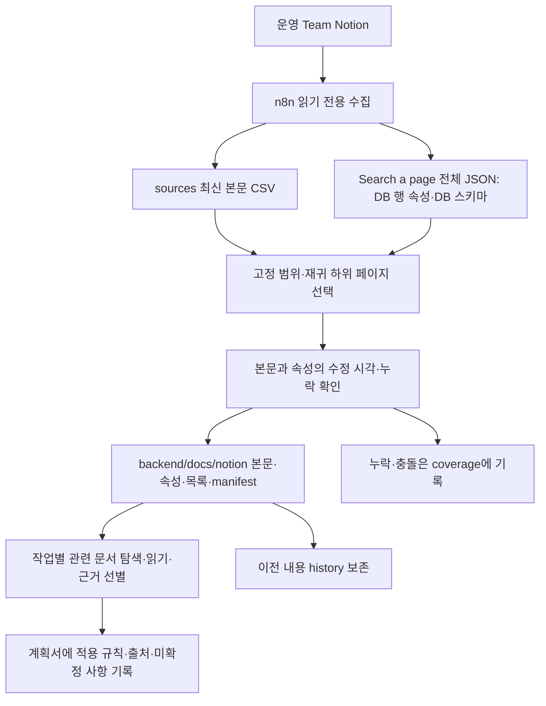

# 운영 Notion → 백엔드 문서 동기화

2026-10-08 사용자가 백엔드용 원문 전체와 DB 행의 속성을 계속 로컬 문서로 가져오도록 허용했다.
적용 범위는 [고정 scope](../../harness/notion-sync-scope.json)에 둔다.
기획 문서 모음 전체, (신)도메인의 지정 5개 페이지와 하위 페이지, (신)API 명세서 전체다.
실제 저장 경로는 `backend/docs/notion/`이다.
이 디렉터리는 Git에서 제외하는 원문 캐시다. 추적되는 문서 탐색 기준은
[notion-context.md](../../backend/docs/notion-context.md)에 둔다.
수집 후에는 변경된 내용을 읽어 관련 현재 문서·계획에 필요한 규칙만 반영한다.
원문 복사만으로 정제된 하네스 갱신을 완료했다고 보고하지 않는다.



## 실행 절차

1. 운영 credential이 설정된 `Knot Notion Change Queue`를 수동 실행하고 Executions의 Succeeded를 확인한다.
   현재 수집 초안은 미게시다. 순차 처리·대기·재시도 설정은 유지한다.
2. 같은 실행의 `Search a page` 출력 전체 JSON을 확보한다. Simplify OFF, Return All ON의
   원문 `properties`가 있어야 한다. 복사가 안 되면 Edit Output에서 전체 선택·복사 후 **Cancel**한다.
   Save·Pin을 누르지 않는다. credential 값은 읽지 않는다.
3. `knot_notion_sources`에서 시스템 열을 포함한 CSV를 다운로드한다.
   raw CSV와 inventory는 저장소 밖의 비공개 작업 디렉터리에 저장하고 권한을 사용자로 제한한다.
4. 저장소 루트에서 실행한다.

```sh
uv run harness/sync_notion_docs.py /absolute/private/sources.csv /absolute/private/inventory.json
uv run harness/sync_notion_docs.py /absolute/private/sources.csv /absolute/private/inventory.json --check
```

5. manifest의 범위·수정 시각과 coverage를 확인한다. `--check`는 현재 입력으로 생성될 파일이
   이미 저장돼 있는지 검사하고 파일을 쓰지 않는다. coverage가 0임을 뜻하지 않는다.
6. 변경한 정책을 현재 Issue·ADR·실제 코드와 대조한다. 관련 문서를 실제로 읽고 필요한 규칙만
   추적되는 주제별 문서나 해당 구현 계획에 반영한다. 현재 정제 문서가 없으면 있다고 가정하지 않는다.
   현재 캐시는 원문 보관 단계이며 실제 구현 API 명세와 구분한다.

## 완료 조건과 queue

본문 캡처만 있거나 DB 속성만 읽었다고 동기화 완료로 판정하지 않는다. page_id별 본문과
속성의 수정 시각이 일치하고, 해당 범위의 하위 페이지·DB 행이 로컬 목록에 포함돼야 한다.
DB 컨테이너는 본문 대신 스키마와 하위 행 목록을 저장할 수 있다.
이미지/파일은 텍스트 수집만으로 원문을 다 읽은 것이 아니다. 필요한 첨부는 추가 확인한다.

`complete`는 수집 상태다. `pending → verified → processed`는 별도의 비교 완료 절차다.
로컬 동기화만으로 candidate를 verified로 바꾸거나 processed를 삭제하지 않는다.
후보 비교를 완료할 때는 현재 manifest에 같은 revision의 본문과 속성이 반영됐는지도 확인한다.
그 뒤 승인된 completion workflow의 source 일치 검사와 processed 정리 규칙을 적용한다.

## 지속 실행과 실패 복구

예약 실행은 각 환경에서 사용자가 명시적으로 설정한 경우에만 동작한다. 저장소 checkout만으로 예약 작업을 설치하거나 특정 대화의 작업을 재사용하지 않는다.
예약 작업은 최신 capture·properties를 읽고 같은 도구를 실행한다. 변경이 없으면 조용히 종료하고, 변경·실패·사용자 판단이 필요한 충돌이 있을 때만 알린다.
로그인 해제·n8n 장애·수집 실패 때 과거 CSV를 최신으로 표시하지 않는다.
마지막 로컬 문서·manifest를 하네스의 오프라인 근거로 유지한다.
raw 백업 위치는 환경별 `${NOTION_EXPORT_DIR}`로 관리하며 저장소에 개인 경로를 기록하지 않는다.

## 과거 수집 관측 · 2026-10-08

최초 실행 근거는 n8n execution `550211`, 18:31:40 KST 시작·3분 22.326초 성공이다.
sources 1,040개, 속성 inventory 1,066개 중 승인된 scope 430개를 로컬에 반영했다. 이 수치는 해당 실행의 관측이며 현재 상태·제품 승인·의미 검토 완료를 뜻하지 않는다. 현재 범위·revision·누락은 각 환경의 manifest와 coverage에서 확인한다.

생성 문서의 수동 편집은 hash 검사에서 중단된다. 기존 변경을 별도 보존·조정한 뒤 갱신한다.
검색에서 사라진 이전 문서는 삭제하지 않고 coverage에 기록한다.
