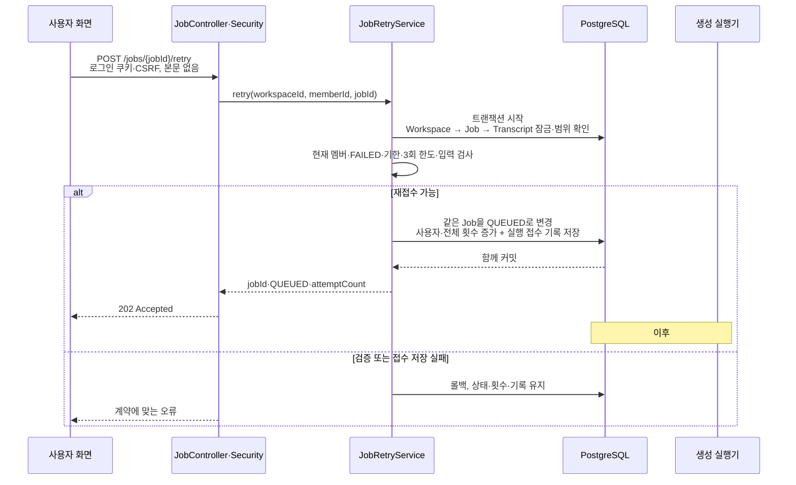

# #494 실패한 문서 생성 작업 재시도 구현 계획

## 2026-10-07 PR #512 리뷰 반영 · 현재 적용 계약 (이부분 수정됨)

사용자가 두 리뷰를 모두 반영하도록 결정했다. 이 절이 아래의 이전 착수 계획·구현 기록을 대체한다. 아래 V31·실행 접수 테이블·Workspace 멤버 전체 재시도 설명은 과거 설계 기록이며 현재 구현 기준이 아니다.

### 범위와 브랜치

기본 체크아웃의 #493 미커밋 리뷰 수정은 그대로 보존한다. 기존 `be/feature/#494`를 `/Users/yongtae/.codex/worktrees/494-review/knot`에 체크아웃해 #512 수정만 진행한다. #493 변경은 커밋 후 부모→자식 순으로 반영하며, 이번에는 미커밋 수정 복사·역방향 병합을 하지 않는다.

### 구현 흐름과 책임

`POST retry` → 인증·CSRF → Workspace 잠금·현재 멤버 검사 → Workspace 범위 Job 잠금 → 연결 Transcript 잠금 → 원본 RecordingSession 조회·`validateControlledBy` → 기한·한도·입력 검사 → Job QUEUED·횟수 갱신 → flush·commit → 202.

입력 조회 DTO·Adapter에 원본 녹음 ID를 추가한다. Service는 기존 RecordingSessionRepository와 도메인 제어 권한 검사를 재사용한다. 같은 Workspace의 다른 멤버 요청은 `403 RECORDING_CONTROL_DENIED`이며 상태·횟수는 유지한다. 생성 Document의 읽기 권한에는 이 소유자 규칙을 확대하지 않는다.

`DocumentGenerationExecutionRequest`와 저장소/Adapter·미병합 V31은 제거한다. V30 횟수 컬럼은 유지한다. Job의 QUEUED 상태와 회차가 재접수의 저장 결과다. 실제 Job 생산·AI 실행·소비·복구·보존 정리 설계는 #501에서 연결하며, 현재 API만으로 AI 호출이 실행된다고 표현하지 않는다.

### 트랜잭션과 TDD

1. 다른 현재 Workspace 멤버의 요청이 403이며 저장 데이터를 유지하는 인수 테스트를 먼저 실행한다. 기존 코드에서 실제 202가 반환되어 RED를 확인했다.
2. 원본 녹음 소유자 검사를 구현하고, 소유자·비소유자·녹음 부재·Workspace 비멤버를 검증한다.
3. 실행 접수 테이블을 제거한다. 상태·횟수만 같은 트랜잭션으로 갱신한다. 기존 중복 요청·동시 접수·기한·탈퇴·정리 경합 검증을 유지한다.
4. 기존 접수 테이블 flush 장애 검증은 Job을 실제 flush한 뒤 장애를 발생시켜 상태·횟수가 롤백되는 PostgreSQL 검증으로 바꾼다. 기존 Transcript FK 보호도 유지한다.
5. 저장소 검증에서 Job 삭제를 막는 신규 실행 접수 FK가 없으며 원문은 유지되는지 확인한다. 삭제된 모델 전용 검증은 함께 제거한다.
6. Swagger·FE 명세를 403 소유자 오류와 QUEUED 접수 계약으로 맞추고 focused 및 전체 Gradle 검증을 실행한다.

### 결과 기록

- 다른 멤버 재시도 인수 테스트 RED: 기대 403, 실제 기존 응답 202를 확인했다. 이후 Service 소유자 검사와 실제 HTTP 403·Job 전체 값 보존 GREEN을 확인했다.
- 집중 검증: 단위 76·통합 24·인수 24 = 124개 PASS. Job 실제 flush 후 장애 롤백·동시 단일 접수·기한·탈퇴·정리 경합을 포함한다.
- 전체 `spotlessCheck check bootJar` PASS: 단위 515·통합 223·인수 325 = 1,063개. 실패·오류·skip 0이다. 이번 #494 체크아웃에는 아직 커밋되지 않은 #493 리뷰 수정이 포함되지 않았으며, 부모 갱신 후 합친 상태의 검증은 별도다.
- 신규 PostgreSQL schema에 V31 실행 접수 테이블이 없고 Job 삭제가 이를 위한 FK로 막히지 않는지 확인했다. 기존 Job→Transcript FK 보호는 유지됐다. 실제 운영 DB 이행·STT/AI 공급자는 관측하지 않았다.
- API 명세·Swagger·제품 결정 문서를 수정했고 diff 공백 검사를 통과했다. 커밋·푸시·GitHub 댓글 게시·PR 본문 수정은 이번 요청에서 수행하지 않았다.
- Persona 기본 체크아웃의 profile·plan·roles·현재 카드 evidence는 기록됐지만 별도 worktree Java 절대 경로 8개는 `Evidence read unavailable`이었다. 실제 컴파일·테스트 PASS와 하네스 evidence 미인증을 구분한다. 기존 전역 하네스 상태는 초기화하지 않는다.
- Persona 종료 실행: `plan --report-filled review` PASS, implementation은 기존 보고서 template-like/incomplete로 거절됐다. `workflow finish implement`는 report-coverage-missing·java-role-read-coverage-missing·convention-toolchain-missing·workflow-loop-state-stale·pending-ticket으로 exit 1이다. 제품 검사 PASS와 하네스 완료 판정은 구분한다.

## 이전 착수 계획과 최초 구현 기록 (현재 계약은 위 절 참조)

상태: #494 제품 구현·로컬 검증 완료. 아래 1~6절은 승인된 착수 계획이며, 실제 실행 결과는 다음 기록을 우선한다.
확인일: 2026-10-07 KST.
대상: [Issue #494](https://github.com/woowacourse-teams/2026-Knot/issues/494).
API: `POST /api/v1/workspaces/{workspaceId}/document-generation-jobs/{jobId}/retry`.
기준: 사용자가 이번 요청에 제공한 최신 API 전문, 기존 사용자 결정, 현재 Issue 본문과 실제 브랜치 코드.
개인 API 적용 기준을 팀 승인·배포 완료와 구분한다. 운영 Notion 및 운영 DB는 이번 계획에서 직접 관측하지 않았다.

### 2026-10-07 구현 결과 (이부분 수정됨)

- `origin/be/feature/#493`의 `951c23572aa522c1dbba8618799390f2df953261`에서 `be/feature/#494`를 실제 생성했다. 부모·형제 브랜치는 변경하지 않았다. 구현 완료 시점에는 원격 쓰기를 하지 않았고, 후속 사용자 요청으로 원자적 커밋·푸시·#493 base의 Draft PR 게시까지 승인받았다.
- `DocumentGenerationJobApi`·`DocumentGenerationJobController`에 POST를 추가하고, `DocumentGenerationJobRetryService.retry(...)`에서 Workspace → Job → Transcript를 JPA/JPQL로 잠금 조회한다. 잠금 대기 후 Clock으로 기한을 검사한다.
- 동일 Job을 QUEUED로 전환하고 전체/사용자 횟수와 영속 실행 접수 기록을 한 트랜잭션에 저장한다. 거절·저장 실패는 횟수를 소비하지 않는다. 사용자 3회·168시간 경계·입력 검사·재실패 시 기한 갱신을 구현했다.
- V30은 최초/사용자/자동 횟수와 합계 제약, V31은 `(job_id, attempt_count)` UNIQUE 접수 테이블을 추가한다. 기존 Job의 미검증 횟수가 있으면 V30은 추정하지 않고 중단한다. 운영 DB 데이터는 미관측이며 적용 전 실제 기록을 확인해야 한다.
- 도메인 → PostgreSQL 저장 기반 → Service/트랜잭션 → HTTP 순서로 테스트 RED와 구현 GREEN을 확인했다. PostgreSQL에서 동시 접수, flush 후 장애 롤백, 잠금 대기 중 만료, 탈퇴 및 정리와의 잠금 경합을 검증했다. 정리 경합은 테스트 SQL로 검증했으며 #501 정리 실행기를 구현한 것은 아니다.
- `PH_BEARSHELL_TIMEOUT_MS=300000 npx ph bearshell --shell './gradlew spotlessApply check bootJar'` PASS. 단위 515·통합 226·인수 324, 총 1,065개. 부모 987 대비 신규 78개이며 실패·오류·skip 0이다. 실제 Security/CSRF·202/400/401/403/404/409·OpenAPI도 포함한다.
- FE 전달 명세: [실패 Job 재시도 API](../api/document-generation-job-retry.md). 실제 본문 없는 Controller는 Content-Type을 필수 검사하지 않으므로 이를 명시했다.
- 202는 영속 접수 완료다. 실제 STT·AI 호출, 접수 소비·작업 복구·자동 재시도·보존 정리는 #501 및 음성 담당 연계다. 실행기 연결 전에는 이번 API만으로 AI가 실행되지 않는다.
- 주 세션 자체 검토이며 외부 리뷰·팀 승인·운영 배포를 뜻하지 않는다. LSP timeout은 Gradle 컴파일·테스트 성공과 구분한다. Persona 종료 판정은 아래 후속 기록에 남긴다.
- Persona 후속 판정: 변경 Java 26개와 profile·plan·roles·현재 카드의 evidence read를 기록했다. `plan --report-filled review`는 성공했고 implementation은 기존 root 보고서의 template-like/incomplete 판정으로 거절됐다. `workflow finish implement`는 report-coverage-missing·java-role-read-coverage-missing·convention-toolchain-missing·workflow-loop-state-stale·pending-ticket으로 exit 1이다. 이전 #493에서 존재하던 하네스 상태와 #427 pending을 보존했으며, 제품 검사 PASS와 Persona 미인증을 구분한다.

## 1. 범위와 브랜치

실패한 기존 Job을 같은 ID로 다시 접수하는 API 하나를 완성한다. 상태·횟수 변경과 DB 실행 접수 기록을 원자적으로 저장하고 202를 반환하는 데까지가 #494의 범위다. 실제 STT·주제 분류·AI 실행, 최초 생성 접수, RUNNING 복구, 자동 재시도 정책, 자료 정리는 #501 및 음성 담당 선행 작업에서 연결한다.

### 확인한 현재 상태

- 체크아웃은 `be/feature/#493`, HEAD는 `951c23572aa522c1dbba8618799390f2df953261`이다. 로컬과 원격 추적 브랜치는 일치한다.
- [PR #511](https://github.com/woowacourse-teams/2026-Knot/pull/511)은 OPEN이며 base는 `be/feature/#496`이다.
- [PR #502](https://github.com/woowacourse-teams/2026-Knot/pull/502)은 OPEN이며 base는 `develop`이다. #493에는 #496의 `c9682f46`이 포함되어 있다.
- 원격 `develop`은 `4d129ddcef437b34e46b90ae81c271963aa2475f`다. 현재 원격 migration은 V26까지이며 V27은 #496, V28·V29는 #493에 있다.
- #495·#497·#498 PR은 형제 또는 별도 후속 브랜치다. #494에 가져올 필수 기반은 아니다. #498의 쓰기·잠금 방식은 설계 참고로만 읽었다.
- `docs/harness/notion-alignment.md`에는 기존 사용자 변경이 있다. 이번 계획에서 수정하지 않는다.

### 제안하는 분기

```text
develop
  └─ be/feature/#496  (PR #502: 공통 저장 기반·문서 상세)
       └─ be/feature/#493  (PR #511: Job 목록·실패 기한)
            └─ be/feature/#494  (다음 구현: 재시도 접수)
```

현재처럼 부모 PR이 미병합이면 최신 `origin/be/feature/#493`에서 `be/feature/#494`를 만든다. 처음 PR의 base는 `be/feature/#493`으로 둬 재시도 변경만 리뷰하게 한다. `develop`에서 바로 시작하면 필요한 Job 실패 기한과 API 기반이 없다.

다음은 구현 시작 시 실행할 후보 명령이며 이번 계획에서는 실행하지 않았다. 실행 직전에 부모 PR 상태·HEAD와 사용자 변경을 다시 확인한다.

```bash
git fetch origin develop 'be/feature/#493'
git switch --no-track -c 'be/feature/#494' 'origin/be/feature/#493'
```

부모 리뷰 수정은 부모 브랜치에서 처리한 뒤 #494에 순서대로 반영한다. #494 변경을 부모나 형제 브랜치에 역으로 섞지 않는다. 이 계획 파일은 아직 미커밋이므로 분기할 때 함께 옮겨 #494의 문서로 관리한다.

착수 전에 #493과 그 선행 기반이 모두 `develop`에 병합됐다면 최신 `origin/develop`에서 분기하고 PR base도 `develop`으로 잡는다. #493만 병합되고 #496이 아직 미병합이면 최신 #496에 #493 변경이 포함됐는지 확인하고 그 브랜치를 부모로 잡는다.

작업 도중 부모가 병합되면 실제 merge/squash 방식과 새 diff를 확인해 최신 부모로 갱신한다. 일반 merge 이력이 이어지면 새 부모를 병합해 갱신하는 방식으로 충분하다. squash로 부모 커밋이 중복되면 분기 시 기록한 부모 SHA 이후의 #494 커밋만 옮기는 방안을 별도로 정한다. rebase·force push를 자동 수행하지 않는다.

## 2. 구현할 흐름

사용자가 실패 카드에서 다시 시도를 누르면 서버는 로그인과 CSRF를 검사한다. 현재 Workspace 멤버인지 확인하고, 그 Workspace에 속한 Job과 저장된 입력 원문을 잠금 조회한다. 잠금 대기가 끝난 뒤 서버 시각으로 기한을 검사한다.



최초 실행만 한 Job은 `attemptCount=1`, `userRetryCount=0`, `automaticRetryCount=0`에서 시작한다. 첫 사용자 재시도 접수 후에는 전체 횟수 2, 사용자 횟수 1이다. 최초 실행과 사용자 재시도 3회만 있으면 전체 횟수는 4다. 내부 자동 재시도가 있으면 전체 횟수에도 포함하지만 사용자 3회 한도를 차감하지 않는다.

### 오류와 중복 요청

| 조건 | 결과 |
| --- | --- |
| 로그인 없음 | 정상 CSRF 조건에서 401 UNAUTHENTICATED |
| CSRF 누락·불일치 | 기존 Security 경로의 403. CSRF와 인증이 둘 다 없으면 필터 순서에 따라 403이 먼저 나올 수 있음 |
| 현재 Workspace 비멤버·탈퇴자·삭제 Workspace | 403 WORKSPACE_ACCESS_DENIED |
| Job 없음·다른 Workspace Job·정리되어 삭제된 Job | 404 DOCUMENT_GENERATION_JOB_NOT_FOUND |
| FAILED 아님·사용자 3회 소진·만료·사용할 수 없는 입력 | 409 RETRY_NOT_ALLOWED |
| 접수 기록 저장 실패 | 요청 실패와 전체 롤백. 202를 반환하지 않음 |

7일은 #493과 동일한 168시간이며 `now < expiresAt`일 때만 허용한다. 정확한 만료 시각부터 거절한다. 실패 시각이 다시 기록되면 새 7일 기한을 계산하지만 사용자 누적 횟수는 유지한다.

같은 FAILED 상태에 대한 동시 요청에서는 먼저 접수한 요청만 202를 받는다. 잠금 후 QUEUED를 본 후속 요청은 409이며 횟수·기록을 추가하지 않는다. 최초 확인 API의 반복 성공 응답과 다른 계약이다. 실행이 다시 실패해 새로운 FAILED 상태가 되면 한도·기한 안에서 다음 사용자 재시도가 가능하다. 이 API에는 영구적인 요청 식별 키가 없으므로 서로 다른 실패 주기의 요청까지 같은 클릭으로 판별한다고 주장하지 않는다.

## 3. 나올 코드와 메서드 초안

실제 재사용할 코드:

| 기존 위치·클래스 | 현재 책임 | 이번 활용 |
| --- | --- | --- |
| `document/presentation/DocumentGenerationJobApi`·`DocumentGenerationJobController` | Job 목록의 Swagger와 실제 GET 매핑 | 같은 두 클래스에 재시도 POST 추가 |
| `document/domain/DocumentGenerationJob` | 원문 ID·상태·생성/갱신 시각·실패/만료 시각, `queue(...)`, `recordFailure(...)` | 상태 전이·횟수 규칙 추가. 재실패 메서드는 누적 횟수를 유지 |
| `WorkspaceRepository.findByIdForUpdate(...)` | 삭제되지 않은 Workspace 잠금 조회 | 탈퇴·삭제와 접근 판단 순서 일치 |
| `WorkspaceMemberRepository.existsByWorkspaceIdAndMemberId(...)` | 현재 활성 멤버 검사 | 로그인 Member의 현재 접근 권한 확인 |
| `recording/domain/Transcript` | 저장된 원문 텍스트와 녹음 연결 | 입력 조회에 사용. STT 생산·검토·공급자 로직은 변경하지 않음 |
| `SecurityConfig`·`GlobalExceptionHandler` | 쿠키 인증·CSRF 및 오류 category의 HTTP 매핑 | 기존 경로 재사용. 임의 인증 예외를 Controller에서 처리하지 않음 |

다음은 제안 코드이며 아직 존재하지 않는다. 패키지는 `com.knot.backend` 아래다.

| 위치·클래스 | 책임 | 메서드 후보·입력·결과 |
| --- | --- | --- |
| `document/application/DocumentGenerationJobRetryService` | 재시도 유스케이스와 쓰기 트랜잭션 | `retry(workspaceId, memberId, jobId)` → RetryResult. 권한·입력 검사 후 Job 전이와 접수 저장 |
| `document/domain/DocumentGenerationJob` 변경 | 자기 상태·기한·사용자 한도 판단 | `retryByUser(acceptedAt)`: FAILED·기한·한도 검사 후 QUEUED, 전체/사용자 횟수 증가 |
| `document/domain/DocumentGenerationJobRepository` | 쓰기용 Job 조회·저장 계약 | `findByWorkspaceIdAndIdForUpdate(...)`, `flush()` |
| `document/infrastructure/DocumentGenerationJobJpaRepository`·Adapter | 범위 조회와 JPA 비관적 잠금 | JPQL로 Job→Transcript→RecordingSession 범위 제한. 실제 생성 SQL의 잠금 범위를 PostgreSQL에서 확인 |
| `document/application/DocumentGenerationInputQuery`·조회 Adapter | 저장 입력을 잠금 조회하고 전달 | `findForUpdate(workspaceId, transcriptId)` → Optional InputResult. Service가 원문 사용 가능 여부를 판단 |
| `document/application/dto/result/DocumentGenerationInputResult` | 입력 확인에 필요한 원문 ID·내용 전달 | 공급자나 HTTP 응답과 연결하지 않음 |
| `document/domain/DocumentGenerationExecutionRequest`·Repository 및 JPA 구현 | DB에 접수 사실을 영속 기록 | `accept(jobId, attemptCount, acceptedAt)`·`save(...)`·`flush()` |
| `document/application/dto/result/DocumentGenerationJobRetryResult` | 접수 결과 전달 | jobId·status·attemptCount |
| `document/presentation/dto/response/DocumentGenerationJobRetryResponse` | API 응답과 Swagger 필드 | `from(result)` |
| 기존 Api·Controller 변경 | Swagger·실제 POST·202 응답 | `retryDocumentGenerationJob(...)`. 요청 본문 DTO는 만들지 않음 |
| `document/domain/DocumentErrorCode` 변경 | API의 Job 오류 분류 | NOT_FOUND category의 DOCUMENT_GENERATION_JOB_NOT_FOUND, CONFLICT category의 RETRY_NOT_ALLOWED |

목록 서비스는 조회 전용으로 유지하고 재시도 서비스에 쓰기 책임을 둔다. Controller의 기존 필드 `service`는 필요하면 `listService`로 명확히 하고 `retryService`를 추가한다. Controller는 서비스 결과를 응답으로 변환하고 HTTP 202를 정한다.

입력 조회 Adapter는 기존 Transcript 매핑을 사용한다. 음성 도메인의 성공 원문 생산·구간 저장·공급자 상태 모델을 #494에서 새로 설계하지 않는다. 현재 모델에 없는 STT 검토 상태를 조건으로 넣지 않는다. 저장 원문 부재 또는 사용할 텍스트가 없는 경우는 입력 불가로 거절하도록 계획한다. FK가 정상인 현재 DB에서는 참조 원문만 먼저 삭제되는 상황은 DB가 막는다.

생성 단계·확정 주제·실행 lease 등 #501의 실행 메타데이터는 #494 접수 모델에 추측해 넣지 않는다. 접수는 jobId와 회차를 넘기고, 실행기는 Job에 연결된 저장 진행 정보를 읽는 계약으로 연결한다.

삼항 연산자를 쓰지 않는다. `validateRetryState`, `validateRetryDeadline`, `validateUserRetryLimit`, `validateRetryTime`, `validateInput`처럼 규칙 단위 private 메서드로 표현한다. 클래스·인터페이스 첫 빈 줄, 일반 필드 묶음, 상수/필드 및 필드/메서드 구분은 현재 사용자 컨벤션을 적용한다.

## 4. 저장 기반과 주의할 점

### 필요한 저장 변경

| 모델·테이블 | 제안 추가 | 지켜야 할 조건 |
| --- | --- | --- |
| `document_generation_jobs` | `attempt_count`, `user_retry_count`, `automatic_retry_count` | 모두 non-null. 전체 ≥1, 사용자 0~3, 자동 ≥0, 전체=1+사용자+자동. 정수 범위 초과도 상태 변경 전에 거절 |
| `document_generation_execution_requests` | ID·job_id·attempt_count·accepted_at | Job FK, UNIQUE(job_id, attempt_count), 양수 회차·필수 시각. 이번 범위는 사용자 재접수 기록 |

`attemptCount`는 API 정의대로 접수된 시도의 누적 횟수다. AI 호출이 실제 시작될 때 다시 증가시키면 이중 계산이 되므로 #501이 이미 접수된 회차를 그대로 소비해야 한다. 자동 재시도는 #501에서 자동/전체 횟수를 함께 증가시키는 방식으로 연결한다.

재접수 시 `createdAt`은 유지하고 `updatedAt`을 접수 시각으로 바꾼다. 기존 `lastFailedAt`·`expiresAt`은 실패 이력으로 유지할 수 있다. V28은 QUEUED에서도 과거 실패 이력을 허용한다. #493은 상태가 QUEUED·RUNNING이면 옛 실패 만료 여부로 제외하지 않는다. 자료 정리 역시 FAILED만 만료 대상으로 삼아 기한 전에 접수된 실행을 보호해야 한다.

### 실행 접수 방식의 선택

1. Job의 QUEUED 행 자체를 실행 대기열로 사용: 테이블은 적지만 회차별 접수 기록과 처리 이력을 #501의 상태 모델에 결합한다.
2. 같은 DB에 별도 실행 접수 행 저장: 작은 테이블이 추가되지만 사용자 재접수 회차를 명시하고 Job 전이와 함께 커밋할 수 있다.
3. 메모리 이벤트 또는 외부 큐에만 전달: DB 커밋·외부 전달 사이의 중단을 처리할 추가 장치가 필요하다.

이번 제안은 2다. 별도 broker나 라이브러리를 도입하지 않고 DB에 남은 실행 접수 행을 #501이 읽게 한다. 흔히 outbox라고 부르는 방식이며, 이 계획에서는 DB에 접수 사실을 남기는 데 집중한다. 메모리 이벤트는 있어도 알림 보조 수단일 뿐 영속 접수의 근거가 아니다. 실행기가 아직 없으므로 #494만으로 실제 생성 재실행이 완료되지는 않는다. 공개 기능의 운영 연결은 #501 소비 경로까지 확인해야 한다.

접수 소비·중복 실행 방지·재시작 복구·기록 정리 기준은 #501에서 구체화한다. FK는 접수 기록이 있는 Job을 먼저 삭제하지 못하게 하며, #501의 만료 정리는 관련 접수 기록과 참조를 확인한 후 순서대로 정리해야 한다. 성공 Document·확인 대상은 #494에서 수정하지 않는다.

### 트랜잭션과 경합

`DocumentGenerationJobRetryService.retry(...)`를 READ_COMMITTED 쓰기 트랜잭션으로 계획한다. 잠금은 Workspace→대상 Job→입력 Transcript 순서를 제안한다. Workspace 잠금은 기존 탈퇴·삭제와 권한 검사를 직렬화하지만 같은 Workspace의 다른 쓰기도 대기시킬 수 있다. 트랜잭션은 짧게 유지하고 외부 AI·파일 호출을 넣지 않는다.

Job 잠금 후 최신 상태를 다시 검사하며, 입력 잠금이 끝난 뒤 Clock을 읽어 만료를 판단한다. 조회 시작 시각을 먼저 잡으면 긴 잠금 대기 뒤에 만료된 재시도를 접수할 수 있다. 시각은 PostgreSQL 저장 정밀도와 맞춰 마이크로초 단위로 다룬다.

Job 상태·횟수·접수 기록의 flush와 최종 commit이 함께 성공해야 한다. flush는 SQL 반영 단계이며 commit이 아니다. 접수 저장 또는 flush 실패를 예외로 전달해 전부 롤백한다. 외부 실행 호출을 트랜잭션에 끼워 넣지 않는다.

#501의 삭제 작업도 공유 입력을 보호하고 호환되는 잠금 순서를 사용해야 한다. 여러 Job을 잠글 때는 일정한 ID 순서를 정하고, Transcript부터 잠근 뒤 Job으로 거꾸로 접근하는 경로를 피한다. 재접수가 먼저 확정되면 QUEUED 입력을 보호하고, 삭제가 먼저 확정되면 404 또는 남아 있는 입력 불가 Job의 409로 거절한다. #494에서는 DB 경합 시험으로 이 경계를 검증하고 실제 정리 실행기의 통합 시험은 #501에서 수행한다.

### Migration과 배포

새 migration이 필요하다. 현재 후보 순서는 V27(#496)→V28·V29(#493)→#494 신규 migration이다. 정확한 새 버전은 구현 착수 직전 원격 develop과 모든 관련 PR을 재확인한 뒤 정한다. 이미 공개된 V27·V28·V29를 고치거나 `outOfOrder`로 순서를 우회하지 않는다.

기존 Job에는 횟수 컬럼이 없으므로 과거 시도 횟수를 상태만 보고 추정하지 않는다. 검증된 최초 실행만 있는 데이터라면 1/0/0으로 이행할 수 있지만, 이력이 불명확하면 명시적으로 이행을 중단하고 실제 기록을 확인한다. 운영 DB의 기존 행과 Flyway 적용 상태는 아직 관측하지 않았다. 이행 검증에는 신규 빈 DB와 검증된 기존 데이터, 확인되지 않은 기존 이력에서 중단·행 보존을 포함한다.

이번 계획에서 ADR 파일은 만들지 않는다. #494 본문에는 예정 ADR 경로가 없다. 실행 접수 저장 방식의 대안·선택 이유는 이 계획에 기록했고, 구현 착수 시 기존 ADR 및 #501의 실행기 설계와 중복 여부를 확인한다. ADR이 필요한 판정이 있으면 저장소의 자산화 절차를 따른다.

## 5. TDD와 검증 순서

모든 테스트 소스는 현재 Gradle 구조에 맞게 `backend/src/test/java/com/knot/backend/` 아래 둔다. 단위·integration·acceptance는 JUnit tag와 Gradle task로 나뉜다. 별도 `src/integrationTest` 폴더를 가정하지 않는다.

1. **Job 생성 횟수·사용자 재시도 규칙**: 실패 테스트 → 최초 1/0/0과 `retryByUser(...)` 최소 구현. FAILED만 접수, 사용자 3회 허용·4회 거절, 정확한 7일 경계, 거절 시 불변, 자동 횟수와 분리한다.
2. **재실패 이력 유지**: 실패 테스트 → `recordFailure(...)`가 사용자·자동·전체 누적 횟수를 보존하며 기한만 새로 잡는 동작을 확인한다. 타임스탬프 범위·단조 증가 및 정수 경계도 검사한다.
3. **횟수 저장과 기존 데이터 이행**: PostgreSQL 실패 테스트 → 신규 migration과 JPA 필드 매핑. 초기 행·CHECK·검증된 이행·불명확한 이력 중단을 검증한다.
4. **실행 접수 기록 저장**: PostgreSQL 실패 테스트 → 접수 Entity·Repository·FK·회차 UNIQUE. DB에 한 번만 기록되고 잘못된 참조는 저장되지 않아야 한다.
5. **잠금 조회와 Workspace 격리**: PostgreSQL 실패 테스트 → Job 쓰기 Repository와 입력 조회 Adapter. 다른 Workspace를 반환하지 않고 Job/입력 경합을 실제 DB에서 관측한다.
6. **재시도 서비스**: Mockito 실패 테스트 → `retry(...)` 조정. 권한·상태·만료·입력 거절과 정상 접수 결과, 기록 저장 실패 전달을 확인한다.
7. **실제 트랜잭션**: PostgreSQL 실패 테스트 → 동시 요청 202 대상 하나, 횟수/접수 하나, 저장 실패 시 전부 롤백, 잠금 대기 중 만료, 탈퇴·정리와의 순서 검증. Mockito 성공을 DB 잠금 증거로 쓰지 않는다.
8. **HTTP·Swagger**: MVC 실패 테스트 → Api·Controller·Response 구현. 본문 없는 POST와 202, jobId·QUEUED·attemptCount, path 오류와 서비스 오류 매핑을 검증한다.
9. **인증·DB 통합과 문서**: 실제 Security·PostgreSQL 인수 테스트 → 로그인·CSRF·Workspace 격리·연속 재실패/재접수·형제 성공 문서 보호, #493 GET에서 재접수 Job 노출을 확인한다. FE 명세와 이 계획의 실행 기록을 정리한다.

| 테스트 위치·방식 | 검증할 동작 | 기대 결과 |
| --- | --- | --- |
| `document/domain/DocumentGenerationJobTest`, 단위 | 최초 횟수·정상 retry·상태/한도/시각 오류·재실패 | 같은 Job, QUEUED, 전체/사용자 각각 +1. 거절은 불변. 재실패는 횟수 유지 |
| 접수 Entity 단위 및 PostgreSQL 저장 시험 | 유효 접수·잘못된 ID/회차·같은 회차 중복 | 정상 기록 하나, 무효 저장 거절 |
| Job·접수 migration integration | CHECK·FK·기존 행 이행 | 계약 위반 차단. 확인되지 않은 이력은 추정 없이 중단·보존 |
| RetryService Mockito | 현재 멤버 성공·비멤버·Job 부재·입력 불가·저장 실패 | Result 또는 계약 오류. 거절 시 접수 저장 없음 |
| RetryTransactionIntegrationTest, 실제 PostgreSQL | 같은 Job 동시 접수·기록 저장 후 실패·잠금 대기 중 만료 | 접수 한 번·횟수 한 번. 실패한 트랜잭션은 상태/횟수/기록 전부 롤백 |
| PostgreSQL 경합 시험 | 재접수 대 삭제·탈퇴 | 먼저 확정된 결과와 현재 권한을 반영. 입력 부재 실행이나 잠금 순서 교착을 피함 |
| JobControllerTest, MVC | 빈 본문 POST·202 DTO·404/409·잘못된 경로 | 정확한 status와 JSON. standalone MVC만으로 Security 검증을 주장하지 않음 |
| JobRetryAcceptanceTest, 실제 Security·PostgreSQL | 쿠키 인증·실제 CSRF cookie/header·기한/한도·다른 Workspace | 202/401/403/404/409 및 저장 결과 일치 |
| 인수·회귀 시험 | 재접수 Job 목록, 형제 성공 문서·확인·원문 보존 | #493에 QUEUED 노출. 기존 성공 결과는 불변 |

없는 입력 분기는 Service 대역으로 거절을 검증하고, DB 시험에서는 실제 FK 때문에 원문만 지울 수 없는 점을 별도로 검증한다. 데이터 제약을 해제한 테스트를 정상 운영 상황의 증거로 사용하지 않는다. 정리 경합 시험은 필요한 최소 DB 연산을 실행하며 실제 #501 정리 실행기의 완료를 뜻하지 않는다.

예정 커밋 경계는 public 동작·schema·adapter 단위로 둔다. 가능한 동작은 test→feat로 나누고, 횟수 migration·접수 테이블·잠금 Adapter·서비스·HTTP·문서는 독립 단위로 관리한다. refactor는 통과한 동작에서 실제 가독성 개선이 필요한 경우에만 추가한다. 커밋 권한을 이번 계획 요청에서 추정하지 않는다.

저장소 설정에서 확인한 예정 명령:

```bash
./gradlew test --tests '*DocumentGenerationJobTest'
./gradlew test --tests '*DocumentGenerationJobRetryServiceTest'
./gradlew integrationTest --tests '*DocumentGenerationJob*IntegrationTest'
./gradlew acceptanceTest --tests '*DocumentGenerationJob*AcceptanceTest'
./gradlew spotlessApply spotlessCheck
./gradlew check bootJar
```

구현 때는 먼저 `npx ph workflow implement`를 실행하고 종료 보고서와 `npx ph workflow finish implement`를 수행한다. 이번 계획에서는 구현 워크플로·제품 테스트를 실행하지 않았다.

## 6. 완료 기준과 다음 작업

- 빈 본문 POST가 현재 멤버·CSRF·Job 상태·횟수·기한·입력을 검사하고, 같은 Job의 QUEUED 전환·횟수 증가·영속 접수 기록을 함께 확정한다.
- 동시 요청과 접수 저장 실패의 결과를 실제 PostgreSQL에서 확인한다. 202 응답은 커밋된 접수 사실을 의미한다.
- #493 조회에서 재접수 작업을 확인하며 형제 Job의 성공 문서·확인 기록·원문이 보존된다.
- 공개된 migration 이력과 사용자 변경을 보존하고, FE 명세·OpenAPI·계획의 실행 기록을 실제 구현과 맞춘다.
- 저장된 fixture로 API·DB 계약을 검증한 것과 실제 AI 실행·STT 지원·운영 배포를 구분한다.

이후 #501이 저장 접수 행을 읽어 회차별 실행·중복 방지·재시작 복구·정리 보호를 완성한다. #499는 음성 담당의 실제 원문 구간 저장 계약을 확인한 뒤 별도로 진행한다. 자동 재시도 한도·backoff·timeout은 기존 확정 범위대로 #501에서 설계하며 이번에 다시 제품 질문으로 돌리지 않는다.

이번 요청의 산출물은 이 계획 문서와 채팅 설명이다. 브랜치 생성·체크아웃·제품 코드 변경·커밋·푸시·PR 게시를 수행하지 않는다.
