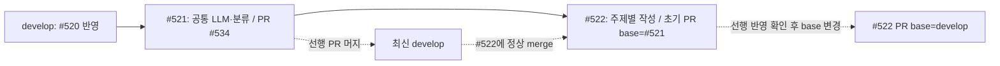
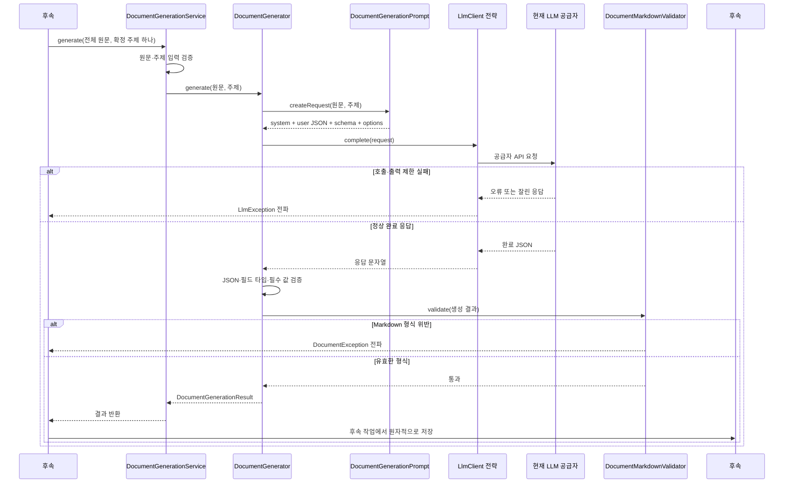

# #522 주제별 Markdown 문서 생성 구현 계획

- 상태: 사용자 승인으로 테스트 먼저 구현하고 검증 완료. `be/feature/#522`에서 동작별 커밋을 구성했다.
- 확인일: 2026-10-08, Asia/Seoul.
- 대상: [#522](https://github.com/woowacourse-teams/2026-Knot/issues/522).
- 사용자 선택: #521 머지를 기다리지 않고 그 기반 위에서 #522를 시작한다.

## 1. 범위와 브랜치

전체 저장 원문과 확정 주제 하나를 받아 `title`, nullable `summary`, Markdown `content`를 생성·검증해 반환한다. 이 작업의 공개 동작은 서버 내부의 `generate(transcriptContent, topic)`이다. HTTP endpoint를 추가하지 않는다.

#521의 분류 결과와 공통 LLM 호출 계약을 재사용한다. #522는 원문을 다시 분류하거나 다른 주제까지 한 응답으로 생성하지 않는다. 자동 접수·Job 등록은 #523, Document·확인 대상의 원자적 저장은 #524, 실제 Job 실행·재시도는 #525, 자료 정리는 #526이다. #521에는 결과의 DB 저장 기능이 없으므로 Issue의 ‘결과·저장 계약 재사용’을 이미 구현된 저장소로 해석하지 않는다.

### 근거와 적용 범위

Notion은 로컬 수집 사본에서 필요한 본문과 manifest revision을 확인했다. 운영 원문을 방금 다시 조회한 것은 아니다. selected API/QA의 본문·속성 revision은 일치하고 manifest status는 빈 배열이다. 수집 완료는 제품 구현이나 팀 승인 완료를 뜻하지 않는다.

| 자료 | 출처·확인 시점 | 적용하는 사실 | 판정 |
|---|---|---|---|
| #522 | [Issue](https://github.com/woowacourse-teams/2026-Knot/issues/522), 10/8 조회 | 전체 원문 + 단일 주제, 작성 규칙, nullable summary, 저장 제외 | 이번 작업 계약. 팀 리뷰 승인과 구분 |
| #534 | [PR](https://github.com/woowacourse-teams/2026-Knot/pull/534), 10/8 조회 | OPEN, REVIEW_REQUIRED, head `72400d6f`; #521 공통 client와 분류 구현이 존재 | 열린 선행 구현. develop 반영 완료 아님 |
| 현재 V2 기준 | [저장소 문서](../product/current-v2-mvp.md) | 읽기 전용 문서를 생성 즉시 DRAFT로 저장하는 후속 흐름 | 현재 제품 기준. 저장은 #524 범위 |
| 문서 상세 API | [Notion](https://www.notion.so/3ebb4351752280289a59e5e52a060471), body/properties 10/6 05:01 UTC, capture 10/7 13:07 UTC | title 필수, summary nullable, content는 읽기 전용 Markdown; 다른 주제 완료를 기다리지 않음 | 사용자 지정 API 우선 기준. 실제 구현은 코드 별도 확인 |
| 주제별 자동 생성 | [STT-R7](https://www.notion.so/3f2b43517522819e8af4fcd6e5f75b39), revision 10/7 03:44 UTC, capture 10/7 13:07 UTC | 녹음 하나에서 주제별 문서 생성, 수동 원문 검토 버튼 불필요 | QA 참고. 이번 작업은 작성 기능만 제공 |
| Markdown 복사 | [STT-R10](https://www.notion.so/3f2b435175228123ae73c6fb679afcd6), revision 10/7 03:45 UTC, capture 10/7 13:07 UTC | 제목·목록·본문을 Markdown으로 복사 | UI 요구 참고. 클립보드 구현은 FE 범위 |
| 도메인·ERD | [도메인 규칙](https://www.notion.so/3e3b4351752280cd9f06edc2ccdff1d8), [ERDiagram](https://www.notion.so/3e4b4351752280cd86c7dc92aac63fd1), revision 각각 10/7 10:36·10:45 UTC, capture 10/7 13:07 UTC | 저장 완료 Transcript를 입력으로 사용; 여러 Document; content TEXT | 문서 생성·Document 컬럼 부분만 대조. 엔티티 변경은 이번 범위 밖 |
| 결정 없음 QA | [STT-R23](https://www.notion.so/3f2b4351752281d29a2dc9831a069c1e), revision 10/7 03:44 UTC, capture 10/7 13:07 UTC | 결정 없음 문구를 넣는 과거 표시 규칙이 남음 | 이번 사용자 규칙·#522와 충돌. 빈 결정 섹션과 안내 문구는 만들지 않음 |
| 작성 실험 | [작성 v7](../llm-test/topic-writer-v7.md), [설정 후보](../llm-test/recommended-settings.md) | 분류 판단 사례, 추론 512·출력 4096 후보 | 과거 실제 합성 관찰. 제품 경로의 품질·최적값을 보장하지 않음 |
| 실제 코드·profile | backend의 LlmClient, LmStudioClient, DocumentTopicPrompt, Document 및 `.persona/project-profile.jsonc` | Java 25, Boot 4.1, Gradle, 도메인 중심 단순 계층. 스트리밍 없이 JSON 응답을 받음 | 현재 구현 관측 |

사용자가 반복해 지정한 ‘해당 내용이 없으면 섹션 생략, 없음 문구 금지’를 적용한다. 기존 QA의 결정 없음 문구를 prompt나 생성 본문에 가져오지 않는다. 결정이 없다는 이유로 논의가 있는 문서를 생성 실패나 NO_CONTENT로 바꾸지도 않는다.

### 지금 시작하는 브랜치

계획 작성 당시 checkout은 `be/feature/#521`, local/remote head는 `72400d6f`였다. #521은 develop `0b697abd`를 포함했다. 구현 요청에서 이 원격 head를 기준으로 `be/feature/#522`를 실제 생성했다. #534가 OPEN인 동안 PR base는 #521을 사용한다.

원격을 fetch하고 #534가 OPEN임을 확인한 뒤 아래 방식으로 시작했다. 선행 PR 머지 전에는 이번 변경만 비교할 수 있도록 base를 #521로 유지한다.

```sh
git fetch origin develop 'be/feature/#521'
git switch -c 'be/feature/#522' 'origin/be/feature/#521'
```

초기 #522 PR의 head는 `be/feature/#522`, base는 `be/feature/#521`이다. 이렇게 하면 #522 PR diff에 #521 코드와 선행 문서 커밋을 다시 제시하지 않는다. #521 자체가 아니라 #522에서 작성 코드만 변경한다.



선행 리뷰 수정은 `origin/be/feature/#521`을 #522에 정상 merge해 가져온다. #534가 머지되면 최신 develop을 #522에 merge하고 PR base를 develop으로 바꾼다. 강제 push나 이력 재작성은 기본 방식으로 사용하지 않는다.

```sh
git fetch origin develop
git switch 'be/feature/#522'
git merge origin/develop
```

base 변경 전에는 `git diff origin/develop...HEAD`에서 #521 변경이 별도 변경으로 다시 나타나지 않는지 확인한다. 선행 PR이 squash되거나 리뷰에서 수정됐다면 실제 파일 차이를 보고 충돌을 해결한다. 시작 전에 #534가 이미 머지됐다면 처음부터 최신 `origin/develop`에서 #522를 만든다.

## 2. 구현할 흐름

후속 #525 실행기가 저장된 전체 원문과 해당 Job의 확정 주제를 읽어 작성 서비스를 호출한다. 상위 실행기는 입력을 읽는 짧은 트랜잭션을 끝낸 뒤 LLM을 호출하고, 반환 결과를 #524의 별도 저장 트랜잭션으로 넘긴다. #522에는 Repository와 트랜잭션 애노테이션을 추가하지 않는다. 이것만으로 호출자의 기존 트랜잭션이 자동 중단되는 것은 아니므로 외부 호출 전에 트랜잭션을 끝내는 책임은 상위 호출자에게 있다.



입력 예시는 `topic=검색 기능 도입 조건`과 전체 원문 문자열이다. 모델 응답은 다음 세 필드만 사용한다. 주제는 이미 확정된 입력이므로 모델 응답으로 바꾸지 않는다.

```json
{
  "title": "검색 기능 개발의 시작 조건",
  "summary": "사용자 수가 1,000명을 넘으면 개발하며 그 전에는 시작하지 않는다.",
  "content": "## 핵심 요약\n검색 기능은 사용자 수가 1,000명을 넘으면 개발하기로 합의했다.\n\n## 보류\n- 검색 기능 개발: 사용자 수가 1,000명을 넘으면 진행하며 그 전에는 시작하지 않는다."
}
```

결정이 없는 정상 문서는 핵심 요약과 실제 배경·제안 등만 있어도 성공한다. 빈 문자열·빈 객체·깨진 JSON은 정상적인 내용 없음 결과가 아니다. 이미 확정된 주제를 작성하다 실패한 경우 오류를 반환하고 재분류·부분 본문 저장·숨은 재시도는 하지 않는다.

## 3. 나올 코드와 메서드 초안

### 현재 코드에서 재사용

| 기존 위치·클래스 | 현재 책임 | #522 사용 방식 |
|---|---|---|
| `global/infrastructure/llm/LlmClient` | `complete(LlmCompletionRequest)` 전략 계약 | LM Studio 구체 타입 대신 이 인터페이스에 의존 |
| `LmStudioClient` | 인증·기한·응답 크기·공급자 오류·완료 사유 검사 | 동일 API 통신 재사용. SSE 기능 추가하지 않음 |
| `LlmCompletionRequest`, `LlmMessage`, `LlmGenerationOptions` | 요청·JSON 스키마·생성 설정 | 작성용 prompt/schema/options만 별도로 전달 |
| `global/config/LlmConfig`, `LlmProperties` | provider 선택, enabled 조건과 연결 설정 | `knot.llm.enabled=true` 조건을 작성 Bean에도 적용 |
| `document/infrastructure/llm/DocumentTopicPrompt`, `DocumentTopicClassifier` | 원문 데이터와 system 규칙 분리, 엄격한 JSON 해석 | 구현 패턴 참고. 분류 호출이나 topics 파서를 작성에 재사용하지 않음 |
| `document/domain/DocumentException`, `DocumentErrorCode` | 문서 도메인 오류 | 입력·작성 응답 오류를 코드로 표현 |
| `document/domain/Document.createDraft(...)` | 저장할 Document 구성 | 이번 단계에서는 호출하지 않음. #524에서 결과 사용 |

### 새로 제안하는 구성

패키지는 `com.knot.backend` 아래다. 클래스·메서드 이름은 아래 제안으로 시작한다. 별도 작성 인터페이스·추상 팩토리·공통 프롬프트 엔진은 추가하지 않는다.

| 위치·클래스 | 책임 | 메서드 초안과 결과 |
|---|---|---|
| `document/application/DocumentGenerationService` | 상위 실행기가 호출할 단일 주제 작성 유즈케이스 | public `generate(String transcriptContent, String topic)` → `DocumentGenerationResult` |
| 동일 Service | 입력을 나눠 검증하고 유효한 호출만 위임 | private `validateTranscriptContent`, `validateTopic` |
| `document/infrastructure/llm/DocumentGenerationPrompt` | 작성 규칙·템플릿·스키마·설정으로 요청 구성 | public `createRequest(String transcriptContent, String topic)` → `LlmCompletionRequest` |
| 동일 Prompt | 원문·주제를 JSON 데이터로 보존하고 리소스 로드 | private `createMessages`, `serializeInput`, `createOptions`, `readResource` |
| `document/infrastructure/llm/DocumentGenerator` | client 호출, 응답 해석·검증·결과 구성 | public `generate(String transcriptContent, String topic)` → `DocumentGenerationResult` |
| 동일 Generator | 타입 강제 변환 없이 JSON 계약 검사 | private `readResponse`, `validateResponseFields`, `readRequiredText`, `readSummary` |
| `document/infrastructure/llm/DocumentMarkdownValidator` | 코드로 확인 가능한 본문 형식과 출력 링크 검사 | public `validate(DocumentGenerationResult result)`; 위반이면 예외 |
| 동일 Validator | heading/fence 구조, 순서와 placeholder 검사 | private `validateSummarySection`, `validateSectionOrder`, `validateSectionBody`, `validateLinks` |
| `document/application/dto/result/DocumentGenerationResult` | 검증된 `title`, nullable `summary`, `content` 전달 | record. 내부 결과이며 HTTP Response가 아님 |
| `src/main/resources/llm/document/generation-system.txt` | 작성 의미 규칙과 JSON-only 출력 지시 | 작성 v7을 계약에 맞춰 정리. 링크를 모델에 읽으라고 지시하지 않음 |
| 동일 resource 경로의 `generation-template.md` | 핵심 요약·선택 섹션 순서와 생략 규칙 | 템플릿 내용을 system 요청에 직접 포함. 예시의 빈 섹션을 결과에 복사하지 않도록 명시 |
| 동일 resource 경로의 `generation-schema.json` | title·summary·content 고정 구조 | 세 필드 required, 추가 필드 금지; summary는 string 또는 null |
| `DocumentErrorCode` | 입력·응답 실패 구분 | 제안: `INVALID_DOCUMENT_GENERATION_INPUT`, `INVALID_DOCUMENT_GENERATION_RESPONSE` |

입력 null·Unicode 공백 원문·빈 주제는 LLM 호출 전에 거절한다. 저장 원문 전체를 그대로 전달하며 구간 선별이나 중간 절단은 하지 않는다. 상위 계층이 확정한 주제의 이름을 모델이 다시 정하지 않게 한다.

응답은 중복 JSON key·뒤에 붙은 두 번째 객체·필드 누락·추가 필드·잘못된 타입을 거절한다. title/content는 비어 있지 않은 문자열이어야 한다. summary 필드는 있어야 하고 null 또는 문자열만 허용한다. 공백뿐인 summary는 null로 정리하는 기술 제안으로 시작한다. title은 바깥 공백만 정리하고, Markdown 본문 내부 공백·줄바꿈을 일괄 정규화하지 않는다. 임의의 제목 길이 제한은 만들지 않는다. Generator는 읽은 세 필드로 결과 후보를 만들고 Validator를 통과시킨 뒤에만 호출자에게 반환한다.

프롬프트·템플릿·스키마가 없거나 깨졌다면 시작 시 설정 오류로 실패시킨다. 기존 `LlmException(LLM_INVALID_CONFIGURATION)`을 사용하고 원문·인증값·전체 응답을 예외 메시지에 붙이지 않는다. `LlmException`은 서비스에서 잡아 성공 결과로 바꾸지 않는다. 세 리소스의 누락은 Spring 시작 실패 테스트로 확인했다.

### Markdown 검증과 의미 품질의 경계

코드가 검사할 규칙은 다음과 같다.

1. 본문은 `## 핵심 요약`으로 시작하고 그 섹션은 하나이며 본문이 있어야 한다.
2. 존재하는 고정 H2 섹션은 `결정 → 보류 → 미결정 → 할 일` 순서다. 각 섹션의 중복과 빈 내용은 거절한다. 고정 섹션은 없어도 된다.
3. 배경·이유·우려·대안·제안 등 추가 H2는 고정 섹션 뒤에 온다. 추가 heading 이름을 좁은 고정 목록으로 제한하지 않는다.
4. 섹션 전체가 `없음`, `해당 없음`, `- (없음)` 같은 placeholder이면 거절한다. ‘결정된 담당자는 없음’ 같은 자연어의 단어만 보고 전체 문서를 거절하지 않는다.
5. Markdown 링크·이미지 링크·자동 URL·HTML 링크 등 생성 본문의 링크는 허용하지 않는다. title/summary에도 URL이 섞이지 않게 검사한다. 템플릿 파일 경로·작성 과정 안내의 누출은 합성 품질 평가에서도 확인한다.

새 의존성 없이 줄 단위 heading/fence 인식으로 필요한 규칙만 검사하는 제안이다. 코드 블록 안의 `## 결정`을 실제 섹션으로 잘못 세지 않도록 fence 사례를 테스트한다. 완전한 Markdown 문법 분석이나 HTML 안전성을 보장하는 파서라고 표현하지 않는다. 복잡한 문법이 실제 fixture에서 필요해지면 기존 의존성을 확인하고 검증 방식을 조정한다.

‘보류가 맞는가’, ‘제안을 할 일로 승격했는가’, ‘담당자·기한을 지어냈는가’, ‘같은 내용이 여러 섹션에 의미상 반복됐는가’는 형식 검사만으로 판정할 수 없다. 이름을 바꾼 섹션에 잘못된 의미를 넣는 문제도 품질 평가 대상이다. 서버가 모든 의미 오류를 차단한다고 약속하지 않는다.

### 생성 설정의 초기 후보와 구현값

| 설정 | 초기 제안 | 적용 근거·한계 |
|---|---|---|
| temperature / topP / topK / repeatPenalty | 0.2 / 0.9 / 20 / 1.0 | 기존 작성 실험의 비교 후보 |
| thinkingEnabled / thinkingBudgetTokens | false / null | 초기 true / 512 요청에서도 추론 토큰 0이 관측되어 예산 적용을 확인하지 못했다. 구현 기본값은 끔으로 정리 |
| maxTokens | 4096 | 추론과 최종 답을 합친 공급자 제한을 확인. 항상 충분하다고 가정하지 않음 |
| 응답 형식 | strict JSON Schema | 세 필드 타입 검사와 서버 재검증 함께 사용 |
| 스트리밍 | false | #521 공통 client의 현재 구현. 과거 stream=true 시간 수치를 그대로 약속하지 않음 |
| 로드 컨텍스트 | 현재 서버 32768 후보 | 요청의 출력 한도와 별개인 서버 설정. 이번 코드에서 서버 로드를 변경하지 않음 |

현재 client는 `reasoning`, `chat_template_kwargs.enable_thinking`, `reasoning_budget`을 전송한다. 과거 문서의 `reasoning_effort`·`thinking_budget_tokens`와 이름이 다르다. 설정 문서를 그대로 복사하는 대신 실제 공급자가 이 요청에서 512를 어떻게 적용하는지, 정상 최종 JSON이 오는지 관찰한다. low/medium/high가 공급자 간 동일 강도라는 가정은 하지 않는다.

구현값은 최적 설정 확정이 아니다. 실제 관찰·예비 실패·프롬프트 보강과 최종 7개 응답은 [#522 합성 품질 기록](../llm-test/522-document-generation-2026-10-08.md)에 남겼다. 예비 켬/끔은 모두 추론 토큰 0이었다. 최종 형식은 7개 통과, 의미 대조는 짧은 6개 충족·장문 1개 부분 충족이다. 장문의 구체적 주간 점검 이유가 일반화되는 한계는 남았다. `finish_reason=length`, 입력 초과, 기한 초과는 기존 LlmErrorCode로 실패한다. 잘린 본문을 살리거나 숨겨진 재호출로 출력 한도를 늘리지 않는다.

## 4. 저장 기반과 주의할 점

DB 변경과 Flyway migration은 필요 없다. 기존 Document의 title/content는 TEXT NOT NULL, summary는 nullable이며 이번에 수정하지 않는다. Repository, DocumentConfirmation, Job 상태·횟수는 건드리지 않는다.

문서 본문은 검증이 끝난 한 결과만 반환한다. `generate()` 자체에 문서 저장 멱등성·동시 실행·롤백 보장을 부여하지 않는다. 실행기가 요청을 반복하면 공급자 호출도 반복될 수 있으며 Job claim과 중복 Document 방지는 #523–#525 책임이다.

전체 원문과 모든 작성 호출은 32768 컨텍스트와 공급자 기한의 제약을 받는다. 원문 전체 한 번 전달 계약은 유지한다. 기존 실험의 ‘발언 ID 선별 → 작성’ 경로는 입력 계약이 달라 이번 기본 구현에 포함하지 않는다. 입력 한도 처리는 실패로 남기며 장문 분할·선별은 후속 요구와 정확성 검증 없이 몰래 도입하지 않는다.

운영 키·실제 비공개 회의 원문을 저장소, fixture, 보고서나 로그에 넣지 않는다. 자동 테스트는 합성 자료와 Mockito/로컬 HTTP 서버만 사용한다. 실제 공급자 호출은 명시적으로 분리된 수동 품질 관찰이며 기본 CI에서 실행하지 않는다.

남은 기술 확인은 구현 중 해결할 수 있다. 공급자 요청 설정과 본문 규칙 검사의 실제 지원 범위를 검증하고 기록한다. 이번 계획을 승인됐다는 이유만으로 모델의 의미 정확성이나 지연 목표 충족을 확인한 것으로 기록하지 않는다.

## 5. TDD와 검증 순서

아래 자동 검증을 구현했다. 테스트를 먼저 작성해 필요한 클래스 부재로 인한 컴파일 실패와, 추론 기본값·빈 markup 본문의 실제 실패를 확인한 뒤 최소 구현으로 통과시켰다. 의미 품질은 별도의 실제 공급자 관찰로 구분했다.

| 테스트 위치·방식 | 동작과 실패 사례 | 기대 결과 |
|---|---|---|
| `DocumentMarkdownValidatorTest`, JUnit | 핵심 요약만 있는 정상 문서, 모든 고정 섹션/일부 생략, 코드 블록 안 heading | 필요한 섹션만 허용하고 실제 순서 검사 |
| 동일 Validator 테스트 | 핵심 요약 누락/중복, 고정 섹션 순서 역전/중복/빈 본문, placeholder, 링크 | `INVALID_DOCUMENT_GENERATION_RESPONSE`, 결과 반환 안 함 |
| `DocumentGenerationPromptTest`, JUnit | 복수 주제 원문과 단일 topic, 따옴표·개행·원문 내 명령, 긴 원문 | system과 user 분리, 직렬화 후에도 topic·전체 원문의 문자 내용 동일, 규칙·템플릿 요청 포함 |
| 동일 Prompt 테스트 | 누락 입력·깨진 리소스/스키마, nullable summary schema, 생성 옵션 | 입력/설정 실패 구분. 실제 모델 동작을 mock으로 증명하지 않음 |
| `DocumentGeneratorTest`, Mockito LlmClient | 정상 title/content, summary=null 또는 문자열, 추가 필드·타입·누락·중복 key·뒤붙은 JSON | 엄격한 결과 반환 또는 도메인 오류 |
| 동일 Generator 테스트 | 형식 위반, 429·timeout·출력 한도 등 LlmException | 실패 전파, 추가 호출·부분 성공 없음 |
| `DocumentGenerationServiceTest`, Mockito | 정상 입력과 null/Unicode 공백 원문·주제 | 정상 결과 반환, 잘못된 입력에서는 generator 호출 0회 |
| `LlmConfigTest` 보강, Spring context | enabled=false/true, 공통 전략 주입, 기존 classifier 공존 | 비활성 시 가짜 문서 Bean 없음. 활성 시 동일 LlmClient 재사용 |
| `DocumentGenerationIntegrationTest`, 로컬 실제 HTTP | Service → prompt → client → parser → validator, 잘못된 본문과 공급자 실패 | 전체 경로의 요청/결과/예외 확인. DB·실제 모델 품질 증거 아님 |
| 실제 공급자 합성 관찰, docs/llm-test 기록 | 제안/결정/조건부 보류/미결정/수락한 할 일/번복 이유/짧은 논의/장문/여러 주제 | 원문 대조 판정과 지연 시간, 실패 사례를 함께 기록 |

진행할 TDD 단위는 다음 순서다.

1. **핵심 요약과 실제 섹션 인식**: 정상 본문 및 누락·빈 내용 실패 테스트 → 최소 Validator 구현.
2. **순서·중복·생략·링크 계약**: 각 규칙별 실패 테스트 → 해당 private 검증 메서드 구현. 자연어 의미를 regex로 판단하지 않는다.
3. **작성 요청 구성**: 전체 원문·단일 주제·규칙·schema 요청 테스트 → Prompt와 세 리소스 구현. v7의 ‘세 문자열’ 표현은 nullable summary 계약에 맞춰 수정한다.
4. **응답 읽기**: 정상/null summary·잘못된 타입·깨진 구조 테스트 → Generator의 엄격한 파싱과 Result 구현. 도메인 오류 코드도 이 동작과 함께 추가한다.
5. **응답 실패와 외부 오류 전파**: Markdown 거절·LLM 오류 테스트 → Validator 연결과 성공 결과 반환 경계 구현. retry를 추가하지 않는다.
6. **상위 호출 계약**: 원문·topic 입력 성공/실패 테스트 → Service.generate와 의미별 private 입력 검사 구현.
7. **Bean 조립과 HTTP 연결**: enabled·실제 로컬 HTTP 흐름 테스트 → 필요한 구성만 연결. 기존 #521 classifier를 교체하지 않는다.
8. **합성 품질 비교와 문서**: 실제 제품 요청으로 후보 설정을 비교하고 기대 결과와 다르면 prompt/형식 검사를 수정한 뒤 관련 테스트만 재실행한다. 계획·실제 관찰의 차이를 기록한다.

커밋 경계는 위 행동별로 잡는다. 개발 순서는 test → 최소 feat/fix이며 각 커밋은 빌드 가능한 작은 단위로 유지한다. 서로 다른 메서드·리소스·문서 변경을 #522 전체 하나로 묶지 않는다. 동작을 바꾸지 않는 개선이 실제 필요할 때만 refactor를 추가한다. 이 계획은 commit/push 권한이 아니다.

저장소 Gradle task로 집중 검증과 `spotlessCheck check bootJar`를 실행했다. 최종 단위 794개·통합 294개·인수 389개, 합계 1477개이며 실패·오류·skip은 0이다. 실제 공급자 JSON 7개도 Java 25에서 제품 Generator/Validator에 재입력해 통과했다. 수동 호출 코드는 저장소에 넣지 않았다.

```sh
./gradlew test --tests '*DocumentGeneration*' --tests '*DocumentGeneratorTest' --tests '*DocumentMarkdownValidatorTest' --tests '*LlmConfigTest'
./gradlew integrationTest --tests '*DocumentGenerationIntegrationTest'
./gradlew spotlessCheck
```

구현 중에는 집중 검증을 사용한다. 공통 client나 configuration을 수정하면 기존 `*LmStudioClientTest`·`*Llm*`·`*DocumentTopic*`도 확인한다. 최종 PR 준비에서 Bean 조립과 전체 회귀를 확인할 필요가 있으므로 `./gradlew check bootJar`를 한 번 실행한다. MVC/Security와 PostgreSQL 검사를 새로 만드는 것은 이번 변경의 책임과 맞지 않는다. 기존 전체 check에 포함된 테스트의 의미를 구분한다.

## 6. 완료 기준과 다음 작업

- 합성 전체 원문과 단일 topic을 전달해 검증된 제목·nullable 요약·Markdown 본문을 반환한다.
- 다른 주제가 제목·요약·본문에 섞이지 않는지 실제 합성 사례에서 대조한다. 결정 없는 정상 논의를 거절하지 않는다.
- 고정 섹션의 순서·생략·placeholder·본문 구조를 코드로 검사하고 실제 의미 품질은 원문과 비교한다.
- 인증·기한·입출력 한도·JSON/Markdown 오류를 실패로 전파한다. 누락 자료·호출 실패를 성공이나 NO_CONTENT로 바꾸지 않는다.
- 공통 LlmClient 전략을 재사용하고 단일 공급자 구현과 문서 생성 의미의 책임을 섞지 않는다.
- DB와 Job을 바꾸지 않고 외부 호출을 트랜잭션 밖에서 수행할 상위 연결 계약을 문서화한다.
- 자동 테스트 증거, 실제 공급자 합성 결과, 과거 실험을 구분했다. 추론 예산 적용은 미확인이라 기본 요청에서 제외했고 비스트리밍 요청의 최종 합성 응답은 4.519~15.728초였다. 운영 SLA·동시 처리량·실제 2시간 회의 품질을 증명한 것은 아니다.
- 선행 #534 변경을 따라가며 #522 diff만 유지한다. 선행 PR 머지 후 develop merge와 PR base 변경을 수행한다.

이후 #523에서 저장 원문 자동 접수와 주제별 Job 등록, #524에서 생성 결과·확인 대상·성공 기록의 원자적 저장, #525에서 작성 호출을 실제 실행과 재시도에 연결한다. #522가 끝나도 STT 종료부터 사용자 문서 표시까지의 전체 흐름이 완성된 것은 아니다.
