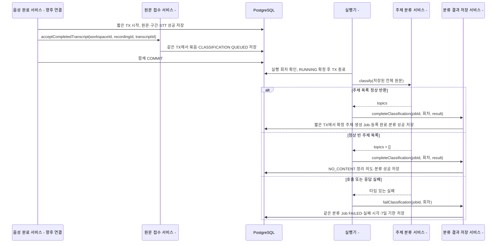

# #523 전사 완료 원문 접수와 주제별 생성 Job 등록 계획

## 1. 범위와 브랜치

- 상태: 사용자 승인 후 로컬 구현·제품 검증 완료. 운영 STT 연결과 실행기는 후속 작업이다.
- 확인일: 2026-10-09 KST.
- 대상: [#523](https://github.com/woowacourse-teams/2026-Knot/issues/523), 상위 [#501](https://github.com/woowacourse-teams/2026-Knot/issues/501).
- 구현 브랜치: 최신 `origin/be/feature/#522`의 `bb6315d9`에서 `be/feature/#523`을 생성했다. develop은 `0b697abd`다. 시작 시 기존 변경은 이 계획 파일뿐이었다.
- [#534](https://github.com/woowacourse-teams/2026-Knot/pull/534)는 develop을 base로 열린 상태다. [#535](https://github.com/woowacourse-teams/2026-Knot/pull/535)는 `be/feature/#521`을 base로 열려 있다. 둘 다 병합된 것으로 취급하지 않는다.
- 후속 PR base는 `be/feature/#522`다. 선행 PR 병합 후 develop 반영과 base 전환을 함께 처리한다. 구현 완료 후 사용자가 commit·push·Draft PR 게시를 요청했다.

### 이번 완료 범위

저장되는 성공 원문의 접수 경계, 분류 작업의 식별자, 확정 주제 목록과 주제별 생성 Job의 원자적 등록, 정상 내용 없음 결과와 정리 의도를 구현한다. 기존 목록·재시도 API로 분류 실패도 다룰 수 있어야 한다.

원문·구간의 생산과 STT 성공 기록은 음성 담당 작업이다. LLM 주제 분류는 #521, Markdown 작성은 #522의 내부 서비스를 재사용한다. 실제 QUEUED 소비·자동 재시도·RUNNING 회수는 #525, Document·확인 대상의 저장은 #524, 자료 삭제는 #526이다. 새로운 사용자 HTTP API는 없다.

### 근거 대조

Notion은 로컬 원문 캐시의 선택한 본문과 manifest를 읽었다. 아래 자료의 본문·속성 revision은 서로 일치하고 선택 항목의 coverage 경고는 없었다. capture는 `2026-10-07T13:07:32.841Z`다. 이번에는 Notion을 실시간 재수집하지 않았으므로 이후 변경 여부는 확인하지 않았다. 원문의 구현 표시는 실제 코드 상태와 구분한다.

| 자료 | 출처·관측 revision | 적용하는 사실 | 판정 |
| --- | --- | --- | --- |
| #523 | [Issue](https://github.com/woowacourse-teams/2026-Knot/issues/523), 현재 OPEN 본문 | 내구성 있는 접수, 분류 실패 재시도, 중복 방지, 확정 주제·등록 완료 저장 | 이번 구현 요구. 팀 승인과 구분 |
| 현재 V2와 리뷰 결정 | [현재 기준](../product/current-v2-mvp.md), [정합성 절차](../harness/notion-alignment.md) | STT 성공 후 자동 생성, 원문 검토 대기 없음, 본인 Job 조회·재시도, 별도 실행 접수 테이블 제거 | 기존 사용자 결정 적용 |
| 생성 작업 목록 API | [Notion](https://www.notion.so/3ebb4351752280a8a9e9df60d5362028), revision 10/6 04:54 UTC | 여러 주제 Job, 일부 성공 유지, 성공 Job 제외, 마지막 실패 후 7일 | 관련 요구 적용. recordingTitle·Workspace 전체 범위는 #511 리뷰 결정으로 대체됨 |
| 재시도 API | [Notion](https://www.notion.so/3ebb43517522802eb145cfbbdd200b73), revision 10/6 04:55 UTC | 같은 Job ID, 사용자 최대 3회, 분류 실패도 재시도 | 관련 요구 적용. 소유자 제한은 #512 리뷰 결정 적용 |
| 도메인 규칙 | [Notion](https://www.notion.so/3e3b4351752280cd9f06edc2ccdff1d8), revision 10/7 10:36 UTC | 여러 주제, 같은 녹음·주제 중복 금지, NO_CONTENT와 실패 구분 | 관련 생성·완료 규칙을 대조 |
| Entity 컬럼·ERD | [컬럼](https://www.notion.so/3e4b43517522809b9f19f2526fc879bf), revision 10/7 11:14 UTC; [ERD](https://www.notion.so/3e4b4351752280cd86c7dc92aac63fd1), revision 10/7 10:45 UTC | 성공 Transcript 입력, Job당 Document 최대 하나, 성공 원문 참조 보호 | 단계·주제·등록 완료 컬럼은 원문에 없음. 아래 확장은 기술 제안 |
| 실패·내용 없음 | [Notion](https://www.notion.so/3edb4351752281e3a1cbee86fe31d1ce), revision 10/6 05:10 UTC | 빈 원문·잡담은 내용 없음, 짧은 정상 논의 제외 금지, 결과 유지 후 자료 정리 | 관련 추가 규칙 적용. 이전 글자 수·30초 일괄 제외와 재시도 제안은 채택하지 않음 |
| 녹음 상세 API | [Notion](https://www.notion.so/3deb4351752280a4a9a3f04bff7d0ee4), revision 9/30 05:39 UTC | 녹음 전체 결과는 별도 종합 상태, Job 삭제만으로 완료 판단 금지 | 다중 Job 표현·상세 응답 연결은 #525/녹음 담당 후속 |
| 코드·선행 PR | `Transcript`, `DocumentGenerationJob`, retry/list 서비스, V27/V28/V30/V31; #534/#535 | 현재 저장 구조와 실제 호출 경계 | 현재 구현 관측. 실행·전사 완료 연동은 없음 |

## 2. 구현할 흐름

### 사용자가 보는 흐름

사용자는 녹음을 끝내고 최종 파일을 업로드한다. STT가 성공하면 음성 쪽에서 전체 원문과 구간을 저장한다. 문서 쪽은 사용자에게 주제 입력이나 원문 검토를 요청하지 않고 분류 작업을 접수한다.

예를 들어 Transcript 81의 주제가 `알림 문구`, `검색 조건`이면 분류 Job 하나와 생성 Job 두 개가 존재한다. 분류 Job은 주제를 정하는 작업이고, 생성 Job은 확정된 주제 하나의 문서를 쓰는 작업이다. 둘 다 같은 기존 Job 식별자·상태·재시도 계약을 사용한다. 분류 성공은 문서 생성 완료와 다르다.

### 권장 접수 경계: 원문 저장과 직접 호출을 함께 커밋

음성 완료 서비스가 **DB 저장만 수행하는 짧은 트랜잭션**에서 원문·구간·STT 성공을 저장하고 `acceptCompletedTranscript(workspaceId, recordingSessionId, transcriptId)`를 직접 호출한다. 문서 서비스는 같은 트랜잭션에 참여해 처리 묶음과 CLASSIFICATION Job을 저장한다. LLM은 여기서 호출하지 않는다.

접수 메서드는 `@Transactional(propagation = MANDATORY)` 후보로 둔다. 기존 트랜잭션이 없으면 호출을 거절하여 잘못된 커밋 경계를 드러낸다. 의미는 [Spring 공식 Propagation API](https://docs.spring.io/spring-framework/docs/current/javadoc-api/org/springframework/transaction/annotation/Propagation.html)를 확인했다. Bean 간 public 호출을 사용하며 같은 클래스 내부 호출에 의존하지 않는다.

원문 저장부터 접수까지 성공하면 모두 커밋한다. 접수 직전·도중에 중단되면 모두 롤백한다. 커밋 직후 중단돼도 QUEUED Job이 남아 #525가 재시작 후 읽는다. STT 외부 호출과 이 저장 트랜잭션을 하나로 묶지 않는다. 원문 저장 실패 후 STT 결과의 재처리는 음성 작업의 내구성 계약이다.

생산자도 저장 시작 전에 **Workspace→RecordingSession→Transcript** 순서로 범위 잠금을 확보해야 한다. 생산자가 녹음/원문을 먼저 잠근 뒤 접수 서비스에서 Workspace 잠금을 얻으면 기존 탈퇴·재시도와 잠금 순서가 뒤집힐 수 있다. 단순히 MANDATORY를 붙이는 것만으로 이 문제를 해결했다고 보지 않는다. 연결 테스트에서 생산자와 Workspace 삭제가 동시에 실행되는 순서를 검증한다.

현재 운영 STT 완료 서비스는 없다. 아래 Producer는 **향후 음성 담당자가 연결할 호출자**이며 이미 구현됐다고 표시하지 않는다. 음성 담당자가 별도 DB/별도 커밋으로 저장하도록 결정한다면 이 직접 호출 보장은 성립하지 않는다. 그때는 성공 완료 표시의 재조회나 생산자가 기록하는 전달 기록과 실제 소비를 함께 설계해야 한다.



그림의 실행권 확보와 LLM 호출은 #525의 역할이다. #523은 그 실행기가 사용할 접수·성공 결과 저장·실패 기록 계약을 제공한다. 기존 #521 계획의 ‘상위 자동 접수 서비스가 classify를 호출’ 설명을 이 경계로 구체화한다. 접수 트랜잭션이 직접 분류를 기다리는 방식으로 구현하지 않는다.

### 쓰기 동작과 반복 호출

| 동작 | 성공 | 반복·실패 처리 |
| --- | --- | --- |
| 성공 원문 접수 | 묶음 하나, 분류 QUEUED 하나 | 같은 원문 재접수는 기존 결과 반환. 다른 녹음/원문 연결·존재하지 않는 원문은 오류 |
| 성공했지만 빈 원문 접수 | LLM 호출 없이 NO_CONTENT와 정리 의도 저장 | 같은 결과 반환. null·참조 유실을 내용 없음으로 둔갑시키지 않음 |
| 주제 분류 결과 확정 | 목록 전체와 주제별 Job 전부, 등록 완료, 분류 SUCCEEDED를 함께 저장 | 동일 회차·동일 목록 재전달은 기존 결과. 다른 목록으로 덮어쓰는 요청은 오류 |
| 정상 topics=[] 확정 | 생성 Job 0개, NO_CONTENT·정리 의도, 분류 SUCCEEDED | 반복해도 결과·정리 요청 시각 유지. 사용자 재시도 없음 |
| 분류 실패 기록 | 같은 Job FAILED와 7일 기한 | 같은 회차의 중복 실패 기록은 최초 실패 시각 유지. 성공·이전 회차의 늦은 실패는 변경 거절 |
| 사용자 재시도 | 기존 retry API가 같은 Job을 QUEUED로 전환 | 소유자·현재 멤버·3회·7일·유효 입력 계약 유지. 실패한 생성 Job 때문에 원문을 재분류하지 않음 |

빈 원문은 성공 완료 계약으로 전달된 실제 빈 문자열·Unicode 공백에 한정한다. 정상 비어 있지 않은 원문은 길이로 잘라내지 않고 #521을 통해 분류한다. API 실패·깨진 응답은 FAILED이며 NO_CONTENT로 변환하지 않는다.

## 3. 나올 코드와 메서드 초안

모든 새 이름과 메서드는 제안이다. Java 25·Spring Boot 4.1·JPA·PostgreSQL·Flyway와 기존 도메인별 계층을 유지한다. 공통 LLM 패키지에 Job 의미를 넣지 않는다.

### 기존 코드에서 재사용할 것

| 실제 위치·클래스 | 현재 동작 | 적용 방식 |
| --- | --- | --- |
| `recording/domain/Transcript` | recordingSessionId·전체 content·createdAt 저장, 빈 content 허용 | 저장 입력 사용. 현재 transcriptionJobId/성공 상태는 없음을 명시 |
| `recording/domain/TranscriptSegment`·Repository | 실제 구간 저장·정렬 조회 | 음성 생산자가 원문과 함께 저장. #523에서 구간을 합성하거나 전체 원문을 재구성하지 않음 |
| `document/application/DocumentTopicClassificationService.classify(String)` | topics 또는 정상 빈 목록 반환, null/공백 입력 거절, DB TX 없음 | #525 실행기가 호출. 빈 성공 원문은 접수 단계에서 별도 처리 |
| `document/application/DocumentGenerationService.generate(String, String)` | 전체 원문·주제 하나의 Markdown 결과 | 생성 Job 실행 때 #525가 호출. #523에서 호출하지 않음 |
| `document/domain/DocumentGenerationJob` | queue, retryByUser, recordFailure; 최초 시도 1, 사용자·자동 횟수 분리 | 단계·주제·묶음 연결과 실행 회차 검증·성공 전이 추가 |
| `DocumentGenerationJobRetryService`·InputQuery | Workspace→Job→Transcript 잠금, 녹음 소유자 확인, 같은 Job 재접수 | 분류 Job도 동일 계약. 단계·확정 주제는 재시도 때 변경하지 않음 |
| `DocumentGenerationJobReadJpaRepository` | 본인 녹음의 QUEUED/RUNNING·유효 FAILED 조회 | 분류 Job도 그대로 조회. 공개 응답에 불필요한 새 필드는 추가하지 않음 |
| WorkspaceRepository·RecordingSessionRepository | 활성 Workspace 조회/잠금과 원본 세션 조회 | 범위·논리 삭제·종료 상태 확인, 기존 잠금 순서와 조율 |
| V27/V28/V30/V31 | 참조 제약, 문서 중복 제약, 실패 시각·횟수, 구간 테이블 | 기존 내용을 수정하지 않고 새 migration으로 확장 |

### 신규·변경 코드 제안

`DocumentGenerationBatch`는 **녹음 하나에서 확정한 주제들과 등록 결과를 보존하는 처리 묶음**이다. 개별 Job의 실행 상태를 복사하지 않는다. 이 기록은 Job 정리 후에도 NO_CONTENT와 확정 주제 목록을 조회할 근거가 된다.

| 위치·클래스 후보 | 책임 | 중요한 메서드 후보 |
| --- | --- | --- |
| `document/application/DocumentGenerationIntakeService` 신규 | 생산자 TX 안에서 한 원문 접수, 동일 입력 재사용 | `acceptCompletedTranscript(long workspaceId, long recordingSessionId, long transcriptId)` → `DocumentGenerationRegistrationResult` |
| `document/application/DocumentClassificationResultService` 신규 | 현재 실행 회차의 분류 결과·생성 Job·완료 표시 원자적 저장 | `completeClassification(long workspaceId, long jobId, int expectedAttemptCount, DocumentTopicClassificationResult result)` → 등록 결과; `failClassification(long workspaceId, long jobId, int expectedAttemptCount)` |
| `document/domain/DocumentGenerationBatch` 신규 | 원본 연결·확정 주제·등록 결과·정리 의도 불변식 | `accept(recordingId, transcriptId, acceptedAt)`, `registerTopics(List<String>, registeredAt)`, `recordNoContent(recordedAt)` |
| `document/domain/DocumentTopicRegistrationState` 신규 | 개별 Job 상태와 구별되는 등록 상태 | `WAITING_CLASSIFICATION`, `TOPICS_REGISTERED`, `NO_CONTENT` |
| `document/domain/DocumentGenerationJobStage` 신규 | 같은 기존 Job API에서 실행 책임 구별 | `CLASSIFICATION`, `GENERATION` |
| 기존 `DocumentGenerationJob` 변경 | 단계에 맞는 생성·상태·회차 보호 | `queueClassification(batchId, transcriptId, now)`, `queueGeneration(batchId, transcriptId, topic, now)`, `validateRunningAttempt(expectedAttemptCount)`, `startRunning(now)`, `recordSuccess(now)` |
| `document/domain/DocumentGenerationBatchRepository` + infrastructure JPA/adapter 신규 | 묶음과 확정 목록 저장·잠금 | `findByRecordingSessionIdForUpdate(recordingId)`, `save(batch)` |
| 기존 JobRepository·JPA/adapter 변경 | 신규 Job 저장, 기존 분류·주제 작업 조회 | `save(job)`, `findClassificationByBatchId(batchId)`, `findAllByBatchId(batchId)` 및 기존 flush/범위 잠금 유지 |
| 기존 `DocumentGenerationInputQuery`·adapter 변경 | 접수 입력과 원본 범위 확인 | 세션·원문 ID가 함께 일치하는 접수용 조회 추가; 기존 retry용 `findForUpdate` 유지 |
| `application/dto/result/DocumentGenerationRegistrationResult` 신규 | 내부 접수 결과 | batchId·등록 상태·nullable 분류 Job ID·생성 Job ID 목록. Entity를 반환하지 않음 |

생성 Job ID가 필요한 실제 호출자만 Result를 받는다. 조회·상태 플래그마다 별도 인터페이스나 범용 Processor를 추가하지 않는다. 문자열 topics 컬렉션은 묶음 소유 컬렉션으로 매핑하며, 독립 Topic/Category 도메인을 만들지 않는다.

### 메서드별 호출 순서

`acceptCompletedTranscript`:

1. 양수 ID와 호출자의 기존 트랜잭션을 확인한다.
2. 활성 Workspace·지정 녹음 세션·종료 상태를 확인하고 기존 묶음을 잠금 조회한다.
3. 입력 연결이 남아 있는 묶음은 같은 원문인지 비교한 뒤 기존 결과를 반환한다. 정리로 연결이 해제된 종료 묶음은 종료 결과를 유지하며 새 작업을 만들지 않는다. 새 묶음에는 연결 원문의 범위·존재를 검사한다. 다른 원문을 임의로 최신 입력으로 교체하지 않는다. STT 성공 판정은 생산자가 보장하는 완료 계약이다.
4. 새 묶음을 저장한다. 성공 빈 원문이면 NO_CONTENT·정리 의도를 기록한다. 비어 있지 않으면 CLASSIFICATION Job 하나를 최초 시도 1로 저장한다.
5. flush로 제약을 확인하고 Result를 반환한다. 최종 commit은 음성 완료 서비스가 한다.

`completeClassification`:

1. Workspace→Job→Transcript→Batch 순으로 잠금과 범위를 검사한다. 잠금 아래에서 Clock을 읽어 마이크로초 정밀도로 시각을 결정한다.
2. 단계 CLASSIFICATION, 현재 회차, RUNNING을 확인한다. 이미 동일 결과로 성공한 같은 회차 재전달은 저장 결과를 반환한다. 오래된 회차는 저장하지 않는다.
3. 확정 목록이 있으면 동일성을 검사한다. #521이 정규화한 주제 문자열과 순서를 그대로 사용한다. DB 경계에서는 null·빈 이름·중복을 거절하여 다른 호출자가 불변식을 깨지 못하게 한다.
4. topics가 있으면 목록 저장→모든 GENERATION Job 저장→TOPICS_REGISTERED→분류 SUCCEEDED를 한 트랜잭션으로 확정한다. 중간 오류는 전체 롤백한다.
5. topics=[]이면 생성 Job 없이 NO_CONTENT·정리 의도·분류 SUCCEEDED를 함께 확정한다.

`failClassification`:

현재 CLASSIFICATION/RUNNING 회차만 기존 `recordFailure`로 갱신한다. 이미 같은 회차 FAILED이면 아무것도 갱신하지 않는다. 오류 원문·LLM 응답은 저장하지 않는다. 분류 실패를 사용자에게 보여줄 Job ID는 접수 때 생성한 ID다. 내부 오류 분류·자동 backoff는 #525 책임이다.

`startRunning`은 큐를 소비하는 구현이 아니라 상태 전이 규칙이다. 최초 실행·사용자 재시도의 접수에서 이미 증가한 attemptCount를 실행 시작 때 다시 올리지 않는다. #525가 중단 회차를 재실행하면 automaticRetryCount와 attemptCount를 함께 증가시킨 후 새로운 RUNNING 회차를 시작해야 한다.

## 4. 저장 기반과 주의할 점

### 권장 저장 구조

새로운 쓰기 전용 실행 접수 테이블이나 메시지 브로커를 먼저 도입하지 않는다. **기존 document_generation_jobs의 QUEUED 행이 실행 대기 정보**다. 새 Batch와 확정 목록은 접수 중복 검사·결과 저장 재전달·등록 완료 조회에서 실제로 읽는 업무 기록이다.

| 테이블 | 변경 제안 | 제약·의미 |
| --- | --- | --- |
| `document_generation_batches` 신규 | id, recording_session_id, transcript_id, topic_registration_state, accepted_at, registered_at, cleanup_requested_at | 녹음 FK·녹음당 UNIQUE. 활성 입력 transcript_id UNIQUE 및 원본 세션 일치 복합 FK. WAITING_CLASSIFICATION은 입력·미등록 상태를 요구. 정상 내용 없음은 registered_at·cleanup_requested_at을 함께 기록 |
| `document_generation_batch_topics` 신규 | batch_id, position, topic | Batch의 `@ElementCollection List<String>` 저장. PK(batch_id, position), UNIQUE(batch_id, topic), position≥0, topic 공백 금지. 목록과 순서 영속화 |
| `document_generation_jobs` 확장 | batch_id, stage, topic | CLASSIFICATION이면 topic NULL, GENERATION이면 확정 topic 필수. batch FK, GENERATION의 (batch_id, topic)→확정 목록 FK. 분류 Job당 하나의 partial UNIQUE, 생성 Job은 UNIQUE(batch_id, topic) |
| 기존 `documents` | 이번에는 컬럼 변경 없음 | Job UNIQUE·(recording_session_id, topic) UNIQUE·입력 일치 FK 유지. #524는 GENERATION 단계와 확정 주제를 검증하여 분류 Job을 문서 출처로 쓰지 않음 |

Batch가 녹음당 하나이므로 GENERATION의 `(batch_id, topic)` 유일성은 같은 녹음·주제의 생성 대상 중복도 막는다. 다른 녹음의 같은 주제는 허용한다. 문서 저장의 최종 UNIQUE는 V27을 계속 사용한다.

Batch의 상태는 등록 상태다. TOPICS_REGISTERED는 모든 문서 성공을 뜻하지 않는다. WAITING_CLASSIFICATION이거나 아직 작업이 진행 중이면 녹음 전체 완료로 판단하지 않는다. 최종 성공/부분 실패/만료 결과는 #525가 집계·보존하는 계약을 추가한다.

### 트랜잭션과 실행 회차

| 경계 | 함께 확정할 변경 | 외부 호출 |
| --- | --- | --- |
| 생산자 TX + 접수 | 원문·구간·STT 성공 + Batch·분류 QUEUED 또는 빈 원문 NO_CONTENT | 없음 |
| 결과 확정 TX | 확정 topics + 생성 Job 전부 + 등록 완료 + 분류 SUCCEEDED | 없음 |
| 분류 실패 TX | 같은 Job FAILED + lastFailedAt·expiresAt | 없음 |
| 후속 #525 | 짧은 TX에서 회차 확정 → TX 종료 → classify/generate → 별도 결과 TX | DB 잠금 밖 |

동시 접수는 기존 Workspace/녹음 잠금 순서에 맞춰 직렬화하고 DB UNIQUE를 최종 방어로 사용한다. 재시도와 분류 결과 저장은 기존 Workspace→Job→Transcript 순서를 유지하고 그 뒤 Batch를 잠근다. 주제 Job 등록도 같은 Batch 아래에서 수행한다. 모든 잠금 경계는 실제 PostgreSQL 테스트로 확인한다.

일반 멤버의 탈퇴는 이미 정상 종료한 녹음의 자동 생성을 취소하지 않는다. 현재 멤버 검사는 사용자 조회·재시도에 적용한다. Workspace 자체가 논리 삭제된 경우에는 신규 접수·분류 결과 등록을 거절하고 유효하지 않은 문서를 만들지 않는다.

늦은 응답을 막는 제안은 `jobId + expectedAttemptCount`다. 단순한 version 숫자 비교만으로 모든 복구를 보장한다고 주장하지 않는다. **#525의 모든 실행 회수는 회차를 증가시켜 이전 응답을 무효화해야 한다.** 이 조건을 지킬 수 없는 실행 설계를 선택하면 실제 claim token을 해당 실행기와 함께 설계한다. lease·heartbeat·소비 간격·동시 호출 수는 이번에 추측해서 설정하지 않는다.

LLM enabled=false에서도 접수 기록을 거짓 NO_CONTENT로 바꾸지 않는다. 접수 서비스는 LLM Bean에 의존하지 않는다. 실행기 활성화·배포 순서는 #525와 함께 점검하며 #523만 배포해서 문서가 자동 생성된다고 표현하지 않는다.

### 중단·정리 후 재접수

- 등록 도중 중단되면 topics·생성 Job·등록 완료·분류 성공이 모두 롤백된다. 분류 Job의 이전 RUNNING은 남을 수 있고 #525가 회수한다.
- 등록 commit 후 중단되면 그대로 재사용한다. 이미 확정된 주제를 모델에 다시 요청해 바꾸지 않는다.
- FAILED Job 정리 후에도 Batch와 확정 주제 목록은 남긴다. 동일 입력의 지연 통지로 새 Job을 만들어 재시도 한도를 초기화하지 않는다.
- NO_CONTENT 정리는 결과 상태를 지우지 않는다. Batch의 transcript_id는 정리 후 NULL을 허용하되 recording_session_id와 NO_CONTENT 결과는 유지한다.
- 원문 FK는 RESTRICT를 기본으로 검토한다. #526은 참조 보호 확인→실행 중/성공 참조 없음 확인→Batch 입력 연결 해제→정리 가능한 Job·구간·원문 제거를 같은 DB 경계에서 처리한다. 실제 파일 삭제 실패 재처리는 별도다. 이 계획에서 삭제 코드를 만들지 않는다.
- 성공 Document가 참조하는 Transcript는 보존한다. 새로운 Batch FK 때문에 그 보호를 우회하거나 NO_CONTENT가 아닌 입력을 무조건 지우지 않는다.

### 실제 대안과 선택 이유

| 대안 | 장점 | 위험·비용 | 제안 |
| --- | --- | --- | --- |
| 원문 저장 TX에서 접수 직접 호출 | 기존 코드의 직접 서비스 호출 방식, 전달 누락 틈 없음, 별도 큐 불필요 | 음성→문서의 명시적 의존; 생산자가 동일 DB/TX 계약을 지켜야 함 | 현재 권장 |
| 커밋 뒤 메모리 이벤트만 사용 | 호출 결합을 줄이기 쉬움 | 커밋 뒤 프로세스 중단이면 이벤트·접수 유실 | 보장 수단으로 사용하지 않음 |
| STT 성공 결과를 주기적으로 재조회 | 저장과 접수를 별도로 커밋해도 누락 복구 가능 | 현재 성공 표시·TranscriptionJob이 없어 대상을 판별할 근거 없음 | 생산자 저장 계약이 생기면 비교 가능 |
| 별도 전달 기록/브로커 | 프로세스·DB 경계가 분리된 생산자에 적용 가능 | 생산·소비·중복·정리를 함께 구현해야 하고 쓰기만 하는 테이블로는 해결 안 됨 | 분리 요구가 생길 때 재검토 |

현재 Transcript는 recording_session_id를 직접 참조한다. Notion의 transcription_job_id·성공 Job 모델은 실제 코드에 없다. 임의의 Transcript 행이나 구간 존재만으로 STT 성공을 판정하는 스캐너는 만들지 않는다. 녹음당 최종 성공 원문 하나라는 생산자 계약도 연결 시 확인하며, 서로 다른 원문이 들어오면 조용히 최신 원문으로 바꾸지 않는다.

### Migration과 남은 확인 사항

새 migration이 필요하다. fetch한 develop과 현재 브랜치 모두 파일상 최고 버전은 V31이다. 열린 BE #533·#532는 각각 종료 증명/CORS이며 migration을 추가하지 않는다. #534/#535도 DB 변경이 없다. **현재 후보는 `V32__add_document_generation_registration.sql`**이며 구현 직전 다시 점검한다. 실제 운영 flyway_schema_history는 조회하지 않았으므로 적용 상태를 단정하지 않는다. 이미 공유된 V27/V28/V30/V31은 수정하지 않는다.

기존 Job에는 단계·확정 주제가 없어, 기존 행을 모두 CLASSIFICATION이나 GENERATION으로 가정하는 backfill은 금지한다. 입력 관계·성공 Document 등으로 검증한 기존 행만 전환한다. 원격 DB에 의미를 확인할 수 없는 Job이 있다면 배포용 migration은 이를 보존한 채 중단하고 검증된 이행안을 먼저 준비한다. 기존 데이터를 삭제해서 통과시키지 않는다. 빈 Job 테이블의 정상 적용과 의미 불명 기존 행의 안전한 중단을 모두 테스트한다.

| 확인할 항목 | 구분 | 처리 시점 |
| --- | --- | --- |
| 음성 완료 서비스가 원문·구간·성공·접수를 같은 DB TX로 확정하는 연결 | 권장 기술 계약, 생산자 코드 아직 없음 | 음성 담당 연결 전. 문서 쪽 계약 테스트와 운영 전체 자동화 완료를 구분 |
| 현재 ERD의 transcription_job_id와 실제 recording_session_id 차이 | 현재 구현 관측 | 음성 도메인 작업에서 조율. #523이 임의로 음성 모델을 교체하지 않음 |
| 운영 기존 Job·최종 성공 원문 데이터의 이행 | 실제 DB 미관측 | migration 확정·배포 전 |
| 실행 회수의 회차 증가·소유권·시간 제한 | #525 기술 설계 | 소비기를 구현할 때 같은 저장 계약을 준수 |
| 전체 상태와 다중 Job ID의 녹음 상세 응답 | 기존 후보 명세와 다중 생성 연결 | #525·녹음 조회 연결에서 결정. #523 공개 API 변경 없음 |

## 5. TDD와 검증 순서

아래 표는 최초 계획의 검증 시나리오다. 실제 구현에서는 도메인 단위 테스트와 `DocumentGenerationRegistrationIntegrationTest`로 서비스·저장 경계·기존 API 연결을 직접 검증한다. 위임만 반복하는 서비스 Mockito 테스트 대신 PostgreSQL 검증을 적용했다. Mockito spy는 실제 저장 직후 장애를 주입하며, DB 동시성은 두 개의 실제 트랜잭션으로 확인한다.

| 테스트 위치·방식 | 성공 시나리오 | 의미 있는 실패·경계 |
| --- | --- | --- |
| `document/domain/DocumentGenerationBatchTest` 순수 Java | 주제와 순서 확정, 정상 NO_CONTENT | null/공백/중복 주제, 확정 목록 변경, 중복 NO_CONTENT가 정리 시각을 갱신하지 않음 |
| 기존 `DocumentGenerationJobTest` | 분류/생성 접수, QUEUED→RUNNING→SUCCEEDED, 최초 회차 1 | 단계·topic 조합 오류, 이전 회차 결과, 성공 후 실패, 시작 시 횟수 중복 증가 금지 |
| `document/application/DocumentGenerationIntakeServiceTest` Mockito | 정상 접수, 같은 입력 재사용, 성공 빈 원문 | 다른 원문/세션/Workspace, 삭제된 Workspace, 진행 중 녹음, 유효 입력 없는 경우 |
| `document/application/DocumentClassificationResultServiceTest` Mockito | 2개 주제의 2개 Job·등록 완료, 정상 빈 목록 | 다른 단계, stale 회차, 이미 확정된 다른 목록, 늦은 실패·반복 실패 |
| `document/infrastructure/DocumentGenerationRegistrationMigrationIntegrationTest` PostgreSQL/Flyway | 전체 migration 적용, 컬렉션 순서, CHECK·FK·UNIQUE | 동일 녹음 Batch, 동일 주제 Job, 분류 Job 중복, 엉뚱한 확정 주제, 기존 불명 행 이행 거절 |
| `document/application/DocumentGenerationIntakeTransactionIntegrationTest` PostgreSQL | 생산자 fixture의 원문·구간·접수 실제 commit | MANDATORY의 TX 없는 호출, 접수 전/후 강제 오류 전체 rollback, 두 TX 동시 동일 입력 접수, Workspace 삭제와 생산자 저장 경쟁 |
| `document/application/DocumentClassificationRegistrationTransactionIntegrationTest` PostgreSQL | 모든 주제 Job의 한 번 등록·동일 결과 재전달 | topic 저장 뒤/두 번째 Job 뒤/완료 표시 직전 오류 전체 rollback, 동시 확정, 재접수와 늦은 결과 경쟁 |
| 기존 retry/list 단위·통합·인수 회귀 | 분류 FAILED도 목록·동일 ID retry, 생성 실패는 해당 Job만 retry | 다른 멤버 403, 사용자 4회·정확한 7일 경계 409, NO_CONTENT 재시도 없음, 성공 문서·다른 주제 보존 |
| Batch 조회/정리 계약의 PostgreSQL 테스트 | Job 제거 후 확정 목록·NO_CONTENT 남음 | 결과 없이 입력만 제거 금지, 성공/실행 중 참조 보호. 실제 자료 삭제는 #526 |

새 HTTP endpoint가 없으므로 신규 Controller나 CSRF 테스트를 만들어 형식만 반복하지 않는다. 기존 사용자 retry의 Security·CSRF·권한·오류 응답 회귀는 유지한다. 외부 LLM 실패 재현은 #521/#522 대역 또는 #525 연결 테스트에서 하며 자동 테스트가 실제 서버를 호출하지 않는다.

### 작업·커밋 경계 제안

각 단계는 실패하는 테스트 → 최소 구현으로 진행한다. 계획 당시에는 게시하지 않았으며, 구현 완료 후 별도 요청으로 커밋·push·Draft PR을 진행한다.

1. **단계별 Job 생성**: queueClassification/queueGeneration의 성공·잘못된 topic 조합 테스트 → factory·단계 불변식. 기존 queue 호출과 fixture의 이행을 명시한다.
2. **묶음의 주제 확정**: 동일 목록·중복/빈 주제·다른 목록 거절 테스트 → Batch·등록 상태·확정 순서 규칙.
3. **저장 계약**: PostgreSQL constraint/migration/기존 불명 행 테스트 → 새 migration·JPA 매핑·Repository adapter. schema와 그 매핑이 맞는 독립 단위로 검증한다.
4. **성공 원문 접수**: 성공·반복·scope 오류 테스트 → acceptCompletedTranscript. 이어 실제 producer TX fixture의 commit/rollback/동시 접수 검증.
5. **빈 성공 원문**: LLM/분류 Job 없이 NO_CONTENT와 정리 의도 저장 테스트 → 빈 입력 분기. null·미존재 입력 거절 유지.
6. **주제 목록과 Job의 원자적 확정**: 2개 주제 성공·중간 오류·동시 재전달 테스트 → completeClassification 및 TOPICS_REGISTERED. 목록 확정과 SUCCEEDED를 함께 커밋.
7. **분류 결과의 NO_CONTENT**: 정상 빈 목록·반복 요청·오류와 구분 테스트 → NO_CONTENT·정리 의도·분류 성공 저장.
8. **회차와 분류 실패**: 현재/이전 회차·중복 실패·성공 후 늦은 실패 테스트 → failClassification·실행 회차 검증·상태 전이. recordFailure의 기존 사용자 retry 계약 보존.
9. **기존 공개 계약 회귀**: 분류 Job 목록과 같은 ID 재시도, 타인 거절, 3회/7일·다른 성공 주제 보존 테스트 → 필요한 최소 연결 수정.
10. **연결 문서**: 생산자 호출 위치·TX·결과 저장·#524/#525/#526 계약을 실제 코드 기준으로 갱신. 가독성 refactor는 검증된 동작을 보존하는 경우에만 별도 단위로 수행.

가능한 단위는 `test`→`feat`로 나누고 서로 독립적인 메서드를 큰 커밋으로 묶지 않는다. 존재하지 않는 타입 때문에 compile이 안 되는 RED를 남기는 대신 기존 공개 계약 테스트로 분리하거나 테스트·최소 구현을 하나의 작은 green 동작 커밋으로 묶는다. 별도 refactor는 의무로 만들지 않는다.

확인한 Gradle task 기준의 예정 명령:

```bash
./gradlew test --tests '*DocumentGenerationBatchTest' --tests '*DocumentGenerationJobTest'
./gradlew test --tests '*DocumentGenerationIntakeServiceTest' --tests '*DocumentClassificationResultServiceTest'
./gradlew integrationTest --tests '*DocumentGeneration*IntegrationTest' --tests '*DocumentClassification*IntegrationTest'
./gradlew acceptanceTest --tests '*DocumentGenerationJob*AcceptanceTest'
./gradlew spotlessCheck check bootJar
```

구현 시작에 `npx ph workflow implement --full`을 수행했다. 종료 시 구현·리뷰 보고서와 `npx ph workflow finish implement`를 수행하고 제품 검사와 하네스 인증을 구분한다.

## 6. 완료 기준과 다음 작업

### 로컬 구현 관측 · 2026-10-09

- `./gradlew spotlessApply spotlessCheck check bootJar` 통과. 단위 804·통합 324·인수 389, 합계 1,517개 실패·오류·skip 0이다.
- 신규 도메인 10개, PostgreSQL 서비스·migration 30개를 포함한다. 실제 생산자 fixture의 원문·구간·접수 commit/rollback과 Workspace 삭제 잠금 대기, 동시 접수·동시 결과 등록, 부분 저장 장애 후 재실행을 관측했다.
- 기존 InputQuery의 범위 잠금과 반환 recordingSessionId 비교로 접수 입력을 검증한다. 같은 쿼리를 중복 추가하지 않았다. 분류 실패 기록은 Batch를 변경하지 않아 Workspace→Job→Transcript 잠금만 사용한다.
- 신규 HTTP API는 없다. 분류 FAILED는 기존 본인 목록과 동일 ID 재시도에 연결된다. 별도 서비스 위임 Mockito 테스트 대신 실제 PostgreSQL 경계를 검증했다.
- V32는 빈 Job 테이블에 적용되고 기존 Job이 있으면 안전하게 중단한다. 운영 데이터 상태나 운영 migration 적용은 확인하지 않았다.
- 연결·후속 계약은 [개발 연결 문서](../development/document-generation-registration.md)에 기록했다. 실제 STT 생산자와 실행기 연결 완료를 주장하지 않는다.
- Persona 종료 검사는 실행했으나 기존 report/role coverage·toolchain·stale loop·pending 항목으로 미인증이다. 제품 검사 통과와 별도로 보고서에 기록했다. 과거 이력을 초기화하지 않았다.

1. 동일 최종 성공 원문의 반복·동시 접수에서 Batch와 분류 Job이 하나다. 다른 원문으로 입력이 교체되지 않는다.
2. 생산자 fixture에서 원문·구간·접수가 함께 commit/rollback되는 실제 PostgreSQL 증거가 있다. 실제 STT 완료 서비스 연결은 별도로 관측한다.
3. 검증된 주제 목록과 생성 Job 전부·등록 완료·분류 성공이 함께 저장된다. 중간 실패와 동시 재전달에도 부분 결과나 중복이 없다.
4. 정상 빈 입력/빈 주제 목록은 NO_CONTENT와 정리 의도를 남긴다. 모델 실패는 같은 분류 Job의 FAILED다.
5. 분류 실패가 기존 본인 Job 목록과 같은 ID 재시도에 연결되고, 한도·기한·횟수는 그대로 유지된다.
6. 이전 실행 회차의 응답과 늦은 실패가 확정된 주제·성공을 덮어쓰지 않는다.
7. NO_CONTENT·확정 주제·등록 완료 조회는 Job 만료 정리와 구분된다. 새 FK의 삭제 경계를 문서화한다.
8. 기존 데이터 의미를 추정하지 않는 migration 및 검증 계획이 마련된다. 코드·fixture 통과를 운영 DB 이행 완료라고 표현하지 않는다.

이 계획의 산출물은 문서 쪽의 내구성 있는 접수·등록 기능이다. STT가 아직 생산자로 연결되지 않았거나 #525 실행기가 없으면 사용자 녹음에서 자동 문서가 생성된다고 보고하지 않는다.

다음은 [#524](https://github.com/woowacourse-teams/2026-Knot/issues/524)의 DRAFT·확인 대상·Job 성공 원자적 저장, 이어 [#525](https://github.com/woowacourse-teams/2026-Knot/issues/525)의 실행·복구·종합 결과, [#526](https://github.com/woowacourse-teams/2026-Knot/issues/526)의 보존 정리다. 확정 주제, Job 단계, 회차 증가 계약을 이 작업들이 동일하게 사용해야 한다.
