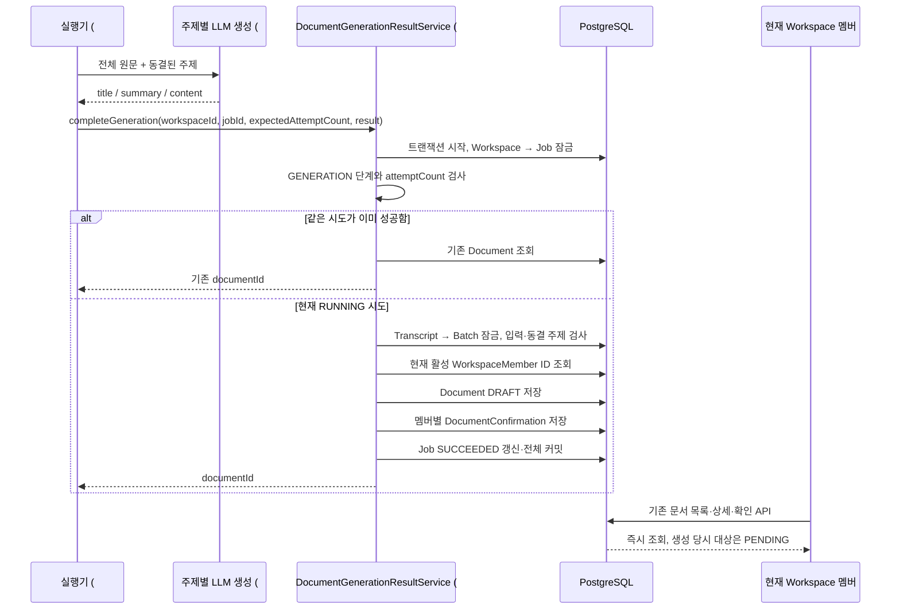

# #524 생성 문서와 확인 대상의 원자적 저장

## 1. 범위와 브랜치

- 상태: 구현·로컬 검증 완료, Draft PR 준비. 확인일: 2026-10-09.
- 대상: [#524](https://github.com/woowacourse-teams/2026-Knot/issues/524). 새 HTTP API 없이 실행기가 호출할 저장 유스케이스를 만든다.
- 브랜치: `be/feature/#523`의 `41572128`에서 `be/feature/#524` 분기. Draft PR base는 `be/feature/#523`이다.
- 선행 PR #534(#521), #535(#522), #536(#523)은 확인 시 OPEN이다. 병합된 코드로 취급하지 않는다. #523의 Batch·동결 주제·GENERATION Job과 #522의 `DocumentGenerationResult`를 재사용한다.
- 이번 요청은 계획, 구현, 검증, atomic commit, push, Draft PR까지 포함한다. PR 본문에는 검증 내용을 넣지 않는다.

| 근거 | 확인한 버전·범위 | 판정 |
| --- | --- | --- |
| [Issue #524](https://github.com/woowacourse-teams/2026-Knot/issues/524) | 10/09 OPEN. 문서·현재 멤버 확인 대상·Job 성공을 함께 저장, 반복 결과와 이전 실행 시도 구분 | 이번 작업 계약 |
| [Entity](https://www.notion.so/3e4b4351752280b8bd16dea73bb1a5bb) | 본문/속성 10/07 22:55 UTC, 수집 10/08 09:35 UTC. Job당 하나·녹음/주제 중복 금지·DRAFT/확인 대상 | 캐시에서 관측한 기준 후보 |
| [Entity 컬럼 관계도](https://www.notion.so/3e4b43517522809b9f19f2526fc879bf) | 본문/속성 10/07 11:14 UTC, 수집 10/07 13:07 UTC. title/content 필수, summary nullable, confirmation 복합 PK | 캐시에서 관측. ‘미구현’ 표시는 현재 코드와 다름 |
| [도메인 규칙](https://www.notion.so/3e3b4351752280cd9f06edc2ccdff1d8) | 본문/속성 10/07 10:36 UTC. 생성 시점 대상, 일부 주제 성공 즉시 공개 | 이후 가입 정책의 오래된 충돌 문구는 최신 API·사용자 결정으로 해소 |
| [문서 상세 API](https://www.notion.so/3ebb4351752280289a59e5e52a060471) | 본문/속성 10/06 05:01 UTC. 생성 이후 가입자는 NOT_REQUIRED, 현재 멤버 읽기 | 이번 작업에 적용하는 확정 계약 |
| `docs/product/current-v2-mvp.md`, Notion manifest/coverage | 위 선택 본문과 속성 수정 시각 일치. 실제 Notion 실시간 수정 여부는 관측하지 않음 | 저장소 기준과 수집 근거 구분 |
| 현재 코드·V27/V32 | `Document.createDraft`, `DocumentConfirmation.require`, 생성 Job·Batch, 가입/탈퇴 Workspace 잠금 | 실제 구현 관측 |

## 2. 구현할 흐름

사용자는 녹음을 마치고 문서 생성 결과를 기다린다. #525 실행기가 LLM 호출을 마친 뒤 이번 저장 메서드를 호출한다. 이 메서드는 사용자 로그인이나 녹음자 조작 권한을 받지 않는 내부 유스케이스다. Workspace·Job·입력의 소속과 현재 실행 시도를 검사한다.

LLM 호출은 이 트랜잭션에 포함하지 않는다. 같은 녹음의 다른 Job이 RUNNING/FAILED여도 성공 문서를 조회한다. 저장 중 오류는 세 변경을 모두 롤백하며, 실패 기록은 #525가 별도 트랜잭션에서 처리한다.

## 3. 나올 코드와 메서드 초안

기존 `DocumentGenerationService.generate`는 결과 생성, `DocumentClassificationResultService`는 주제 동결과 Job 등록, `DocumentDetailService` 등은 공개된 문서 조회를 맡는다. 새 저장 메서드는 이 책임을 섞지 않는다.

| 위치·클래스 | 상태·책임 | 메서드 |
| --- | --- | --- |
| `document/application/DocumentGenerationResultService` | 신규. 결과 저장 트랜잭션 조정 | `long completeGeneration(long workspaceId, long jobId, int expectedAttemptCount, DocumentGenerationResult result)` |
| `DocumentGenerationResultService` | 신규 private 규칙 단위 분리 | `lockWorkspace`, `lockGenerationJob`, `lockRegisteredInput`, `validateRegisteredTarget`, `findCompletedDocument`, `saveConfirmationTargets`, `validateResult` |
| `DocumentGenerationJob` | 기존. 단계·시도·상태·시각 규칙 | `validateGenerationStage()` 추가. 기존 `validateAttempt`, `validateRunningAttempt`, `recordSuccess` 재사용 |
| `DocumentRepository` / JPA adapter | 기존. 신규 문서 저장과 출처 Job 조회 | `save(Document)`, `findByGenerationJobId(long)` 추가 |
| `DocumentConfirmationRepository` / JPA adapter | 기존. 확인 대상 저장 | `saveAll(List<DocumentConfirmation>)` 추가 |
| `WorkspaceMemberRepository` / JPA adapter | 기존. 현재 대상의 정확한 ID 집합 | `findActiveMemberIdsByWorkspaceId(long)` 추가. JPQL, `leftAt IS NULL`, ID 순서 |
| `Document`, `DocumentConfirmation` | 기존 상태 생성 | `createDraft(...)`, `require(documentId, memberId)` 재사용 |

`completeGeneration`의 식별자·주제·원문 연결은 저장된 Job/Batch/Transcript에서 가져온다. LLM이 소속이나 주제를 바꿀 수 없다. `expectedAttemptCount=1`의 늦은 결과가 현재 2회차 Job에 도착하면 충돌 오류다. 현재 시도의 성공 재전달은 기존 ID를 반환하며 본문·생성 시각·확인 대상·ARCHIVED 상태를 변경하지 않는다. 성공 Job에 문서가 없다면 불일치 오류로 처리한다.

새 서비스는 인프라 LLM validator를 의존하지 않는다. #522가 Markdown 형식을 검증하고, 이 경계는 필수 title/content의 유효성과 저장 규칙을 다시 확인한다. 공급자별 프롬프트나 LLM Bean 활성화 여부와 관계없이 저장할 수 있어야 한다.

## 4. 저장 기반과 주의할 점

| 테이블 | 이번 저장 | 기존 제약 |
| --- | --- | --- |
| `documents` | 신뢰한 출처와 AI 결과, DRAFT, 생성 시각 | V27 Job UNIQUE, 녹음/주제 UNIQUE, 출처 복합 FK, 필수 텍스트 CHECK |
| `document_confirmations` | 생성 당시 활성 멤버마다 미확인 행 | `(document_id, member_id)` PK, 문서/멤버 FK |
| `document_generation_jobs` | 현재 RUNNING → SUCCEEDED, updatedAt | V32 단계·주제·입력 FK와 동결된 주제 연결 |

추가 컬럼/테이블이 필요하지 않아 migration을 추가하지 않는다. 최신 develop과 선행 PR의 V32를 대조했으며 실제 배포 DB 적용 상태는 관측하지 않았다.

- `READ_COMMITTED`에서 Workspace를 먼저 잠근다. 실제 가입·탈퇴도 같은 Workspace를 먼저 잠그므로, 대상 조회와 커밋 사이에 멤버 변경이 끼어들지 않는다. 잠금 대기 후 이전 트랜잭션에서 가입한 멤버도 읽는다.
- 잠금 순서는 Workspace → Job → Transcript → Batch다. 확인 API의 Workspace → Document와 같은 시작점을 유지한다. 별도 멤버 행 잠금을 추가하지 않는다.
- 문서 생성 뒤 가입자는 NOT_REQUIRED다. 성공 재전달 시 현재 멤버로 확인 대상을 다시 만들지 않는다. 탈퇴자는 기존 집계 규칙에 따라 제외된다.
- 유효한 Workspace에 활성 멤버가 전혀 없다면 정상 DRAFT를 만들어 숨기지 않고 저장 충돌로 거절한다.
- 삭제된 Workspace, 없는/다른 소속 Job·입력, 잘못된 단계/상태/시도, 동결 주제 불일치는 저장 전에 거절한다.
- UNIQUE 충돌은 전체 롤백한다. 실패한 트랜잭션 안에서 예외를 삼키고 기존 문서를 조회하지 않는다. 같은 Job 중복 요청은 잠금 뒤 성공 결과 조회로 처리한다.
- 생성 시각은 잠금·검증 뒤 한 번 읽고 PostgreSQL 정밀도인 마이크로초로 맞춘다. 문서와 Job 성공에 같은 시각을 쓴다.

## 5. TDD와 검증 순서

| 위치·방식 | 검증할 동작 | 관찰할 결과 |
| --- | --- | --- |
| `DocumentGenerationJobTest`, 단위 | 생성 단계 통과, 분류 단계 거절 | 기존 등록 충돌 코드 |
| `DocumentGenerationResultIntegrationTest`, PostgreSQL | DRAFT·현재 대상·Job 성공 | 실제 커밋 후 세 테이블 일치 |
| 같은 통합 테스트 | 저장 후/대상 저장 중/Job flush 실패 | Document·Confirmation 0개, Job RUNNING 유지 |
| 같은 통합 테스트 | 성공 재전달·동시 완료·이전 시도 | 문서 하나, 최초 대상/본문 유지, 늦은 결과 거절 |
| 같은 통합 테스트 | 가입·탈퇴와 저장 경쟁 | 실제 PostgreSQL 잠금 대기 관측, 커밋 순서와 대상 일치 |
| 같은 통합 테스트 | 삭제 Workspace·입력 없음·잘못된 주제/응답 | typed error, 불완전 문서 없음 |
| 기존 실제 조회 서비스 연결 | 일부 주제 성공, 이후 가입, 확인·보관 | 즉시 조회, NOT_REQUIRED, 기존 확인 후 ARCHIVED |

1. 생성 단계 guard의 실패 테스트 → 최소 domain 메서드.
2. 첫 결과의 원자적 저장·실패 롤백 테스트 → 저장/대상 조회 repository와 서비스.
3. 반복·이전 시도·동시 완료 테스트 → 재전달 분기와 신뢰한 출처 검사.
4. 가입·탈퇴·부분 성공·기존 확인 API 연결 테스트 → 필요한 경계 보완.
5. 가독성 정리, focused tests, 전체 `test integrationTest acceptanceTest spotlessCheck check bootJar`.

메서드/adapter/문서 단위로 커밋한다. 테스트는 구현 전에 RED를 확인하고, 공개된 커밋은 해당 최소 구현까지 포함해 빌드 가능한 단위로 만든다. 불필요한 refactor 커밋을 만들지 않는다. Mockito fault injection은 오류 시점을 만들고 실제 PostgreSQL 롤백으로 결과를 검증한다. 실제 LLM이나 STT 호출을 검증했다고 표현하지 않는다.

## 6. 완료 기준과 다음 작업

저장 유스케이스의 첫 호출·재전달·실패·경쟁을 PostgreSQL에서 확인했고 기존 문서 조회·확인과 연결했다. 실제 생성 실행기는 아직 필요하다.

2026-10-09 검증: 신규 생성 단계 단위 2개·결과 저장 통합 29개. 전체 단위 806·통합 353·인수 389 = 1,548개, failures/errors/skipped 0. Spotless·check·bootJar·Governance 단위 8개 통과. 중간 저장 오류는 실제 flush 뒤 장애 주입과 PostgreSQL 롤백, 가입·탈퇴는 실제 서비스의 잠금 대기로 확인했다. 입력 없음은 조회 실패를 주입한 증거다. 실제 STT/LLM/실행기와 구분한다.

최종 호출 계약은 [생성 문서 결과 저장 연결 계약](../development/document-generation-result-storage.md)에 정리했다. Persona 종료 검사도 실행했으나 보고서 coverage·Java role 읽기 coverage·convention toolchain·기존 loop/pending 상태로 exit 1이다. 제품 검사 통과와 별개이며 기존 전역 기록을 초기화하지 않았다.

다음은 [#525](https://github.com/woowacourse-teams/2026-Knot/issues/525)다. QUEUED Job을 가져와 짧게 RUNNING으로 바꾸고, 트랜잭션 밖에서 분류/생성을 호출한 뒤 #523/#524 결과 저장 메서드에 현재 시도 번호를 전달한다. 내부 재시도와 중단 복구도 #525에서 연결한다. 이후 #526에서 만료 자료와 오디오 정리를 구현한다.
