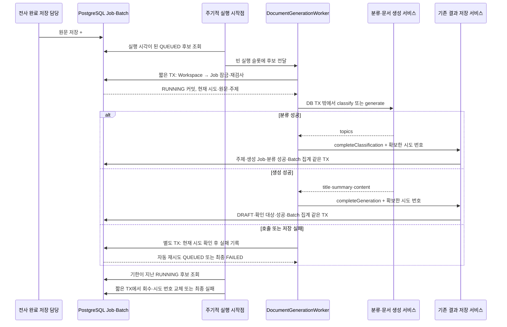

# #525 문서 생성 Job 실행·재시도·중단 복구

## 1. 범위와 브랜치

- 상태: 2026-10-09 로컬 구현 및 제품 검증 완료. 2–6절은 구현 전 계획과 판단 근거이며, 실제 구현·검증 결과는 7절에 구분해 기록한다.
- 대상: [#525](https://github.com/woowacourse-teams/2026-Knot/issues/525), 상위 [#501](https://github.com/woowacourse-teams/2026-Knot/issues/501).
- 현재 브랜치: 최신 #524 `b13d54a5`에서 만든 `be/feature/#525`. 구현 완료 후 사용자가 commit·push·Draft PR 생성을 별도로 요청했다. merge는 이번 요청에 포함하지 않는다.
- 선행 미병합이면 PR base는 `be/feature/#524`다. 선행 병합 시 실제 develop 포함 여부를 확인한 뒤 base를 정한다.
- #534(#521) → #535(#522) → #536(#523) → #537(#524)는 확인 시 OPEN이다. 이 코드는 현재 작업 브랜치에 있지만 develop에 병합된 것으로 설명하지 않는다.
- 이번 범위: QUEUED 소비, 분류/생성 호출, 현재 시도 결과 반영, 실패·유한 자동 재시도, 만료 RUNNING 회수, 녹음별 결과 보존과 내부 조회 계약.
- STT 실행/완료 저장 연결, 녹음 상세 HTTP DTO, FE 폴링/알림 화면, 실제 오디오·원문 삭제는 각각 담당 연결 작업과 #526이다. 신규 HTTP endpoint는 없다.

| 근거 | 확인 시점·버전 | 적용 사실과 판정 |
| --- | --- | --- |
| [Issue #525](https://github.com/woowacourse-teams/2026-Knot/issues/525) | 10/09 OPEN, TODO·메모 전체 | 이번 요청의 작업 계약. 메모는 없음이며 ADR 필수 표식은 없음 |
| [현재 V2 기준](../product/current-v2-mvp.md), [정합성 규칙](../harness/notion-alignment.md) | 10/09 저장소 읽기 | API 우선과 기존 사용자 결정 유지. 수집 상태와 제품 승인·실제 구현을 구분 |
| [Entity](https://www.notion.so/3e4b4351752280b8bd16dea73bb1a5bb), [컬럼 관계도](https://www.notion.so/3e4b43517522809b9f19f2526fc879bf) | 본문/속성 각각 10/07 22:55 UTC·11:14 UTC 일치, 수집 10/08 09:35·10/07 13:07 UTC | 주제별 Job, 같은 녹음·주제 중복 금지, 성공 원문 보호. 현재 코드의 구현 표시와 별도 대조 |
| [도메인 규칙](https://www.notion.so/3e3b4351752280cd9f06edc2ccdff1d8) | 본문/속성 10/07 10:36 UTC 일치, 수집 10/07 13:07 UTC | 일부 성공 유지, 사용자 retry 3회·7일, NO_CONTENT 보존 결과. timeout/backoff는 기술 설계 범위 |
| [정리 중·완료](https://www.notion.so/3edb43517522810c804cf472952079f0), [실패·내용 없음](https://www.notion.so/3edb4351752281e3a1cbee86fe31d1ce) | 본문/속성 10/06 05:07·05:10 UTC 일치, 수집 10/07 13:07 UTC. 속성 v2·개발 중 | 자동 생성·즉시 공개·부분 실패 분리. 자동 1회는 초기 설계값의 근거 후보; 낡은 30초 제외/결정 없음 문구는 최신 API·#521/#522 계약으로 대체 |
| [재시도 API](https://www.notion.so/3ebb43517522802eb145cfbbdd200b73), [작업 목록 API](https://www.notion.so/3ebb4351752280a8a9e9df60d5362028) | manifest 본문 10/08 17:06 UTC, 속성 10/06 04:55·04:54 UTC, 수집 10/08 17:43 UTC. revision_mismatch | 본문과 필요한 속성을 읽었으나 최신 일치 자료로 인증하지 않는다. 기존 #494/#493 구현·사용자 소유자 제한 결정·Issue #525가 적용 근거. method=POST/GET, 구현=NO 표시는 실제 API 존재와 다름 |
| [녹음 상세 API](https://www.notion.so/3deb4351752280a4a9a3f04bff7d0ee4) | 본문/속성 09/30 05:39 UTC 일치, 수집 10/07 13:07 UTC | 전체 결과를 폴링하는 연결 후보. 단일 jobId만으로 다중 Job 표현을 확정하지 않으며 HTTP 필드 변경은 #380 연결 |
| 실제 코드·PR·schema | Job/Batch·#521~#524 서비스·재시도·조회 테스트, V27/V28/V30/V32. 원격 develop=0b697abd | QUEUED 소비·lease·자동 재시도 메서드·전체 결과 집계는 아직 없음. 최신 열린 BE PR의 migration 추가는 #536 V32뿐 |

Notion은 로컬 manifest/coverage에서 관측한 캐시다. 이번에 실시간 Notion을 재수집하거나 pending을 완료 처리했다고 주장하지 않는다. source mismatch는 새 제품 정책을 추측하는 근거로 쓰지 않는다.

## 2. 구현할 흐름

녹음자가 종료한 뒤 음성 담당 코드가 저장 원문과 #523 접수를 함께 커밋하면 실행기가 대기 Job을 발견한다. 사용자는 생성 버튼을 누르지 않는다. 분류가 성공하면 주제별 생성 Job이 생기고 각 문서는 자기 성공 저장이 커밋되는 즉시 기존 API로 읽는다. 세 주제 중 둘이 성공하면 그 두 문서는 유지하며 나머지만 재시도한다.

### 유스케이스별 결과

| 상황 | 서버 처리 | 사용자에게 연결할 결과 |
| --- | --- | --- |
| 분류·모든 주제 생성 성공 | 각 성공 저장·전체 결과 SUCCEEDED | 모든 문서 조회 가능 |
| 한 주제 실패, 다른 주제 실행 중 | 실패 대상만 처리, 전체는 처리 중 | 성공 문서는 즉시 보이며 실행 표시는 유지 |
| 실행 대상 없음, 일부/전체 실패 | 전체 FAILED, 성공/실패 개수 보존 | 성공 문서 보기와 실패 Job별 재시도 |
| 빈 입력 또는 정상 분류 topics=[] | #523의 NO_CONTENT·정리 의도 유지 | 실패와 구분, 사용자 retry 없음 |
| 429·timeout 등 일시적 오류 | 유한 자동 재접수, nextAttemptAt 저장 | 대기/처리 중, 횟수 소진 뒤 FAILED |
| 서버 중단·실행 기한 만료 | 현재 RUNNING 회수, 새 시도로 재접수 또는 FAILED | 영구 RUNNING 방지 |
| 과거 실행의 응답·오류 | 현재 시도/상태 검사로 미반영 | 새 작업과 성공 문서 유지 |

동일 성공 시도의 재전달은 기존 #523/#524처럼 같은 결과다. 이미 끝난 시도에 반복 실패를 기록해 기한을 늘리지 않는다. 사용자 retry의 인증·현재 멤버·녹음 소유자·CSRF·3회·7일은 기존 API에서 검사한다. 실행기는 내부 작업이며 로그인 사용자 권한을 대신 사용하지 않는다.

### 실행 방식 선택

| 실제 대안 | 이점 | 비용·선택 |
| --- | --- | --- |
| 기존 Job QUEUED + 주기적 DB 조회 + JPA 잠금 재검사 | 접수·retry와 같은 DB, 재시작해도 대기 자료 유지 | 첫 구현으로 제안. 기본 poll 1초, 후보는 작은 페이지 |
| Job을 먼저 SKIP LOCKED로 잠금 | 여러 소비자가 다른 행을 빠르게 가져감 | 기존 Workspace→Job 순서와 반대여서 직접 적용하면 교착 위험. 초기에는 채택하지 않음 |
| 별도 접수 테이블/outbox·외부 broker | 높은 처리량·전달 분리 | 소비·전달·복구 구조가 더 필요. 현재 근거로 추가하지 않음 |

후보 읽기는 소유권 확보가 아니다. 작업 스레드가 시작한 후 Workspace→Job 잠금으로 QUEUED·nextAttemptAt을 다시 검사하고 성공한 하나만 LLM을 호출한다. 실행기 포화 시 후보 전달을 거절해도 DB 상태는 QUEUED다. 메모리 큐는 0, 고정 스레드 2개를 초기 제안으로 두며 실제 다중 BE 인스턴스의 전체 동시 호출 수는 별도로 산정한다. 한 인스턴스의 슬롯을 전역 제한으로 설명하지 않는다.

## 3. 나올 코드와 메서드 초안

### 기존 코드 재사용

| 기존 클래스 | 현재 책임 | 이번 연결 |
| --- | --- | --- |
| DocumentTopicClassificationService | classify(전체 원문) | CLASSIFICATION에서 호출 |
| DocumentGenerationService | generate(전체 원문, 주제 하나) | GENERATION에서 호출 |
| DocumentGenerationIntakeService | MANDATORY 원문 접수, 빈 원문 NO_CONTENT | Batch 진행 초기값 함께 저장 |
| DocumentClassificationResultService | 분류 결과와 생성 Job 원자 등록, 반복/이전 시도 검사 | lease와 Batch 집계 반영, failClassification의 실패 처리는 공통 실패 유스케이스로 연결 |
| DocumentGenerationResultService | DRAFT·확인 대상·성공 원자 저장 | lease와 Batch 집계도 동일 TX에서 반영 |
| DocumentGenerationJobRetryService | 본인 FAILED Job 사용자 재접수 | 기존 횟수 증가 유지, 예약 시각·오류·Batch 진행 갱신 |
| Job/Batch Repository와 JPA adapter | 도메인 조회·저장·잠금 | 후보 JPQL 조회와 Batch 진행 조회 추가 |
| LlmClient 전략·LmStudioClient | 공급자 통신·120초 기본 timeout·typed error | 그대로 사용. 실행기가 공급자를 직접 선택하지 않음 |

### 신규·변경 제안

| 위치·클래스 | 책임 | 중요한 public 메서드 후보 |
| --- | --- | --- |
| document/infrastructure/DocumentGenerationScheduler | @Scheduled 시작점. Bean이 활성화된 경우만 동작 | dispatchQueued(), recoverExpired(); 후보 조회·executor 전달만 수행 |
| document/application/DocumentGenerationClaimService | 짧은 READ_COMMITTED 확보 TX | Optional<DocumentGenerationExecution> claim(workspaceId, jobId); 조건 충족 시 RUNNING·lease·진행 상태 커밋, 경쟁으로 놓친 후보는 empty |
| document/application/DocumentGenerationWorker | 외부 호출과 단계별 결과 저장 조정 | execute(workspaceId, jobId); NOT_SUPPORTED로 외부 호출 시 ambient TX를 중단, claim→classify/generate→결과 저장 |
| document/application/dto/result/DocumentGenerationExecution | 실행 확보 시 고정 입력. JPA Entity를 외부 호출에 넘기지 않음 | workspaceId/jobId/batchId/stage/attemptCount/transcriptContent/topic. 입력을 로그/toString으로 출력하지 않음 |
| document/application/DocumentGenerationFailureService | 현재 시도만 실패·자동 재접수·집계 | failAttempt(workspaceId, jobId, expectedAttemptCount, failureCause); 늦은/반복 실패는 미반영, 현재 실행만 갱신 |
| document/application/DocumentGenerationRecoveryService | 만료 RUNNING 회수 | recoverExpired(workspaceId, jobId, expectedAttemptCount); 현재 상태·기한 재검사, 아니면 no-op |
| document/domain/DocumentGenerationRetryPolicy | 오류 분류와 제한 판단. sleep/HTTP/Repository 없음 | isAutomaticallyRetryable(cause), calculateNextAttemptAt(now, automaticRetryCount) |
| document/domain/DocumentGenerationFailureCause | 저장 가능한 안전한 원인 enum | TIMEOUT/RATE_LIMITED/UNAVAILABLE/AUTHENTICATION/INVALID_INPUT/INVALID_RESPONSE/INPUT_LIMIT/OUTPUT_LIMIT/EXECUTION_EXPIRED/WORKSPACE_DELETED/STORAGE_FAILURE/INTERNAL_FAILURE 등 |
| document/application/DocumentGenerationProgressService | 내부 녹음별 진행 데이터 제공 | Optional<DocumentGenerationProgressResult> findProgress(workspaceId, recordingSessionId); 다른 Workspace 제외, 미접수면 empty |
| document/domain/DocumentGenerationBatch | 진행/최종 집계 불변식 | registerTopics, recordJobTransition(stage, previous, next, changedAt); 같은 실제 전이를 한 번만 반영 |
| document/domain/DocumentGenerationJob | 실행·시도·lease 불변식 | startRunning(now, leaseUntil), validateRunningAttemptAt(expected, now), retryAutomatically(now, nextAt), recordFailure(now, cause); 기존 retryByUser에 예약/오류 초기화 추가 |
| Job Repository/JPA adapter | 잠금 없는 제한된 후보 목록, 기존 잠금 | findReadyCandidates(now, limit), findExpiredCandidates(now, limit). 후보 DTO에는 ID만, 원문 제외 |
| global/config/DocumentGenerationWorkerProperties·Config | 시작 설정·검증·bounded executor·스케줄러 조립 | enabled/concurrency/pollDelay/leaseDuration/automaticRetryLimit/retryDelay/recoveryDelay |

public 메서드와 domain 타입은 실제 구현 중 역할이 합쳐지면 줄인다. 단일 executor를 위한 새 port/interface, 일반 Job framework, Spring Batch/Redis/Kafka 의존성을 미리 만들지 않는다. Spring Configuration은 global/config, 문서 스케줄링 구현은 document/infrastructure다.

Worker의 외부 호출은 다른 Bean의 트랜잭션 메서드를 호출한다. 같은 객체의 private/self invocation으로 TX를 흉내 내지 않는다. 성공 저장 TX가 롤백되면 종료된 뒤 실패 유스케이스를 호출한다. DB 장애로 실패 저장도 불가능하면 RUNNING이 남고 복구 작업이 처리한다.

### 초기 설정과 실패 분류 제안

| 항목 | 제안 | 이유·검증 상태 |
| --- | --- | --- |
| Worker 활성화 | 기본 false, 활성화 시 knot.llm.enabled=true 필수 | LLM Bean이 없는 환경에서 접수 Job을 FAILED로 만들지 않음 |
| 한 인스턴스 LLM 동시 실행 | 2, executor queue 0 | 메모리 포화와 무제한 모델 동시 호출 방지. 실측 최적값 아님 |
| 조회 간격 / 회수 간격 | 1초 / 5초 | 새 작업 대기와 복구 지연의 초기 기술값 |
| LLM timeout | 기존 설정 120초 | 공급자 기본 deadline 재사용 |
| 실행 lease | 150초 | timeout보다 긴 저장 여유. 설정 검사에서 timeout+여유 만족; 처리량 최적화 수치 아님 |
| 내부 자동 재시도 | Job 생애 누적 최대 1회, 5초 뒤 재접수 | 사용자 3회와 분리. 초기 기획의 ‘한 번 더’ 참고, Issue가 위임한 기술 제안. 사용자 retry로 자동 한도 초기화하지 않음 |
| 429/timeout/연결·5xx 장애 | 내부 1회 후보 | nextAttemptAt만 저장하고 스레드 sleep 없음 |
| 인증/설정/입출력 한도/JSON·Markdown 오류 | 자동 재시도 없음 | 같은 요청 반복으로 해결되지 않음; 최종 FAILED·원인 코드 기록 |
| 중단/lease 만료 | 내부 한도가 남으면 새 시도, 소진 시 FAILED | 성공 응답 없는 과거 실행을 재사용하지 않음 |

429 Retry-After는 현재 Client가 전달하지 않는다. 지원한다고 주장하지 않으며 초기에는 고정 backoff다. 필요 시 safe duration metadata를 통신 계약에 추가하는 별도 증분을 검토한다. 장애 반복 시 슬롯이 포화되므로 높은 동시성 설정을 성능 측정 없이 권장하지 않는다.

횟수 예: 최초 접수 attempt=1/user=0/automatic=0 → 실행 시작은 그대로 → 자동 재접수 attempt=2/user=0/automatic=1 → 실패 후 사용자 재접수 attempt=3/user=1/automatic=1. 기존 V30의 attempt=1+user+automatic 제약을 지킨다. 실행 없이 최종 실패하는 회수는 새 시도 횟수를 올리지 않고 상태 FAILED로 이전 결과를 거절한다.

## 4. 저장 기반과 주의할 점

새 실행 접수 테이블을 만들지 않는다. Job 실행 제어와 Batch 진행 보존에 기존 테이블 변경이 필요하다.

| 테이블 | 추가/변경 제안 | 제약·역할 |
| --- | --- | --- |
| document_generation_jobs | next_attempt_at, execution_deadline_at, failure_cause | QUEUED 예약 시각, RUNNING lease, 안전한 마지막 원인 enum. RUNNING은 deadline 필수, 그 외 deadline 없음. QUEUED nextAttemptAt 필수, 재접수 때 오류 초기화 |
| document_generation_batches | processing_status, queued_count, running_count, succeeded_count, failed_count, finished_at | 등록 단계와 전체 실행 결과 분리. 주제 등록 후 개수 합은 동결 주제 개수, 모든 개수 ≥0. terminal 결과·개수는 Job 삭제 뒤에도 보존 |
| 위 두 테이블 | 후보 조회 인덱스 | Job(status,next_attempt_at,id), Job(status,execution_deadline_at,id), 실제 실행 계획 확인 후 선택 |

processing_status의 내부 제안은 QUEUED/RUNNING/SUCCEEDED/FAILED/NO_CONTENT다. WAITING_CLASSIFICATION은 분류 Job 상태를 반영한다. TOPICS_REGISTERED에서는 running>0이면 RUNNING, 그 외 queued>0이면 QUEUED, 둘 다 0이고 failed>0이면 FAILED, 전부 성공하면 SUCCEEDED다. NO_CONTENT는 별도 terminal이며 성공 문서 수 0만으로 판정하지 않는다. 외부 녹음 화면 status=PROCESSING/COMPLETED와의 매핑은 #380에서 맡는다.

**집계는 Job 전이와 같은 TX에서 갱신한다.** intake/분류 등록/#524 성공/사용자 retry/자동 retry/복구의 실제 전이만 반영한다. 동일 결과 재전달은 카운터를 올리지 않는다. 예: 세 주제 중 2 성공·1 최종 실패이면 succeeded=2/failed=1, 사용자 retry 시 failed=0/queued=1, retry 성공 시 succeeded=3/failed=0이다.

#526이 만료 Job을 삭제할 때 집계를 재계산하거나 failed를 줄이지 않는다. 이미 보존한 종료 결과를 유지한다. 일부 실패 Job이 삭제된 뒤 다른 실패 Job을 retry하더라도 삭제된 실패의 개수는 유지해야 한다. 이 경우 살아 있는 해당 Job의 FAILED→QUEUED 전이만 차감한다. 목록에서 Job이 사라짐을 전체 성공으로 해석하지 않는다.

### 트랜잭션과 경쟁

| 경계 | 포함 | 제외 |
| --- | --- | --- |
| 실행 확보 TX | Workspace→Job→Transcript→Batch 잠금, 입력/단계/예약 검사, RUNNING+lease+집계 | LLM, 긴 대기, executor 제출 |
| 분류 결과 TX | 시도/lease 검사, 동결 주제·생성 Job·분류 성공·집계 | LLM |
| 생성 결과 TX | 시도/lease 검사, DRAFT·현재 확인 대상·성공·집계 | LLM |
| 실패·회수 TX | Workspace→Job→Batch 잠금, 현재 시도·상태 검사, 실패/예약·횟수·집계 | 원문 요구, 외부 호출, 파일 삭제 |
| 사용자 retry TX | 기존 권한·입력·횟수·7일 + Job 재접수·집계 | 실행 완료 대기 |

실패·회수는 입력 없음도 종료할 수 있도록 Transcript 읽기를 필수로 두지 않는다. 확보 중 현재 QUEUED의 입력·단계가 잘못됐으면 같은 확보 TX에서 안전한 최종 실패와 집계를 기록하고 실행 입력을 반환하지 않는다. 경쟁으로 상태가 바뀐 후보와 데이터 오류를 구분한다. 원문 내용을 임의 생성하거나 주제를 재분류해서 바꾸지 않는다. 자동 실행은 정상 종료한 녹음자의 탈퇴만으로 중단하지 않으며 삭제 Workspace는 확보/완료에서 거절한다. soft-delete 뒤 남은 QUEUED/RUNNING은 삭제 전용 내부 검사로 FAILED(WORKSPACE_DELETED 후보)를 한 번 기록하고 재접수하지 않는다. 회수 후보 조회는 삭제된 Workspace도 식별할 수 있어야 한다. 이 정리는 활성 Workspace 조회를 우회해 새 문서를 만드는 경로가 아니다.

복구와 성공 저장은 같은 Workspace→Job 잠금에서 경쟁한다. 성공이 먼저 커밋하면 회수 no-op; lease가 만료된 첫 결과는 거절하고 회수 후 새 attempt만 반영한다. 이미 SUCCEEDED인 동일 시도 replay는 lease가 제거돼도 기존 문서를 반환한다. Worker는 늦은 성공 거절을 새 시도의 실패로 변환하지 않는다. HTTP 요청이 공급자에 전달된 뒤 timeout/중단되면 공급자 실행 중복 자체는 남을 수 있다. 보장 범위는 현재 시도 결과만 저장하고 문서를 중복 생성하지 않는 것이다.

claim 후보가 다른 실행기에 선점됐으면 empty, 만료 대상이 이미 성공/회수됐으면 no-op, 동일 FAILED 실패 통지는 기존 시각 유지다. 입력·단계 불일치는 typed error와 안전한 실패 처리다. DB 잠금은 짧은 제한을 설정해 한 Workspace가 다른 녹음의 모든 실행 슬롯을 장시간 점유하지 않도록 하고 PostgreSQL에서 대기·timeout 동작을 검증한다.

### Migration과 배포

- 확인 시 develop 최신은 V31, 선행 #536은 V32다. 열린 BE PR의 migration 경로를 확인했다. `V33__add_document_generation_execution.sql`은 현재 미점유 번호 후보이며 구현 직전 재확인한다.
- 기존 versioned migration을 수정하거나 outOfOrder를 사용하지 않는다. V32의 기존 Job 이행 제한도 유지한다.
- 신규 컬럼은 기존 QUEUED의 예약 시각=updated_at, 이미 존재하는 RUNNING은 만료된 lease로 복구 가능하게 명시적으로 이행한다. 과거 FAILED 원인은 LEGACY_FAILURE로 기록하며 원인을 추측하지 않는다. 성공 문서나 terminal Job을 다시 실행시키지 않는다.
- Batch 집계는 기존 분류/주제/Job·Document를 교차 확인해 backfill한다. 주제 누락·성공 GENERATION Job의 Document 누락 같은 불일치는 임의 성공으로 만들지 않고 migration 중단·기존 행 보존이다. CLASSIFICATION 성공에는 Document를 요구하지 않는다.
- 새 Worker를 끈 상태에서 migration·읽기 호환을 확인한 뒤 모든 결과 writer가 lease/집계를 반영하는 버전으로 배포하고 활성화한다. 옛 결과 writer와 새 회수기가 동시에 동작하는 혼합 배포는 피한다.
- 운영 DB의 적용·데이터 유무는 이번 계획에서 관측하지 않았다. 원문·본문·인증값·HTTP 응답 body·예외 원문은 로그/문서에 기록하지 않고 jobId/stage/attempt/cause/소요 시간만 사용한다.

## 5. TDD와 검증 순서

예정 테스트다. 계획 작성 중 실행한 테스트로 표현하지 않는다. 단위는 규칙, Mockito는 호출 순서, 실제 PostgreSQL은 잠금·커밋·재시작 복구, 모의 HTTP는 통신 adapter가 증명하는 범위를 나눈다.

| 테스트 위치·방식 | 성공과 의미 있는 실패 | 기대 결과 |
| --- | --- | --- |
| Job/RetryPolicy/Batch 단위 | 예약 시작·현재 lease·자동 1회, 기한 동률·시도 초과·영구 오류·카운터 음수 거절 | 정확한 상태/시도 합계, 경계에서 만료 |
| ClaimService PostgreSQL | ready 확보·동시 소비, 미래 예약·선점 완료·삭제 Workspace·잘못된 입력 | 하나만 RUNNING/외부 입력 반환, 나머지 empty/안전한 실패, DB 집계 일치 |
| Worker Mockito | classify→분류 결과, generate→문서 저장, 외부/저장 오류 | 올바른 단계만 호출, 확보한 시도 전달, 실패 TX 별도 호출 |
| Worker Spring/PostgreSQL | LLM callback에서 TX 활성 여부·다른 TX의 Workspace 접근 | LLM 호출에 TX/Workspace 잠금 없음. mock만으로 증명하지 않음 |
| FailureService PostgreSQL | 일시 오류 자동 접수·영구 오류 FAILED, 반복/이전 실패·성공 후 실패 | 사용자 횟수 불변, 예약/원인/7일 기록, 기존 성공·최초 실패 기한 유지 |
| RecoveryService PostgreSQL | 실제 claim 후 이전 실행기 폐기·새 실행기 회수, 저장과 회수 경쟁 | 기한 뒤 회수 한 번, 이전 응답 거절, 영구 RUNNING 없음 |
| ProgressService PostgreSQL | 분류 대기/실패/NO_CONTENT, 2성공1실패→retry 성공 | 분류 등록 완료를 생성 완료로 오인하지 않음. 다른 Workspace 제외, 미접수 empty |
| Batch/결과 저장 PostgreSQL | 결과 저장/집계 flush 장애, 만료 Job 삭제 후 집계 조회·남은 Job retry | Document·대상·성공·집계 전부 롤백. 삭제된 실패도 최종 결과 유지 |
| Scheduler/설정 단위·Spring | disabled/no LLM·슬롯 포화·submit 거절·실행 실패 | QUEUED 그대로, 무제한 메모리 큐 없음, 다른 Job 처리는 계속 |
| 기존 retry Security/인수 | 정상 본인 retry 소비, 401/403/타인 녹음/CSRF/3회·7일 거절 | 기존 HTTP 계약과 소유자 제한 유지, 시작 때 횟수 중복 증가 없음 |
| 모의 LlmHttpServer/기존 client 통합 | 정상 응답·429·5xx·timeout·인증·JSON/Markdown 오류 | 정확한 cause, 유한 retry, NO_CONTENT로 오류를 숨기지 않음 |

1. **시도·기한·집계 규칙:** 단위 실패 테스트 → Job/Batch/RetryPolicy 최소 구현. 사용자/자동 횟수와 timeout 경계를 먼저 고정한다.
2. **저장 기반:** migration fixture 실패 → Job 제어 필드·Batch 집계 backfill/제약·JPA mapping. 기존 데이터 보존과 이행 거절을 따로 확인한다.
3. **Job 한 개 확보:** 실제 DB 동시 확보 실패 테스트 → JPQL 후보·claim. `startRunning`이 횟수를 올리지 않는지 검증한다.
4. **분류 실행 한 개:** Mockito·DB TX 경계 실패 테스트 → Worker CLASSIFICATION과 기존 분류 결과 저장/집계 연결.
5. **생성 실행 한 개:** generate→#524 실패 테스트 → GENERATION과 원자적 집계 연결. 성공 문서가 즉시 기존 조회에 보이는지 확인한다.
6. **현재 시도 실패와 자동 재시도:** 원인별·반복/과거 시도 실패 테스트 → failure service. 사용자 retry의 예약·집계도 별도 증분으로 연결한다.
7. **중단 회수:** claim 뒤 실행 중단·새 실행기·늦은 응답 테스트 → 만료 lease 회수, timeout 검사와 bounded retry. 임의 sleep 대신 고정 Clock·latch로 순서를 관측한다.
8. **녹음별 결과 보존:** 일부 성공/실패·NO_CONTENT·삭제 이후 fixture 실패 → ProgressService·영속 집계. #380에서 읽을 내부 계약 문서 작성.
9. **자동 실행 시작점:** disabled·포화·submit 거절 테스트 → 설정과 scheduler/executor. 미구현 구성요소가 있는 동안 Worker 기본 비활성 유지.
10. **회귀·문서:** 실제 PostgreSQL 복수 Job 흐름, 기존 API·migration 검증과 전체 검사. 필요한 가독성 정리는 covered 동작 이후에만 refactor한다.

커밋은 각 단계 안에서도 public 동작·schema·adapter·설정·문서 단위로 나눈다. 가능한 경우 `test` → `feat`를 분리하고 공개되는 최소 단위가 빌드 가능한지 확인한다. 형식을 맞추기 위한 빈 refactor 커밋은 만들지 않는다. 이 계획은 commit/push/PR 권한이 아니다.

저장소에서 확인한 명령: focused `./gradlew test --tests '*DocumentGeneration*Test'`, PostgreSQL `./gradlew integrationTest --tests '*DocumentGeneration*IntegrationTest'`, 기존 API 인수 `./gradlew acceptanceTest --tests '*DocumentGenerationJob*AcceptanceTest'`; 최종 `./gradlew test integrationTest acceptanceTest spotlessCheck check bootJar`, `git diff --check`. 추가 클래스명에 맞춰 focused 패턴을 구체화한다. 개발 시작 전 `npx ph workflow implement`를 실행하며 계획만 작성하는 지금은 실행하지 않는다.

## 6. 완료 기준과 다음 작업

완료 기준은 저장된 QUEUED가 자동 실행되고, 한 녹음의 3개 주제에서 2개 성공/1개 실패를 유지한 채 실패 하나만 재시도해 완료하는 것이다. 동시 소비·중단·timeout·이전 결과·부분 저장 장애를 실제 PostgreSQL과 모의 LLM으로 확인한다. 만료 Job을 지운 뒤에도 전체 결과가 바뀌지 않아야 한다.

기술 초기값은 위 제안이며 최적 성능 인증이 아니다. 실제 공급자에서는 짧은 합성 원문과 복수 요청으로 시간·오류·동시성·입출력 한도를 별도 관측한다. 사용자 회의 원문·토큰을 문서에 복제하지 않는다. 서버/모델 관측 없이 2시간 회의 처리 SLA를 주장하지 않는다.

- 다음은 [#526](https://github.com/woowacourse-teams/2026-Knot/issues/526): 성공 원문·실행 중 입력 보호, 7일 실패/30일 오디오/NO_CONTENT 정리와 삭제 실패 재처리. #525 집계는 유지한다.
- 음성 담당: 실제 STT 완료 저장 TX에서 #523 접수 호출. 현재 생산자 구현이 없다는 관측을 유지하며 대신 STT를 구현하지 않는다.
- 녹음 담당 #380/FE: 내부 progress의 여러 Job·부분 성공/실패·NO_CONTENT를 HTTP 계약과 화면에 연결. 외부 단일 jobId/실패 이유의 확정은 담당 연결 시 처리한다.
- Notion 재시도/목록 revision_mismatch는 문서 정합 작업으로 남는다. 이번 실행기에서 새 HTTP 동작을 추정해 바꾸는 차단 조건으로 사용하지 않는다.

기술 근거: [Spring Scheduling](https://docs.spring.io/spring-framework/reference/integration/scheduling.html)의 fixedDelay와 bounded executor, [트랜잭션 프록시](https://docs.spring.io/spring-framework/reference/data-access/transaction/declarative/annotations.html)를 Context7에서 확인했다. 기존 JPA 잠금의 실제 동작·추가 인덱스 효과·초기 설정의 처리량은 구현 시 검증 대상이다.

## 7. 실제 구현과 관측

- Worker가 확보 서비스 → 기존 분류/생성 서비스 → 기존 원자적 결과 저장을 조정한다. 외부 호출은 `NOT_SUPPORTED`이며 확보·성공·실패/회수·사용자 retry는 별도 Bean의 짧은 트랜잭션이다.
- `DocumentGenerationExecution`은 workspace/job/attempt/stage/원문/topic을 포함하며 계획의 batchId는 실행에 필요하지 않아 제외했다. `toString`에 원문·주제는 출력하지 않는다.
- 자동 재시도 한도는 Job 도메인의 생애 누적 1회다. RetryPolicy는 안전한 cause로 재시도 여부를 판단하고 설정의 고정 Duration으로 다음 접수 시각을 계산한다. 실제 enum은 `STORAGE`, `INTERNAL`이며 추정 없는 이전 실패는 `LEGACY_FAILURE`다.
- 후보 JPQL은 Batch와 RecordingSession으로 Workspace를 식별한다. 확보·분류/생성 결과 저장·실패/회수의 내부 잠금에서 PostgreSQL `lock_timeout`은 3초다. 결과 저장은 삭제 Workspace를 거절하며 일반 조회·변경 API의 활성 Workspace 범위는 그대로다.
- V33은 기존 상태를 대조한 뒤 Job 기한/예약/원인과 Batch 진행 개수·종료 시각을 이행한다. 주제별 생성 Job 누락 등 불일치는 SQL 이행을 중단하며 원래 행과 스키마를 보존한다.
- 실제 PostgreSQL과 Spring에서 동시 확보, 외부 호출 중 트랜잭션/Workspace 잠금 해제, 2성공/1실패와 해당 Job 사용자 retry, 기한 동률 회수, 이전 결과 차단, 자동 횟수 소진, 잘못된 입력·삭제 Workspace, 실패 Job 삭제 후 최종 개수 보존을 확인했다.
- 실제 스케줄러 활성 테스트는 원문 접수만 호출한 뒤 분류 및 두 주제 문서·확인 대상·성공 집계가 자동으로 저장되는 것을 관측했다. LLM 서비스 응답은 Mockito이며 실제 LM Studio 품질·속도 관측은 아니다.
- V32→V33 실제 DB 이행은 기존 RUNNING 회수 가능 상태, 혼합 주제 상태와 성공 문서 보존, 불일치 시 이행 거절을 확인했다. 인덱스 실행 계획/운영 데이터 이행을 검증했다고 주장하지 않는다.
- 복구 테스트는 저장된 RUNNING과 고정 Clock·현재/이전 시도로 중단 뒤 상태를 재현한다. 실제 OS 프로세스 강제 종료나 운영 서버 재시작은 수행하지 않았다.
- 실행 설정과 #380의 내부 결과 연동은 [운영·연동 문서](../../backend/docs/document-generation-worker.md)에 정리했다. 전체 Gradle 결과와 Persona 종료 판정은 아래와 같다.

최종 제품 검증: `./gradlew spotlessApply test integrationTest acceptanceTest spotlessCheck check bootJar` PASS. 단위 820·통합 373·인수 389, 총 1,582개이며 실패·오류·skip 0이다. `git diff --check`도 PASS다. 잠금 제한 회귀는 확보 1개 통과/결과 저장 2개 실패 RED를 재현한 뒤 세 경로 모두 통과했다. 실행기 고유 테스트 컨텍스트는 클래스 종료 시 닫아 전체 검사 메모리 부족을 해소했다. 기존 인수 fixture의 상태 변경에도 새 예약·기한·원인 제약을 적용했다. 구현 단계에서는 commit·push·PR·merge를 수행하지 않았으며, 후속 사용자 요청에 따라 동작·schema·adapter·설정·문서별 커밋과 푸시·Draft PR 생성을 진행한다. 사용자 변경 `backend/docs/notion-api-alignment.md`와 과거 Persona 이력은 제외하고 보존한다.

Persona 판정: 현재 Java 41개와 profile/plan/card의 evidence read는 성공했고 reports를 기록했다. report-filled review는 성공, implementation은 기존 보고서의 template-like/incomplete 판정으로 거절됐다. `npx ph workflow finish implement`는 exit 1이며 report-coverage-missing, java-role-read-coverage-missing, convention-toolchain-missing, workflow-loop-state-stale, pending-ticket을 보고했다. 과거 전역 기록·#427 pending 등을 초기화하지 않으며 제품 검사 성공과 하네스 완료 인증을 구분한다.
