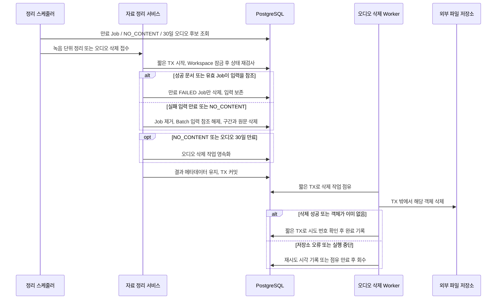

# #526 문서 생성 실패 자료와 원본 오디오 보존 정리 구현 계획

- 상태: 승인 계획 기반 로컬 구현·제품 검증 완료. 기존 제안과 실제 구성 차이는 아래 구현 기록에 적는다.
- 확인일: 2026-10-09 (Asia/Seoul)
- 대상: [Issue #526](https://github.com/woowacourse-teams/2026-Knot/issues/526), 상위 #501
- 확인한 checkout: `be/feature/#525`, HEAD `0b215748`. 계획 작성 시 작업 트리는 깨끗했다.

## 1. 범위와 브랜치

### 구현 기록 · 2026-10-09

- 최신 origin/be/feature/#525에서 be/feature/#526을 생성했다. V34~V36은 계획과 같은 순서로 추가했고 기존 migration은 변경하지 않았다.
- 실제 문서 정리 진입점은 `DocumentRetentionCleanupService.cleanup(workspaceId, recordingId, batchId)`다. 후보가 제공하는 Batch ID를 녹음 범위와 다시 대조한다. 만료/삭제 전용 JPA Adapter를 추가해 기존 실행 Repository에 정리 조회와 삭제 메서드를 분산하지 않았다.
- `RecordingAudioRetentionService.schedule(uploadId)`는 Upload → Task 잠금만 사용한다. 문서 생성 결과 NO_CONTENT는 불변이므로 단독 오디오 접수에서 조회로 확인하고 Workspace/RecordingSession 잠금을 추가로 얻지 않는다. 문서 정리에서 호출하는 scheduleNoContent는 MANDATORY로 같은 트랜잭션에 참여한다.
- 두 후보 스캔을 `RetentionCleanupScheduler`에서 호출하고, 파일 Worker는 전용 풀로 분리했다. Task에 confirmation_after를 추가했다. 별도 reason 필드는 두지 않고 Batch의 NO_CONTENT와 완료 시각에서 접수 근거를 확인한다.
- `RecordingAudioDeletionStateService`와 Worker가 실제 Task 소비·lease 회수·이전 attempt 거절·재시도·재확인을 수행한다. Task 잠금은 Upload를 기다린 뒤 현재 DB 행을 refresh한다.
- S3 Adapter는 버전 활성/중단 상태에서 같은 key의 버전·마커를 실제 versionId로 삭제한다. 전체 60초/100페이지, 기존 단일 호출 5초, 기본 lease 120초로 제한한다. 과거 URL 만료의 기본 재확인 값 7일과 업로드 종료 대기 기본 30분은 실제 호스트 관측이 아니다.
- 운영 활성화 전 확인과 실제 설정은 [보존 정리 운영 문서](../operations/document-generation-retention.md)에 정리한다. 자동 처리는 기본 비활성이다.

이번 작업은 생성이 끝난 뒤의 자료 정리다. 마지막 실패 후 7일이 만료된 Job과 더 이상 사용하지 않는 입력을 삭제하고, 업로드 완료 확인 후 30일이 지난 오디오를 삭제한다. `NO_CONTENT`는 30일을 기다리지 않고 원문·구간·오디오를 정리한다. 성공 문서와 그 원문, 녹음의 최종 결과는 유지한다.

새 HTTP API를 만들지 않는다. 조회 API가 자료를 삭제하지 않으며, 생성 실행·LLM 호출·STT 실행도 추가하지 않는다. 서버의 주기적 처리 작업이 후보를 읽고 재검사한 뒤 정리한다.

### 확인한 근거

| 자료·출처 | 확인 시점·revision | 적용 사실 | 판정 |
| --- | --- | --- | --- |
| [#526](https://github.com/woowacourse-teams/2026-Knot/issues/526) | 10/9 원격 조회, OPEN, 메모 없음 | 7일·30일·NO_CONTENT, 참조 보호, 삭제 실패 복구 | 이번 구현 계약. 팀 승인 여부는 별도 |
| [현재 V2 기준](../product/current-v2-mvp.md), [정합성 규칙](../harness/notion-alignment.md) | 10/9 저장소 읽음 | 최신 API 우선, 과거 제안과 실제 구현 구분 | 저장소 작업 기준 |
| [Entity - 컬럼 관계도](https://app.notion.com/p/3e4b43517522809b9f19f2526fc879bf) | 본문/속성 10/7 11:14Z 일치, 캡처 10/7 13:07Z | 오디오 완료 확인 기준 30일, 실패 입력 7일, NO_CONTENT 결과 유지 | 계약 근거. 과거 Chunk 모델은 현재 Upload 모델을 대체하지 않음 |
| [도메인 규칙 및 UseCase](https://app.notion.com/p/3e3b4351752280cd9f06edc2ccdff1d8) | 본문/속성 10/7 10:36Z 일치, 캡처 10/7 13:07Z | 성공 문서 원문·구간 보호, 전체 원문/구간 동일 저장 결과 | 관련 규칙 근거 |
| [Entity](https://app.notion.com/p/3e4b4351752280b8bd16dea73bb1a5bb) | 본문/속성 10/7 22:55Z 일치, 캡처 10/8 09:35Z | Transcript와 Segment의 책임, Job/Document 참조 | 모델 후보와 구현 대조 |
| [실패·내용 없음 정책](https://app.notion.com/p/3edb4351752281e3a1cbee86fe31d1ce) | 본문/속성 10/6 05:10Z 일치, 캡처 10/7 13:07Z | 부분 성공 유지, 결과 기록 후 NO_CONTENT 자료 정리 | 속성 v2·개발 중·문서 정리, STT-R16/R22/R23. 과거 일괄 녹음 삭제 표현은 최신 계약으로 제한 |
| [Job 목록](https://app.notion.com/p/3ebb4351752280a8a9e9df60d5362028), [재시도](https://app.notion.com/p/3ebb43517522802eb145cfbbdd200b73) | 본문 10/8 17:06Z, 속성 각각 10/6 04:54Z·04:55Z. 캡처 10/8 17:43Z, `revision_mismatch` | 마지막 실패 기준 7일, 삭제된 Job 404, 결과 판정은 종합 상태로 수행 | 본문 참고와 #526/코드 대조. 속성의 구현 NO는 실제 구현 증거가 아님 |
| V26/V27/V28/V31/V32/V33, Job·Batch·Upload·Storage·접수/결과/재시도 서비스 | 10/9 현재 checkout 읽음 | FK RESTRICT, nullable Batch 입력, 고정 종합 상태, completedAt, 저장소 삭제 메서드 부재 | 현재 브랜치 구현 관측 |
| [PR #534](https://github.com/woowacourse-teams/2026-Knot/pull/534) → [#535](https://github.com/woowacourse-teams/2026-Knot/pull/535) → [#536](https://github.com/woowacourse-teams/2026-Knot/pull/536) → [#537](https://github.com/woowacourse-teams/2026-Knot/pull/537) → [#538](https://github.com/woowacourse-teams/2026-Knot/pull/538) | 10/9 원격 조회, 모두 OPEN | #523의 V32·#525의 V33과 실행/결과 계약에 의존 | 미병합 선행 코드 |

Notion은 선택한 로컬 캐시의 본문·관련 속성·manifest·coverage를 읽었다. 운영 원문을 오늘 재수집한 것은 아니다. API 두 페이지의 revision 불일치는 남아 있으며, 동일한 보존 규칙이 #526과 코드에도 존재하므로 이 계획에서 별도 제품 결정을 추측하지 않는다.

### 브랜치 제안

현재는 브랜치를 바꾸지 않는다. 바로 구현한다면 최신 `origin/be/feature/#525`에서 프로젝트 관례인 `be/feature/#526`을 만들고 PR base를 `be/feature/#525`로 둔다. Git `#`가 포함된 브랜치 인수는 따옴표로 감싼다.

구현 직전 fetch 후 깨끗한 작업 트리에서 선행 브랜치를 fast-forward로 최신화한다. #538까지 develop에 병합됐다면 최신 develop에서 분기하고 base도 develop로 둔다. 선행 PR이 squash 병합되면 base만 바꾸지 말고 #526 전용 변경만 새 develop 위로 옮겨 중복 diff를 확인한다. 기존 PR을 임의로 머지하거나 force-push하지 않는다.

원격 develop `0b697abd`는 V31까지, 열린 PR의 신규 migration은 #536의 V32와 #538의 V33이다. 현재 다음 후보는 V34이며 실제 DB 적용 상태는 확인하지 않았다. 구현 시 열린 PR과 migration 번호를 다시 확인한다.

## 2. 구현할 흐름

### 사용자가 보는 동작

| 상황 | 서버 처리 | 사용자가 보는 결과 |
| --- | --- | --- |
| Job 실패 후 7일 미만 | FAILED Job과 입력 유지 | 녹음한 본인이 기존 한도 내에서 재시도 |
| 정확히 7일 만료 | 만료 FAILED Job 삭제, 다른 참조 없을 때만 입력 정리 | 목록에서 제외. 삭제 전 만료 요청은 기존 409, 삭제 후 요청은 404 |
| 같은 녹음의 일부 문서 성공 | 실패 Job만 정리, 성공 Job·문서·원문·구간 보호 | 이미 생성된 문서와 원문 계속 조회 |
| 다른 Job 실행/재시도 중 | 해당 입력 보호 | 진행 중 표시 유지 |
| 오디오 완료 확인 후 정확히 30일 | 오디오 삭제 요청 기록 후 파일 삭제 | 문서·원문·구간은 계속 조회 |
| NO_CONTENT 확정 | 결과 상태 저장 후 입력 정리와 오디오 삭제 접수 | 내용 없음 결과 유지, 재시도 없음 |
| 파일 삭제 실패/서버 중단 | 삭제 작업을 DB에서 다시 읽어 재처리 | 생성 결과가 바뀌지 않으며 파일 정리를 계속 시도 |

예를 들어 A 문서는 성공하고 B Job은 7일 전에 실패했다면 B Job만 지운다. A가 같은 Transcript를 참조하므로 원문과 구간은 남고 Batch의 실패 이력도 유지된다. 오디오는 별도의 30일 기한에 삭제한다.



### 트랜잭션에 묶는 유즈케이스

1. `cleanupRecording(workspaceId, recordingSessionId)`: 만료 검증·참조 검사·Job 삭제·Batch 입력 해제·Segment/Transcript 삭제·필요한 오디오 삭제 의도를 한 READ_COMMITTED 트랜잭션에서 처리한다. 실패하면 전부 롤백한다.
2. `scheduleExpiredAudio(workspaceId, uploadId)`: completedAt의 30일 경계 재검사와 삭제 의도 저장을 한 트랜잭션에서 처리한다. 생성 입력을 삭제하지 않는다.
3. 파일 삭제는 `claim` 커밋 → 외부 호출 → `complete`/`reschedule`의 별도 커밋이다. DB와 S3를 하나의 원자적 트랜잭션으로 보지 않는다.

스캔 결과는 후보일 뿐 삭제 허가가 아니다. 잠금을 얻은 뒤 Clock을 다시 읽어 상태·기한·참조를 검사한다. 이미 지워진 행, 재시도로 QUEUED가 된 Job, 중복 후보는 정상적인 no-op이다. 잘못된 FK/상태 조합은 도메인 오류로 중단하고 롤백하며 성공으로 숨기지 않는다.

## 3. 나올 코드와 메서드 초안

아래 경로는 `backend/src/main/java/com/knot/backend/` 기준이다. 단순 도메인 우선 계층 구조와 기존 JPA Repository/Adapter를 따른다. 범용 정리 프레임워크·새 메시지 브로커는 만들지 않는다.

### 현재 코드에서 재사용할 책임

| 기존 클래스 | 확인한 책임 | 이번 연결 |
| --- | --- | --- |
| `document/domain/DocumentGenerationJob` | lastFailedAt·expiresAt·재시도 횟수·실행 상태 | 같은 168시간 만료 규칙 재사용 |
| `document/domain/DocumentGenerationBatch` | 주제 목록·종합 상태·개수·finishedAt·cleanupRequestedAt | Job 삭제 후에도 이력을 유지하고 원문 참조만 해제 |
| `DocumentGenerationIntakeService` | 기존 Batch를 먼저 찾아 중복 접수 처리 | 정리 후 반복 통지로 새 작업이 생기지 않도록 입력 식별 기록 사용 |
| `DocumentGenerationClaimService`, `DocumentClassificationResultService`, `DocumentGenerationResultService`, `DocumentGenerationJobRetryService` | Workspace를 먼저 잠그고 Job/입력/Batch 처리 | 정리와 동일 Workspace 잠금으로 경합 제어 |
| `DocumentGenerationProgressService` | Batch에 저장된 종합 결과 조회 | Job 삭제 후에도 FAILED/NO_CONTENT 유지 검증 |
| `recording/domain/RecordingAudioUpload` | 최초 완료 확인 시각·storageKey·COMPLETED 상태 | 30일 기준점 유지, 삭제 확인과 마지막 URL 만료 시각 추가 |
| `recording/application/RecordingAudioStorage` | presignUpload·findStoredObject | 객체 삭제 계약 추가 |
| `recording/infrastructure/storage/S3RecordingAudioStorage`, `UnconfiguredRecordingAudioStorage` | 외부 호출/기술 예외 변환, 미설정 거절 | 삭제 구현과 미설정 오류 처리 |

### 제안할 코드와 공개 메서드

| 위치·클래스 | 메서드 후보와 입력/결과 | 판단·부작용 |
| --- | --- | --- |
| 기존 `DocumentGenerationJob` | `isRetentionExpired(Instant now): boolean` | FAILED이며 현재 시각이 expiresAt 이상일 때만 만료 |
| 기존 `DocumentGenerationBatch` | `releaseInput(long expectedTranscriptId, Instant releasedAt): void` | 종료 결과에서만 입력 FK 해제. 해제한 ID·시각 기록, 상태/개수 유지. 반복 해제는 동일 입력이면 no-op |
| 기존 Batch | `validateInput(long transcriptId)` 보완 | 활성 또는 해제한 입력 ID와 비교. 정리 후 동일 통지는 재사용, 다른 입력은 기존 충돌 오류 |
| `document/application/DocumentGenerationRetentionService` 신규 | `cleanupRecording(long workspaceId, long recordingSessionId): void` | Workspace 포함 삭제 이력 잠금 → 참조 재검사 → 정리·삭제 의도 저장. 내부 규칙은 `deleteExpiredJobs`, `hasProtectedInput`, `releaseUnusedInput`, `requestNoContentAudioDeletion`로 분리 |
| 기존 Job/Batch Repository와 Adapter | `findRetentionCandidates(now, limit)`, `findAllByBatchIdForUpdate(batchId)`, `delete(job)` | 후보는 Page 제한. Job 잠금은 ID 순서. 만료 자료만 명시적으로 삭제 |
| `recording/domain/TranscriptRepository` 및 JPA Adapter 신규 | `findByIdForUpdate(id)`, `delete(transcript)`, `flush()` | 입력 삭제를 recording 저장 계약으로 제공. 기존 입력 Query의 조회 책임은 유지 |
| 기존 `TranscriptSegmentRepository` | `deleteAllByTranscriptId(id)` | 특정 원문의 구간 삭제. 전체 테이블 삭제 메서드는 추가하지 않음 |
| 기존 Document Repository | `existsBySourceTranscriptId(id)`, `existsByGenerationJobId(id)` | 성공 결과의 참조 보호. 조회 구현은 JPA로 제한 |
| 기존 `RecordingAudioUpload` | `isRetentionExpired(now)`, `recordUploadUrlExpiry(expiresAt)`, `recordDeleted(deletedAt)` | 완료 확인 30일, 마지막 URL 만료 기록, 최초 삭제 시각 유지. COMPLETED/완료 시각을 되돌리지 않음 |
| `recording/application/RecordingAudioRetentionService` 신규 | `scheduleExpiredAudio(workspaceId, uploadId): void` | 완료된 오디오만 30일 재검사. uploadId당 삭제 작업 하나 기록 |
| `recording/domain/RecordingAudioDeletionTask` 및 Repository/Adapter 신규 | `request(...)`, `claim(now, deadline)`, `complete(expectedAttempt, now)`, `reschedule(expectedAttempt, now, nextAttemptAt, errorCode)` | PENDING/RUNNING/SUCCEEDED, 점유 만료·시도 번호로 중복/지연 결과 제어. 원문·토큰·URL은 저장하지 않음 |
| `recording/application/RecordingAudioDeletionStateService` 신규 | `claim(taskId): Optional<execution>`, `complete(taskId, attempt)`, `reschedule(taskId, attempt, code)` | 각각 짧은 TX. 미준비 후보는 empty, 오래된 결과는 no-op. Upload/Task를 함께 잠그고 성공 시 deletedAt 기록 |
| `recording/application/RecordingAudioDeletionWorker` 신규 | `execute(taskId): void` | 트랜잭션 밖에서 StateService.claim → Storage.deleteStoredObject → complete/reschedule. 프로세스 중단은 다음 claim에서 만료 회수 |
| 기존 `RecordingAudioStorage` | `deleteStoredObject(String storageKey): void` | 이미 없는 객체는 성공. 통신/권한/미설정 오류는 RecordingException으로 변환 |
| `document/infrastructure/DocumentGenerationRetentionScheduler`, `recording/infrastructure/storage/RecordingAudioRetentionScheduler` 신규 | 후보 스캔·개별 처리 호출 | document DB 정리와 recording 오디오 만료/파일 처리의 단방향 책임 유지 |
| `global/config/RetentionWorkerProperties`, `RetentionWorkerConfig` 신규 | 설정 검증과 Bean 조립 | 기본 비활성, 후보 수·주기·파일 처리 동시성·점유 기한·재시도 backoff 명시 |

Execution 전달 DTO는 `recording/application/dto/result/`의 독립 record 파일로 둔다. Entity는 class, 오류는 해당 도메인 ErrorCode/Exception으로 표현한다. 중첩 타입·삼항 연산자·긴 복합 검증 if를 추가하지 않으며 Workspace 공백 스타일을 따른다.

30일 정리와 NO_CONTENT 정리는 같은 삭제 Task Repository를 사용한다. document 쪽은 recording 도메인의 작업 생성 계약을 사용하고 recording 쪽은 document 서비스에 의존하지 않는다.

## 4. 저장 기반과 주의할 점

### 모델 변경 제안

| 테이블 | 변경 후보 | 제약·의미 |
| --- | --- | --- |
| `document_generation_batches` | nullable `released_transcript_id`, `input_released_at` | 삭제한 입력 ID는 FK 없이 중복 통지 검증용 메타데이터로 유지. 해제 필드는 함께 채우고 활성 transcript_id와 동시에 존재하지 않음 |
| 같은 Batch | `ck_generation_batch_state` 보정 | 분류 실패 만료 후 WAITING_CLASSIFICATION + FAILED + 해제 기록 조합을 허용. 실행 중 입력 없는 조합은 거절 |
| `recording_audio_uploads` | nullable `deleted_at`, `last_upload_url_expires_at` | 삭제 확인 이력, URL 자체를 저장하지 않는 마지막 업로드 URL 만료 기록. 완료 확인 시각은 그대로 유지 |
| `recording_audio_deletion_tasks` 신규 | id, upload_id, storage_key, reason, status, requested_at, attempt_count, next_attempt_at, execution_deadline_at, last_failure_code, completed_at | IDENTITY PK, upload_id UNIQUE·FK RESTRICT, 상태별 시각 CHECK, 준비/만료 스캔 인덱스. 삭제 소비와 복구까지 같은 작업에서 구현 |
| 기존 Jobs/Uploads | 만료 후보 조회용 인덱스 | 실제 JPQL 조회 조건에 맞춰 FAILED expires_at/id 및 COMPLETED completed_at/id 확인. 필요한 인덱스만 추가 |

Migration은 필요하다. 현재 번호 기준으로 Batch 해제 규칙 V34, Upload 삭제/URL 메타데이터 V35, 실제 소비할 삭제 Task V36처럼 목적별 신규 migration을 제안한다. 구현 직전 번호를 다시 확정한다. 기존 V26~V33은 수정하지 않는다. 운영 flyway_schema_history와 데이터 분포는 아직 관측하지 않았다.

### 입력을 실제 삭제하는 순서

1. 만료 FAILED Job 중 Document가 참조하지 않는 행만 삭제하고 flush한다. Batch의 failedCount를 감소시키거나 결과를 재집계하지 않는다.
2. 성공 Document, QUEUED/RUNNING, 보존 기한 내 FAILED Job이 있으면 입력을 유지한다. 사용자 재시도 3회를 소진했더라도 7일이 남은 Job을 조기 삭제하지 않는다.
3. 성공 분류 Job도 Transcript와 Batch 입력을 참조한다. 성공 문서/유효 Job이 하나도 없고 종료된 녹음의 입력을 정리하는 경우에만, 문서를 참조하지 않는 종료 분류 Job을 함께 제거한다. 성공 생성 Job은 Document FK 때문에 보존한다.
4. 모든 Job/Document 참조가 사라졌을 때 Batch의 입력을 해제하고 flush한다. V32의 `(batch_id, transcript_id)` 복합 FK까지 고려한다.
5. 해당 TranscriptSegment들을 삭제하고 flush한 다음 Transcript를 삭제한다. FK RESTRICT는 그대로 유지한다.
6. Batch·주제 식별 목록·RecordingSession·Upload·삭제 Task의 메타데이터는 보존한다. 분류 실패와 전체 생성 실패 모두 FAILED가 유지되고, NO_CONTENT도 그대로 유지된다.

NO_CONTENT가 빈 원문 접수에서 만들어졌다면 분류 Job 자체가 없을 수 있다. 이 경우에도 같은 해제/삭제 흐름이 동작해야 한다. 이미 삭제된 입력은 재실행 시 no-op이며 동일 STT 완료 통지가 새 분류 Job을 만들지 않아야 한다.

### 경합과 잠금

현재 접수는 Workspace → RecordingSession → 기존 Batch 또는 새 입력이며, 결과/claim/사용자 재시도는 Workspace → Job → Transcript → Batch 순서를 사용한다. 같은 Workspace의 쓰기를 먼저 직렬화하는 점이 공통이다.

정리는 `Workspace(논리 삭제 포함) → RecordingSession → Job들(ID 순서) → Transcript → Batch → Upload/삭제 Task`로 처리한다. 오디오 단독 처리는 `Workspace → RecordingSession → Upload → Task`, 파일 처리 상태 갱신은 `Upload → Task`만 사용하며 이후 Workspace 잠금을 얻지 않는다. 같은 녹음의 모든 입력/Job 생성·참조 변경은 Workspace 잠금 프로토콜을 따라야 한다. 앞으로 연결할 STT 저장도 이 계약을 적용한다.

기존 내부 Workspace 잠금의 3초 제한을 재사용하고 후보를 작은 단위로 처리한다. 하나의 TX에서 모든 Workspace를 순회하지 않는다. cleanup/재시도/결과 저장 경합은 PostgreSQL로 증명한다. 잠금 전에 읽은 상태와 기존 Mockito 테스트만으로 삭제 안전성을 판단하지 않는다.

### 파일 삭제와 복구

커밋 뒤 이벤트만 보내고 끝내는 대안은 프로세스 중단으로 삭제 요청을 잃을 수 있다. 여기서는 삭제 의도를 영속화하고 실제 읽는 Worker까지 구현한다. #494에서 제거한 미소비 실행 접수 테이블과 책임이 다르다.

Worker는 한 작업을 짧게 점유하고 DB TX 밖에서 파일을 삭제한다. 삭제 후 완료 기록 전에 중단돼도 같은 key 삭제를 반복한다. 다른 시도의 늦은 성공/실패는 attemptCount로 거절한다. 외부 오류는 재시도 시각과 정제된 오류 코드를 남기며, 사용자 Job의 3회 제한을 적용하지 않는다. 재시도는 제한된 backoff로 계속하고 설정/권한 오류는 관측 가능하게 남긴다.

초기 기술 설정 제안은 스캔 1분, 후보 20개, 파일 동시 처리 1개다. 기존 저장소 단일 호출 timeout은 5초이며 삭제 작업의 전체 호출 시간 제한보다 점유 기한을 길게 둔다. 여러 객체 버전 삭제가 필요하면 전체 실행 시간도 제한해야 한다. 운영값은 실제 저장소 테스트 뒤 확정하며 생성 Worker의 풀을 공유하지 않는다.

### 실제 저장소에서 확인할 사항

- 현재 Storage는 endpoint 설정으로 NCP 등 S3 호환 저장소를 지원한다. 운영 버킷의 versioning·삭제 권한·저장소 고유 동작은 아직 확인하지 않았다. AWS에서는 versioning이 켜진 버킷의 일반 DeleteObject가 delete marker를 만들므로 물리 삭제를 보장하지 않는다. 활성화 전에 해당 key의 버전 제거 방식까지 확인한다. 버킷 전체 삭제/정리는 하지 않는다. [AWS DeleteObject](https://docs.aws.amazon.com/AmazonS3/latest/API/API_DeleteObject.html)
- 현재 URL 발급 서비스는 만료 시각을 응답하지만 DB에는 저장하지 않는다. AWS presigned PUT은 만료 전 재사용 가능하므로 NO_CONTENT 파일 삭제 후 이전 URL로 객체가 다시 생길 수 있다. `lastUploadUrlExpiresAt` 기록과 삭제 재확인을 포함한다. 첫 삭제는 즉시 시도하되 쓰기 가능 기간이 끝나기 전 Task를 최종 종료하지 않는다. 만료 직전 시작한 업로드가 뒤늦게 끝나는 경우도 저장소/업로드 제한으로 확인해야 하며, 단순히 URL 만료만으로 해결됐다고 주장하지 않는다. [AWS presigned URL](https://docs.aws.amazon.com/AmazonS3/latest/userguide/using-presigned-url.html)
- 과거 Upload는 URL 만료 기록이 없으므로 당시 TTL/최대 업로드 처리 시간을 확인해 안전한 재확인 기준을 정한다. 현재 기본 TTL 15분을 과거 모든 발급에 적용했다고 추정하지 않는다. 이 운영 확인은 삭제 Worker 활성화 조건이며 DB 자료 정리 설계 자체를 막지 않는다.
- 삭제 완료 후에도 COMPLETED Upload의 반복 완료 확인 API는 기존 최초 completedAt을 반환한다. 삭제가 업로드 미완료로 되돌아가지 않도록 한다. storageKey/prefix/bucket 이동이 있으면 기존 삭제 대상 식별도 함께 검증한다.

## 5. TDD와 검증 순서

구현 시작 시 `npx ph workflow implement`와 프로젝트 profile을 다시 확인한다. 각 행위는 실패하는 테스트 → 최소 구현 순서로 진행한다. 실제 리팩터링 필요가 생길 때만 이미 통과한 테스트 위에서 refactor를 분리한다.

1. Job의 `isRetentionExpired`: 고정 Clock으로 7일 직전/정확히/직후를 작성하고 기존 expiresAt 규칙 재사용. 재실패 기한 갱신과 사용자 횟수 유지를 회귀 검증한다.
2. Batch의 `releaseInput` 및 `validateInput`: 분류 실패·전체 실패·NO_CONTENT 종료 이력 유지, 동일 반복 통지, 다른 입력 거절을 작성한다. 실행 중 해제를 거절하고 저장 제약을 맞춘다.
3. Batch migration: V33에서 종료/실행 중 fixture를 준비해 신규 migration 적용, nullable 해제 조합과 기존 데이터 유지, Hibernate validate를 검증한다.
4. `cleanupRecording`의 만료 Job 삭제: 삭제 전 재검사와 실패 이력 보존부터 구현한다. 아직 유효한 Job/문서 참조가 있으면 원문을 유지한다.
5. `cleanupRecording`의 입력 삭제: 종료 분류 Job·복합 FK·Batch 해제·구간→원문 순서와 전체 롤백을 PostgreSQL로 검증한다. 빈 원문 NO_CONTENT도 포함한다.
6. 정리와 실제 #494 retry/claim/결과 저장 경합: 재시도가 먼저 접수되면 QUEUED 입력 유지, 정리가 먼저면 삭제된 Job 404, 성공 결과/다른 RUNNING 보호를 검증한다.
7. Upload의 30일 판단·삭제 기록·URL 만료 기록: 완료 기준 경계, 반복 완료 확인, 삭제 확인 idempotency를 작성하고 Upload migration을 적용한다.
8. 삭제 Task 요청/점유/성공/실패·만료 회수: 메서드별 테스트로 상태 규칙과 시도 번호를 검증한다. Task migration·UNIQUE·FK를 실제 PostgreSQL로 검증한다.
9. `scheduleExpiredAudio`와 NO_CONTENT 접수: 하나의 Upload당 Task 하나, 30일 전 no-op, NO_CONTENT 우선, 접수 저장 실패 시 입력 정리까지 롤백을 검증한다.
10. `deleteStoredObject` adapter: 정확한 bucket/key, 이미 없는 객체, 권한/통신/미설정 오류를 작성한다. 실제 호환 저장소의 버전·재업로드 동작 확인은 별도 환경 검증이다.
11. 파일 Worker: 외부 호출 중 DB 잠금 없음, 삭제 성공 후 DB 저장 실패, 프로세스 중단/만료 회수, 중복 요청, 늦은 결과, URL 유효 중 재등장 파일 재정리를 작성한다.
12. Scheduler/config와 전체 사용자 회귀: 비활성 시 실행 없음, 후보 제한/동시 처리 제한, 오류 작업 후 다른 작업 계속 처리, 오디오 삭제 후 문서 원문 조회를 연결한다. 기술 문서와 보존 안내를 갱신한다.

| 테스트 위치·방식 (제안) | 성공·실패 시나리오 | 증명할 결과 |
| --- | --- | --- |
| `document/domain/DocumentGenerationJobTest`, `DocumentGenerationBatchTest` / 순수 Java | 기한 경계, 재실패, 종료 입력 해제·반복 통지, 실행 중 해제 거절 | 시간과 상태 규칙. DB 잠금 증거는 아님 |
| `document/application/DocumentGenerationRetentionServiceTest` / Mockito | 만료 삭제, 성공/유효 참조 보존, 없는 후보, 저장 오류 | 협력과 정상/no-op/예외 흐름 |
| `document/application/DocumentGenerationRetentionIntegrationTest` / PostgreSQL Testcontainers | 복합 FK 삭제 순서, 전체 롤백, cleanup vs retry/claim/results, Batch 실패·진행 유지 | 실제 참조 무결성·트랜잭션·동시성 |
| `recording/domain/RecordingAudioUploadTest`, `RecordingAudioDeletionTaskTest` / 순수 Java | 30일 경계, 최초 삭제 시각, 점유/회수, 오래된 시도 | 도메인 상태 규칙 |
| `recording/application/RecordingAudioRetentionIntegrationTest` / PostgreSQL | 동시 접수 UNIQUE, NO_CONTENT 우선, Batch 정리와 Task 접수 원자성 | DB 접수 누락/중복 방지 |
| `recording/application/RecordingAudioDeletionWorkerTest` / Fake·Mockito | 삭제 성공/실패/이미 없음, 완료 저장 실패, 재실행 | 외부 작업 조정. 실제 제공자 동작은 증명하지 않음 |
| `recording/application/RecordingAudioDeletionIntegrationTest` / PostgreSQL + 모의 저장소 | 중복 Worker 점유, lease 만료, 지연 결과 거절, 외부 호출 중 다른 DB 쓰기 | DB 잠금·복구와 외부 호출 분리 |
| 기존 `recording/infrastructure/storage/S3RecordingAudioStorageTest` 확장 / mock S3Client | key/prefix, 오류 변환, 객체 없음 | SDK adapter 요청 계약 |
| `document/acceptance/DocumentRetentionAcceptanceTest` / 실제 Security·PostgreSQL + 모의 저장소 | 성공 문서 원문 유지, 제거 Job 재시도 404, 권한/CSRF 기존 계약 | 사용자 HTTP 결과 연결 |

커밋을 요청받으면 public 행위별 `test` → `feat`를 기본 경계로 잡는다. migration·adapter·설정·문서는 별도 concern으로 나누되 Entity/migration 정합성을 검증한다. 넓은 서비스 전체를 하나의 feat에 묶지 않는다. 이 계획 작성은 commit/push 권한으로 해석하지 않는다.

확인한 Gradle 명령은 아래와 같다. 현재는 예정된 검증이며 실행 완료를 뜻하지 않는다.

```sh
./gradlew test --tests '*DocumentGenerationBatchTest' --tests '*DocumentGenerationJobTest'
./gradlew test --tests '*Retention*Test' --tests '*AudioDeletion*Test'
./gradlew integrationTest --tests '*Retention*IntegrationTest' --tests '*AudioDeletion*IntegrationTest'
./gradlew acceptanceTest --tests '*DocumentRetentionAcceptanceTest'
./gradlew spotlessCheck check bootJar
```

변경 중에는 행위별 집중 검증을 하고 공유 스키마/생성·재시도 계약이 바뀐 마지막에 check를 실행한다. 운영 DB를 테스트에 쓰지 않는다. 구현 완료 시 Persona implementation/review report를 채우고 `npx ph workflow finish implement`를 실행한다.

## 6. 완료 기준과 다음 작업

- 정확한 7일/30일 경계가 코드·DB 후보 조회·기존 목록/재시도와 일치한다.
- 실패 Job 삭제 뒤 FAILED가 SUCCEEDED로 바뀌지 않고, 다른 실행 중 Job의 표시가 유지된다.
- 성공 문서와 유효 Job의 입력은 보존되고, 참조가 없는 실패/NO_CONTENT 입력만 FK 순서에 따라 삭제된다.
- 정리 후 동일 전사 완료 통지·중복 정리·파일 재삭제가 새 Job이나 잘못된 상태를 만들지 않는다.
- NO_CONTENT 입력 정리와 파일 삭제 접수가 원자적이며 파일 실패/재시작은 영속 Task에서 복구된다.
- 오디오 만료 뒤 문서의 전체 원문과 Segment 조회가 유지된다.
- Testcontainers 검증과 모의 저장소 검증을 통과한다. 실제 버킷 삭제·권한·versioning·URL 재사용/진행 중 업로드와 안전한 종료 기준은 실제 환경에서 별도로 관측한다.

다음 연결은 선행 PR #534 → #535 → #536 → #537 → #538 및 #526 변경의 순차 병합·배포다. #526 이후에도 실제 STT 저장 완료 → 접수 호출 연결, 녹음 상세의 종합 상태와 FE 연결, 실제 LLM/파일 저장소 환경의 전체 흐름 검증이 남는다. #526 완료만으로 상위 #501의 실제 서비스 전체 흐름이 검증됐다고 표현하지 않는다.

최초 계획 작성 시 제품 코드·브랜치·Issue·PR을 변경하지 않았고 신규 테스트를 실행하지 않았다. 이후 사용자 승인으로 위 구현 기록의 로컬 브랜치와 코드를 추가했다. 최종 검증 결과는 아래에 기록한다.

## 7. 구현 검증 기록 · 2026-10-09

- `be/feature/#526`에서 주 세션으로 구현했다. Java·JPA 상태 모델, 정리 서비스, 영속 오디오 삭제 소비/복구, S3 adapter와 V34~V36을 포함한다. commit/push/PR/merge는 이 구현 요청에 포함되지 않아 수행하지 않았다.
- 도메인/서비스/Task 부재 컴파일 RED와 S3 404·버전·페이지·권한 처리 RED를 확인한 뒤 구현했다. 기존 테스트의 과거 고정 URL 만료 시각은 서버와 같은 Clock 기준으로 수정했다. 검증을 삭제하거나 skip하지 않았다.
- 집중 PostgreSQL 검사는 만료 경계·참조 보호·NO_CONTENT 접수 롤백·동시 retry/cleanup·중복 claim·lease 복구·늦은 결과를 확인했다. 파일 삭제 후 완료 기록 전 중단은 실제 영속 RUNNING 상태와 모의 저장소·Clock으로 재현한다.
- 실제 활성 Spring 스케줄러가 입력 정리와 파일 삭제를 자동 처리하는 것을 로컬에서 관측했다. V33 기존 행의 V34~V36 이행, 실제 Security HTTP의 성공 문서 원문/Segment 유지와 재시도 409→404도 검사했다.
- 실제 운영 버킷·IAM·OS 강제 종료·운영 migration·업로드 종료 최대 시간은 확인하지 않았다. 자동 처리는 기본 비활성이며 운영 설정의 확인 범위는 운영 문서에 적는다.
- 최종 명령: `./gradlew spotlessApply test integrationTest acceptanceTest spotlessCheck check bootJar --console=plain`, BUILD SUCCESSFUL(3m18s). XML 집계 단위 842·통합 389·인수 391=1,622개, failures/errors/skipped 0. 신규 40개(22/16/2)를 포함한다. `git diff --check`도 통과했다.
- 전체 검사 중 메모리 부족과 중단 검사/재실행의 결과 파일 충돌이 있었다. 수정한 업로드 테스트 컨텍스트를 AFTER_CLASS에 종료하고 검사 프로세스가 겹치지 않게 한 뒤 최종 단일 실행을 통과했다. Persona 전역 종료 인증 결과는 제품 검증과 구분한다.
- Persona 구현/리뷰 보고서를 채우고 `npx ph workflow finish implement`를 실행했다. review report-filled는 성공했지만 기존 root 구현 보고서 형식/coverage, Java role coverage, convention-toolchain, stale workflow-loop, 과거 pending-ticket으로 finish exit 1이다. 전역 이력을 초기화하지 않았으며 제품 검증 성공을 Persona 인증 성공으로 표현하지 않는다.
