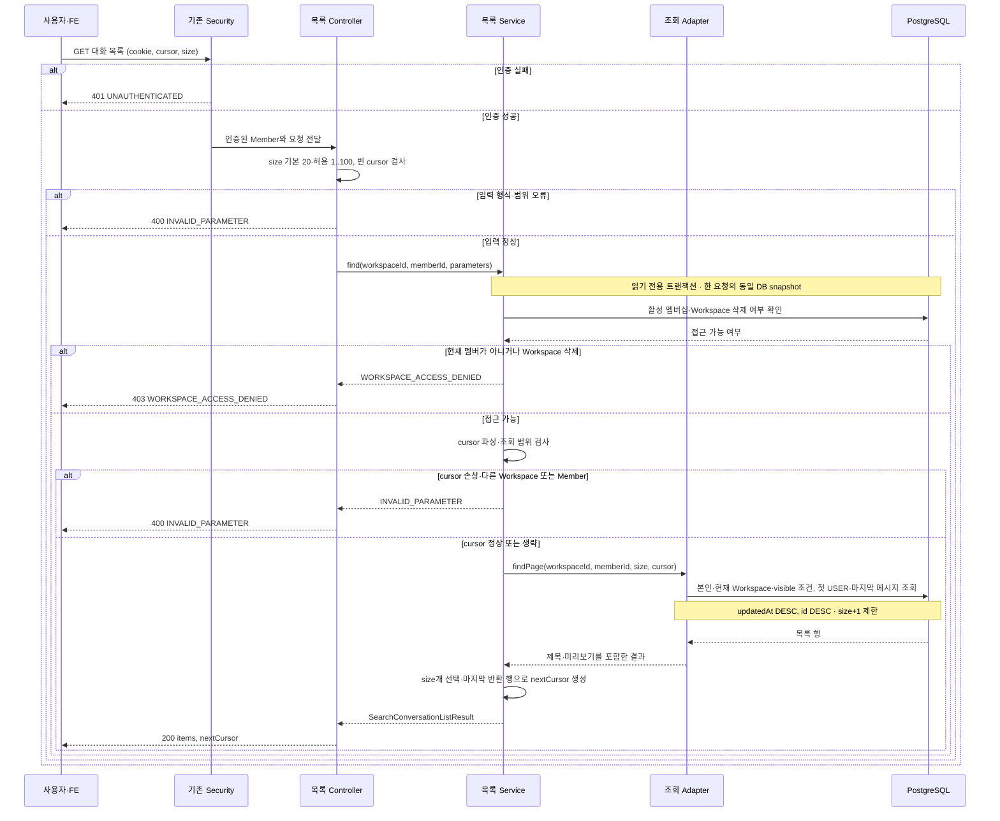
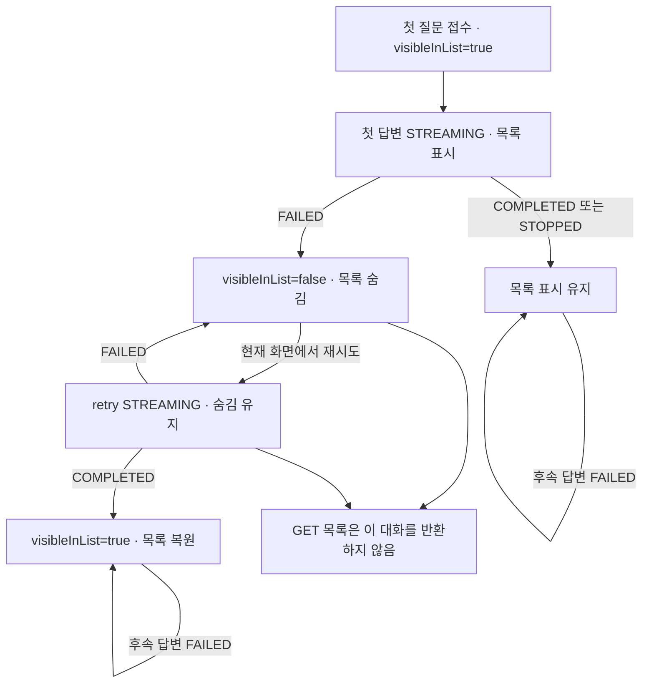

# #564 내 탐색 대화 목록 조회 구현 계획

## 1. 범위와 브랜치

- 상태: #564 GET 구현과 로컬 전체 검증 완료. 실제 #563/#569 생성·재시도 연결은 해당 Issue 범위다. Persona 전역 종료 판정은 별도로 기록한다.
- 확인 날짜: 2026-10-11 KST. 외부 원문 revision은 근거 표의 수집 시점 그대로다.
- 대상: [Issue #564](https://github.com/woowacourse-teams/2026-knot/issues/564), `GET /api/v1/workspaces/{workspaceId}/search/conversations`.
- 현재 브랜치: `be/feature/#564`. 확인한 develop `630f34d42b759c55852868ddd9077cb6ac766e4b`에서 분기했다.
- 공유 기반 적용: #563 저장 모델이 아직 없으므로 이 브랜치에 목록에 필요한 `SearchConversation`·`SearchMessage` 매핑, 첫 답변 숨김 메서드, V37 테이블·제약·인덱스를 포함했다. #563은 이 기반을 재사용하며 첫 질문 원자적 저장과 생성 흐름을 구현한다.
- 완료 범위: 현재 Workspace의 본인 대화만 최근 활동순으로 조회하고, 첫 답변 실패 숨김·커서·인증·오류 계약을 검증한다.
- 선행 기반: [#563](https://github.com/woowacourse-teams/2026-knot/issues/563)의 SearchConversation·SearchMessage와 첫 질문 원자적 저장. 목록 계획에서 #563의 전체 답변 생성 완료를 기다릴 필요는 없지만, 공유 Entity·migration·숨김 전이 계약은 먼저 맞춘다.
- 연결 작업: [#565 메시지](https://github.com/woowacourse-teams/2026-knot/issues/565), [#569 재시도](https://github.com/woowacourse-teams/2026-knot/issues/569). 검색 방식·LLM·SSE 구현은 목록 조회의 의존성이 아니다.

### 근거와 적용 상태

| 자료 | 출처·확인 시점 | 이번 작업에 적용하는 사실 | 판정 |
| --- | --- | --- | --- |
| 현재 사용자 API와 이전 결정 | 이번 요청, #564 본문 `updatedAt=2026-10-10T12:56:13Z` | size 기본 20·최대 100, updatedAt/id DESC, 개인 범위, 제목 파생, 실패 숨김·재시도 성공 복원 | 사용자 채택 계약. 팀 승인·구현 완료와 구분 |
| 목록 API 원문 캐시 | [Notion](https://www.notion.so/3ebb43517522808ab9f9e8c5d7e5fb1b), body/properties revision `2026-09-30T01:25:00Z`, captured `2026-09-30T02:19:13.940Z` | 개인 대화·빈 대화 제외·첫 실패 숨김·정렬 | 과거 참고. 캐시에 Header/Response 표 내용이 빠져 있어 현재 사용자 전문과 Issue로 보완. 이번 실시간 Notion 재조회는 수행하지 않음 |
| 탐색 실패 기획 | [Notion](https://www.notion.so/3edb43517522815f94ecd3c8f692ba7f), body/properties revision `2026-10-10T08:29:00Z`, captured `2026-10-10T09:04:55.537Z`, complete | `visibleInList=false`, 현재 화면에서 retry, 성공하면 목록 복원, 보존 기간 미정 | 캐시 관측. 이미 채택한 사용자 결정과 일치 |
| 탐색 도메인 규칙 | [Notion](https://www.notion.so/3e3b4351752280cd9f06edc2ccdff1d8), body/properties revision `2026-10-10T12:31:00Z`, captured `2026-10-10T13:17:14.862Z`, complete | Workspace·Member 개인 범위, 첫 질문 이후 저장, 목록 패널 고정은 UI 상태 | 캐시 관측. 탐색·공통 목록 관련 절만 적용 |
| Search ERD | [Notion](https://www.notion.so/3e4b4351752280cd86c7dc92aac63fd1), body/properties revision `2026-10-07T10:45:00Z`, captured `2026-10-07T13:07:32.841Z`, complete | 대화 FK와 시각, 대화별 sequence UNIQUE, role/status 제약 | 캐시 관측. ERD에 숨김 컬럼이 없어 아래 추가 설계를 제안 |
| 현재 제품·근거 탐색 규칙 | [현재 V2 기준](../product/current-v2-mvp.md), [정합성 절차](../harness/notion-alignment.md), [Notion 탐색 기준](../../backend/docs/notion-context.md) | 같은 항목은 최신 API와 사용자 결정을 우선. 자료의 미구현·캐시 상태를 구현 완료로 해석하지 않음 | 저장소 기준 |
| 현재 코드 | 아래 기존 코드 표. 로컬 develop과 remote SHA 대조 | Search V2 package·Entity 없음. 문서 목록·현재 멤버십·쿠키 인증·오류 처리 재사용 가능 | 현재 구현 관측. 이번 테스트 실행 없음 |
| migration·열린 PR | 로컬 `backend/src/main/resources/db/migration/`, GitHub develop 및 열린 PR 목록 확인 | develop V36까지 파일 존재. 열린 BE #544/#545/#546/#548은 녹음 영역, 탐색 모델 PR은 목록에서 확인되지 않음 | 파일·PR 목록 관측. 운영 DB Flyway 적용 이력은 미확인 |

프로젝트 profile은 `backend/.persona/project-profile.jsonc`, 컨벤션은 `backend/.persona/development-guideline.md`를 읽었다. Java 25·Spring Boot 4.1·JPA·PostgreSQL·Flyway, 도메인별 계층과 DTO 경계를 따른다. 계획 작성에는 Persona 구현 workflow를 시작하지 않는다.

### 확정 사항과 남은 사항

확정된 size·정렬·숨김 규칙은 다시 인터뷰하지 않는다. 화면 이탈을 서버가 추적하거나 숨김 대화의 ID 직접 접근을 차단하는 별도 계약은 추가하지 않는다. 조회는 숨김·본문·updatedAt을 변경하지 않는다.

표시 문자열의 공백·길이 규칙과 updatedAt의 쓰기 시점은 아직 명세에 충분히 정의되지 않았다. 아래에는 구현 후보와 확정할 시점을 적는다. 숨김 대화의 보존 기간은 목록 조회 구현을 막지 않으며 정리 작업 전에 별도로 정한다.

## 2. 구현할 흐름

사용자가 대화 목록을 열면 현재 로그인 멤버와 Workspace를 기준으로 목록을 읽는다. 서버는 현재 멤버십이 유효한지 확인한다. 조회 결과가 없어도 정상 응답이다.



Controller는 HTTP 입력·응답을, Service는 권한·커서·페이지 조합을, 조회 Adapter는 실제 DB 조회를 담당한다. 그림의 오류는 기존 Security와 예외 처리기를 거쳐 HTTP 응답으로 변환한다. 초과 행이 없거나 빈 목록이면 nextCursor는 null이다.

GET에는 본문·requestId·X-XSRF-TOKEN이 없다. 기존 Security를 유지하고 실제 filter chain을 사용한 테스트로 CSRF 헤더 없이 GET이 성공하는지 확인한다.

### 정렬과 커서 예시

같은 updatedAt의 대화 ID가 `12, 11, 10`이고 size가 2라면 `12, 11`을 반환한다. 커서는 **반환한 마지막 대화 11**을 가리킨다. 확인용 초과 행 10으로 커서를 만들지 않는다.

후속 조회 조건은 다음과 같다.

```sql
updated_at < :cursorUpdatedAt
OR (updated_at = :cursorUpdatedAt AND id < :cursorConversationId)
```

응답은 `items=[...]`, `nextCursor=...`다. 빈 목록은 `items=[]`, `nextCursor=null`. 결과가 정확히 size개이고 더 없다면 nextCursor도 null이다. size를 바꿔도 같은 범위의 cursor를 이어 사용할 수 있게 제안한다.

### 최초 실패 대화의 노출

| 생성 흐름에서 확정한 상태 | 목록 노출 | 저장 책임 |
| --- | --- | --- |
| 첫 질문 접수·첫 ASSISTANT STREAMING | 노출 | #563에서 visibleInList=true로 원자적 생성 |
| 첫 ASSISTANT FAILED | 숨김 | #563 실패 종료 트랜잭션에서 false로 변경 |
| 숨김 대화의 첫 답변 retry STREAMING | 계속 숨김 | #569에서 false 유지 |
| retry COMPLETED | 다시 노출 | #569 완료 트랜잭션에서 true로 변경 |
| retry FAILED 또는 STOPPED | 계속 숨김이라는 제안 | 성공 때 복원한다는 기준에 맞춘 후보. #569/#568 쓰기 계약에서 확인 |
| 최초 시도 STOPPED 또는 COMPLETED | 노출 | 최초 FAILED 숨김 규칙에 해당하지 않음 |
| 이미 정상 대화의 후속 답변 FAILED | 계속 노출 | 첫 답변 실패 규칙을 모든 실패에 확대하지 않음 |

단순히 첫 답변의 현재 status가 FAILED인지만 검사하면 retry가 STREAMING으로 바뀐 순간 다시 보인다. 따라서 실패에 따른 숨김을 저장해야 한다. 이 조회는 저장된 `visibleInList`를 읽는다. 부분 본문이 있다는 이유로 FAILED를 노출하지 않는다.



노출 상태를 바꾸는 주체는 #563·#569의 생성/재시도 흐름이다. #564의 GET은 값을 읽기만 한다. 숨긴 대화의 retry가 STOPPED로 끝나는 경우는 계속 숨김을 제안한 상태이므로, 확정된 전이처럼 그림에 넣지 않았다. 서버가 화면 이탈을 감지하는 새 API도 추가하지 않는다.

## 3. 나올 코드와 메서드 초안

### 실제 기존 코드

아래 경로의 기준은 `backend/src/main/java/com/knot/backend/`다.

| 위치·클래스 | 현재 책임 | 이번 작업에서 참고·재사용할 부분 |
| --- | --- | --- |
| `auth/infrastructure/jwt/JwtAuthenticationFilter`·`auth/domain/AuthenticatedMember` | access cookie 인증, 서버가 확인한 Member 식별자 제공 | Controller에서 getMemberId() 사용. 클라이언트가 Member ID를 지정하지 않음 |
| `global/config/SecurityConfig`·`auth/presentation/handler/AuthAuthenticationEntryPoint` | 인증 필요 경로·CSRF·401 JSON | 목록 경로에 기존 보호 적용. 별도 인증 구현 없음 |
| `workspace/domain/WorkspaceMemberRepository` | existsByWorkspaceIdAndMemberId(...) 계약 | 현재 멤버십 검사에 재사용 |
| `workspace/infrastructure/WorkspaceMemberJpaRepository` | 활성 멤버와 삭제되지 않은 Workspace만 매칭 | 탈퇴·삭제 Workspace 접근을 함께 차단 |
| `document/presentation/DocumentApi`·`DocumentController` | Swagger 계약·HTTP 입력·Service/Response 변환 | 같은 구조로 Search HTTP 경계 작성 |
| `document/application/DocumentListService` | 권한·커서·size+1·응답 페이지 조합, REPEATABLE_READ 조회 | 유스케이스 구조 참고. 문서 목록 기본값 50은 탐색에 복사하지 않음 |
| `document/application/dto/query/DocumentListParameters`·`document/domain/DocumentCursor` | 기본값·검증, 버전/조회 범위 포함 Base64 URL 커서 | 탐색용 독립 타입으로 같은 규칙 단위 메서드 사용 |
| `document/infrastructure/DocumentListJpaRepository`·`DocumentListQueryAdapter` | DTO projection 기반 제한 조회 | Entity 전체 로딩·대화마다 추가 조회를 피하는 패턴 참고 |
| `global/exception/GlobalExceptionHandler` | ProjectException JSON 변환, query 타입 오류는 INVALID_PARAMETER | 불필요한 전역 예외 처리 변경 없이 재사용 |

### 신규 코드와 구현 책임

아래 목록 타입은 이 브랜치에 구현했다. 공유 Entity는 선행 구현이 없어 최소 매핑·숨김 규칙만 함께 마련했다. #563의 질문 저장·상태 변경 흐름은 이 모델을 재사용한다.

| 위치·클래스 | 책임 | 중요한 메서드 |
| --- | --- | --- |
| `search/presentation/SearchConversationApi` | GET·query·응답·401/403/400 Swagger 계약 | findConversations(workspaceId, cursor, size, authenticatedMember) |
| `search/presentation/SearchConversationController` | 인증 Member ID 추출, parameters 생성, Service 호출, 응답 변환 | findConversations(...) → SearchConversationListResponse |
| `search/application/dto/query/SearchConversationListParameters` | size 기본 20·1..100, 빈 cursor 거절 | of(cursor, Integer size), private resolvePageSize/validateSize/validateCursor |
| `search/domain/SearchConversationCursor` | 탐색 목록의 정렬 위치와 조회 범위 | of(workspaceId, memberId, updatedAt, conversationId), encode(), parse(encoded, workspaceId, memberId) |
| `search/application/SearchConversationListService` | 현재 멤버십, 커서 파싱, 페이지·다음 커서 결정 | find(workspaceId, memberId, parameters) → SearchConversationListResult |
| `search/application/SearchConversationListQuery` | 목록 조회 의도의 계약. 기존 DocumentListQuery 방식 사용 | findPage(workspaceId, memberId, size, cursor) → List<SearchConversationListItemResult> |
| `search/infrastructure/SearchConversationListQueryAdapter`·`SearchConversationListJpaRepository` | 제한 조회·projection을 결과 DTO로 변환 | findPage(...), 저장소 findPage(..., Pageable) |
| `search/infrastructure/SearchConversationListRow` | SQL/JPQL projection. Entity 그래프가 아닌 목록 필드 전달 | id, firstQuestion, lastMessage, createdAt, updatedAt |
| `search/application/dto/result/SearchConversationListItemResult`·`SearchConversationListResult` | title·preview를 포함한 목록과 nextCursor | 변환은 Adapter에서 수행. 별도 범용 Mapper는 만들지 않음 |
| `search/presentation/dto/response/SearchConversationListItemResponse`·`SearchConversationListResponse` | 정확한 JSON 필드·nullable·ISO 시각 제공 | from(result) |
| `search/domain/SearchErrorCode`·`SearchException` | 탐색 입력 오류 | INVALID_PARAMETER. #563에 존재하면 같은 타입을 확장 |

Service의 `find`는 권한을 확인하고 읽기만 한다. `@Transactional(readOnly=true, isolation=REPEATABLE_READ)`를 적용했다. 권한 검사와 데이터 조회가 한 요청의 같은 DB 시점에 맞도록 기존 문서 목록 방식과 통일했다. 별도 PostgreSQL 쓰기 트랜잭션으로 snapshot을 확인했으며 Mockito 결과와 구분한다.

### 조회 구현 후보

한 목록 조회 SQL/JPQL에서 대화마다 첫 USER와 마지막 메시지를 각각 하나만 연결하는 projection을 우선한다. 첫 USER는 `sequence=1 AND role=USER`, 마지막 메시지는 해당 대화의 `max(sequence)`로 선택한다. 같은 대화의 여러 메시지가 join되어 페이지 행을 늘리지 않게 한다.

- WHERE에 `workspaceId`, 인증에서 얻은 `memberId`, `visibleInList=true`를 모두 넣는다.
- 첫 USER는 INNER JOIN으로 읽어 비정상적인 빈 대화가 목록에 나타나지 않게 한다.
- 마지막 메시지는 LEFT JOIN으로 읽어 응답 nullable 구조를 보존한다. 정상 저장된 대화에는 메시지가 있으므로 null은 통상 발생하지 않는다.
- List 반환과 Pageable의 size+1 제한을 사용한다. 총 개수를 세는 count 쿼리는 필요 없다.
- Query Adapter가 문자열을 표시 값으로 변환한다. PostgreSQL에서 본문 제한 추출이 필요하면 같은 projection 안에서 수행한다.
- JPQL의 max(sequence) 연관 subquery와 projection은 PostgreSQL 통합 테스트로 확인한다. 필요하면 같은 Adapter 내부의 native SQL로 바꾼다. 새 조회 엔진·라이브러리를 도입하지 않는다.

멤버십 확인 1회와 목록 조회 1회의 고정된 조회를 목표로 한다. N개의 대화마다 제목·미리보기를 추가 조회하는 N+1 방식은 사용하지 않는다. 단일 projection의 실행 계획이 나쁘다면 제한된 페이지와 메시지를 일괄 조회하는 대안을 검토하되, 쿼리 수와 응답 스냅샷을 다시 검증한다.

### 표시 문자열 후보

title은 첫 USER content에서 만들고 별도 제목 컬럼을 만들지 않는다. preview는 sequence가 가장 큰 메시지의 content에서 만든다. 마지막 메시지가 빈 STREAMING 답변이면 `""`를 반환하고 이전 질문을 대신 마지막 메시지처럼 보여주지 않는다.

사용자가 title 최대 80·preview 최대 120으로 진행하도록 확정했다. 공백을 한 칸으로 정리하고 Unicode code point 기준으로 자른다. 별도 자름 표시를 붙이지 않으며 원본 content는 바꾸지 않는다. 이모지 surrogate pair를 나누지 않는 동작을 단위 테스트로 확인했다.

## 4. 저장 기반과 트랜잭션

### 공유 모델과 migration

| 테이블 후보 | 목록에 필요한 값·제약 | 작업 소유 범위 |
| --- | --- | --- |
| `search_conversations` | identity id, workspace/member FK RESTRICT, created_at/updated_at TIMESTAMPTZ NOT NULL, visible_in_list BOOLEAN NOT NULL | V37과 Entity 매핑 구현. visible_in_list는 숨김 제품 규칙을 저장하는 추가 컬럼 |
| `search_messages` | conversation FK RESTRICT, role/sequence/content/status, UNIQUE(conversation_id, sequence), sequence>0, role/status CHECK | V37 공유 읽기 모델. 빈 STREAMING content 허용. 쓰기 동작은 #563에서 추가 |
| 목록 조회 인덱스 | `(workspace_id, member_id, updated_at DESC, id DESC) WHERE visible_in_list=true` | V37에 포함. sequence UNIQUE 인덱스로 첫/마지막 메시지를 읽음 |

기존 Search V2 테이블과 공유 Entity가 없으므로 목록에 필요한 기반을 V37에 한 번만 생성했다. #563은 동일 모델을 확장하며 테이블을 중복 생성하지 않는다. 빈 대화를 저장하지 않는 규칙과 USER/ASSISTANT 교대 저장은 향후 #563의 원자적 접수 트랜잭션 책임이다. 이 GET은 first USER가 없는 행을 제외한다.

구현 착수 시 develop의 V36까지와 관련 열린 PR을 다시 확인해 V37을 할당했다. 실제 운영 DB의 적용 상태를 확인하거나 운영 migration을 실행한 것은 아니다. V13의 구형 search와 V14 제거 구조를 V2 기반으로 재사용하지 않았다.

### 읽기와 쓰기의 경계

- visible_in_list는 답변 실패·재시도 완료를 확정하는 **쓰기 트랜잭션**에서 함께 갱신한다. 조회가 답변 상태를 보며 숨김을 수정하지 않는다.
- 첫 접수는 대화와 질문·답변을 원자적으로 저장한다. FK만으로는 대화에 메시지가 최소 하나 존재한다는 규칙을 보장하지 못하므로 #563 트랜잭션 검증이 필요하다.
- sequence UNIQUE로 첫/마지막 메시지를 한 개씩 선택할 수 있다. createdAt 동률에 의존하지 않는다.
- updatedAt은 생성 흐름이 갱신한다. 질문 접수·본문 저장·종료 중 어떤 시점을 활동으로 볼지 #563/#566에서 통일한다. 목록에서 갱신하지 않으며 매 delta마다 대화 행 갱신을 강제하지 않는다.
- 커서에는 DB에서 읽은 updatedAt을 그대로 넣는다. JVM에서 재생성한 시각이나 밀리초로 줄인 값은 쓰지 않는다. PostgreSQL 마이크로초 정밀도를 보존한다.

### 커서와 동시 변경

커서는 `탐색 목록 version + workspaceId + memberId + updatedAt + conversationId`를 Base64 URL 방식으로 표현하는 후보다. blank·너무 긴 값·잘못된 인코딩·버전·필드 수·ID·시각·다른 조회 범위는 INVALID_PARAMETER로 거절한다. 길이 상한은 기존 cursor의 512자를 참고해 적용하는 기술 제안이다.

커서는 인증 수단이 아니며 인코딩도 암호화가 아니다. 항상 인증 Member ID와 path Workspace를 실제 DB 조회 조건으로 사용한다. 같은 형식의 정렬값을 바꾼 커서라도 권한 범위를 넓혀서는 안 된다.

목록은 최신 활동순이며 페이지 간 고정 snapshot을 약속하지 않는다. 첫 페이지 이후 과거 대화가 활동해서 앞쪽으로 이동하면, 다음 페이지에서는 그 대화가 빠질 수 있다. 최초 페이지를 다시 읽으면 최신 순서를 받는다. 동일 정렬값의 안정적인 연속 조회는 검증하되, mutable updatedAt에 대해 모든 페이지의 누락 없는 전체 snapshot을 완료 조건으로 넣지 않는다. 그런 제품 요구가 생기면 별도 버전/이력 저장 계약이 필요하다.

한 요청의 REPEATABLE_READ는 여러 HTTP 요청의 snapshot을 고정하지 않는다. 권한도 그 요청의 DB snapshot 기준이다. 이전 요청의 cursor가 있어도 다음 요청 시작 전에 탈퇴가 확정되면 403이다.

### 남은 확인 사항

| 항목 | 현재 상태 | 처리 시점 |
| --- | --- | --- |
| title/preview 길이·개행·자름 표시 | 사용자 확정: 공백 한 칸, 80/120 code point, 별도 자름 표시 없음 | 구현·단위 검증 완료 |
| updatedAt 쓰기 시점 | 최근 메시지 활동 의미만 계약에 있음 | #563/#566 쓰기 흐름 설계 전 |
| 숨김 retry가 STOPPED로 끝날 때 | 성공 때만 복원한다는 기준에서 계속 숨김을 제안 | #568/#569 상태 전이 구현 전 |
| 숨김·정상 대화 보존 기간 | 미정. 조회에는 보존 중 숨김 필터만 적용 | 실제 정리 작업 구현 전 |
| Flyway 실제 적용 이력·신규 번호 | 운영 DB 미관측, 파일 V36까지만 확인 | migration 작성·배포 전 |

## 5. TDD와 검증 순서

아래는 실행할 계획이다. 이번 계획 작성에서 제품 테스트를 실행하거나 통과했다고 주장하지 않는다.

1. **공유 저장 계약 정렬:** #563의 SearchConversation/Message·visibleInList 전이 테스트를 먼저 작성하고 최소 모델·migration을 구현한다. #564에서 동일 Entity를 따로 만들지 않는다. 최초 FAILED→retry STREAMING에서도 false가 유지되는 동작을 저장 기반 완료 조건에 넣는다.
2. **입력 기본값과 오류:** `SearchConversationListParametersTest`에서 size 생략/1/20/100 성공, 0/101/음수·빈 cursor 실패부터 작성한다. `of`와 의미별 검증 메서드만 구현한다.
3. **커서 한 동작:** `SearchConversationCursorTest`에서 encode/parse 왕복·마이크로초·동률 ID·size 변경 성공을 작성한다. 손상/다른 Member·Workspace/버전/잘못된 시각·ID 실패를 추가하고 탐색용 cursor를 구현한다.
4. **권한과 페이지 조합:** Mockito `SearchConversationListServiceTest`에서 빈 결과·size+1·정확히 size·마지막 반환 행의 커서 성공을 작성한다. 멤버십 거절 시 query가 호출되지 않는 실패를 확인하고 Service를 구현한다.
5. **실제 DB 조회:** PostgreSQL `SearchConversationListQueryIntegrationTest`에서 개인 범위·visible·sequence 기준 제목/마지막 메시지·updatedAt/id 정렬·size+1을 먼저 검증한다. projection 조회와 인덱스를 구현한다. 필터 전에 LIMIT하지 않는다.
6. **표시 문자열과 HTTP 경계:** 길이/공백 규칙을 맞춘 후 변환의 정상·빈 본문·한글/emoji 경계를 검증한다. 실제 Security·PostgreSQL을 사용하는 `SearchConversationListAcceptanceTest`에서 path/query 바인딩·JSON 필드·ISO 시각·null·형식 오류를 함께 검증하고 Controller/Api/Response를 구현한다. 별도 MVC slice를 중복 작성하지 않았다.
7. **인증과 상태 전이 연결:** 실제 Security·PostgreSQL의 `SearchConversationListAcceptanceTest`에서 access cookie 200·미인증 401·비멤버/탈퇴/삭제 Workspace 403을 확인한다. 저장된 최초 상태 전이 후 같은 GET의 목록이 노출→숨김→숨김→복원되는지 검증한다.
8. **읽기 일관성과 완료 검증:** 동시 변경으로 같은 응답이 서로 다른 시점의 제목·미리보기·updatedAt을 섞지 않는지 PostgreSQL transaction으로 확인한다. 조회 후 상태/updatedAt/저장 건수가 그대로인지 확인하고, 집중 검증 뒤 저장소 필수 check를 실행한다.

### 테스트 매트릭스

경로의 기준은 `backend/src/test/java/com/knot/backend/`다. 모두 신규 테스트 후보다.

| 위치·방식 | 검증할 성공·실패·경계 | 기대 결과 |
| --- | --- | --- |
| `search/application/dto/query/SearchConversationListParametersTest`, JUnit | 기본20/최대100, 0/음수/101, blank cursor | 정상 기본값 또는 INVALID_PARAMETER |
| `search/domain/SearchConversationCursorTest`, JUnit | encode/parse, 시각 정밀도, scope 불일치, 손상/초과 길이/version/필드 오류 | 같은 조회 범위만 파싱 성공. 임의 예외가 500으로 새지 않음 |
| `search/application/SearchConversationListServiceTest`, Mockito | 허용/거절, 빈 목록, size와 size+1, 초과 행 커서 오류 방지 | 최대 size, null 또는 마지막 반환 행 cursor. 거절 시 query 호출 없음 |
| `search/infrastructure/SearchConversationListQueryIntegrationTest`, PostgreSQL/Testcontainers/Flyway | A Member×X Workspace에 B Member·Y Workspace·숨김·빈 대화를 섞음 | 해당 개인의 보이는 대화만 반환. 다른 범위 행이 LIMIT을 소모하지 않음 |
| 같은 DB 테스트 | 같은 updatedAt 다수, 마이크로초 차이, 첫 USER와 최신 sequence, 마지막 빈 STREAMING 본문 | updatedAt/id DESC·정확한 파생 값. 빈 content는 빈 preview |
| 같은 DB 테스트 | 1/20/100 페이지, 데이터 없는 다음 페이지, row 수/조회 수 | size+1 이하 제한, join 중복 없음, 대화 수에 비례한 추가 SELECT 없음 |
| `search/presentation/SearchConversationListAcceptanceTest`, 실제 Security+PostgreSQL | size=abc/overflow·빈/손상 cursor, 응답 필드·nullable·OpenAPI | 400 INVALID_PARAMETER와 정상 JSON 계약. 별도 MVC slice는 중복하지 않음 |
| `search/presentation/SearchConversationListAcceptanceTest`, 실제 Security+PostgreSQL | 정상 access cookie·CSRF 헤더 없는 GET, cookie 없음/만료, 비멤버/탈퇴/삭제 Workspace | 200/401 UNAUTHENTICATED/403 WORKSPACE_ACCESS_DENIED |
| 같은 인수 테스트 | 다른 Member·Workspace cursor, size 경계와 마지막 페이지 | 400 또는 정상 다음 페이지·nextCursor=null |
| 같은 인수/저장 전이 테스트 | 첫 STREAMING→FAILED→retry STREAMING→COMPLETED; 후속 FAILED | 노출→숨김→숨김→복원; 이미 정상 대화는 유지 |
| `search/application/SearchConversationListSnapshotIntegrationTest`, 실제 thread/transaction | 요청 사이 탈퇴, 읽는 중 메시지·정렬값 변경 | 다음 요청 403, 한 응답은 동일 DB snapshot. 페이지 간 전체 고정은 보장하지 않음 |
| 조회 전후 DB 비교 | 대화/메시지/숨김/시각·녹음 상태 읽기 | 조회로 데이터 변경 없음. LLM·검색·녹음 제어 adapter 호출 없음 |

기존 `DocumentListQueryIntegrationTest`, `DocumentListAcceptanceTest`, `DocumentListSnapshotIntegrationTest`와 테스트 지원 Testcontainers 설정을 참고한다. Mockito는 DB 제약·isolation·migration을 증명하지 않는다. DB fixture 전이만으로 실제 생성 worker/retry 전체 연결까지 구현 완료라고 표현하지 않는다. #563/#569와 연결한 검증은 해당 쓰기 구현이 준비된 뒤 수행한다.

### 확인한 검증 명령

`backend/build.gradle`에서 test는 integration/acceptance 태그를 제외하고, integrationTest·acceptanceTest가 별도 존재하며 check가 둘 모두를 요구하는 것을 확인했다.

```sh
./gradlew test --tests 'com.knot.backend.search.*'
./gradlew integrationTest --tests 'com.knot.backend.search.*'
./gradlew acceptanceTest --tests 'com.knot.backend.search.*'
./gradlew spotlessCheck check
```

커밋 요청이 오면 parameters 검증, cursor, Service 페이지 조합, DB 조회/인덱스, HTTP 계약, 인수 검증을 각각 검토 가능한 단위로 나눈다. 각 동작은 실패 테스트→최소 구현으로 진행한다. schema concern은 따로 유지하고 단순 분리만을 위한 refactor는 넣지 않는다. 여기서 commit·push·PR·Issue 수정은 수행하지 않는다.

## 6. 완료 기준과 다음 작업

- 실제 GET에서 쿠키 인증과 현재 멤버십을 적용하고 개인 대화만 반환한다.
- size 20 기본/1..100, updatedAt DESC/id DESC, scope가 맞는 opaque cursor, 마지막 페이지 null이 HTTP·PostgreSQL에서 확인된다.
- first USER 파생 title과 마지막 sequence preview가 맞고 별도 title 컬럼·대화별 반복 조회가 없다.
- 첫 실패와 retry 중 숨김·성공 후 복원·후속 실패 유지가 공유 저장 전이와 연결되어 확인된다.
- 조회로 대화·메시지·녹음 상태가 바뀌지 않는다.
- 신규 schema/인덱스가 실제 Flyway·JPA mapping과 맞고 필요한 단위·DB·인수·포맷/필수 check가 통과한다.
- fixture 목록 조회 완료와 실제 #563/#569 생성·재시도 연결 완료를 구분해 보고한다.

### 실제 구현과 검증 기록

- 입력·커서 테스트를 먼저 작성한 뒤 미구현 타입으로 compileTestJava 실패를 확인했다. 최소 구현 후 Service·표시 문자열·숨김 상태까지 단위 테스트 47개가 통과했다.
- 저장 통합 테스트 10개가 테이블 부재로 실패한 뒤 V37을 추가했다. 실제 PostgreSQL/Flyway·JPA 매핑, sequence UNIQUE·양수, role/status CHECK·FK RESTRICT가 통과했다.
- 조회 테스트를 먼저 작성하고 QueryAdapter 미구현 컴파일 실패를 확인했다. projection 구현 후 개인 범위·숨김/빈 대화 제외·정렬·마이크로초 커서·첫 질문/최신 메시지·SQL 1회 검증 6개가 통과했다.
- HTTP 테스트를 먼저 실행해 경로 부재로 실패를 확인했다. Controller/Api/Response 추가 후 인증·오류·페이지 크기 변경·공개 OpenAPI를 포함한 인수 테스트 19개가 통과했다.
- 별도 쓰기 트랜잭션으로 메시지와 updatedAt을 변경·커밋한 후에도 현재 GET은 멤버십 조회 시점의 DB snapshot으로 읽는 통합 테스트 1개가 통과했다.
- 첫 실패 숨김·retry 중 숨김·성공 복원은 Entity와 저장 fixture로 확인했다. 실제 #563/#569의 생성·재시도 API가 이 메서드를 호출하는 연결은 해당 Issue 구현 범위다. 현재 목록 조회가 생성 작업을 실행하거나 숨김을 수정하지 않는다.
- 전체 `./gradlew spotlessCheck check bootJar --console=plain`은 1분 57초에 BUILD SUCCESSFUL. XML 기준 단위 952·통합 414·인수 417, 총 1,783개이며 failures/errors/skipped 모두 0. 신규 탐색 테스트는 단위 47·통합 17·인수 19, 총 83개다.
- 첫 전체 실행에서는 기본 512MiB 테스트 JVM에서 컨텍스트 누적에 따른 OutOfMemoryError가 발생했다. 실패 후 종료 정리가 멈춘 해당 테스트 프로세스만 중단했다. `build.gradle` Test 작업에 `spring.test.context.cache.maxSize=8`을 적용하고 동일 전체 명령을 다시 실행해 통과했다. 설정 근거는 [Spring 공식 context cache 문서](https://docs.spring.io/spring-framework/reference/testing/testcontext-framework/ctx-management/caching.html)다. 테스트 삭제·skip·assertion 완화는 없다.
- 운영 DB migration·실제 배포·FE 화면·LLM 생성 품질은 이번 로컬 검증 대상이 아니다. HTTP 관측은 실제 애플리케이션·Security 필터·PostgreSQL을 사용하는 MockMvc 인수 테스트다.
- Persona 구현/검토 보고서에 이번 근거와 결과를 기록했다. review report filled는 성공했고 implementation report filled는 기존 전역 보고서의 필수 항목이 불완전하다는 판정으로 거절됐다. `npx ph workflow finish implement`는 exit 1: report-coverage-missing, java-role-read-coverage-missing(unsafe evidence traversal), convention-toolchain-missing(ast-grep), workflow-loop-state-stale, pending-ticket(과거 step-1). 현재 GET과 전체 Gradle 검증 완료를 전역 하네스 종료 인증과 구분한다. 관련 없는 과거 기록을 삭제하거나 규칙을 완화하지 않았다.

다음 연결 작업은 #565 메시지 조회와 FE 목록 연결이다. 목록의 hover/고정은 UI 상태이며 이번에 서버 저장 기능을 추가하지 않는다. 검색 방식 실험은 목록 조회 개발과 독립적으로 진행한다.
