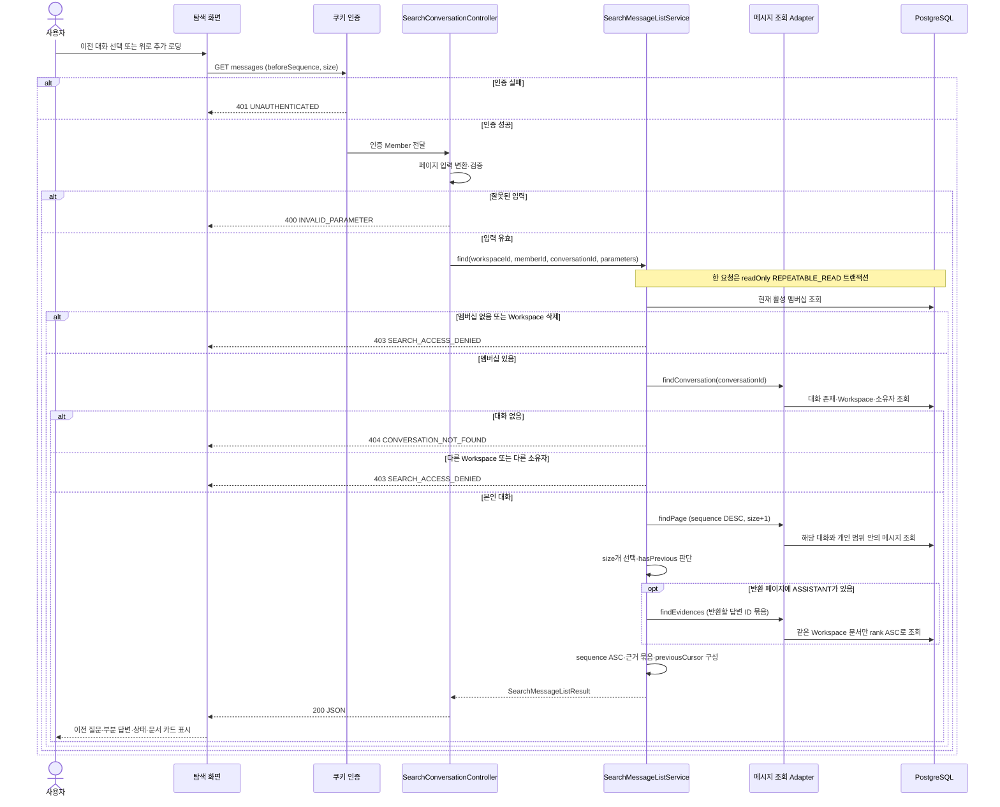

# #565 탐색 대화 메시지 조회 구현 계획

## 1. 범위와 브랜치

- 상태: #565 로컬 구현과 Gradle 검증 완료. 아래 설계 초안과 근거 조사 기록을 유지하며 실제 구현 결과는 마지막 절에 기록했다. 부모 migration 충돌 해소와 운영 배포는 아직 수행하지 않았다.
- 확인 날짜: 2026-10-11 KST.
- 대상: [Issue #565](https://github.com/woowacourse-teams/2026-knot/issues/565), `GET /api/v1/workspaces/{workspaceId}/search/conversations/{conversationId}/messages`.
- 구현 브랜치: `be/feature/#565`. 분기한 부모 `be/feature/#564`의 HEAD는 `1f2744f9299e90289b4a1323af16baf2133214d8`. 테스트·구현은 메서드·저장 제약 단위의 커밋으로 분리한다.
- 원격 develop 관측: `630f34d42b759c55852868ddd9077cb6ac766e4b`. [PR #572](https://github.com/woowacourse-teams/2026-knot/pull/572)는 OPEN·REVIEW_REQUIRED·미병합 상태다. 현재 브랜치의 Search 모델을 develop에 병합된 구현으로 취급하지 않는다.
- 완료 범위: 본인 대화의 최신·과거 메시지와 저장된 문서 근거 조회, 권한·페이지네이션·오류·읽기 일관성 검증, OpenAPI 및 API 계약 문서 반영.
- 선행 기반: #564/PR #572의 SearchConversation·SearchMessage·role/status와 테이블. SearchEvidence 읽기 모델과 제약은 이번 작업에서 추가하며 #563 생성 구현이 재사용한다.
- 후속 연결: #563 첫 질문 저장·생성, #567 SSE 재연결. 이 GET은 검색 전략 결정·LLM 생성·SSE 구독·중지·재시도를 실행하지 않는다.

### 브랜치와 PR 순서

저장소의 기존 BE 이슈 브랜치 관례를 따라 **`be/feature/#565`**를 사용한다. 사용자 구현 요청 후 미병합 #564 기반으로 분기했다.

| 구현 시작 시점 | 분기 기준 | #565 PR 대상 | 이후 처리 |
| --- | --- | --- | --- |
| #572 미병합 | 최신 `be/feature/#564`의 확인한 HEAD | `be/feature/#564` | #572 리뷰 반영은 #564 브랜치에서 처리하고 #565에 반영한다. #572 병합 후 #565에서 이미 develop에 들어간 부모 변경을 제외하고 재정렬한 뒤 PR base를 develop으로 변경한다 |
| #572 병합 완료 | 갱신한 `origin/develop` | `develop` | #564 모델이 실제로 포함됐는지 확인하고 분기한다 |

미병합 상태에서 시작하는 경우의 명령 후보는 `git switch -c 'be/feature/#565' 'be/feature/#564'`다. 실행 전에 #564 HEAD와 원격 상태, 사용자 변경을 확인한다. #564 기반 PR을 먼저 두면 목록 API 변경이 메시지 API 리뷰에 함께 나타나지 않는다.

부모 PR이 squash merge됐다면 기존 부모 커밋을 그대로 전체 rebase하지 않는다. #565가 분기한 부모 경계와 실제 병합 commit을 확인해 **#565 고유 커밋만** 새 develop 위로 옮긴다. 정확한 rebase 기준 SHA는 그 시점에 정한다. 이미 게시한 브랜치의 재작성·push는 당시 승인된 범위와 공유 상태를 확인한다. #565의 병합·배포는 #572 공유 기반 뒤에 진행한다.

### 근거와 적용 상태

아래 Notion 자료는 지정된 로컬 원문 캐시에서 관련 본문과 필요한 DB 속성을 읽었다. 이번 실시간 Notion fetch·Figma 화면 검증은 수행하지 않았다. 캐시 수정 시각을 현재 원문 확인 시각으로 표현하지 않는다.

| 자료 | 출처·관측 revision | 적용하는 사실 | 판정 |
| --- | --- | --- | --- |
| 현재 사용자 결정·Issue #565 | [Issue](https://github.com/woowacourse-teams/2026-knot/issues/565), updatedAt `2026-10-10T12:56:15Z` | 기본 30·최대 100, beforeSequence, sequence ASC 응답, 변환 가능한 문자열 previousCursor, 401/403/404 구분, USER 빈 근거 | 사용자 채택 작업 계약. 팀 승인·구현 완료와 구분 |
| 메시지 API | [Notion](https://www.notion.so/3ebb435175228009b53bef6680719a88), body/properties `2026-10-05T06:12:00Z`, captured `2026-10-07T13:07:32.841Z`, complete | GET 경로·응답 전체 필드, 부분 본문과 상태, 문서 근거 3개, 제외 수 이력 필드 없음 | 캐시 관측. DB 속성 method=GET·구현=NO·도메인=검색. 제안값은 현재 사용자 결정·Issue로 보완 |
| 탐색 도메인 규칙 | [Notion](https://www.notion.so/3e3b4351752280cd9f06edc2ccdff1d8), body/properties `2026-10-10T12:31:00Z`, captured `2026-10-10T13:17:14.862Z`, complete | Workspace·Member 개인 범위, 부분 답변 보존, 실제 사용 Document만 근거 | 탐색 관련 절의 캐시 관측 |
| Search ERD·컬럼 | [ERD](https://www.notion.so/3e4b4351752280cd86c7dc92aac63fd1), body/properties `2026-10-07T10:45:00Z`; [컬럼](https://www.notion.so/3e4b43517522809b9f19f2526fc879bf), `2026-10-07T11:14:00Z`; 둘 다 captured `2026-10-07T13:07:32.841Z`, complete | 메시지 순서·role/status 제약, 근거 복합 PK/FK·rank 1..3·순위 UNIQUE, 역할/Workspace 검사는 서비스 책임 | 캐시 관측. Search 절만 적용 |
| 질문·답변 / 실패 기획 | [질문·답변](https://www.notion.so/3edb4351752281b2b973f1190485efd4), body/properties `2026-10-10T08:30:00Z`; [실패](https://www.notion.so/3edb43517522815f94ecd3c8f692ba7f), `2026-10-10T08:29:00Z`; 둘 다 captured `2026-10-10T09:04:55.537Z`, complete | 연결 종료와 생성 분리, 첫 실패 목록 숨김, 기존 화면 재시도, 제외 수 이력 복원 미정 | 캐시 관측. 이미 채택한 결정 우선 |
| 기록 패널·탐색 지도 | [기록 패널](https://www.notion.so/3edb4351752281eca2c7deaf30666cea), body/properties `2026-10-10T08:30:00Z`; [지도](https://www.notion.so/3ddb4351752281229c7fca3d4fb798d8), `2026-10-10T08:54:00Z`; captured `2026-10-10T09:04:55.537Z` | 카드 날짜·sourceType, STOPPED 패널 표시 정책 미정 | 텍스트 관측. 지도는 attachment_or_unsupported_block이 있어 이미지 검증 근거로 사용하지 않음 |
| 엔티티 후보 페이지 | [SearchConversation](https://www.notion.so/029b4351752282cfab6281f1a5a12cd0), [SearchMessage](https://www.notion.so/7c8b4351752283c1949b011b092371bd), [SearchEvidence](https://www.notion.so/872b43517522831aa4ba0158173dae87), body/properties `2026-09-23T03:08:00Z`, captured `2026-09-30T02:19:19Z` 부근, complete | 대화·메시지는 핵심 도메인 후보, Evidence는 연결 데이터 후보 | 과거 후보 속성. 최신 계약과 실제 코드로 대조하며 Migration 없음 표시를 현재 사실로 사용하지 않음 |
| 저장소 기준 | [현재 V2](../product/current-v2-mvp.md), [정합성](../harness/notion-alignment.md), [근거 탐색](../../backend/docs/notion-context.md), `.persona/project-profile.jsonc`·`.persona/development-guideline.md` | 최신 API·사용자 결정 우선, Java 25/Spring Boot 4.1/JPA/PostgreSQL/Flyway, 도메인별 계층·DTO | 저장소 기준. 계획만 작성하므로 Persona 구현 workflow 미시작 |
| 현재 코드·PR | 아래 기존 코드 표, [#572](https://github.com/woowacourse-teams/2026-knot/pull/572), [#573](https://github.com/woowacourse-teams/2026-knot/pull/573), 현재 develop 및 열린 BE PR 파일 목록 | #572 모델은 미병합. FE #573은 첫·후속 질문 SSE/mock 작업이며 메시지 GET 연동 완료 근거가 아님 | 코드·GitHub 관측. 운영 DB 적용 이력 미확인 |

### 적용할 계약과 남은 결정

이번 API의 제품 계약은 이미 이슈에 정리돼 있다. size·커서·첫 실패 숨김을 다시 결정하지 않는다. 첫 실패 대화의 ID 직접 읽기는 현재 멤버십·소유권을 검사하며 `visible_in_list`로 차단하지 않는다. 화면 이탈 감지나 새 접근 제한을 추가하지 않는다.

근거는 저장된 연결을 읽는다. STOPPED·FAILED라는 이유로 저장된 근거를 조회 시 삭제하거나 숨기는 상태 필터를 새로 넣지 않는다. 어떤 생성 시점에 근거를 저장·제거할지와 패널을 자동으로 열지는 후속 쓰기·FE 계약에서 정한다. 이는 미정인 STOPPED 근거 정책을 새로 확정하는 것이 아니다.

## 2. 구현할 흐름

사용자가 대화 목록에서 대화를 고르면 FE가 최신 메시지를 요청한다. 서버는 access cookie 인증, 현재 Workspace 멤버십, 대화 존재와 소유 범위를 검사한다. 최신 메시지부터 size+1개를 읽어 이전 페이지 존재 여부를 판단하고, 반환할 size개에 연결된 근거만 한 번에 읽는다. 응답은 sequence 오름차순이다.

조회는 본문·status·visibleInList·updatedAt·Document 확인 기록을 변경하지 않는다. 저장된 본문 전체를 공백·개행·이모지까지 그대로 반환하며 목록의 제목 80자·미리보기 120자 규칙을 적용하지 않는다.



### 페이지 예시

같은 대화에 sequence `1..8`이 있을 때 `size=3`으로 처음 조회한다. DB에서는 `[8,7,6,5]`를 읽고 `[8,7,6]`을 선택한다. 최종 응답은 `[6,7,8]`, `hasPrevious=true`, `previousCursor="6"`이다.

다음 요청은 `?beforeSequence=6&size=3`이다. 조건은 **sequence < 6**이며 응답은 `[3,4,5]`, 다음 커서는 `"3"`이다. 마지막 `[1,2]` 페이지는 `hasPrevious=false`, `previousCursor=null`이다. `beforeSequence=1`이면 빈 배열·false·null이다. 반환한 가장 작은 sequence가 커서이므로 경계 메시지가 중복되지 않는다.

페이지는 메시지 개수 단위다. size=1이나 홀수이면 질문·답변 쌍이 페이지 경계에서 나뉠 수 있다. 이미 정한 size 계약을 바꾸거나 쌍을 맞추려고 페이지 크기를 늘리지 않는다.

## 3. 나올 코드와 메서드 초안

### 실제 기존 코드

모든 경로는 저장소 루트 기준이다.

| 기존 위치·클래스 | 현재 책임 | 이번 적용 |
| --- | --- | --- |
| `backend/src/main/java/com/knot/backend/search/presentation/SearchConversationApi.java`, `SearchConversationController.java` | 목록 GET·OpenAPI, 인증 객체에서 Member ID 추출 | 같은 base path에 메시지 GET 메서드 추가. 목록 서비스와 메시지 서비스의 책임을 분리 |
| `search/application/SearchConversationListService.java`, `SearchConversationListQuery.java`, `search/infrastructure/SearchConversationListQueryAdapter.java` | 목록의 권한·페이지 구성과 읽기 query 분리, REPEATABLE_READ | 계층과 트랜잭션 패턴 참고. 목록 SQL을 메시지 API용으로 변경하지 않음 |
| `search/domain/SearchConversation.java`, `SearchMessage.java`, role/status enum | 대화 범위·목록 노출, 메시지 읽기 JPA 매핑 | 재사용. 질문 접수나 상태 변경 메서드는 이번 조회를 위해 추가하지 않음 |
| `search/domain/SearchErrorCode.java`, `SearchException.java` | INVALID_PARAMETER와 공통 ProjectException 연결 | SEARCH_ACCESS_DENIED·CONVERSATION_NOT_FOUND 추가 |
| `workspace/domain/WorkspaceMemberRepository.java`와 infrastructure 구현 | existsByWorkspaceIdAndMemberId는 실제로 left_at NULL·Workspace deleted_at NULL 검사 | 현재 멤버십 검사 재사용. 실패를 이 API의 SEARCH_ACCESS_DENIED로 변환 |
| `document/domain/Document.java`, `document/infrastructure/DocumentReadJpaRepository.java` | Document id/workspace/title/topic·현재 문서 상태, projection 조회 패턴 | Evidence 카드에서는 id/title/topic만 읽음. 문서 확인 API를 호출하지 않음 |
| `document/domain/DocumentConfirmationId.java`, `DocumentConfirmation.java` | 복합 PK의 Embeddable/EmbeddedId 관례 | SearchEvidence 읽기 매핑에서 참고 |
| `global/config/SecurityConfig.java`, `global/exception/GlobalExceptionHandler.java` | cookie 인증, GET CSRF 면제, 타입 오류·ProjectException 응답 | 기존 설정 재사용. 문자·정수 overflow 형식 오류는 400 INVALID_PARAMETER |
| `backend/src/test/java/com/knot/backend/search/SearchFixtures.java`, document의 `DocumentFixtures`, testsupport | 현재 PostgreSQL 데이터 구성·Security/MockMvc·Testcontainers | 메시지 ID 반환·근거 fixture를 필요한 만큼 확장 |

### 제안할 신규·변경 코드

아래는 `backend/src/main/java/com/knot/backend/` 아래에 놓을 후보다. Query interface는 현재 목록·문서 읽기 관례와 서비스 테스트 대역을 위한 경계다. 별도의 UseCase/port 패키지는 만들지 않는다.

| 제안 위치·클래스 | 책임 | 메서드 후보·입력 → 출력 |
| --- | --- | --- |
| 기존 `search/presentation/SearchConversationApi`, Controller | HTTP 형식·인증 Member·응답 직렬화 | `findMessages(workspaceId, conversationId, beforeSequence, size, authenticatedMember)` → SearchMessageListResponse |
| `search/application/dto/query/SearchMessageListParameters` | 기본값과 페이지 범위 검증 | `of(Integer beforeSequence, Integer size)` → 검증된 parameters. 기본 30, size 1..100, 선택 beforeSequence >0 |
| `search/application/SearchMessageListService` | 권한·한 응답의 페이지·근거 구성·읽기 트랜잭션 | `find(long workspaceId, long memberId, long conversationId, parameters)` → SearchMessageListResult |
| `search/application/SearchMessageListQuery` | 읽기 계약 | `findConversation(long conversationId)` → Optional<SearchConversation>; `findPage(workspaceId, memberId, conversationId, beforeSequence, size)` → sequence DESC 메시지 목록; `findEvidences(workspaceId, memberId, conversationId, answerIds)` → 메시지 ID별 근거 Map |
| `search/infrastructure/SearchMessageListQueryAdapter`, `SearchMessageListJpaRepository` | 대화 단건·size+1 메시지 projection 조회 | Query 계약 구현. 실제 메시지 SQL에도 Workspace·소유자·conversation 조건 적용 |
| `search/infrastructure/SearchEvidenceReadJpaRepository`, `SearchEvidenceRow` | 선택한 답변 근거 묶음 조회·정렬·그룹화 | `findForMessages(...)` → messageId/documentId/title/topic/rank projection. Adapter가 메시지별 Map으로 변환 |
| `search/domain/SearchEvidence`, `SearchEvidenceId` | `(message_id, document_id)` 복합 ID·rank JPA 읽기 매핑 | EmbeddedId와 필드 getter, JPA 생성자. 생성 workflow용 public factory/save 계약은 필요 없이 미리 만들지 않음 |
| `search/application/dto/result/SearchMessageListResult`, `SearchMessageListItemResult`, `SearchEvidenceItemResult` | 유스케이스 결과. content/status/createdAt·근거·페이지 | immutable DTO. 단순 값 DTO는 불필요한 별도 테스트 없이 Service/HTTP 행위로 검증 |
| `search/presentation/dto/response/SearchMessageListResponse`, `SearchMessageListItemResponse`, `SearchEvidenceItemResponse` | JSON 필드·OpenAPI schema | 각 `from(result)` 변환. 내부 messageId 그룹화 키·Entity는 응답에 노출하지 않음 |

`findPage`의 size+1 조회는 Adapter 책임이다. 서비스는 여분 한 개를 먼저 제거하고 반환할 ASSISTANT ID만 근거 조회에 넘긴다. 조회 결과가 없거나 USER만 있으면 근거 SQL을 실행하지 않는다. SQL projection이 필요할 때 현재 SearchConversationListRow 관례대로 message row를 별도 파일에 두되 계층을 불필요하게 늘리지 않는다.

서비스 내부 메서드는 `validatePathIds`, `validateMembership`, `validateConversationScope`, `selectPage`, `createPreviousCursor`, `assembleItems`처럼 실제 규칙 단위로 나눈다. 사용자 ID는 요청 body/query에서 받지 않는다. 누락된 대화는 404이고 존재하지만 범위가 다른 대화는 403이라는 #565 계약을 따른다. 대화 검사가 끝나기 전에 메시지·근거를 읽지 않는다.

### 쿼리 구현의 선택 이유

메시지와 근거를 한 번에 collection join하고 LIMIT을 적용하면 근거가 여러 개인 답변이 여러 행이 되어 페이지 크기와 경계가 틀어질 수 있다. 따라서 **메시지 페이지 선택 → 선택한 답변의 근거 IN 조회**를 사용한다. 정상 페이지는 멤버십·대화·메시지·근거의 최대 4개 조회이고 COUNT 쿼리는 필요 없다. 이는 특정 DB query count를 제품 계약으로 고정하는 것이 아니라 메시지별 반복 조회를 막기 위한 구현 목표다.

## 4. 저장 기반과 주의할 점

### 기존 기반과 신규 테이블

| 모델·테이블 | 필드·제약 | 이번 작업 |
| --- | --- | --- |
| SearchConversation / search_conversations | workspace/member FK·시각·visible_in_list | PR #572 기반 재사용. ID 직접 조회의 범위만 검사하며 노출 flag 변경 없음 |
| SearchMessage / search_messages | conversation FK, UNIQUE(conversation_id,sequence), sequence>0, role/status CHECK, content TEXT NOT NULL | 현재 기반 재사용. UNIQUE 인덱스로 대화별 sequence 범위 조회. 빈 STREAMING content 포함 |
| SearchEvidence / search_evidences | message_id BIGINT NOT NULL, document_id BIGINT NOT NULL, rank SMALLINT NOT NULL | 신규 migration·읽기 매핑 |
| 근거 제약 | PK(message_id,document_id), UNIQUE(message_id,rank), CHECK(rank BETWEEN 1 AND 3), 두 FK ON DELETE RESTRICT | 같은 문서·같은 순위 중복과 네 번째 근거·없는 연결 대상 차단. 두 키와 rank 범위 조합으로 답변당 최대 3개 보장 |

Document 제목·주제나 Transcript 인용문을 근거 테이블에 복사하지 않는다. 카드 값은 연결 Document에서 읽는다. DRAFT/ARCHIVED 상태만으로 과거 근거를 제거하거나 새로 검색하지 않는다. 물리 삭제는 FK로 제한되고 삭제/보존 정책의 변경은 후속 작업이다.

근거가 ASSISTANT에만 연결되고 같은 Workspace Document를 가리키는 규칙은 행 하나의 CHECK로 증명할 수 없다. ERD의 서비스 검증 계약을 유지한다. #565는 조회 쿼리에서도 ASSISTANT·대화 범위·Document Workspace 조건을 적용해 잘못 연결된 USER/다른 Workspace 문서가 노출되지 않게 방어한다. #563/#566/#569의 저장 서비스는 이를 실제 저장 전 검사해야 하며 이번 읽기 테스트가 쓰기 검증을 증명하지는 않는다.

### migration 번호 충돌과 적용 순서

2026-10-11 원격 develop의 migration 파일은 V36까지 확인했다. 열린 BE PR 파일을 확인하니 다음 충돌이 있다.

| 변경 | 현재 파일 | 상태 |
| --- | --- | --- |
| #572 Search 기반 | `V37__create_search_conversations_and_messages.sql` | 현재 브랜치·미병합 PR |
| [#544 녹음 연결 만료](https://github.com/woowacourse-teams/2026-knot/pull/544) | `V37__add_end_reason_to_recording_sessions.sql` | 미병합 PR, #530 브랜치 기반 |
| [#545 만료 회수](https://github.com/woowacourse-teams/2026-knot/pull/545) | `V38__add_active_last_seen_index_to_recording_sessions.sql` | 미병합 PR, #384 브랜치 기반 |
| #546·#548 | 이번 파일 목록에서는 migration 추가 없음 | 미병합 PR |

**#565에 새 V38을 바로 할당하지 않는다.** 동일 V37 두 파일은 함께 배포할 수 없으며 #572부터 번호 조정이 필요하다. 현재 관측을 토대로 녹음 V37/V38 뒤에 Search 기반 V39, 근거 V40을 두는 순서가 후보다. 실제 merge·배포 순서와 그 사이 추가된 migration을 확인한 뒤 번호를 확정한다.

제안 파일명은 이 조건을 충족할 때 `V40__create_search_evidences.sql`이다. V39/V40은 예약·적용 완료된 번호가 아니다. #572 기반 번호 정리는 해당 부모 브랜치에서 검토하고 #565에 반영한다. 이 계획 작업은 기존 SQL을 수정하지 않았다.

운영/공유 DB의 flyway_schema_history는 아직 관측하지 않았다. 이미 적용한 migration을 단순 rename하거나 checksum을 변경하지 않는다. 미적용 여부와 적용 대상 DB를 확인해 팀과 순서를 맞춘다. 미병합 부모 번호를 조정해도 녹음 PR 배포 전에 더 높은 Search 버전을 먼저 적용하면 이후 낮은 버전이 누락될 수 있으므로 배포 순서까지 확인한다. outOfOrder로 충돌·누락을 우회하지 않는다.

### 한 요청의 읽기 일관성

서비스 public find의 `@Transactional(readOnly=true, isolation=REPEATABLE_READ)`를 제안한다. 멤버십·대화·메시지·근거를 여러 번 조회하므로 한 응답이 같은 시점의 DB 상태를 읽게 한다. 예를 들어 메시지 본문은 이전 생성 결과인데 근거만 다음 retry 결과가 되는 조합을 피한다. 권한 판단 역시 이 요청의 첫 DB 읽기가 만든 snapshot 기준이며 이후 탈퇴까지 선형적으로 차단한다고 주장하지 않는다.

서로 다른 페이지 요청은 서로 다른 snapshot이다. sequence는 변경하지 않으므로 이후 새 메시지가 추가돼도 과거 페이지의 `sequence < beforeSequence` 경계는 유지된다. 기존 답변 본문·status·근거는 생성/재시도로 바뀔 수 있어 페이지 전체 이력을 동결하지 않는다. STREAMING 고착 감지나 실패 확정은 GET 부작용으로 넣지 않는다.

### 미확정 사항과 처리 시점

| 항목 | 이번 적용 | 처리 시점 |
| --- | --- | --- |
| 근거 카드 날짜·sourceType | #565 계약의 documentId/title/topic/rank만 반환 | FE 카드 실제 연동 전 날짜 의미를 정해 별도 계약 보완 |
| STOPPED·FAILED 근거 저장/패널 정책 | 저장된 유효 근거를 조회. 상태만으로 추가 필터·삭제 없음 | #563 생성·#568 중지 쓰기/FE 정책 연결 전 확정 |
| 대화·숨긴 대화 보존 기간 | 삭제·보존 작업 없음, 현재 ID 접근 검사 유지 | 보존 정리 구현 전 |
| migration 번호·배포 순서 | V37 충돌 명시, V39/V40 조건부 후보 | 구현 migration 작성 전 및 PR 병합·배포 직전 재확인 |
| 검색 방식·질문 최대 길이·생성 기한 | 이 GET의 설계를 바꾸지 않음 | #563 실제 접수·생성 단계 |

## 5. TDD와 검증 순서

각 단계는 실패하는 테스트를 실제로 확인하고 해당 행위의 최소 구현으로 통과시킨다. 기존 #564 테스트를 약화하지 않는다. 새로운 라이브러리는 도입하지 않으며 Java 규칙은 현재 AGENTS와 profile을 따른다.

1. **페이지 입력 계약**: SearchMessageListParametersTest에서 기본 30·size 1/100·양의 beforeSequence 성공, size 0/101·beforeSequence 0/음수 실패 → parameters의 of/규칙별 검증 구현.
2. **근거 DB 제약과 매핑**: SearchEvidenceStorageIntegrationTest에서 migration/Entity가 없어 실패하는 것을 확인 → 확정한 새 migration·EmbeddedId/Entity 읽기 매핑 구현. 정상 3개·duplicate document/rank·rank 0/4·FK 위반을 각각 검사한다. 적용된 이전 migration은 변경하지 않는다.
3. **대화 단건 조회와 인가**: Query integration에서 존재/없음 → findConversation 최소 구현. Service Mockito에서 활성 본인 성공, 미가입·탈퇴·소유자/Workspace 불일치 403·없는 대화 404·부적절 path 400 → service 경로/권한 판단 구현. 거절 시 메시지·근거 query를 호출하지 않는다.
4. **메시지 페이지**: Query PostgreSQL 테스트에서 최신 size+1·beforeSequence 미만·개인 범위·빈 결과 → findPage 구현. Service 테스트에서 여분 제외·ASC 응답·커서·size=1·마지막/빈 페이지 → 페이지 조합 최소 구현. 이 단계의 정상 근거는 빈 배열이다.
5. **근거 한 번에 복구**: Query integration에서 두 답변에 각 3개 근거·rank 순서·페이지 밖 제외·USER/다른 Workspace 잘못 연결 노출 방지 → evidence projection·adapter 그룹화 구현. Service 테스트에서 반환 답변 ID만 조회하고 USER는 []로 조합 → 응답 근거 연결.
6. **본문과 상태 보존**: Service 테스트에서 개행/공백/한글/이모지·긴 본문·빈 STREAMING·COMPLETED/FAILED/STOPPED 복구 → 자르기/정규화 없는 변환 확인. 단순 DTO getter 테스트는 추가하지 않는다.
7. **HTTP 계약**: 최소 MVC slice에서 route/service 위임·JSON·INVALID_PARAMETER를 확인 → 기존 Api/Controller에 messages 메서드·Response schema 추가. 실제 Security+PostgreSQL acceptance에서 쿠키 200·무인증/만료/임시 인증 401·GET CSRF header 없이 성공·403/404 구분·필드 타입·날짜 직렬화·커서 재사용 검증.
8. **snapshot와 읽기 부작용**: PostgreSQL 실제 별도 thread/transaction으로 메시지 읽기 후 근거/content/status 갱신을 commit하고 다음 근거 읽기를 이어가게 한다 → 한 응답에서 이전 snapshot 유지·다음 요청에서 새 값 확인. GET 전후 대화/메시지/근거/문서 확인 상태 불변 검증. 필요한 transaction 경계만 보완한다.
9. **명세와 최종 검증**: beforeSequence 예시·오류 우선순위·부분 본문·hidden ID 읽기·근거 필드·조회 부작용 없음 문서화. 범위 테스트가 끝나면 공유 모델·migration·Controller 변경 때문에 전체 check와 bootJar를 한 번 실행한다. Persona 구현/리뷰 보고서와 종료 workflow는 실제 구현 단계에서 수행한다.

### 테스트 매트릭스

위치는 `backend/src/test/java/com/knot/backend/` 아래의 제안 경로다.

| 위치·방식 | 검증할 행위 | 기대 결과·증명 범위 |
| --- | --- | --- |
| `search/application/dto/query/SearchMessageListParametersTest` / 순수 단위 | 기본값·범위 경계, beforeSequence 선택/양수 | 기본 30·1..100, 부적절 값은 SearchException INVALID_PARAMETER |
| `search/application/SearchMessageListServiceTest` / Mockito | 현재 멤버·본인 대화, 없는 대화·다른 소유자/Workspace, 경로 검증 | 정상 결과, 400/403/404 code; 거절 시 메시지/근거 위임 없음. 실제 DB 멤버십·격리 수준 증명은 아님 |
| 동일 ServiceTest / Mockito | latest size+1 선택·ASC·커서·빈/마지막 페이지·size=1 | 커서가 반환 배열 최소 sequence 문자열, 경계 미포함, 마지막 false/null |
| 동일 ServiceTest / Mockito | 원본 content/status·USER 근거[]·ASSISTANT rank·선택 답변 ID | 공백/줄바꿈/긴 본문 보존, 모든 허용 상태 그대로, 없으면 [] |
| `search/infrastructure/SearchEvidenceStorageIntegrationTest` / PostgreSQL+Flyway+JPA | 새 테이블 mapping·복합 키·rank·NOT NULL·FK RESTRICT | 정상 3개 읽기, 중복/rank 범위/없는 참조·연결 대상 삭제 실패. 테스트는 제약별 독립 transaction |
| `search/infrastructure/SearchMessageListQueryIntegrationTest` / PostgreSQL | 최신/과거 범위·동일 생성 시각에서도 sequence 정렬·한 페이지 다중 근거 | 제한된 대화/개인 범위, 메시지 기준 정확한 페이지, 근거 join으로 size가 줄지 않음 |
| 동일 QueryIntegrationTest / PostgreSQL | USER/다른 Workspace 근거 오류 fixture·빈 답변 ID | 잘못된 근거 노출 없음, 없는 근거 [], 빈 IN query 실행 안 함 |
| 동일 QueryIntegrationTest / PostgreSQL+SQL 관측 | 메시지 수를 늘렸을 때 근거 조회 수 | bulk query 유지, 메시지별 추가 query 없음. 실제 SQL 관측은 실행 단계에서 기록 |
| `search/presentation/SearchMessageListControllerTest` / MVC slice | URL/query·Service 전달·JSON·형식 오류 | 200 schema; 문자/Integer overflow/Long overflow는 400 INVALID_PARAMETER. slice가 실제 인증을 증명하지 않음 |
| `search/presentation/SearchMessageListAcceptanceTest` / 실제 Security+MockMvc+PostgreSQL | 쿠키 인증·GET CSRF·탈퇴/삭제·타인·없는 대화·잘못된 입력 | 200/400/401/403/404 실제 code와 JSON. 다른 사용자 본문·문서 누출 없음 |
| 동일 AcceptanceTest | 처음→과거→마지막·visibleInList=false·상태별 부분 본문·조회 불변 | 커서 중복 없음, 숨김 본인 대화는 현재 권한으로 읽기, 저장된 상태 복구, GET 부작용 없음 |
| `search/application/SearchMessageListSnapshotIntegrationTest` / 실제 transaction·thread | 조회 중 content/status/근거 교체 commit | 응답 내부 snapshot 일관, 다음 요청은 변경 반영. 외부 모델 동작 증명은 아님 |
| OpenAPI 검증 / 실제 Application Context | messages 경로와 Integer 입력·배열·nullable cursor·오류 schema | 명세와 실제 직렬화 일치 |

없는 메시지 페이지와 없는 근거는 200의 빈 배열이다. 존재하지 않는 대화는 빈 배열로 감추지 않고 404다. 읽기이므로 requestId·중복 실행 방지·write rollback·LLM 실패 테스트를 새로 넣지 않는다. 반복 GET이 저장 상태를 바꾸지 않는 것은 실제 DB 비교로 검증한다.

### 제안할 커밋 경계

입력 검증, 근거 schema/mapping, 대화 조회·권한, 메시지 page query, 결과 페이지 구성, evidence query/조합, HTTP adapter, snapshot 경계, 문서를 각각 독립 concern으로 둔다. 가능한 행위마다 `test` → `feat`로 나누고 schema·문서·설정은 섞지 않는다. RED 테스트 commit을 쓰면 다음 구현 commit과 목적을 분명히 기록하며 컴파일 실패만 무의미하게 남기는 분리는 피한다. behavior가 이미 검증됐고 실제 개선이 필요할 때만 refactor commit을 추가한다. 이 표는 commit 실행 권한이 아니다.

### 확인한 검증 명령

build.gradle의 test/integration/acceptance 태그 분리와 check 의존성을 확인했다. 실제 구현 단계에서 backend 디렉터리에서 실행할 명령이다.

```bash
./gradlew test --tests 'com.knot.backend.search.*' --console=plain
./gradlew integrationTest --tests 'com.knot.backend.search.*' --console=plain
./gradlew acceptanceTest --tests 'com.knot.backend.search.presentation.SearchMessageListAcceptanceTest' --console=plain
./gradlew spotlessCheck check bootJar --console=plain
```

이 계획 작성 중 위 테스트를 실행한 것은 아니다. 구현 전 `npx ph workflow implement`를 실행하고 당시의 단일 rail과 기존 Persona 상태를 확인한다. 구현 뒤 보고서 작성·`npx ph workflow finish implement`를 수행하고 사전부터 있던 전역 blocker와 이 기능의 테스트 결과를 구분한다.

## 6. 완료 기준과 다음 작업

- [x] 인증된 현재 Workspace 멤버가 본인 대화만 읽고, 400/401/403/404를 이슈 계약대로 구분한다.
- [x] 최신 size개·beforeSequence 과거 페이지·sequence ASC·hasPrevious·previousCursor 변환을 실제 HTTP/DB에서 확인한다.
- [x] 모든 허용 role/status와 저장된 전체/부분/빈 본문이 원본 그대로 복구된다.
- [x] USER 근거[]·ASSISTANT 저장된 유효 Document 근거 최대 3개·rank 정렬·개인/Workspace 범위 방어를 검증한다.
- [x] 메시지 페이지를 선택한 후 근거를 묶어서 읽고 메시지별 반복 쿼리가 발생하지 않는다.
- [x] 한 요청의 본문·상태·근거 snapshot 일관성과 GET의 저장 부작용 없음을 PostgreSQL에서 확인한다.
- [ ] V37 충돌을 해소한 부모 기반과 근거 migration의 실제 적용 순서가 PR·배포에서 보장된다.
- [x] 범위 테스트·전체 check·bootJar·포맷·OpenAPI 계약을 통과하고 구현/리뷰 증거를 남긴다. Persona 전역 종료 판정은 별도 기록한다.

이번 완료는 fixture로 준비한 저장 데이터의 읽기 API 완료다. 첫 질문을 실제로 받아 AI 답변을 만드는 전체 흐름, 검색 품질, 녹음과의 동시 사용, 브라우저 패널 동작은 이 검증으로 완료됐다고 표현하지 않는다.

다음 작업은 #563의 원자적 첫 질문 접수·requestId 보존과 실제 생성 연결이다. #567은 이 GET으로 STREAMING 상태를 복구한 뒤 SSE 구독을 이어가는 흐름을 연결한다. Evidence 쓰기 경로는 이번 테이블을 재사용하고 같은 Workspace·ASSISTANT 검증과 retry 정리를 구현한다.

### 실제 구현·검증 결과 (2026-10-11)

- 입력 타입·Service/Query/adapter가 없는 compileTestJava RED, 근거 테이블 없는 실제 PostgreSQL RED, 메시지 HTTP 경로 없는 인수 RED를 확인한 뒤 구현했다. MVC 위임·snapshot 검증은 구현 후 회귀 검증으로 추가했다.
- 신규 테스트 79개: 단위 31개(입력 11·Service 13·MVC 7), PostgreSQL 통합 20개(저장 11·조회 8·snapshot 1), Security·HTTP 인수 28개.
- 전체 `./gradlew spotlessCheck check bootJar --console=plain` 통과. JUnit XML 합계 1,862개(단위 983·통합 434·인수 445), failures/errors/skipped 0.
- 메시지 페이지는 추가 projection 없이 기존 SearchMessage의 scalar 필드를 읽는다. JPA 연관관계가 없고 응답에 전체 메시지 필드가 필요하여 별도 행 DTO를 늘리지 않았다. Entity는 HTTP로 노출하지 않는다. 근거는 Document 제목·주제 projection을 한 SQL로 읽는다.
- 본문·상태 조회 후 별도 thread/transaction이 완료 답변과 근거 교체를 commit해도 현재 응답은 이전 snapshot을 유지한다. 다음 요청에서 새 값이 보인다. GET 전후 대화·메시지·근거·Document 확인 기록 불변을 비교했다.
- JSONPath의 배열 wildcard는 실제 응답이 있어도 null로 평가돼 배열 길이와 각 위치의 값을 직접 검사하도록 수정했다. 운영 로직이나 기대 순서는 완화하지 않았다.
- API 문서: [대화 메시지 조회](../api/search-conversation-messages.md). 기본 30·최대 100, previousCursor → beforeSequence 예시와 hidden 대화·근거·오류 계약을 기록했다.
- V40 근거 migration은 로컬 Flyway/PostgreSQL에서 통과했다. 부모 V37은 변경하지 않았다. #572의 V37 충돌 정리와 녹음 V37/V38 → Search 기반 → 근거 순서 확보는 병합·배포 선행 조건이다. 운영 DB 적용 이력은 미관측이며 번호 재조정 전에 확인한다.
- 최초 구현 단계에서는 커밋·push·PR을 수행하지 않았다. 후속 사용자 요청으로 메서드 단위 커밋·push·PR 게시를 승인받았다. 사용자 소유 #563 roadmap은 커밋에서 제외한다. merge·배포는 수행하지 않는다.
- Persona 종료 판정: implementation/review report-filled는 모두 exit0. `npx ph workflow finish implement`는 exit1이며 기존 전역 report-coverage-missing, java-role-read-coverage-missing, convention-toolchain-missing, workflow-loop-state-stale, pending-ticket이 남았다. Gradle 제품 검증 통과와 전역 하네스 종료 인증 실패를 구분한다. 관련 없는 pending·이력·설정을 지우거나 완화하지 않았다.

### 커밋 구성과 PR 준비

입력 검증, 근거 schema, findConversation, findPage, findEvidences, 서비스 find, HTTP findMessages를 각각 테스트 → 구현 순서로 분리한다. 동일 Query/adapter 파일도 메서드별 index patch로 나누고 실제 working tree의 최종 구현은 유지한다.
snapshot 회귀 테스트·API 계약 문서·이 계획 문서는 별도 커밋이다. 기능 코드 7쌍과 추가 3개로 총17개 커밋을 구성한다. 각 중간 test commit은 바로 뒤 feat commit이 필요한 상태이며 최종 브랜치의 검증 결과와 구분한다.

PR의 대상 API는 GET messages 하나다. 부모 #572가 미병합이므로 base는 be/feature/#564로 한다. V37 충돌 및 부모 병합·배포 순서 조건을 참고 사항에 기록하고 Draft로 게시한다.
게시 준비의 `./gradlew test spotlessCheck --console=plain`와 governance 단위8개도 통과했다. 앞서 전체1862개를 검증한 product/test 소스를 커밋 중 변경하지 않았다.
