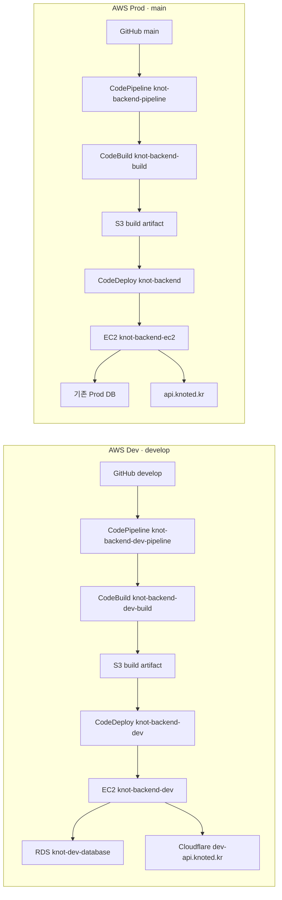

# AWS Dev·Prod 환경 분리 및 배포 구성 기록

작성일: 2026-09-30
상태: Dev 기본 배포 검증 완료, Prod 및 전체 환경 정합성 확인 중

이 문서는 2026-09-30에 진행한 AWS Dev 환경 구성, 기존 Prod 파이프라인 대조,
Cloudflare 연결과 배포 검증을 한 곳에 기록한다. 비밀번호, 키, Secret 값은 기록하지 않는다.

## 문제 상황

- AWS 사용량에 한도가 있어 개발 환경을 운영 환경과 같은 리소스에 올리면 운영 비용·변경 위험이 커진다.
- 기존 운영 배포는 AWS `main` 파이프라인으로 구성되어 있었다. 개발 환경은 NCP에 있었고,
  개발 DB·OAuth 주소·Swagger 설정을 운영과 분리해 확인할 AWS Dev 환경이 필요했다.
- AWS Dev의 Spring 설정이 공통 설정만 사용하면 API 문서가 비활성화된다.
  공통 `application.properties`는 `knot.api-docs.enabled=false`,
  `application-dev.properties`는 `true`로 설정되어 있어 Dev 서비스에 `dev` 프로필이 필요하다.
- 목표는 운영과 비슷한 배포 경로를 두되, Dev의 EC2·RDS·도메인·설정을 Prod와 분리하는 것이다.

## 대안

| 대안 | 장점 | 단점 | 결과 |
| --- | --- | --- | --- |
| 개발 배포를 NCP에만 유지 | AWS 추가 비용이 없다. | 운영과 다른 배포·DB 환경이라 운영 유사 검증이 제한된다. | AWS Dev를 별도로 구성하기로 함 |
| Prod 리소스에 개발 프로필만 추가 | 추가 서버 비용을 줄인다. | 개발 배포와 데이터가 운영에 영향을 줄 수 있다. | 미채택 |
| Prod와 비슷한 AWS Dev EC2·RDS를 별도로 구성 | 운영과 가까운 배포 경로를 검증하면서 데이터·설정을 분리한다. | EC2·RDS 사용료가 추가된다. | 채택 |
| CodePipeline 없이 수동 배포 | 첫 설정이 간단하다. | 빌드와 배포가 반복 가능하지 않고 실행 이력이 분산된다. | CodePipeline·CodeBuild·CodeDeploy 사용 |

## 결정

### 환경 경계

- AWS 리전은 서울(`ap-northeast-2`)로 사용한다.
- Prod 파이프라인의 소스 브랜치는 `main`, AWS Dev 파이프라인은 `develop`으로 분리한다.
- 개발용 EC2와 RDS를 별도로 두고, Dev Spring 프로필 및 개발 OAuth·도메인 설정을 사용한다.
- NCP를 `release` 프로필로 전환하는 일은 AWS Dev 구성과 별도 작업으로 남긴다.
  현재 저장소의 NCP workflow가 여전히 `develop`을 받아 `SPRING_PROFILES_ACTIVE=dev`를 설정한다.

### AWS 리소스

| 구분 | 리소스 | 확인된 설정 |
| --- | --- | --- |
| Prod EC2 | `knot-backend-ec2` | `t4g.small`, `project-public`, `project-public-a`, IAM 역할 `ec2-project` |
| Dev EC2 | `knot-backend-dev` | 리소스 ID 비공개 관리, `t4g.small`, 실행 중, 상태 검사 3/3 통과, `project-public`, `project-public-a`, IAM 역할 `ec2-project` |
| Dev AMI | `knot-backend-dev` | 현재 Dev EC2가 사용 중인 AMI ID는 비공개 관리 |
| Dev RDS | `knot-dev-database` | PostgreSQL, `db.t4g.micro`, 상태 `사용 가능`, 보안 그룹 `project-db`; 생성 시 `project-rds-subnet-group`을 사용하도록 설정 |
| Prod 파이프라인 | `knot-backend-pipeline` | `main` → Source → Build → Deploy, 기존 CodeBuild·CodeDeploy 사용 |
| Dev 파이프라인 | `knot-backend-dev-pipeline` | `develop` → Source → Build → Deploy |
| Dev CodeBuild | `knot-backend-dev-build` | Java 25 빌드, artifact 저장소 `techcourse-project-2026-artifacts` |
| Dev CodeDeploy | 앱 `knot-backend-dev`, 그룹 `knot-backend-dev-deployment-group` | EC2의 `Name=knot-backend-dev` 태그를 배포 대상으로 선택, `AllAtOnce` |

EC2는 과목에서 지정한 VPC `TECHCOURSE-PROJECT`, 직접 접근용 `project-public` 보안 그룹과
`project-public-a` 서브넷을 사용한다. Dev 인스턴스의 자동 할당 공인 IP는
비공개 운영 설정에서 관리하며 Elastic IP는 연결되어 있지 않다.

### 도메인과 애플리케이션 설정

- Cloudflare의 `dev-api.knoted.kr` A 레코드는 비공개 관리하는 Dev 원 서버 주소를 가리키며 Proxy가 켜져 있다.
- Dev API 호스트는 `dev-api.knoted.kr`, 프론트엔드·OAuth 측 Dev 도메인은 `dev-knoted.kr`로 분리한다.
- Spring은 AWS Dev에서 `dev` 프로필을 사용한다. NCP에서 가져온 런타임 설정·Secret은 값 자체를
  문서나 저장소에 넣지 않고 인스턴스의 비밀 설정으로 관리한다.
- Spring 설정에서 Flyway는 활성화되어 있어 애플리케이션 시작 시 migration을 시도한다.
  현재 Dev RDS에 기록된 최종 Flyway migration 버전까지 확인한 것은 아니다.

### 배포 흐름

AWS 과목 가이드에 따라 Source는 GitHub OAuth 앱(버전 1) 방식으로 구성했다. AWS 안내는
새 연결을 만들 때 GitHub App 방식을 권장하므로 OAuth 연결 방식은 추후 전환 검토 항목이다.

모든 생성 리소스에 적용할 태그는 다음과 같다.

| Key | Value |
| --- | --- |
| `Service` | `techcourse` |
| `Role` | `techcourse-etc` |
| `ProjectTeam` | `knot` |

Dev CodePipeline, CodeBuild 프로젝트, CodeDeploy 배포 그룹의 태그는 확인했다. EC2, AMI,
RDS, CodeDeploy 애플리케이션 및 그 밖의 생성 리소스까지 전부 확인한 것은 아니다.

## 검증 결과

| 환경 | 확인 | 결과 |
| --- | --- | --- |
| AWS Dev 파이프라인 | Source·Build·Deploy | 모두 성공. 실행 ID `21ec1371-ea44-485d-b8ba-0a0a2c36c93c`, commit `7a517a41` |
| AWS Dev 배포 | CodeDeploy | 배포 `d-SV782MK3L`, 1/1 인스턴스 성공 |
| AWS Dev EC2 | 인스턴스 콘솔 | 실행 중, EC2 상태 검사 3/3 통과 |
| AWS Dev API | `curl -i https://dev-api.knoted.kr/actuator/health` | HTTP 200, `{"groups":["liveness","readiness"],"status":"UP"}` |
| AWS Dev RDS | RDS 콘솔 | `knot-dev-database` 상태 `사용 가능` |
| AWS Prod 파이프라인 | CodePipeline 콘솔 | `main` 기반 마지막 확인 실행은 성공으로 표시됨. 소스·빌드 commit `a0a0a0ce`, 2026-09-18 |
| AWS Prod 배포 | CodeDeploy 콘솔 | 배포·인스턴스 ID는 비공개 관리, Prod EC2에 1/1 성공, `ValidateService` 성공 |
| AWS Prod 공개 API | `api.knoted.kr/api/v1/auth/me`, `/v3/api-docs` | 2026-09-30 확인 시 둘 다 HTTP 404. Prod 정상 응답을 확인하지 못함 |
| AWS Prod 배포 commit 일치 | CodePipeline 시각화 | Deploy에 rollback 표시가 있고 배포 카드가 다른 commit `93e5924e`를 보여 줌. `main`의 `a0a0a0ce`와 실제 적용 revision의 일치 여부를 추가 확인해야 함 |
| 자동 트리거 | AWS·GitHub 콘솔 | GitHub push webhook은 활성 상태이고 최근 전달 성공이 보였음. 권한 `events:ListRuleNamesByTarget` 거부로 EventBridge 연결 상세 및 후속 push 자동 실행은 독립 검증하지 못함 |
| NCP release 전환 | workflow 소스 | 미완료. `.github/workflows/deploy-backend-dev.yml`은 `develop`을 NCP에 배포하고 `SPRING_PROFILES_ACTIVE=dev`를 지정함 |

Dev 파이프라인의 성공은 Dev의 빌드·배포 경로가 동작했다는 증거다. Prod의 파이프라인 성공은
현재 Prod 도메인의 애플리케이션 응답이나 최신 소스가 적용되었다는 증거가 아니다.

## 남은 작업

- `api.knoted.kr`에서 API 경로가 404인 원인을 Cloudflare DNS/Origin, Nginx 및 Prod 프로세스 경로로 나눠 확인한다.
- Prod CodePipeline의 rollback 표시와 CodeDeploy revision의 실제 commit을 대조해 `main` artifact가 배포됐는지 확인한다.
- NCP의 기존 Dev 환경 변수를 비밀 값 노출 없이 AWS Dev 설정과 대조하고, NCP를 `release`로 바꾸는 workflow·서비스 변경을 별도로 완료한다.
- Dev RDS의 실제 연결, 애플리케이션 시작 시 Flyway 적용 결과와 데이터 격리를 확인한다. RDS 콘솔의 연결된 컴퓨팅 리소스 0은 자동 연결 표시이며 수동 EC2 연결을 뜻하지 않는다.
- 현재 공인 IP가 자동 할당이므로 EC2 중지/시작 뒤 Cloudflare A 레코드가 오래된 주소를 가리킬 수 있다. 안정적인 주소가 필요하면 비용을 고려해 Elastic IP 사용 여부를 결정한다.
- 생성한 모든 리소스에 필수 태그가 있는지 전체 점검한다. 현재 태그 확인은 일부 CodePipeline/CodeBuild/CodeDeploy 리소스에 한정된다.
- Dev·Prod 양쪽 로그 보존, 핵심 지표 대시보드, 장애 알림과 시나리오 부하 관측은 별도 작업으로 검증한다.
- CodeBuild는 현재 Amazon Linux 2 Standard 6.0 계열이다. AWS 콘솔 권고에 따라 Amazon Linux 2023 전환을 별도 검토한다.
