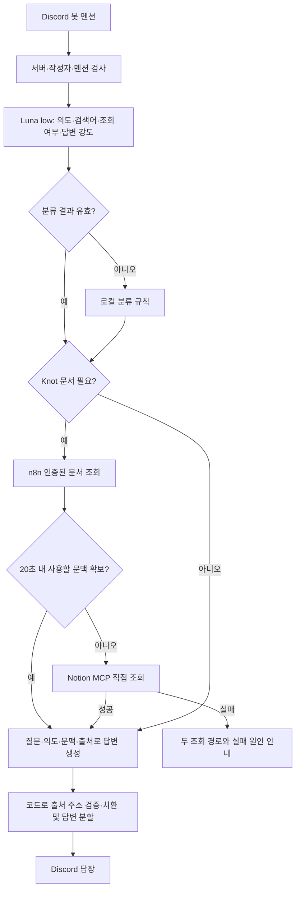
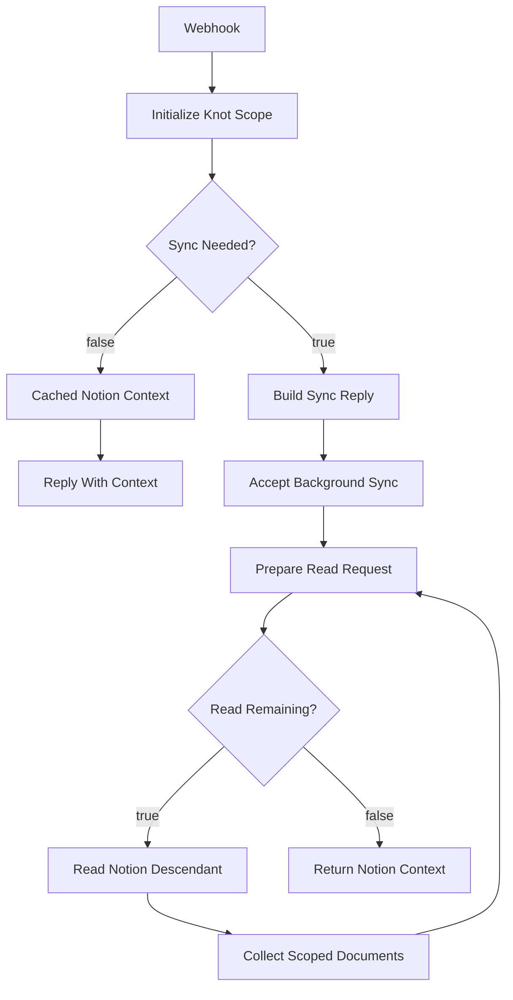
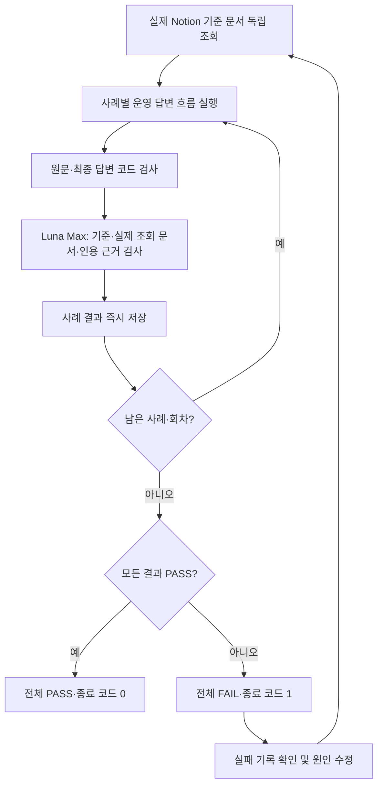

# Knot Discord 챗봇 운영 및 답변 품질 검증

작성일: 2026-10-03 (Asia/Seoul)
상태: Mac 실행 및 Discord 멘션 응답 확인, 실제 문서·모델 품질 검증 12/12 통과

관련 이슈: [#450](https://github.com/woowacourse-teams/2026-Knot/issues/450)
결정 기록: [Mac Codex OAuth와 읽기 전용 Notion MCP](../adr/450-discord-assistant-local-codex-notion.md) (Proposed)

## 1. 목적과 현재 상태

Knot 팀의 Notion 문서를 찾아 개발 질문에 답하고, 가벼운 일상 대화도 지원하는 개발 생산성 도구다.
Knot 제품의 서버·프론트엔드 기능과 별도로 Mac에서 실행한다.

Discord에서 봇을 멘션하면 로컬 Codex CLI가 기존 ChatGPT OAuth 로그인으로 답변한다.
별도 OpenAI API 키나 의사결정 API는 사용하지 않는다. 질문 전처리는 Luna low,
답변은 질문에 따라 Luna low·medium·max를 사용한다.

2026-10-03 검증 당시 n8n 서버는 HTTP 503을 반환했다. 이 오류 자체를 복구한 것은 아니며,
Mac의 읽기 전용 Notion MCP로 전환하여 문서 답변이 동작하는 것을 확인했다.
성공한 답변에는 복구 과정의 오류를 표시하지 않는다.

| 항목 | 설정 |
| --- | --- |
| Discord 애플리케이션·봇 ID | `1554427227473711114` |
| 허용 Discord 서버 | `1536954284447633448` |
| 응답 조건 | 허용 서버의 접근 가능한 채널에서 봇을 직접 멘션 |
| 제외 대상 | DM, 다른 서버, 봇 메시지, 멘션 없는 메시지 |
| Notion Knot 루트 | `3aeb4351752280a29797de8949496356` |
| n8n 워크플로우 | `Knot Dev Assistant - Discord Mention`, `hq0ZfDUytZuFtlvt` |
| 모델 | `gpt-5.6-luna` |
| Mac 서비스 | `com.knot.discord-assistant` LaunchAgent |

`BOT_USER_ID`는 Discord 연결 시 자동 확인한다. 최초에 전달했던 Discord 전송용 웹훅 대신,
Discord Gateway로 멘션을 수신하고 로그인한 봇이 원래 메시지에 답장한다.

## 2. 운영 요청 흐름



### 질문 전처리

Luna low 한 번의 호출로 아래 네 필드를 준비한다. 전처리 시 Notion 문서를 읽지는 않는다.
JSON Schema와 Pydantic으로 결과를 검증하고, 실패·형식 오류·25초 초과 시 로컬 규칙으로 진행한다.

```json
{
  "effort": "medium",
  "retrieve_notion": true,
  "intent": "초대 발급·재사용 정책이 단일 또는 복수 모드인지 판단",
  "search_queries": ["초대", "도메인 규칙", "워크스페이스"]
}
```

| 질문 종류 | 기본 답변 강도 | 문서 조회 |
| --- | --- | --- |
| 인사·가벼운 잡담 | `low` | 생략 |
| 문서 조회·요약·일반 질문 | `medium` | Knot 문서가 필요할 때 |
| 설계·비교·분석·디버깅 | `max` | Knot 문서가 필요할 때 |

검색어는 최대 4개다. 단일·복수라는 단어가 문서에 없더라도 초대 발급·재사용·재발급 규칙을
찾을 수 있도록 의도를 풀어 검색한다. 인사와 업무 질문이 섞이면 실제 질문을 기준으로 분류한다.

### 답변 계약

- 결론을 먼저 말하고 필요한 근거와 미확정 사항을 덧붙인다. 기본 1~6문장, 자연스러운 반말이다.
- Knot 사실은 조회된 문서에 근거한다. 사용자 질문의 가정은 확정된 프로젝트 사실로 취급하지 않는다.
- 현재 방식을 물으면 정책과 구현 상태를 구분한다. 문서의 후속 구현·미구현·재구현 필요는 생략하지 않는다.
- 수치·시간·조건·부정 표현을 문서와 대조하도록 프롬프트에 명시한다. 이는 모델 지침이며 별도 코드 사실 검증은 아니다.
- 사용한 문서 1~2개만 인용한다. 검색 후보 전체를 참고 문서 목록으로 붙이지 않는다.
- 모델은 `[출처 1]` 같은 번호를 출력한다. 코드는 실제 조회 메타데이터의 제목·URL로 치환하며 범위 밖 번호는 제거한다.
- 기존 Markdown 링크도 조회 결과와 대조한다. 확인되지 않은 링크는 제거한다.
- 복구된 n8n/MCP 오류와 내부 검색 과정은 성공 답변에 붙이지 않는다. 운영 장애를 직접 묻는 경우는 별도다.
- 문서 전체를 읽었다고 말하지 않는다. 근거가 부족하면 확인할 수 없는 부분을 짧게 밝힌다.

예를 들어 초대 방식 질문의 기대 답변은 다음과 같다.

> 정책상 복수 모드야. 새 초대를 만들어도 기존 초대는 유지돼. 다만 여러 유효 초대 생성은
> 후속 구현 대상이라, 현재 구현이 완료됐다고는 말할 수 없어.

이 예시는 [워크스페이스 생성 및 초대 공유](https://www.notion.so/496b4351752283a9b3d90139067890f5)의
2026-10-03 조회 내용에 근거한다. 이후 정책이 변경되면 답변 예시와 검증 기준을 함께 갱신한다.

## 3. 문서 조회: n8n과 Notion MCP

### n8n 워크플로우

[운영 워크플로우](https://n8n.aitestbed.kr/workflow/hq0ZfDUytZuFtlvt)는 Header Auth로 요청을 인증하고,
Notion 읽기와 문서 캐시를 담당한다. 공유 비밀값은 `X-Knot-Assistant-Secret` 헤더로 전달한다.



| 단계 | 역할 |
| --- | --- |
| Webhook·Initialize Knot Scope | 인증, 허용 서버·고정 루트·질문 검사 |
| Sync Needed?·Cached Notion Context·Reply With Context | 저장된 문서 조회 또는 수집 필요 여부 판단 |
| Build Sync Reply·Accept Background Sync | 먼저 응답하고 같은 실행에서 수집 지속 |
| Prepare Read Request·Read Remaining?·Read Notion Descendant | 읽기 큐와 요청 한도 관리, Notion 조회 |
| Collect Scoped Documents | 하위 페이지·블록·DB·다음 커서·재시도 작업 수집 |
| Return Notion Context | workflow global static data의 `knotReadCache`에 결과 저장 |

Mac은 `action=status`로 캐시부터 확인한다. 갱신이 필요하고 수집 잠금을 획득하면 `action=ask`로
수집을 시작한다. 대기 응답은 3초 간격으로 확인하며 전체 n8n 대기는 잠금 대기까지 포함해 최대 20초다.
실패·시간 초과·빈 결과·사용할 근거가 없는 결과는 MCP 직접 조회로 전환한다.

캐시 유효 시간은 15분, 수집 간격은 700ms, 실행당 읽기 한도는 5,000회다.
하위 DB의 데이터 소스를 조회하고 행 페이지와 블록을 수집한다. 한도나 접근 실패가 있으면
`warnings`와 `coverage.complete`로 불완전 상태를 기록한다. 오래된 캐시의 갱신 상태도 내부 기록으로 처리한다.

### 읽기 전용 MCP

Mac의 stdio MCP는 같은 Notion 액세스 키와 Notion API `2025-09-03`을 사용한다.
봇은 Python 3.14, Keychain 읽기와 MCP는 실제 접근이 확인된 Python 3.11 환경을 사용한다.

| 도구 | 읽기 범위 |
| --- | --- |
| `search_knot(query, search_queries?)` | 제목 검색 또는 직접 Notion 링크, 최대 5개 페이지 |
| `read_knot_page(page_id)` | 페이지 속성·본문·중첩 블록 |
| `read_knot_database(database_id)` | DB의 데이터 소스와 소스별 처음 8개 문서 |

부모 페이지·블록·데이터 소스·DB 경로가 Knot 루트에 도달하는지 확인한 뒤 본문을 읽는다.
범위 확인에 필요한 상위 메타데이터는 읽되 범위 밖 본문은 반환하지 않는다.
페이지 수정·삭제 도구는 없고 외부 링크·관계·외부 동기화 블록은 따라가지 않는다.

제목 검색에서 검색어에 맞는 제목이 없으면 일반어를 제외한 핵심 단어로 최대 4개 추가 검색한다.
API가 빈 목록 대신 무관한 문서만 반환하는 경우에도 적용한다. 검색어별 대표 문서를 먼저 읽어
주제 문서와 도메인 규칙을 함께 확보한다. 긴 문서는 주제 키워드 주변 문장을 추출한다.

| 직접 조회 제한 | 값 |
| --- | --- |
| 도구 실행당 API 요청 | 최대 120회, 350ms 간격 |
| 페이지네이션 조회 | 최대 500개 |
| 페이지당 중첩 블록 | 최대 30개 묶음 |
| 반환 문맥 | 전체 12,000자, 문서당 2,400자 |
| MCP 응답 대기 | 최대 120초 |
| 검색 완전성 | 항상 `coverage.complete=false` |

직접 조회는 전체 본문 검색이 아니며 첨부 파일·이미지 내용을 검색하지 않는다.
Knot 하위 전체가 접근 허용 범위라는 것과 매 질문에 전체 문서를 읽는다는 것은 다르다.

## 4. Mac 설정과 운영

현재 구현 경로는 `tools/discord-knot-assistant/`다. 기존 `/tools/` ignore 규칙에 이 도구만 예외를 두어
소스·테스트·README·`.env.example`을 저장소에서 관리한다. 실제 `.env`, Python 캐시,
실행 결과와 다른 로컬 도구는 계속 제외한다. 새 Mac에서는 인증·로컬 설정을 별도로 준비한다.

| 설정·인증 | 저장 위치 |
| --- | --- |
| Codex | 현재 Mac 사용자의 ChatGPT OAuth 로그인 |
| Discord 봇 토큰 | Keychain 서비스 `com.knot.discord-assistant` |
| Notion 액세스 키 | Keychain 서비스 `com.knot.discord-assistant.notion`, n8n Notion 자격 증명 |
| n8n 주소·Header Auth | 로컬 `.env`와 n8n 자격 증명 |

Discord Public Key는 봇 토큰을 대신할 수 없다. Message Content Intent와 대상 채널의 보기·전송 권한이 필요하다.
모델 프로세스는 ephemeral·read-only로 실행하고 사용자 설정 및 셸·앱·플러그인·브라우저 도구를 비활성화한다.

아래 명령은 저장소 루트에서 실행한다.

```bash
codex login status

# 새 환경의 n8n 설정과 숨김 입력 토큰 저장
uv run --script tools/discord-knot-assistant/bot.py configure
uv run --script tools/discord-knot-assistant/bot.py set-token
uv run --script tools/discord-knot-assistant/bot.py set-notion-token

# 로그인 시 자동 실행 등록
uv run --script tools/discord-knot-assistant/bot.py install-service

# 상태 확인과 코드 변경 후 재시작
launchctl print "gui/$(id -u)/com.knot.discord-assistant"
launchctl kickstart -k "gui/$(id -u)/com.knot.discord-assistant"

# 자동 실행 등록 해제
uv run --script tools/discord-knot-assistant/bot.py uninstall-service
```

`configure`는 `.env`를 새로 작성한다. 기존 설정에서 n8n 인증만 바꾸려면 `set-n8n-auth`를 사용한다.
포그라운드 실행은 `bot.py run`이다. 자동 실행 서비스와 동시에 별도 `run`을 실행하지 않는다.

LaunchAgent 파일은 `~/Library/LaunchAgents/com.knot.discord-assistant.plist`, 로그는
`~/Library/Logs/KnotDiscordAssistant/`의 `stdout.log`, `stderr.log`다.
서비스는 로그인 후 실행하고 종료된 프로세스를 재시작한다. Mac 잠자기·종료·네트워크 단절 시에는 답할 수 없다.

### 장애와 지연 확인

| 이벤트·필드 | 확인할 내용 |
| --- | --- |
| `discord.gateway.ready` | 연결 완료와 실제 봇 ID |
| `assistant.request.routed` | 분류 방식, 의도에 따른 검색어·조회 여부·강도 |
| `notion.lookup.fallback` | n8n에서 MCP로 복구한 이유 |
| `assistant.request.completed` | 메시지 ID와 단계별·전체 처리 시간 |
| `assistant.request.failed` | `stage`, `failure_code`, `message_id`, `error_type` |
| `classification_seconds` | 분류와 실행 슬롯 대기 |
| `notion_seconds` | n8n 대기와 MCP 조회 |
| `codex_wait_seconds` | 답변 생성과 실행 슬롯 대기 |

조회가 복구되면 전환 이유는 로그에만 남긴다. 두 경로가 모두 실패하면 각 경로와 원인을 사용자에게 알려준다.
Codex 생성 실패도 해당 단계의 오류를 안내한다. Discord 연결이 끊겨 전송 자체가 불가능하면 채널에 안내할 수 없다.
운영 로그는 질문·답변 원문을 저장하지 않으며, 아래 평가 보고서에는 재현용 질문·답변을 저장한다.

## 5. 반복 품질 검증 루프

```bash
# 단일 실제 흐름 재현: Discord에 게시하지 않음
uv run --script tools/discord-knot-assistant/bot.py verify --question 'Knot 초대 방식은 단일 모드야 복수 모드야?'

# 6개 사례를 각각 2회 반복: Discord에 게시하지 않음
uv run --script tools/discord-knot-assistant/bot.py evaluate --rounds 2
```

`evaluate`는 운영 봇과 동일한 분류기·검색 경로·프롬프트·모델·출처 후처리를 실행한다.
`--rounds`는 1~3이며 기본값은 2다. 별도 평가에서만 Luna Max 검토 호출을 추가한다.
운영 답변마다 검토 모델을 호출하거나 예약 실행하는 구성은 아니다.



마지막 수정 단계는 담당자가 기록을 보고 수행한다. 평가 명령이 자동으로 코드를 수정하지는 않는다.

### 사례와 판정 기준

| 사례 | 검사할 핵심 |
| --- | --- |
| 초대 단일·복수 모드 | 복수 정책, 기존 초대 유지, 후속 구현 상태 구분 |
| 같은 뜻의 다른 표현 | 새 사람을 초대해도 기존 코드가 유지되는 정책 이해 |
| 틀린 전제 | 항상 하나만 유효하다는 가정을 정정 |
| 알 수 없는 운영 배포 시각 | 정책 날짜를 배포 시각으로 만들지 않고 확인 불가 안내 |
| 잡담 | 조회 생략, 자연스러운 짧은 답변, 문서·오류 안내 없음 |
| 프론트엔드 커밋 컨벤션 | 실제 문서의 `feat`, `fix`, `docs`, `refactor`, `chore`와 의미·출처 |

기준 문서는 [초대 정책](https://www.notion.so/496b4351752283a9b3d90139067890f5)과
[커밋 컨벤션](https://www.notion.so/3b3b43517522801b882dce1bf798a52b)을 실행 시작 때 별도로 읽는다.
기준 문서를 읽지 못하면 FAIL로 종료한다.

코드 검사는 조회 분기 불일치, 빈 답변, 1,500자 초과, 복구 오류 노출, 잘못된 출처 번호·URL,
문서 질문의 출처 누락, 잡담의 불필요한 인용을 검사한다. 후처리가 링크를 교정했더라도
원문 모델 답변의 잘못된 URL은 실패로 남긴다.

Luna Max는 질문별 기준과 독립 기준 문서, 실제 조회 문서·출처를 함께 검토한다.
사실 오류·근거 없는 단정·핵심 누락·질문 오해·잘못된 인용을 검사하고, 문체 선호만으로 실패시키지 않는다.
검토 실패나 잘못된 JSON도 FAIL이다. 모든 사례가 모든 회차에서 통과해야 전체 PASS다.

### 기록과 다음 수정 절차

결과는 `~/Library/Application Support/KnotDiscordAssistant/evaluations/`의 JSON에 사례마다 저장한다.
디렉터리 권한은 700, 파일은 600이다. 기록에는 회차·질문·원문 답변·최종 답변·검색어·출처 URL·강도·시간·위반 사항이 있다.
토큰과 Notion 본문 전체는 기록하지 않는다. 중단된 실행은 전체 PASS로 표시하지 않으며 이전 실패 기록도 보존한다.

새 오답이 발생하면 다음 순서로 처리한다.

1. 실제 질문과 실패 유형을 `evaluation_cases.py`에 추가하고 기준 문서를 지정한다.
2. 운영과 같은 경로로 재현하여 분류·검색·답변·출처·검토 중 실패 단계를 구분한다.
3. 원인을 수정하고 관련 합성 회귀 테스트를 추가한다. 문서 정책 변경이 아니라면 기대 사실을 낮추지 않는다.
4. 로컬 회귀 테스트를 실행한 뒤 전체 `evaluate --rounds 2`를 다시 실행한다.
5. 운영 코드가 바뀌면 서비스를 재시작하고 실제 Discord 멘션과 로그로 확인한다.

현재 로컬 회귀 테스트의 재현 명령은 다음과 같다. 실제 Notion·Codex 평가와 달리 외부 서비스 대신
합성 응답을 사용하며, `.env`와 실제 토큰 없이 실행할 수 있다.

```bash
uv run --python 3.14 \
  --with 'discord.py>=2.5,<3' --with 'httpx2[http2]' \
  --with 'mcp>=1.12,<2' --with 'keyring>=25,<27' \
  --with 'pydantic-settings>=2.8,<3' --with 'structlog>=25,<26' \
  --with pytest --with anyio \
  python -m pytest tools/discord-knot-assistant -q
```

MCP SDK는 v1 계약을 사용하므로 검증 환경도 `<2`로 제한한다. Git 브랜치·제목 컨벤션 검사는
`python3 -m unittest discover .github/scripts -p 'test_*.py' -q`로 실행한다.

## 6. 발견한 실패와 적용한 수정

| 실제 발견한 실패 | 원인 | 적용한 수정 |
| --- | --- | --- |
| 커밋 컨벤션을 못 찾음 | `커밋 타입` 검색이 무관한 제목을 반환하고 재검색하지 않음 | 제목 일치 여부 검사, 일반어 제외 후 `커밋` 등 핵심 단어 재검색 |
| 잘못된 Notion 인용 URL | 모델이 직접 주소를 작성 | 출처 번호 출력 후 실제 메타데이터 주소로 치환, 원문 가짜 링크도 검증 FAIL |
| 만료 규칙이 모순됨 | 규칙을 줄이면서 부정 표현의 범위를 바꿈 | 수치·조건·부정 표현과 자기 모순 점검 지침 |
| 정책을 구현 완료처럼 이해할 수 있음 | 간결하게 답하며 후속 구현 단서를 생략 | 현재 방식 질문에 미구현·후속 구현 상태 필수 안내 |
| 근거가 있는데 검토 실패 | 검토 모델이 핵심 기준 문서만 읽고 추가 조회 문서의 근거를 무시 | 검토에 실제 조회 문서 전체와 출처 추가, 주장과 인용의 대응 검사 |
| 성공 답변에 503·전환 과정 노출 | 복구 경고를 답변에 자동 첨부 | 성공 시 내부 로그만 기록, 두 경로 모두 실패할 때 원인 안내 |

## 7. 2026-10-03 검증 증거

| 증거 종류 | 관찰 결과 | 해석 범위 |
| --- | --- | --- |
| 로컬 합성 회귀 테스트 | Python 3.14, 52개 PASS | 요청 처리·분류 오류·검색·출처·장애 복구의 코드 회귀 |
| 실제 문서·모델 반복 검증 | 6개 사례 × 2회, 12/12 PASS, 종료 코드 0 | 해당 시점의 Notion·Codex 경로와 사례별 답변 품질 |
| 실제 Discord 멘션 | 초대 코드 유지·정책/구현 구분·커밋 컨벤션 3개 답변 확인 | 채널 수신·실제 답변 전송과 성공 답변 형식 |
| Mac 서비스 | LaunchAgent 실행 중, Discord Ready 확인 | 해당 시점의 서비스 연결 상태 |
| 정적 타입 검사 | basedpyright 미설치로 미실행 | 타입 검사 통과 증거는 없음 |

실제 모델 보고서 파일명은 `20261003T115741404833Z.json`이다. 파일명의 시각은 UTC이며
작성일 표시는 한국 시간 기준이다. 보고서는 위 Mac의 평가 결과 디렉터리에만 저장되어 있다.
해당 실행은 분류 Luna low, 문서 답변 Luna medium, 잡담 Luna low, 검토 Luna Max를 사용했다.

| 실제 Discord 질문 메시지 ID | 확인한 답변 | 운영 로그 전체 시간 |
| --- | --- | --- |
| `1555903061174648934` | 새 초대 생성 후 기존 코드 유지와 24시간 만료 | 35.508초 |
| `1555905214521811007` | 복수 정책과 후속 구현·재구현 상태 구분 | 26.139초 |
| `1555908929244889119` | 커밋 타입 5개와 의미, 실제 커밋 컨벤션 링크 | 25.294초 |

마지막 커밋 질문은 최종 검색·프롬프트 적용 후 확인했다. 앞선 두 답변은 같은 작업의 이전 변경 시점이다.
세 성공 답변 모두 복구 오류 안내와 검색 후보 목록이 없었다.
평가 결과의 `seconds`는 별도 Max 검토까지 포함하므로 운영 응답 시간과 직접 비교하지 않는다.

합성 장애 검증에는 n8n 503·시간 초과·빈 결과·무관한 문맥·응답 형식 오류, 양쪽 조회 실패,
범위 밖 본문 차단, DB 행 부모 경로, 중첩 블록, 페이지네이션, 쓰기 경로 거절, 늦게 등장하는 근거,
분류 형식 오류와 검토 실패를 포함했다. 합성 테스트는 실제 Notion 권한이나 모델 정확성 전체를 증명하지 않는다.

## 8. 남은 한계와 코드 안내

- n8n의 HTTP 503 자체는 해결하지 않았다. 현재 실제 문서 검증은 MCP 복구 경로를 통해 통과했다.
- 직접 조회의 제목 검색·최대 5개 문서·문맥 길이 제한 때문에 모든 Knot 문서의 검색 완전성을 확인한 것은 아니다.
- 이전 대화 이력 전달과 스트리밍 응답은 구현되어 있지 않다. 분류와 답변마다 새 Codex CLI 프로세스를 실행한다.
- 응답 시간은 분류·CLI 시작·Notion 호출·동시 실행 슬롯 대기를 포함한다. 위 시간은 단일 관측이며 성능 보장이나 비교 벤치마크가 아니다.
- Mac 기반 LaunchAgent는 24시간 클라우드 운영을 대신하지 않는다.
- Luna Max의 검토도 오류 가능성이 있다. 새 실제 오답은 사례에 추가하고 판정 근거도 점검한다.

| 로컬 구현 파일 | 책임 |
| --- | --- |
| `tools/discord-knot-assistant/bot.py` | CLI, 설정, 토큰 저장, 실행·검증·서비스 명령 |
| `assistant.py` | Discord 수신·답변, n8n/MCP 전환, 단계별 로그 |
| `question_classifier.py`, `question_routing.py` | Luna low 전처리, 스키마, 로컬 복구 |
| `codex_cli.py` | Codex 실행·프롬프트·출처 치환·답변 분할 |
| `notion_mcp.py`, `notion_mcp_client.py` | 읽기 전용 stdio 서버·클라이언트 |
| `notion_api.py`, `notion_lookup.py`, `notion_models.py` | 범위 확인·API 읽기·검색·문맥 구성 |
| `evaluation.py`, `evaluation_cases.py` | 반복 평가·사례 기준·판정·보고서 |
| `failure_details.py`, `sync_guard.py`, `macos_service.py` | 실패 안내·수집 잠금·서비스 관리 |

로컬 실행 상세는 [도구 README](../../tools/discord-knot-assistant/README.md)를 참조한다.
이 문서와 README는 실행 가능한 n8n 워크플로우 JSON 백업을 대신하지 않는다.
