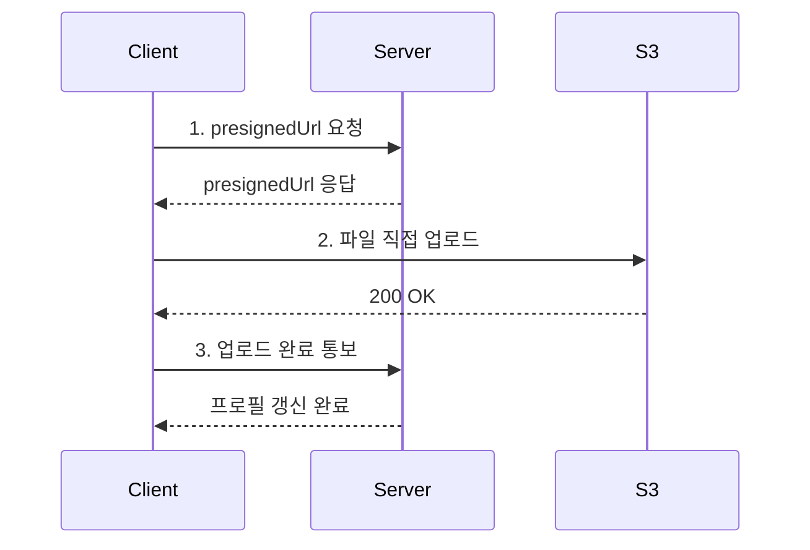
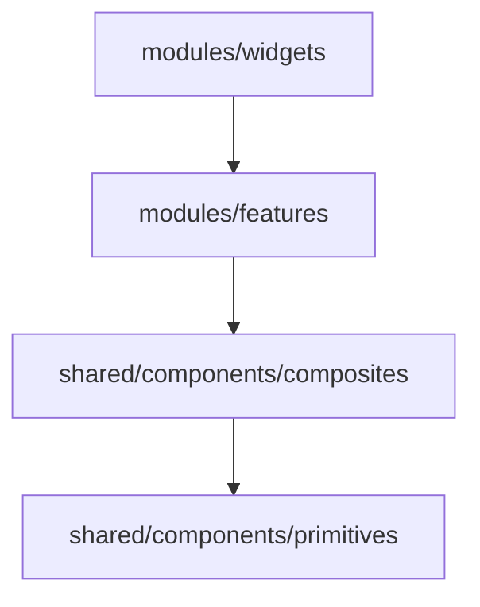
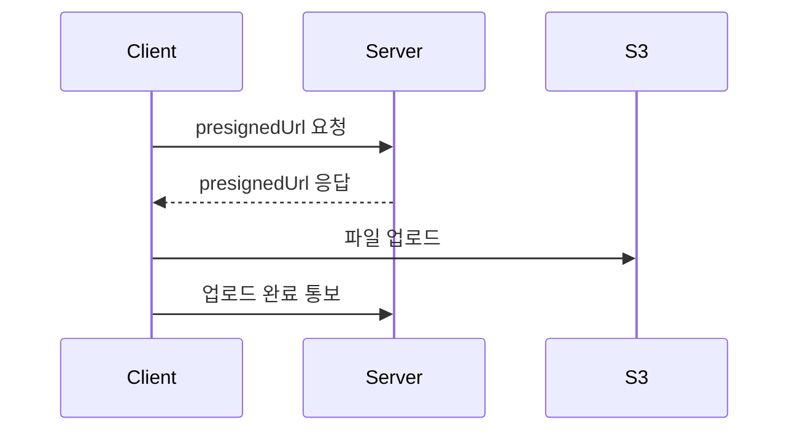

# pr 작성 커맨드

이 커맨드는 HEAD 커밋과 develop 브랜치 커밋의 변경사항을 파악하여 pr 내용을 작성함.

작성 결과물은 레포 내부(`context/`)가 아니라 **OS 임시 디렉토리**에 저장하고, 작성이 끝나면 **VS Code로 자동으로 열어줌**.

PR 본문에는 `/explain-diff-html`로 만든 **변경 설명 페이지**를 Artifact로 게시한 링크를 포함함. 게시된 페이지는 작성자 본인만 볼 수 있으므로, 완료 시 사용자가 직접 링크에 들어가 공유를 켜도록 안내함.

## 이 커맨드가 하는 일

1. **변경사항 확인** - 코드의 변경사항을 명확히 확인
2. **이슈 확인** - 관련 이슈 및 상위(부모) 이슈 내용까지 조회
3. **변경 설명 페이지 생성·게시** - `/explain-diff-html`로 HTML을 만들고 Artifact로 게시
4. **PR 문서 작성** - 임시 파일에 작성, 설명 페이지 링크 포함
5. **VS Code로 열기** - 작성된 파일을 자동으로 오픈
6. **공유 안내** - 사용자가 링크에 직접 들어가 공유를 켜도록 안내

---

## 1단계: 변경사항 확인

아래를 **모두** 수행하여 변경사항을 명확하고 정확하게 파악.

```bash
git branch --show-current                # 현재 브랜치 확인
git log develop..HEAD --oneline          # 쌓인 커밋 메시지 확인
git diff develop...HEAD --stat           # 변경 파일 개괄
git diff develop...HEAD                  # 실제 변경 코드
```

- `context/statement.md` 파일이 존재하면 읽어서 작성자의 의도·주의사항을 반영. (없으면 생략)
- diff가 큰 경우 `--stat`으로 전체 윤곽을 먼저 잡고, 핵심 파일만 개별적으로 확인.
- 이슈 번호는 커밋 메시지·브랜치명(`feature/#51-...`)에서 추출. 찾지 못하면 임의로 추측하지 말고 **작업을 멈추고 사용자에게 이슈 번호를 물어본 뒤 진행**.

## 2단계: 이슈 확인 (상위 이슈 포함)

이슈 내용을 읽지 않고 diff만으로 PR을 작성하지 말 것. **"무엇을 바꿨는가"는 diff가, "왜 필요한가"는 이슈가 알려줌.**

### 2-1. 해당 이슈 조회

```bash
gh issue view <이슈번호> --json number,title,body,state,labels
```

### 2-2. 상위 이슈 조회 (필수)

이 레포는 GitHub 네이티브 sub-issue를 사용함. `gh issue view`로는 부모 이슈가 보이지 않으므로 **반드시 GraphQL로 확인**.

```bash
gh api graphql -f query='
query($owner:String!, $name:String!, $number:Int!, $after:String) {
  repository(owner:$owner, name:$name) {
    issue(number:$number) {
      number title body state
      parent { number title body state }
      subIssues(first:30, after:$after) {
        nodes { number title state }
        pageInfo { hasNextPage endCursor }
      }
    }
  }
}' -F owner=woowacourse-teams -F name=2026-Knot -F number=<이슈번호>
```

- `subIssues`는 한 번에 최대 30개만 반환하므로, `pageInfo.hasNextPage`가 `true`이면 `-F after=<endCursor>`로 **`hasNextPage`가 `false`가 될 때까지 반복 조회**하여 하위 이슈 목록을 모두 모음.

판단 기준:

- `parent`가 있으면 → **서브 이슈**. 부모 이슈의 `title`/`body`(구현 기능 설명·TODO·메모)를 함께 읽어 이번 작업이 전체 중 어느 조각인지 파악.
- `parent`가 `null`이고 `subIssues`가 있으면 → **본 이슈**. 하위 이슈 목록과 상태를 확인해 이번 PR이 어떤 하위 항목을 닫는지 파악.
- 둘 다 없으면 → 단독 이슈. 해당 이슈 본문만 사용.
- 이슈 본문이 비어있는 경우가 흔함(제목만 있는 서브 이슈 등). 이때는 **부모 이슈 본문이 사실상 유일한 맥락**이므로 반드시 조회.

### 2-3. 조회 결과를 PR에 반영하는 방법

| 확인한 것                                   | PR에 반영할 위치                                       |
| ------------------------------------------- | ------------------------------------------------------ |
| 부모 이슈의 `## 구현 기능 설명`             | 초록에서 "무엇을 위한 작업인지" 한 문장으로            |
| 부모 이슈의 `## TODO` 중 이번에 처리한 항목 | `### 변경사항` 제목·범위 결정에 사용                   |
| 부모 이슈의 `## TODO` 중 남은 항목          | 후속 작업임을 명시 (`~는 후속 PR에서 진행하겠습니다.`) |
| 이슈의 `## 메모`, 라벨                      | 참고 사항 / 논의점                                     |

- 서브 이슈일 경우 관련 이슈 섹션에 **양쪽 모두** 기재.
- 이슈 번호를 자동으로 찾지 못한 경우는 1단계와 동일하게 처리. 임의로 추측하거나 `- #`로 비워두지 말고, 작업을 멈추고 사용자에게 물어본 뒤 진행.
- `gh` 인증 실패·네트워크 오류 시 이슈 조회를 생략하고, **"이슈 내용을 반영하지 못했음"을 사용자에게 명시적으로 알림.**

### 관련 이슈 표기 형식

서브 이슈인 경우:

```md
## 관련 이슈

- #178
- 상위 이슈: #170
```

단독 이슈인 경우:

```md
## 관련 이슈

- #51
```

## 3단계: 변경 설명 페이지 생성·게시

1·2단계에서 파악한 diff와 이슈 맥락을 그대로 이어받아 `/explain-diff-html` 스킬을 호출하고, 결과 HTML을 Artifact로 게시함. 게시된 URL은 4단계 PR 본문에 넣음.

### 3-1. `/explain-diff-html` 호출

`Skill` 도구로 `explain-diff-html`을 호출하되, Artifact로 게시할 수 있는 형태여야 하므로 아래 조건을 `args`로 함께 전달함.

```text
대상: develop...HEAD diff (이슈 #<번호> <이슈 제목>)
출력 조건:
- 파일 경로: /tmp/<YYYY-MM-DD>-explanation-<브랜치명을 -로 치환>.html
- Artifact로 게시하므로 <!DOCTYPE>, <html>, <head>, <body> 태그를 쓰지 않고, <title>과 <style>을 파일 맨 위에 둔 뒤 본문 요소를 바로 작성
- body에 배경색을 명시하고, 라이트·다크 테마 모두에서 읽히도록 색은 CSS 변수로 정의 (:root에 라이트 기본값, prefers-color-scheme: dark와 [data-theme="dark"]에서 재정의)
- 외부 스크립트·이미지 없이 자체 완결. 퀴즈 피드백은 alert 대신 인라인으로 표시
- 본문은 한국어 높임말
```

- 파일명의 날짜는 `date +%F`로 확인.
- 스킬이 로드되면 그 지시(Background · Intuition · Code · Quiz 구성, 목차, 코드 블록은 `<pre>`)를 그대로 따름. Artifact 도구 규칙에 따라 HTML을 쓰기 전에 `artifact-design` 스킬도 로드함.
- HTML은 `/tmp` 아래에만 쓰고 **레포 안에는 만들지 않음.**

### 3-2. Artifact로 게시

```text
Artifact(
  file_path = <3-1에서 만든 HTML 경로>,
  favicon = "🔍",
  description = "<이슈 제목> 변경 설명 (배경·직관·코드·퀴즈)"
)
```

- `<title>`은 변경을 식별할 수 있는 짧은 이름으로 둠. (예: `초대 링크 입장 플로우 변경 설명`)
- 게시 결과의 URL(`https://claude.ai/code/artifact/...`)을 기록해 4단계에서 사용.
- 게시가 실패하면(도구 사용 불가, 크기 초과 등) 작업을 중단하지 않고 PR 문서에는 링크 대신 로컬 HTML 경로를 적은 뒤, 6단계 안내에서 게시 실패 사실을 알림.

## 4단계: PR 문서 작성

### 저장 위치

```bash
mkdir -p /tmp/knot-pr
```

파일 경로: `/tmp/knot-pr/<브랜치명을 -로 치환>-pr.md`

- 예: 브랜치가 `feature/#182-routing` 이면 → `/tmp/knot-pr/feature-182-routing-pr.md`
- 파일이 이미 존재하면 덮어씀.
- **`context/` 하위에는 절대 작성하지 않음.**

## 5단계: VS Code로 열기

작성 완료 후 반드시 실행:

```bash
code /tmp/knot-pr/<파일명>.md
```

## 6단계: 공유 안내 (필수)

Artifact는 게시 직후 **작성자 본인만 볼 수 있음**. 리뷰어가 PR의 링크를 열 수 있으려면 사용자가 직접 공유를 켜야 하며, 이는 도구로 대신할 수 없음. 마지막 메시지에 반드시 아래 세 가지를 포함:

1. PR 문서 저장 경로 (한 줄)
2. 변경 설명 페이지 URL
3. 공유 안내: "위 링크에 직접 들어가서 페이지의 공유(Share) 메뉴로 공유를 켜 주세요. 켜기 전에는 리뷰어가 열 수 없습니다."

게시가 실패했다면 2·3번 대신 실패 사실과 로컬 HTML 경로를 알림.

---

## PR 문서 형식

아래 형식을 그대로 따름. 주석(`<!-- -->`)은 모두 제거하고 실제 내용으로 채움.

```md
## 관련 이슈

- #[이슈번호]

## 작업 내용

_주요 변경사항 요약(초록). 한 문장에서 두 문장._

> 변경 배경·핵심 아이디어·코드 워크스루·퀴즈를 정리한 [변경 설명 페이지](<아티팩트 URL>)를 함께 참고해 주세요.

### [변경사항 1]

줄글로 설명. 변경사항이 많다면 개괄식이 아닌 `h3`로 하나씩 나누어 작성.

### [변경사항 2]

...

### 참고 사항

- 리뷰어가 중점적으로 봐주길 원하는 부분
- 필요 없다면 섹션 자체를 생략
```

### 말투 규칙

- 전 구간 **높임말** 사용. (`~하였습니다.`, `~입니다.`)
- 초록은 간결하게, 본문은 "왜 이렇게 했는지"가 드러나게.

---

## 다이어그램 · 예시 코드 (중요)

설명만으로 전달이 어려운 변경사항은 **반드시** 다이어그램이나 예시 코드를 함께 넣음.
단, 장식용으로 남발하지 말고 **아래 판단 기준에 해당할 때만** 추가.

### 판단 기준

| 변경 유형                                 | 추가할 것                     |
| ----------------------------------------- | ----------------------------- |
| API 호출 순서 / 비동기 흐름 / 인증 플로우 | `mermaid sequenceDiagram`     |
| 폴더·레이어 구조 변경, 의존 방향 변경     | `mermaid flowchart` 또는 트리 |
| 상태 전이(로딩·에러·성공, 폼 단계)        | `mermaid stateDiagram-v2`     |
| 새 컴포넌트/훅의 사용법                   | 사용 예시 코드 블록           |
| 인터페이스·컨벤션 변경                    | Before / After 코드 블록      |
| 단순 리네이밍, 오타 수정, 설정값 변경     | 아무것도 추가하지 않음        |

### 작성 규칙

- GitHub는 mermaid를 렌더링하므로 ```mermaid 코드 펜스를 사용.
- 다이어그램 노드 라벨은 **한글 가능**, 단 `()` `[]` 등 특수문자는 `"..."`로 감쌈.
- 예시 코드는 실제 diff에서 가져오되, **동작 이해에 필요한 최소한만** 발췌 (10~20줄 이내).
- 예시 코드에는 반드시 언어 태그(`tsx`, `ts`)를 붙임.
- Before/After는 각각 별도 코드 블록으로 나누고 `**Before**` / `**After**` 로 라벨링.

### 예시 1 — 비동기 흐름 (sequenceDiagram)

````md
### 프로필 사진 업로드

프로필 사진은 S3를 통하여 관리하도록 하였습니다.
presignedUrl을 발급받은 뒤 프론트에서 직접 파일을 업로드하고, 업로드 완료 사실을 서버에 알리는 3단계 흐름입니다.



업로드라는 동작 하나에 3개의 API 호출이 필요하여, 현재는 하나의 비동기 함수로 묶어 핸들러에서 관리하도록 구현하였습니다.
````

### 예시 2 — 구조 변경 (flowchart)

````md
### 컴포넌트 추상화 레벨 정리

임포트 방향이 상위 레벨로 역류하지 않도록 레이어를 정리하였습니다.



상위 레벨은 하위 레벨만 임포트할 수 있으며, 동일 레벨 간 참조는 금지하였습니다.
````

### 예시 3 — 컨벤션 변경 (Before / After)

````md
### getRouterPath 파라미터명 변경

의미가 모호했던 `path` 파라미터를 `routeKey`로 변경하였습니다.

**Before**

```ts
const getRouterPath = (path: RouteKey) => ROUTES[path];
```

**After**

```ts
const getRouterPath = (routeKey: RouteKey) => ROUTES[routeKey];
```

인자로 넘기는 값이 경로 문자열이 아니라 라우트 키라는 점을 이름에서 드러내도록 하였습니다.
````

### 예시 4 — 신규 컴포넌트 사용법

````md
### TextField 프리미티브 구현

값과 에러 메시지를 함께 다루는 `TextField`를 추가하였습니다.

```tsx
<TextField
  value={name}
  onChange={handleChange}
  placeholder="팀 이름을 입력해 주세요."
  errorMessage={isDuplicated ? "이미 존재하는 팀 이름입니다." : undefined}
/>
```

`errorMessage` 유무와 값의 길이로 `Input`의 `status`를 계산해 넘기므로, 사용처에서는 값과 에러 메시지만 전달하면 됩니다.
````

---

## 전체 출력 예시

(서브 이슈 `#51`, 상위 이슈 `#40 [FE] 프로필 관리 기능` 인 경우)

````md
## 관련 이슈

- #51
- 상위 이슈: #40

## 작업 내용

프로필 관리 기능 중 프로필 사진 업로드 및 제거 기능을 구현하였습니다.
상위 이슈의 TODO 중 프로필 정보 수정은 후속 PR에서 진행하겠습니다.

> 변경 배경·핵심 아이디어·코드 워크스루·퀴즈를 정리한 [변경 설명 페이지](https://claude.ai/code/artifact/xxxxxxxx-xxxx-xxxx-xxxx-xxxxxxxxxxxx)를 함께 참고해 주세요.

### 프로필 사진 업로드

프로필 사진은 S3를 통하여 관리하도록 하였습니다.
presignedUrl을 발급받은 이후 프론트에서 파일을 업로드하고, 업로드가 완료되었다는 사실을 서버에 전달하는 방식입니다.



업로드 동작 하나에 3개의 API 호출이 필요하여 현재는 하나의 비동기 함수로 묶고, 이를 핸들러에서 관리하도록 구현하였습니다.
다만 이는 기존의 api → query hook → component 계층 컨벤션에 위배되는 코드이므로, 추후 개선하도록 하겠습니다.

### 업로드할 프로필 사진 수정

요구사항에 따라 업로드할 프로필의 크기 및 위치를 수정할 수 있어야 했습니다.
`GestureDetector`와 `Animated.Image`를 통해 이미지를 이동할 수 있도록 하고, 이동한 위치와 확대한 배율을 계산하여 `image-manipulator`로 crop하도록 구현하였습니다.

```tsx
const cropped = await manipulateAsync(uri, [
  { crop: { originX, originY, width: cropSize, height: cropSize } },
]);
```

### 참고 사항

- 3개의 API를 하나의 비동기 함수로 묶은 부분이 컨벤션에 어긋나는데, 계층을 유지하며 처리할 방법이 있을지 의견 부탁드립니다.
````
