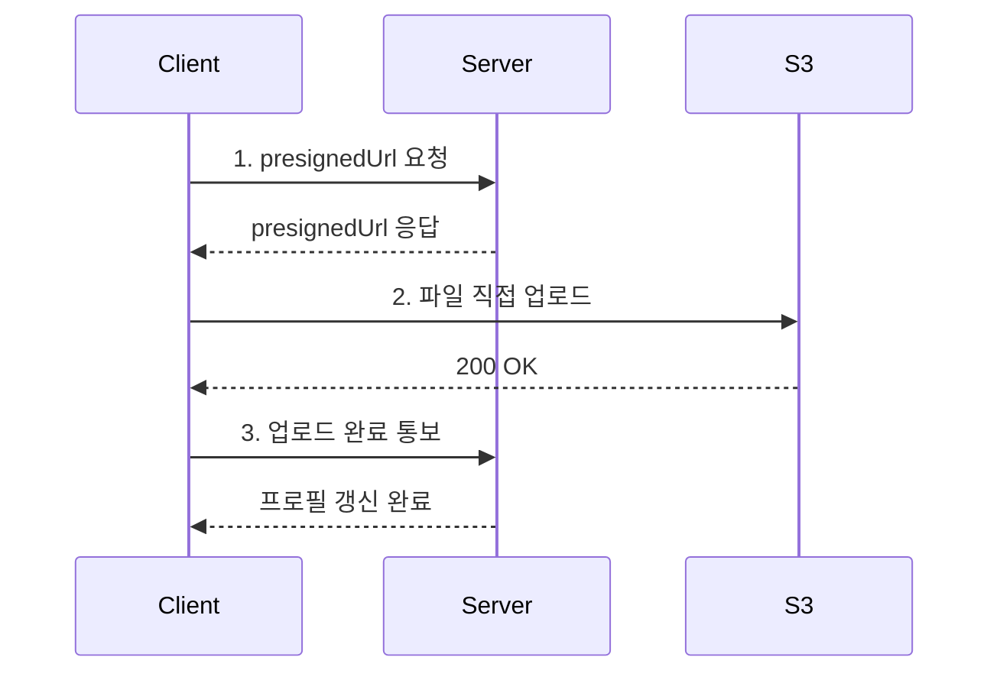
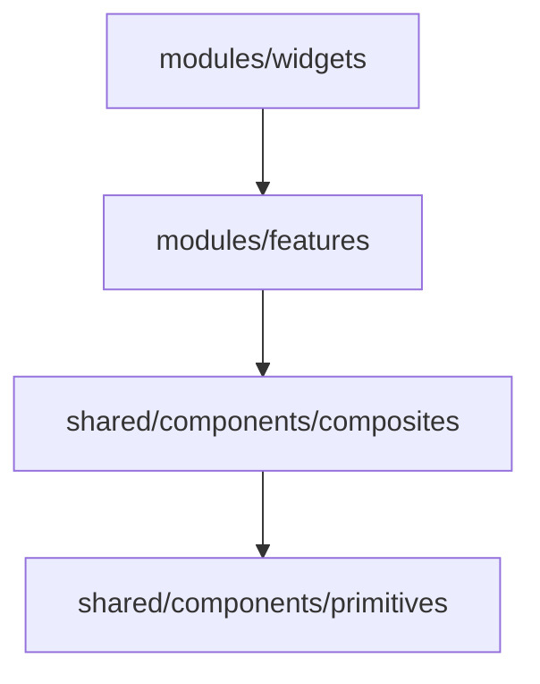
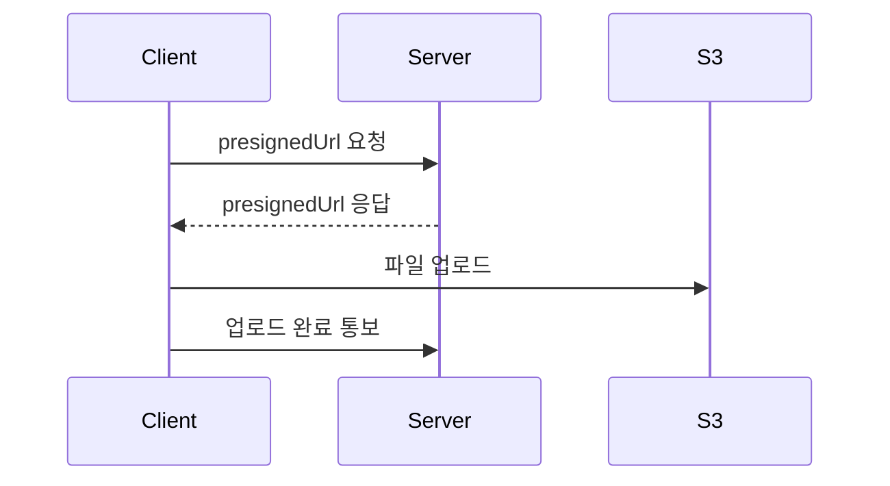

# pr 작성 커맨드

이 커맨드는 HEAD 커밋과 develop 브랜치 커밋의 변경사항을 파악하여 pr 내용을 작성함.

작성 결과물은 레포 내부(`context/`)가 아니라 **OS 임시 디렉토리**에 저장하고, 작성이 끝나면 **VS Code로 자동으로 열어줌**.

PR 본문에는 `/explain-diff-html`로 만든 **변경 설명 페이지**를 Artifact로 게시한 링크를 포함함. 게시된 페이지는 작성자 본인만 볼 수 있으므로, 완료 시 사용자가 직접 링크에 들어가 공유를 켜도록 안내함.

최상단 안내 문구는 사용자에게 전달받음.

## 이 커맨드가 하는 일

0단계를 시작하기 전에 [글쓰기 규칙](#글쓰기-규칙-모든-단계-공통)을 로드하고, 이후 모든 문장에 적용함.

0. **안내 문구 받기** - 최상단 `[!IMPORTANT]`에 넣을 문구를 사용자에게 전달받고, 그대로 내도 되는지 판단해 필요하면 다시 씀
1. **변경사항 확인** - 코드의 변경사항을 명확히 확인
2. **이슈 확인** - 관련 이슈 및 상위(부모) 이슈 내용까지 조회
3. **PR 자산 수집** - 파일 diff 링크, Storybook 링크, 변경 전·후 스토리 캡처, 캡처한 사진을 GitHub에 올려 주소 받기
4. **변경 설명 페이지 생성·검사·게시** - `/explain-diff-html`로 HTML을 만들고, 금지 표현 검사를 통과시킨 뒤 Artifact로 게시
5. **PR 문서 작성·검사** - 임시 파일에 작성하고 금지 표현 검사를 통과시킴
6. **열기** - 검사를 통과한 PR 문서는 VS Code로, 사진 폴더는 Finder로 엶
7. **마무리 안내** - 설명 페이지 공유, 올리지 못한 사진 안내, 빠진 사진·링크 안내

---

## 글쓰기 규칙 (모든 단계 공통)

이 스킬이 쓰는 **모든 문장**은 `.claude/skills/create-pr-content/writing-rules.md`를 따름. (경로는 모두 `frontend/` 폴더 기준)

| 적용 대상                                  | 검사 방법          |
| ------------------------------------------ | ------------------ |
| PR 문서, 최상단 안내 문구 포함 (5단계)     | 검사기 + 직접 대조 |
| 변경 설명 페이지의 본문 텍스트 (4단계)     | 검사기 + 직접 대조 |
| Artifact `description`, `<title>` (4단계)  | 직접 대조          |
| 사용자에게 보내는 메시지·질문 (모든 단계)  | 직접 대조          |

- 0단계를 시작하기 전에 `writing-rules.md`를 **처음부터 끝까지 Read로 읽음.** 기억에 의존해 일부만 적용하지 말 것.
- 이 스킬의 다른 지시(예시 문장, 말투 규칙, `/explain-diff-html`의 문체 지시)와 `writing-rules.md`가 충돌하면 **`writing-rules.md`가 우선.**
- 0단계 안내 문구가 검사에 걸리면 0-1의 "다시 써야 하는 문구"로 보고 0-2에 따라 다시 씀.

### 금지 표현 검사기

`writing-rules.md`의 금지 표현 중 정규식으로 잡을 수 있는 것은 같은 폴더의 `banned-patterns.txt`에 있고, 아래 검사기가 이 목록으로 파일을 검사함.

```bash
bash .claude/skills/create-pr-content/check-writing.sh <검사할 .md 또는 .html 경로>
```

- 위반이 없으면 `OK`와 종료 코드 0, 있으면 `줄번호: 내용` 목록과 종료 코드 1을 반환함.
- `.md`는 코드 블록·인라인 코드·URL·구분선을 제외하고 검사함. `.html`은 `<style>`·`<script>`·`<pre>`·`<code>`·`<svg>` 내부와 태그를 제외한 본문 텍스트만 검사함.
- 위반이 나오면 해당 문장을 **다른 표현으로 다시 쓴 뒤** 다시 검사하고, `OK`가 나올 때까지 반복함. 위반이 남은 상태로 다음 단계로 넘어가지 않음.
- 금지 표현을 활용형·띄어쓰기·비슷한 글자로 바꿔 검사만 피하는 수정은 금지. (예: `통해` → `통하여`, `·` → `ㆍ`, `—` → `―`) 문장 구조를 바꿔 다시 씀.
- 금지 표현을 코드 블록이나 인라인 코드(백틱)로 감싸 검사에서 빼는 것도 금지. 백틱은 실제 코드 식별자에만 씀.

### 검사기가 잡지 못하는 규칙 (직접 대조)

검사기가 `OK`를 내도 끝난 것이 아님. 검사기 통과 후 문장마다 아래를 대조하고, 걸리면 고친 뒤 검사기를 다시 실행함.

- [ ] 모든 문장이 완결된 문장인가. (표 셀, 제목, 링크 이름, 이미지 `alt`는 예외)
- [ ] 이전·이후 문장과 하나의 맥락인 짧은 문장을 끊어 쓰지 않았는가. 같은 맥락이면 한 문장으로 연결함.
- [ ] 바로 뒤 묘사가 보여줄 내용을 요약 선언문으로 먼저 말하지 않았는가. 같은 대상을 "~이었다/~였다" 규정문으로 두 문장 연속 쓰지 않았는가.
- [ ] 내용이 아닌 문장을 강조하는 문장(예: "가장 중요한 변경은 다음과 같습니다.")이 없는가.
- [ ] "혼동하기 쉽습니다"처럼 독자가 할 판단을 대신 쓰지 않았는가. 설명 중이면 설명만 씀.
- [ ] 뜻이 맞지 않는 단어(예: 기준이 손에 잡힌다, 발표를 가른다)를 쓰지 않았는가.
- [ ] 3인칭 대명사(그것, 이것, 그, 이)로 앞 내용을 가리키지 않았는가. 가리키는 대상을 직접 씀.
- [ ] "~은 ~이다(~은 ~입니다)" 규정문, "~할 것 같다" 추측 표현을 쓰지 않았는가.
- [ ] "옮기다", "남기다", "남다", "자리", "개설", "소득", "자산", "보간", "진단하다"를 규칙이 허용한 대상에만 썼는가.
- [ ] "이런 뜻입니다"처럼 딱딱한 표현 대신 "~라고 말할 수 있습니다"처럼 풀어 썼는가.
- [ ] 마지막 문장을 상투어(예: 한 번 더 성장했습니다)로 끝내지 않았는가.

## 0단계: 최상단 안내 문구 받기

전달받은 안내 문구:

```text
$ARGUMENTS
```

- 위 블록이 비어 있거나 `$ARGUMENTS`가 그대로 보이면 문구를 전달받지 못한 것임. **다른 작업을 시작하기 전에** 사용자에게 문구를 요청하고 답을 받은 뒤 진행함.
  - 요청할 때 "리뷰어가 집중해서 볼 것"과 "넘어가도 되는 것"을 대강 적어도 다듬어서 넣는다고 알림.
  - 사용자가 "없음"이라고 답하면 콜아웃을 넣지 않음.
- 전달받은 문구는 완성된 글이 아니라 **작성 의도를 담은 재료**로 봄. 1·2단계로 변경사항과 이슈를 파악한 뒤, 5단계에서 본문을 쓰기 전에 아래 순서로 다듬음.

### 0-1. 그대로 내도 되는지 판단 (생략 금지)

문구를 받을 때마다 **반드시** 아래 기준을 하나씩 확인함. 하나라도 어긋나면 0-2에 따라 다시 씀.

| 기준                | 그대로 내도 되는 문구                                           | 다시 써야 하는 문구                                |
| ------------------- | ----------------------------------------------------------------- | -------------------------------------------------- |
| 문장                | 주어와 서술어가 갖춰진 완결된 문장                                | 키워드 나열, 명사형 메모(`리액트 위주`), 끊긴 문장 |
| 말투                | 리뷰어에게 하는 높임말(`~해 주세요`, `~입니다`)                   | 반말, 구어체(`걍`, `봐주셈`, `ㅇㅇ`), 혼잣말        |
| 대상                | 리뷰어가 diff에서 찾을 수 있는 컴포넌트·훅·파일·영역 이름         | `그 부분`, `저번에 말한 거`처럼 작성자만 아는 지칭  |
| 요청                | 무엇을 집중해서 볼지, 무엇을 넘어가도 되는지가 구분됨             | 무엇을 봐 달라는 것인지 알 수 없음                 |
| 표기                | 오타와 띄어쓰기 오류가 없음                                       | 오타, 띄어쓰기 오류, 잘못된 고유명사 표기          |

### 0-2. 다시 쓰기

- **의도와 범위는 바꾸지 않음.** 사용자가 말한 집중할 것과 넘어갈 것만 쓰고, 말하지 않은 요청·우려·칭찬을 지어내지 않음.
- 모호한 지칭은 1단계 diff에서 확인한 실제 이름으로 바꾸고 백틱으로 감쌈. diff에서 대상을 특정할 수 없으면 추측해 채우지 말고 사용자에게 물어봄.
- 첫 줄은 리뷰어가 가장 먼저 알아야 할 요청 한 문장으로 쓰고, 덧붙일 요청이 있으면 둘째 줄부터 리스트로 씀.
- 전체를 1~4줄로 씀. 배경 설명은 변경 설명 페이지에 맡김.
- 「말투 규칙」을 따름.

### 0-3. 형식 맞추기

다시 쓴 문구와 그대로 쓰는 문구 모두 형식을 아래처럼 맞춤.

- 첫 줄은 굵게 감쌈. 이미 굵게 감싸져 있으면 그대로 둠.
- 둘째 줄부터는 줄바꿈과 리스트를 유지함.
- 모든 줄 앞에 `> `를 붙이고, 빈 줄은 `>`로 둠.

다시 쓴 예:

```text
web api는 몰라도 됨 리액트 쪽 위주로. 독이랑 녹음화면 상태 공유하는거 이상한지 봐주셈
```

```md
> [!IMPORTANT]
> **Web API 동작 원리는 넘어가고 React 로직 위주로 봐 주세요.**
> - 독과 녹음 화면이 `recordingStore`로 녹음 상태를 공유하는 구조가 괜찮은지 봐 주세요.
```

형식만 맞춘 예 (기준을 모두 만족함):

```text
독과 대화 열이 같은 폭 규칙을 쓰는 구조가 괜찮은지 봐 주세요.
```

```md
> [!IMPORTANT]
> **독과 대화 열이 같은 폭 규칙을 쓰는 구조가 괜찮은지 봐 주세요.**
```

## 1단계: 변경사항 확인

아래를 **모두** 수행하여 변경사항을 명확하고 정확하게 파악.

```bash
git branch --show-current                # 현재 브랜치 확인
git log develop..HEAD --oneline          # 쌓인 커밋 메시지 확인
git diff develop...HEAD --stat           # 변경 파일 개괄
git diff develop...HEAD                  # 실제 변경 코드
```

- `context/statement.md` 파일이 존재하면 읽어서 작성자의 의도·주의사항을 반영. (없으면 생략)
- diff가 큰 경우 `--stat`으로 전체 윤곽을 먼저 잡고, 핵심 파일만 개별적으로 확인.
- 이슈 번호는 커밋 메시지·브랜치명(`feature/#51-...`)에서 추출. 찾지 못하면 임의로 추측하지 말고 **작업을 멈추고 사용자에게 이슈 번호를 물어본 뒤 진행**.

## 2단계: 이슈 확인 (상위 이슈 포함)

이슈 내용을 읽지 않고 diff만으로 PR을 작성하지 말 것. **"무엇을 바꿨는가"는 diff가, "왜 필요한가"는 이슈가 알려줌.**

### 2-1. 해당 이슈 조회

```bash
gh issue view <이슈번호> --json number,title,body,state,labels
```

### 2-2. 상위 이슈 조회 (필수)

이 레포는 GitHub 네이티브 sub-issue를 사용함. `gh issue view`로는 부모 이슈가 보이지 않으므로 **반드시 GraphQL로 확인**.

```bash
gh api graphql -f query='
query($owner:String!, $name:String!, $number:Int!, $after:String) {
  repository(owner:$owner, name:$name) {
    issue(number:$number) {
      number title body state
      parent { number title body state }
      subIssues(first:30, after:$after) {
        nodes { number title state }
        pageInfo { hasNextPage endCursor }
      }
    }
  }
}' -F owner=woowacourse-teams -F name=2026-Knot -F number=<이슈번호>
```

- `subIssues`는 한 번에 최대 30개만 반환하므로, `pageInfo.hasNextPage`가 `true`이면 `-F after=<endCursor>`로 **`hasNextPage`가 `false`가 될 때까지 반복 조회**하여 하위 이슈 목록을 모두 모음.

판단 기준:

- `parent`가 있으면 → **서브 이슈**. 부모 이슈의 `title`/`body`(구현 기능 설명·TODO·메모)를 함께 읽어 이번 작업이 전체 중 어느 조각인지 파악.
- `parent`가 `null`이고 `subIssues`가 있으면 → **본 이슈**. 하위 이슈 목록과 상태를 확인해 이번 PR이 어떤 하위 항목을 닫는지 파악.
- 둘 다 없으면 → 단독 이슈. 해당 이슈 본문만 사용.
- 이슈 본문이 비어있는 경우가 흔함(제목만 있는 서브 이슈 등). 이때는 **부모 이슈 본문이 사실상 유일한 맥락**이므로 반드시 조회.

### 2-3. 조회 결과를 PR에 반영하는 방법

| 확인한 것                                   | PR에 반영할 위치                                       |
| ------------------------------------------- | ------------------------------------------------------ |
| 부모 이슈의 `## 구현 기능 설명`             | 초록에서 "무엇을 위한 작업인지" 한 문장으로            |
| 부모 이슈의 `## TODO` 중 이번에 처리한 항목 | `### 변경사항` 제목·범위 결정에 사용                   |
| 부모 이슈의 `## TODO` 중 남은 항목          | 후속 작업임을 명시 (`~는 후속 PR에서 진행하겠습니다.`) |
| 이슈의 `## 메모`, 라벨                      | 참고 사항 / 논의점                                     |

- 이슈 번호를 자동으로 찾지 못한 경우는 1단계와 동일하게 처리. 임의로 추측하거나 `- #`로 비워두지 말고, 작업을 멈추고 사용자에게 물어본 뒤 진행.
- `gh` 인증 실패·네트워크 오류 시 이슈 조회를 생략하고, **"이슈 내용을 반영하지 못했음"을 사용자에게 명시적으로 알림.**

### 관련 이슈 표기 형식

이번 PR이 닫는 이슈는 `Closes`로 적음. 상위 이슈는 이번 PR로 닫히지 않으므로 `Closes`를 붙이지 않음.

서브 이슈인 경우:

```md
## 관련 이슈

- Closes #178
- 상위 이슈: #170
```

단독 이슈인 경우:

```md
## 관련 이슈

- Closes #51
```

## 3단계: PR 자산 수집 (파일 링크 · Storybook 링크 · 사진)

프론트 루트(`frontend/`)에서 실행함. `<slug>`는 브랜치명의 `/`, `#`, 공백을 `-`로 치환한 값임.

```bash
node .claude/skills/create-pr-content/scripts/pr-assets.mjs --out /tmp/knot-pr/<slug>-assets
```

스크립트가 하는 일:

- 현재 브랜치의 PR을 찾아 변경 파일마다 `Files changed` 탭의 diff 링크를 만듦. **develop 브랜치에서 작업했다면 PR이 없으므로 파일 링크를 만들지 않음.**
- PR 본문 끝의 Storybook 봇 블록에서 미리보기 주소를 읽어 스토리 링크를 만듦.
- 변경 파일이 속한 컴포넌트의 스토리를 모두 캡처함.
  - 변경 후: PR 미리보기가 HEAD 기준이면 그 주소를, 아니면 로컬 Storybook을 빈 포트에 띄워서 찍음.
  - 변경 전: develop 상시 Storybook(`https://knot-storybook-5f8.pages.dev`)에 같은 스토리가 있으면 찍음.
  - 스토리가 실제로 그린 영역만 2배 해상도로 잘라 찍음.
- PR이 있으면 찍은 사진을 Aside(`aside repl`)로 GitHub에 올려 사진 주소(`https://github.com/user-attachments/assets/...`)를 받음.
  - PR 페이지를 새 탭으로 열어 새 댓글 입력창에 사진을 넣고, GitHub가 입력창에 적어 준 주소만 읽은 뒤 입력창을 비우고 탭을 닫음. **댓글은 등록하지 않음.**
  - GitHub의 PR 본문용 사진 주소는 공개 API로 받을 수 없어서 로그인한 브라우저가 필요함. 사용자의 Aside에서 GitHub에 로그인돼 있어야 함.
  - 댓글 입력창에 작성 중인 글이 있으면 건드리지 않고 올리지 않음.
- 결과를 `/tmp/knot-pr/<slug>-assets/manifest.json`에 쓰고 같은 내용을 출력함.

manifest에서 쓰는 값:

| 필드                         | 의미                                                         |
| ---------------------------- | ------------------------------------------------------------ |
| `files[].link`               | 파일의 diff 링크. PR이 없으면 `null`                         |
| `stories[].link`             | 스토리 링크. PR 미리보기가 없으면 `null`                     |
| `stories[].after.file`       | 변경 후 사진 경로. 파일 이름은 스토리 ID의 `--`를 `__`로 바꾼 값 |
| `stories[].after.url`        | GitHub에 올린 사진 주소. 올리지 못했으면 `null`               |
| `stories[].after.placeholder` | `url`이 `null`일 때 본문 `src`에 넣을 임시 표시 (`{{after/<파일 이름>}}`) |
| `stories[].before`           | 변경 전 사진. develop에 없는 새 스토리면 `null`              |
| `stories[].after.size.width` | 사진의 CSS 폭. ``의 기준                          |
| `stories[].identical`        | `true`면 변경 전과 후가 같아 이 스토리에서는 화면 변화가 없음 |
| `upload.warnings`            | Aside 없음, GitHub 로그인 안 됨 등 업로드 실패 이유. 7단계에서 알림 |
| `warnings`                   | PR을 못 찾음, 로컬 Storybook 실패 등. 7단계에서 알림         |

실패 처리:

- 로컬 Storybook은 Node 22 이상이 필요함. Node 버전 오류로 실패하면 `--no-capture`로 다시 실행해 링크만 받고, 사진을 찍지 못한 이유(`nvm use 22` 후 재실행 필요)를 7단계에서 알림.
- 그 밖의 실패도 작업을 멈추지 않고 `--no-capture`로 링크만 받은 뒤 진행하고, 실패 내용을 7단계에서 알림.
- 업로드가 실패해도 캡처와 링크는 그대로 쓰고, 그 사진의 `url`은 `null`로 둠. 본문에는 `placeholder`를 넣고 7단계에서 `upload.warnings`를 알림.
  - Aside가 꺼져 있거나 로그인이 풀린 경우처럼 원인을 바로 해결할 수 있으면, 해결한 뒤 캡처 없이 남은 사진만 다시 올림.

    ```bash
    node .claude/skills/create-pr-content/scripts/pr-assets.mjs --out /tmp/knot-pr/<slug>-assets --upload-only
    ```

  - `--upload-only`는 manifest에서 `url`이 없거나 올린 뒤 내용이 바뀐 사진만 올리고, manifest의 `url`을 채움. 이미 올린 사진은 다시 올리지 않음.
- PR이 없으면(develop 브랜치, 아직 PR을 열지 않은 브랜치) 사진을 올리지 않음.

## 4단계: 변경 설명 페이지 생성·검사·게시

1·2단계에서 파악한 diff와 이슈 맥락을 그대로 이어받아 `/explain-diff-html` 스킬을 호출하고, 결과 HTML을 검사한 뒤 Artifact로 게시함. 게시된 URL은 5단계 PR 본문에 넣음.

### 4-1. `/explain-diff-html` 호출

`Skill` 도구로 `explain-diff-html`을 호출하되, Artifact로 게시할 수 있는 형태여야 하므로 아래 조건을 `args`로 함께 전달함.

```text
대상: develop...HEAD diff (이슈 #<번호> <이슈 제목>)
출력 조건:
- 파일 경로: /tmp/<YYYY-MM-DD>-explanation-<slug>.html
- Artifact로 게시하므로 <!DOCTYPE>, <html>, <head>, <body> 태그를 쓰지 않고, <title>과 <style>을 파일 맨 위에 둔 뒤 본문 요소를 바로 작성
- body에 배경색을 명시하고, 라이트·다크 테마 모두에서 읽히도록 색은 CSS 변수로 정의 (:root에 라이트 기본값, prefers-color-scheme: dark와 [data-theme="dark"]에서 재정의)
- 외부 스크립트·이미지 없이 자체 완결. 퀴즈 피드백은 alert 대신 인라인으로 표시
- 본문은 한국어 높임말
- 본문 텍스트는 .claude/skills/create-pr-content/writing-rules.md 규칙을 따름. 작성 전에 이 파일을 처음부터 끝까지 읽고, explain-diff-html의 문체 지시와 충돌하면 writing-rules.md를 우선
- 제목·목차·본문에 가운뎃점(·), 엠 대시(—), 하이픈 두 개(--)를 구분자로 쓰지 않음. 나열은 쉼표로 씀
- 코드는 블록이면 <pre>, 인라인이면 <code>에만 씀. 코드가 아닌 문장이나 금지 표현을 <code>로 감싸지 않음
- 퀴즈 문항, 선택지, 정답 피드백 문구는 모두 HTML 마크업에 직접 씀. 피드백은 숨긴 요소로 두었다가 클릭하면 보이게 하고, <script>에는 동작 코드만 둠
```

- 파일명의 날짜는 `date +%F`로 확인.
- 스킬이 로드되면 그 지시(Background, Intuition, Code, Quiz 구성, 목차, 코드 블록은 `<pre>`)를 따르되, 문체는 `writing-rules.md`를 우선함. Artifact 도구 규칙에 따라 HTML을 쓰기 전에 `artifact-design` 스킬도 로드함.
- 퀴즈 문구를 HTML 마크업에 쓰게 하는 이유는 검사기가 `<script>` 안 문자열을 검사하지 않기 때문임.
- HTML은 `/tmp` 아래에만 쓰고 **레포 안에는 만들지 않음.**

### 4-2. 금지 표현 검사 (필수)

게시 전에 HTML 본문을 검사함.

```bash
bash .claude/skills/create-pr-content/check-writing.sh /tmp/<YYYY-MM-DD>-explanation-<slug>.html
```

- `OK`가 나올 때까지 「글쓰기 규칙」 방식으로 고치고 다시 검사함.
- `OK`가 나오면 「검사기가 잡지 못하는 규칙」으로 본문을 대조함. 퀴즈 피드백과 다이어그램 라벨도 대상임.
- 고칠 때 `<style>`, `<pre>`, 퀴즈 동작 코드는 건드리지 않음.

### 4-3. Artifact로 게시

```text
Artifact(
  file_path = <4-1에서 만든 HTML 경로>,
  icon = "code",
  description = "<이슈 제목> 변경 설명 (배경, 직관, 코드, 퀴즈)"
)
```

- `description`과 `<title>`도 `writing-rules.md`를 따름. 가운뎃점(`·`) 대신 쉼표를 씀.
- `<title>`은 변경을 식별할 수 있는 짧은 이름으로 둠. (예: `초대 링크 입장 플로우 변경 설명`)
- 게시 결과의 URL(`https://claude.ai/code/artifact/...`)을 기록해 5단계에서 사용.
- 게시가 실패하면(도구 사용 불가, 크기 초과 등) 작업을 중단하지 않고 PR 문서에는 링크 대신 로컬 HTML 경로를 적은 뒤, 7단계 안내에서 게시 실패 사실을 알림.

## 5단계: PR 문서 작성

### 저장 위치

```bash
mkdir -p /tmp/knot-pr
```

파일 경로: `/tmp/knot-pr/<slug>-pr.md`

- 예: 브랜치가 `fe/feature/#369` 이면 → `/tmp/knot-pr/fe-feature-369-pr.md`
- 파일이 이미 존재하면 덮어씀.
- **`context/` 하위에는 절대 작성하지 않음.**
- 아래 [PR 문서 형식](#pr-문서-형식)과 「글쓰기 규칙」을 함께 따름.

### 작성 후 금지 표현 검사 (필수)

```bash
bash .claude/skills/create-pr-content/check-writing.sh /tmp/knot-pr/<slug>-pr.md
```

- `OK`가 나올 때까지 「글쓰기 규칙」 방식으로 고치고 다시 검사함.
- `OK`가 나오면 「검사기가 잡지 못하는 규칙」으로 문장마다 대조하고, 고친 부분이 있으면 검사기를 다시 실행함.

## 6단계: 열기

5단계 검사가 `OK`로 끝난 뒤에만 실행:

```bash
code /tmp/knot-pr/<slug>-pr.md
open /tmp/knot-pr/<slug>-assets
```

## 7단계: 마무리 안내 (필수)

마지막 메시지도 `writing-rules.md`를 따름. 같은 맥락의 내용은 한 문장으로 이어 쓰고, 가운뎃점(`·`)과 엠 대시(`—`)를 쓰지 않음. 마지막 메시지에 아래를 포함함.

1. PR 문서 저장 경로 (한 줄)
2. 변경 설명 페이지 URL과 공유 안내: "위 링크에 직접 들어가서 페이지의 공유(Share) 메뉴로 공유를 켜 주세요. 켜기 전에는 리뷰어가 열 수 없습니다." 게시가 실패했다면 실패 사실과 로컬 HTML 경로를 대신 알림.
3. 사진 업로드 안내: 본문에 `{{...}}` 표시가 남았을 때만 알림. "열린 폴더의 사진 중 아래 표시에 해당하는 파일을 GitHub PR 편집창에 끌어다 놓아 주소를 받은 뒤, 본문의 `{{...}}` 표시를 받은 주소로 바꿔 주세요." 그리고 남은 표시 목록과 올리지 못한 이유(`upload.warnings`). 모두 올렸다면 "사진은 모두 GitHub에 올려 본문에 넣었습니다."라고만 알림.
4. 사진이나 링크를 달지 못한 변경 단위와 그 이유, manifest의 `warnings`. (있을 때만)

---

## PR 문서 형식

아래 형식을 그대로 따름. 주석(`<!-- -->`)은 모두 제거하고 실제 내용으로 채움.

```md
> [!IMPORTANT]
> **<0단계 안내 문구 첫 줄>**
> <0단계 안내 문구 나머지>

## 관련 이슈

- Closes #<이슈번호>

## 작업 내용

_주요 변경사항 요약(초록). 한 문장에서 두 문장._

> 변경 배경·핵심 아이디어·코드 워크스루·퀴즈를 정리한 [변경 설명 페이지](<아티팩트 URL>)를 함께 참고해 주세요.

---

### [변경사항 1]

줄글로 설명. 변경사항이 많다면 개괄식이 아닌 `h3`로 하나씩 나누어 작성.

---

### [변경사항 2]

...
```

### 구분선 규칙

- `## 작업 내용`의 설명 페이지 안내 인용문 뒤와, 모든 `###` 단위 앞에 `---` 구분선을 넣어 단위를 눈으로 나눔.
- 구분선 앞뒤에는 빈 줄을 둠. 빈 줄 없이 텍스트 바로 아래에 `---`를 쓰면 GitHub가 그 텍스트를 제목(setext heading)으로 바꿈.

### 콜아웃

- 최상단 `> [!IMPORTANT]`에는 0단계에서 판단하고 다듬은 문구만 넣음.
- 0단계 문구에서 "넘어가도 된다"고 한 영역이 있으면, 그 영역 묶음 맨 앞에 `> [!WARNING]`을 두고 봐야 하는 파일과 보지 않아도 되는 파일을 링크로 나눠 적음. 그런 영역이 없으면 쓰지 않음.

  ```md
  > [!WARNING]
  > 클래스로 된 Web API 계층은 넘어가고 store 로직까지만 봐 주세요.
  >
  > - 봐야 하는 파일: [`recordingStore/index.ts`](<diff 링크>)
  > - 보지 않아도 되는 파일
  >   - [`recordingStore/microphone.ts`](<diff 링크>)
  ```

- 변경 설명 페이지 링크는 콜아웃이 아닌 일반 `>` 인용으로 둠.

### 말투 규칙

- 전 구간 **높임말** 사용. (`~하였습니다.`, `~입니다.`)
- 초록은 간결하게, 본문은 "왜 이렇게 했는지"가 드러나게.

---

## 다이어그램 · 예시 코드 (중요)

설명만으로 전달이 어려운 변경사항은 **반드시** 다이어그램이나 예시 코드를 함께 넣음.
단, 장식용으로 남발하지 말고 **아래 판단 기준에 해당할 때만** 추가.

### 판단 기준

| 변경 유형                                 | 추가할 것                     |
| ----------------------------------------- | ----------------------------- |
| API 호출 순서 / 비동기 흐름 / 인증 플로우 | `mermaid sequenceDiagram`     |
| 폴더·레이어 구조 변경, 의존 방향 변경     | `mermaid flowchart` 또는 트리 |
| 상태 전이(로딩·에러·성공, 폼 단계)        | `mermaid stateDiagram-v2`     |
| 새 컴포넌트/훅의 사용법                   | 사용 예시 코드 블록           |
| 인터페이스·컨벤션 변경                    | Before / After 코드 블록      |
| 단순 리네이밍, 오타 수정, 설정값 변경     | 아무것도 추가하지 않음        |

### 작성 규칙

- GitHub는 mermaid를 렌더링하므로 ```mermaid 코드 펜스를 사용.
- 다이어그램 노드 라벨은 **한글 가능**, 단 `()` `[]` 등 특수문자는 `"..."`로 감쌈.
- 예시 코드는 실제 diff에서 가져오되, **동작 이해에 필요한 최소한만** 발췌 (10~20줄 이내).
- 예시 코드에는 반드시 언어 태그(`tsx`, `ts`)를 붙임.
- Before/After는 각각 별도 코드 블록으로 나누고 `**Before**` / `**After**` 로 라벨링.

### 예시 1 — 비동기 흐름 (sequenceDiagram)

````md
### 프로필 사진 업로드

프로필 사진은 S3를 통하여 관리하도록 하였습니다.
presignedUrl을 발급받은 뒤 프론트에서 직접 파일을 업로드하고, 업로드 완료 사실을 서버에 알리는 3단계 흐름입니다.


```mermaid
sequenceDiagram
    participant C as Client
    participant S as Server
    participant S3 as S3

    C->>S: 1. presignedUrl 요청
    S-->>C: presignedUrl 응답
    C->>S3: 2. 파일 직접 업로드
    S3-->>C: 200 OK
    C->>S: 3. 업로드 완료 통보
    S-->>C: 프로필 갱신 완료
```

업로드라는 동작 하나에 3개의 API 호출이 필요하여, 현재는 하나의 비동기 함수로 묶어 핸들러에서 관리하도록 구현하였습니다.
````

### 예시 2 — 구조 변경 (flowchart)

````md
### 컴포넌트 추상화 레벨 정리

임포트 방향이 상위 레벨로 역류하지 않도록 레이어를 정리하였습니다.


```mermaid
flowchart TD
    W[modules/widgets] --> F[modules/features]
    F --> C[shared/components/composites]
    C --> P[shared/components/primitives]
```

상위 레벨은 하위 레벨만 임포트할 수 있으며, 동일 레벨 간 참조는 금지하였습니다.
````

### 예시 3 — 컨벤션 변경 (Before / After)

````md
### getRouterPath 파라미터명 변경

의미가 모호했던 `path` 파라미터를 `routeKey`로 변경하였습니다.

**Before**

```ts
const getRouterPath = (path: RouteKey) => ROUTES[path];
```

**After**

```ts
const getRouterPath = (routeKey: RouteKey) => ROUTES[routeKey];
```

인자로 넘기는 값이 경로 문자열이 아니라 라우트 키라는 점을 이름에서 드러내도록 하였습니다.
````

### 예시 4 — 신규 컴포넌트 사용법

````md
### TextField 프리미티브 구현

값과 에러 메시지를 함께 다루는 `TextField`를 추가하였습니다.

```tsx
<TextField
  value={name}
  onChange={handleChange}
  placeholder="팀 이름을 입력해 주세요."
  errorMessage={isDuplicated ? "이미 존재하는 팀 이름입니다." : undefined}
/>
```

`errorMessage` 유무와 값의 길이로 `Input`의 `status`를 계산해 넘기므로, 사용처에서는 값과 에러 메시지만 전달하면 됩니다.
````

---

## 전체 출력 예시

(서브 이슈 `#51`, 상위 이슈 `#40 [FE] 프로필 관리 기능` 인 경우)

````md
## 관련 이슈

- Closes #51
- 상위 이슈: #40

## 작업 내용

프로필 관리 기능 중 프로필 사진 업로드 및 제거 기능을 구현하였습니다.
상위 이슈의 TODO 중 프로필 정보 수정은 후속 PR에서 진행하겠습니다.

> 변경 배경·핵심 아이디어·코드 워크스루·퀴즈를 정리한 [변경 설명 페이지](https://claude.ai/code/artifact/xxxxxxxx-xxxx-xxxx-xxxx-xxxxxxxxxxxx)를 함께 참고해 주세요.

---

### 프로필 사진 업로드

프로필 사진은 S3를 통하여 관리하도록 하였습니다.
presignedUrl을 발급받은 이후 프론트에서 파일을 업로드하고, 업로드가 완료되었다는 사실을 서버에 전달하는 방식입니다.


```mermaid
sequenceDiagram
    participant C as Client
    participant S as Server
    participant S3 as S3

    C->>S: presignedUrl 요청
    S-->>C: presignedUrl 응답
    C->>S3: 파일 업로드
    C->>S: 업로드 완료 통보
```

업로드 동작 하나에 3개의 API 호출이 필요하여 현재는 하나의 비동기 함수로 묶고, 이를 핸들러에서 관리하도록 구현하였습니다.
다만 이는 기존의 api → query hook → component 계층 컨벤션에 위배되는 코드이므로, 추후 개선하도록 하겠습니다.

---

### 업로드할 프로필 사진 수정

요구사항에 따라 업로드할 프로필의 크기 및 위치를 수정할 수 있어야 했습니다.
`GestureDetector`와 `Animated.Image`를 통해 이미지를 이동할 수 있도록 하고, 이동한 위치와 확대한 배율을 계산하여 `image-manipulator`로 crop하도록 구현하였습니다.

```tsx
const cropped = await manipulateAsync(uri, [
  { crop: { originX, originY, width: cropSize, height: cropSize } },
]);
```
````
