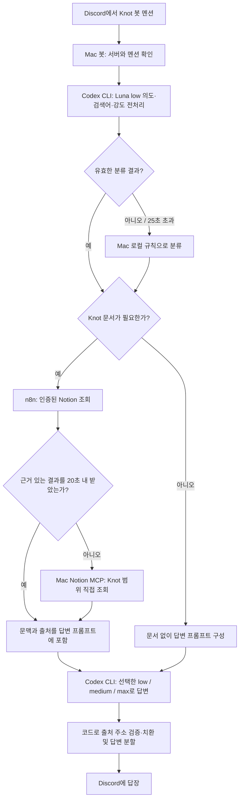
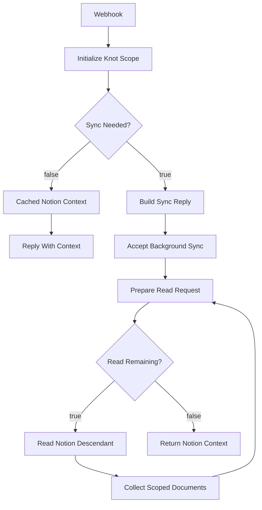

# Knot Discord Assistant

Mac에서 실행되는 개발 생산성 봇이다. Knot 서버에서 봇을 멘션하면 n8n으로 문서를 조회하고, 실패·빈 결과·20초 대기 초과 시 읽기 전용 Notion MCP로 직접 조회한다. 결과 문맥으로 ChatGPT 로그인된 로컬 Codex CLI의 `gpt-5.6-luna` 답변을 만든다. 질문에 따라 추론 강도를 자동 선택한다. 인사와 가벼운 대화는 Notion 조회를 건너뛴다.

이 문서는 2026-10-06 회의 명령 추가까지의 구현과 운영 구성을 기준으로 한다. 제품 기능과 별도로 실행하는 개발 도구다.

저장소에 남는 운영·검증 기록은 [Knot Discord 챗봇 운영 및 답변 품질 검증](../../docs/operations/knot-discord-assistant.md)에 정리했다.
소스·테스트·이 README와 `.env.example`만 추적한다. 실제 `.env`와 캐시·실행 결과는 ignore 규칙으로 제외한다.

## 회의 일정 생성·수정·취소

`/회의 생성`은 기본 정보 → 안건 폼과 비공개 미리보기로 이어진다. 날짜는 오늘부터 25일 목록에서 선택하고, 시간은 `2030` 또는 `20:30`처럼 시·분만 직접 입력한다. 연도는 선택한 날짜에 자동으로 포함되며 제출하면 `20:30`으로 정리된다. 기존 공지 수정 시 목록 밖의 원래 날짜도 유지된다. 첫 폼에 날짜·시간·구분·대상·장소를 모두 입력하고 비공개 `다음 · 안건 작성` 버튼으로 두 번째 폼을 연다.

회의 구분은 정규·긴급·백엔드·프론트엔드, 알림 대상은 FE·BE·Everyone이다. 장소·주제·결정해야 할 것도 필수다. 마지막 `공지 확정` 전에는 공지를 보내지 않는다. 공지는 항상 `#회의-일정`으로 보내고, 작성자만 공지 아래 수정·취소 버튼을 사용할 수 있다. 수정은 같은 메시지를 갱신하고 취소는 취소됨 표시와 버튼 제거로 처리한다. 수정·취소 때 대상에게 다시 알리지 않는다.

`DISCORD_FE_ROLE_ID`, `DISCORD_BE_ROLE_ID`, `DISCORD_MEETING_CHANNEL_ID`는 `.env.example`에 현재 서버 기본값이 있다. 게시된 내역은 저장소 밖의 `~/Library/Application Support/KnotDiscordAssistant/meetings.sqlite3`에 0600으로 보관하고 재시작 후 버튼을 복원한다. AI·Notion 호출과 자동 리마인더는 이 흐름에 없다. Mac이 꺼지면 버튼 처리도 멈춘다.

사용법·장애 처리·실제 검증 범위는 [회의 명령 운영 기록](../../docs/operations/discord-meeting-command.md), 설계는 [#505 구현 계획](../../docs/implement-plan/505-discord-meeting-command.md)을 참고한다.

## 전체 흐름



- Discord Gateway의 봇 연결이 멘션을 수신한다. 처음 전달했던 Discord 전송용 웹훅은 현재 수신·답변 경로에 사용하지 않는다. 답변은 로그인한 봇이 원래 메시지에 직접 보낸다.
- Mac은 질문 분류·AI 답변·Notion MCP 직접 조회를 담당하고, n8n은 Notion 수집·검색·캐시를 담당한다. Mac에 문서 캐시를 저장하지 않는다. MCP는 조회할 때 로컬 stdio 프로세스로 시작하며 공개 포트를 열지 않는다.
- 분류와 답변은 각각 새 Codex CLI 프로세스로 실행한다. 현재는 생성 완료 후 답변을 전송하며, 스트리밍과 이전 대화 이력 전달은 구현되어 있지 않다.

## 운영 대상과 설정

| 항목 | 현재 값 / 저장 위치 |
|---|---|
| Discord 애플리케이션·봇 ID | `1554427227473711114` |
| 허용 Discord 서버 ID | `1536954284447633448` |
| 응답 조건 | 허용 서버의 채널에서 봇을 직접 멘션한 사용자 메시지 |
| 제외 | DM, 다른 서버, 봇이 보낸 메시지, 멘션 없는 메시지 |
| Notion 루트 | `3aeb4351752280a29797de8949496356` |
| n8n 워크플로우 | `Knot Dev Assistant - Discord Mention` / `hq0ZfDUytZuFtlvt` |
| 질문 분류 모델 | `gpt-5.6-luna`, `low` 고정 |
| 답변 모델 | `CODEX_MODEL`, 기본 `gpt-5.6-luna` |
| 답변 강도 | 분류 결과의 `low`, `medium`, `max` |
| Discord 토큰 | macOS Keychain, 서비스 `com.knot.discord-assistant`, 계정은 현재 macOS 사용자 |
| Notion 액세스 토큰 | n8n 자격 증명과 Mac Keychain 서비스 `com.knot.discord-assistant.notion` |
| 웹훅 공유 비밀값 | n8n의 `Knot Dev Assistant Webhook Auth`와 Mac의 `.env` |

`BOT_USER_ID`는 Discord 연결 후 확인하므로 별도 환경 변수로 입력하지 않는다. Notion 토큰은 Mac Keychain에 저장하고 코드·문서·`.env`에 실제 값을 넣지 않는다. Discord Public Key는 봇 로그인 토큰을 대신할 수 없다.

| 환경 변수 | 의미 | 기본값 / 제약 |
|---|---|---|
| `N8N_NOTION_WEBHOOK_URL` | n8n production webhook | 필수, HTTPS와 `n8n.aitestbed.kr` 호스트만 허용 |
| `N8N_WEBHOOK_SECRET` | Header Auth 비밀값 | 필수, 문서에 실제 값을 기록하지 않음 |
| `DISCORD_GUILD_ID` | Mac이 허용하는 서버 | `1536954284447633448` |
| `NOTION_ROOT_PAGE_ID` | 조회 루트 | 위 Knot 루트 ID |
| `CODEX_MODEL` | 답변 모델 | `gpt-5.6-luna`; 분류 모델은 바뀌지 않음 |
| `MAX_CONTEXT_CHARS` | 답변 모델에 전달할 문맥 문자 수 | `12000`, 허용 범위 `1000`~`30000` |

서버와 루트를 변경하려면 Mac의 MCP 범위 상수와 n8n의 고정 범위 검사를 함께 수정해야 한다. MCP의 루트는 `settings.ROOT_PAGE_ID`로 고정되어 환경 변수로 넓힐 수 없다. MCP는 Keychain 대신 프로세스 환경 변수 `NOTION_ACCESS_TOKEN`도 지원한다.

## 준비

- macOS, `uv`, Codex CLI가 설치되어 있고 `codex login status`가 ChatGPT 로그인 상태여야 한다.
- Discord Developer Portal에서 Message Content Intent가 켜져 있어야 한다.
- `.env`의 `CODEX_MODEL` 기본값은 `gpt-5.6-luna`다. 같은 ChatGPT 로그인으로 Codex CLI의 Luna low가 먼저 질문을 분류한다. 별도 API 키는 사용하지 않는다.
- Codex는 사용자 설정, 플러그인, 앱, 셸, 브라우저 도구를 비활성화하고 읽기 전용으로 실행한다.
- n8n은 HTTPS production webhook으로 요청을 받아 다음 JSON을 돌려줘야 한다.

```json
{
  "context": "검색된 Knot 문서 내용",
  "sources": [{ "title": "페이지 제목", "url": "https://www.notion.so/..." }],
  "warnings": [],
  "coverage": { "complete": true, "documents": 10, "requests": 0, "cached": true }
}
```

Webhook은 `query`, `root_page_id`, 문자열 `guild_id`, `action`을 받는다. Discord ID는 JavaScript 정수 정밀도 한도를 넘으므로 문자열로 전달한다.

[운영 워크플로우](https://n8n.aitestbed.kr/workflow/hq0ZfDUytZuFtlvt)는 Header Auth로 인증한다. `실제 운영용 Knot Access Key`로 Knot 루트의 하위 페이지, 중첩 블록, 데이터베이스의 모든 데이터 소스와 문서를 조회한다. Notion API `2025-09-03`을 명시하고 HTTP Request의 Lowercase Headers를 끈다. HTTP 요청은 GET과 조회용 POST만 생성하며 페이지 수정 API를 사용하지 않는다. 외부 페이지 링크와 관계는 따라가지 않는다.

첫 `action=ask` 요청은 캐시가 없으면 HTTP 202와 `pending=true`를 반환하고 백그라운드에서 수집한다. Mac은 `action=status`로 완료 여부를 확인한다. 수집 결과는 15분 동안 재사용한다. 오래된 캐시가 있으면 먼저 답변하고 백그라운드에서 새로 수집한다. Notion 요청은 700ms 간격으로 보내며 속도 제한과 서버 오류는 큐 뒤로 보내 최대 10회 재시도한다. 접근 실패、외부 동기화 블록 제외、조회 한도 도달은 `warnings`에 기록한다. 성공한 답변에는 운영 경고를 자동으로 붙이지 않는다.

관련 근거를 찾지 못하면 빈 `context`와 `sources`를 반환한다. 수집은 실행당 5,000개 읽기 요청으로 제한되며, 한도에 도달하면 전체 조회 완료로 표시하지 않는다.

Mac의 봇과 검증 명령은 먼저 저장된 조회 결과를 확인하고, 갱신이 필요할 때만 수집을 시작한다. `~/Library/Application Support/KnotDiscordAssistant/notion-sync.json`에 파일 잠금으로 시작 상태를 공유하여 재시작과 동시 요청의 중복 수집을 막는다. 새 조회 결과를 확인하면 잠금을 해제하고, 완료 신호가 없으면 2시간 뒤 재시도를 허용한다. 답변 링크는 조회된 출처와 대조하고, 제목이 일치하면 실제 URL로 교정하며 확인되지 않은 링크는 제거한다. 인용하지 않은 검색 후보를 참고 문서 목록으로 자동 추가하지 않는다.

## n8n 워크플로우 구조

실행 노드 12개와 설명용 Sticky Note 1개로 구성한다. 노드 이름은 운영 화면의 이름과 같다.



| 노드 | 역할 |
|---|---|
| `Webhook` | POST 요청 수신, Header Auth 확인 |
| `Initialize Knot Scope` | 서버·루트·비어 있지 않은 질문 검사, 캐시 상태와 수집 큐 구성 |
| `Sync Needed?` | 새 수집을 시작할지 저장된 결과를 반환할지 분기 |
| `Cached Notion Context` | 저장된 문서에서 관련 문맥·출처·경고 구성; 캐시가 없으면 대기 상태 구성 |
| `Reply With Context` | 조회 결과 또는 대기 상태를 Mac에 반환 |
| `Build Sync Reply` | 수집 시작 응답 구성; 이전 캐시가 있으면 그 문서의 문맥을 포함 |
| `Accept Background Sync` | Mac에 먼저 응답하고 같은 실행에서 수집을 계속 진행 |
| `Prepare Read Request` | 큐에서 읽을 작업과 API 요청 구성, 실행당 읽기 한도 적용 |
| `Read Remaining?` | 읽을 작업이 남았으면 API 호출, 끝났으면 캐시 저장 단계로 이동 |
| `Read Notion Descendant` | n8n Notion 자격 증명으로 읽기 요청 실행 |
| `Collect Scoped Documents` | 문서와 블록 내용 수집, 하위 항목·다음 페이지·재시도 작업을 큐에 추가 |
| `Return Notion Context` | 수집 결과를 workflow global static data의 `knotReadCache`에 저장 |

수집 완료 경로는 이미 응답한 HTTP 요청에 두 번째 답변을 보내지 않는다. Mac의 다음 `status` 요청이 저장된 결과를 읽는다. 설명용 Sticky Note에도 Luna low 분류와 질문별 답변 강도를 기록했다.

### 웹훅 계약

Production URL: `https://n8n.aitestbed.kr/webhook/907be9c6-b1e6-46a6-aa5b-8d979995b465`

Header Auth는 `X-Knot-Assistant-Secret` 헤더를 사용한다. 실제 비밀값은 `.env`와 n8n 자격 증명에서만 관리한다.

```json
{
  "query": "Knot 그라운드 룰 알려줘",
  "root_page_id": "3aeb4351752280a29797de8949496356",
  "guild_id": "1536954284447633448",
  "action": "status"
}
```

- `status`: 새 수집을 시작하지 않고 현재 캐시·갱신 상태를 조회한다.
- `ask`: 유효한 캐시가 없으면 수집을 시작하고, 이미 최신 캐시가 있으면 저장된 문서를 사용한다.
- Mac은 `status`부터 호출한다. 갱신이 필요하고 공유 수집 잠금을 획득한 경우에만 `ask`를 한 번 호출한다.
- n8n은 질문을 최대 2,000자로 잘라 검색한다. 봇의 답변 프롬프트에는 원래 질문을 전달한다.

| 응답 상태 | Mac의 처리 |
|---|---|
| HTTP 200, `pending=false`, `refreshing=false` | 저장된 문맥으로 답변 |
| HTTP 200, `pending=false`, `refreshing=true` | 이전 문맥으로 먼저 답변; 갱신 상태는 내부 기록 |
| HTTP 202, `pending=true` | 문맥이 준비될 때까지 3초 간격으로 `status` 조회 |
| 인증·범위 검사 실패, HTTP 오류 | 원인 코드를 기록하고 Notion MCP 직접 조회로 전환 |

`sources`는 제목과 실제 Notion URL이다. `warnings`는 접근 실패·제외·속도 제한·읽기 한도 등의 설명이다. `coverage.complete=false`이면 수집이 끝났더라도 전체 문서를 확인했다는 뜻이 아니다. `coverage.requests`는 해당 실행의 읽기 요청 수이며 캐시 조회에서는 0일 수 있다.

### Notion 조회 범위와 수집 설정

- Knot 루트에서 하위 페이지, 중첩 블록, 하위 데이터베이스를 따라간다. 데이터베이스 메타데이터의 `data_sources`를 읽고 각 데이터 소스를 조회하여 행 페이지와 그 내용을 수집한다. 커서가 있으면 다음 페이지도 큐에 넣는다.
- 외부 페이지 링크, 관계 속성으로 연결된 페이지, 외부 동기화 블록은 확장하지 않는다. 연결된 항목이 실제 Knot 하위 데이터라는 근거 없이 조회 범위를 넓히지 않는다.
- 범위 제한은 n8n의 고정 루트 검사와 조회 큐로 적용한다. 답변 프롬프트의 “Knot 문서만 사용” 지시가 접근 제어를 대신하지 않는다. Notion이 자격 증명에 허용하지 않은 문서는 읽을 수 없다.
- DB의 `data_sources`가 비어 있으면 빈 DB와 권한 부족을 단정하지 않고 경고를 남긴다.

| 설정 | 현재 값 |
|---|---|
| Notion API 버전 | `2025-09-03` |
| HTTP Request의 Lowercase Headers | 끔; 자격 증명이 다른 버전 헤더를 추가하는 충돌 방지 |
| API 호출 종류 | GET, 데이터 소스 조회용 POST |
| 호출 간격 / 배치 크기 | 700ms / 1 |
| HTTP 요청 제한 시간 | 20초 |
| HTTP 노드 재시도 | 3회, 1초 간격 |
| 속도 제한·서버 오류의 큐 재시도 | 최대 10회, 큐 뒤로 이동 |
| 실행당 읽기 한도 | 5,000회; 초과 시 경고와 불완전 범위 표시 |
| 질문당 반환 출처 | 최대 8개 문서 |
| 캐시 유효 시간 | 15분 |
| 현재 캐시 형식 | version 4; version 3은 이전 결과로만 사용 |

## 읽기 전용 Notion MCP

`notion_mcp.py`는 공식 MCP Python SDK v1을 사용한다. Notion API `2025-09-03`과 기존 액세스 키로 접속한다. 검색·본문 조회 전에 부모 페이지, 블록, 데이터 소스, DB 경로가 Knot 루트에 도달하는지 확인한다. 범위 검증에 필요한 상위 항목 메타데이터만 읽고 범위 밖 본문은 반환하지 않는다. 외부 링크·관계·참조된 동기화 블록을 따라가지 않는다.

| MCP 도구 | 동작 |
|---|---|
| `search_knot(query, search_queries?)` | 전처리 검색어 최대 4개 또는 원문·Notion 링크로 조회. Knot 범위의 최대 5개 페이지 |
| `read_knot_page(page_id)` | 지정 페이지 속성·본문·중첩 블록 읽기 |
| `read_knot_database(database_id)` | DB의 데이터 소스와 소스별 처음 8개 문서 읽기 |

수정·삭제 도구는 없다. HTTP는 허용된 GET과 검색·데이터 소스 조회용 POST만 생성한다. 봇은 `search_knot`을 호출한다. 제목 검색은 전체 본문 검색이 아니며, DB의 모든 행을 한 번에 읽었다고 안내하지 않는다. 직접 조회 결과는 항상 `coverage.complete=false`다. 검색어별 대표 문서를 우선 읽어 주제 문서와 규칙 문서를 함께 확보하고, 긴 본문은 주제 키워드가 나오는 부분과 앞뒤 문장을 추출한다.

도구 실행당 API 요청 최대 120회, 350ms 간격, 페이지네이션 조회당 최대 500개, 페이지당 중첩 블록 30개 묶음, 반환 본문 12,000자·문서당 2,400자, MCP 응답 제한 120초다. 첨부 파일·이미지 내용은 검색하지 않는다. 현재 Mac에서 Keychain 읽기를 확인한 Python 3.11로 MCP를 실행하며 봇의 Python 환경과 분리한다. 키 저장 후 Python 실행 환경을 변경하면 macOS 키체인 접근 확인이 다시 필요할 수 있다.

다른 MCP 클라이언트에 연결할 때 사용할 설정 예시다. 전역 Codex 설정에는 자동 등록하지 않는다.

```toml
[mcp_servers.knot_notion]
command = "/opt/homebrew/bin/uv"
args = ["run", "--python", "3.11", "--script", "/absolute/path/to/knot/tools/discord-knot-assistant/notion_mcp.py"]
```

두 조회 경로가 모두 실패하면 `n8n 문서 조회 ... HTTP 503`와 `Notion MCP 직접 조회 ... 액세스 키가 유효하지 않아`처럼 각 경로와 원인을 답장한다. 전환으로 복구하면 전환 사유는 운영 로그에만 남긴다. 분류·문서 조회·Codex 답변 생성 실패는 `stage`, `failure_code`, `message_id`로 기록한다. 예기치 않은 Discord 연결 끊김으로 전송 자체가 불가능하면 채널에 오류 안내를 보낼 수 없다.

## AI 분류·답변 계약

Luna low가 Notion 문서 없이 질문 의도와 검색어, 조회 여부, 답변 강도를 한 번에 전처리한다. 추가 모델 호출을 끼우지 않는다. 결과는 다음 네 필드만 허용한다.

```json
{
  "effort": "medium",
  "retrieve_notion": true,
  "intent": "초대 발급·재사용 정책이 단일 또는 복수 모드인지 판단",
  "search_queries": ["초대", "도메인 규칙", "워크스페이스"]
}
```

JSON Schema로 출력을 제한하고 Pydantic으로 다시 파싱한다. `effort`는 `low`, `medium`, `max`만 허용하고 조회 여부는 Boolean만 허용한다. 잘못된 값·추가 필드·문자열 Boolean은 로컬 규칙으로 복구한다. “안녕, 우리 스프린트 목표가 뭐야?”처럼 인사와 질문이 섞여 있으면 실제 질문을 기준으로 분류하도록 지시한다.

답변은 결론을 먼저 말하고 핵심 근거와 필요한 미확정 사항을 덧붙인다. 기본 1~6문장, 자연스러운 반말, 사용한 출처 1~2개다. 질문에 필요한 규칙만 답하며 수치·시간·조건·부정 표현이 문서와 맞고 서로 모순되지 않는지 점검하도록 한다. 문서의 표현을 질문의 의미와 비교해 판단하되 추론임을 구분한다. 목표 규칙과 현재 구현 상태, 확정 사항과 미정 사항을 섞지 않는다. 복구된 오류와 내부 검색 과정은 설명하지 않으며, 근거가 부족하면 빠진 규칙을 짧게 알려준다. 문서와 질문은 참고 데이터로 전달하고 그 안의 도구 실행 지시는 따르지 않도록 한다. Codex는 ephemeral·read-only 모드이며 사용자 설정과 셸·앱·플러그인·브라우저·멀티 에이전트 도구를 비활성화한다.

| 제한 | 값 / 의미 |
|---|---|
| 분류 실행 제한 시간 | 25초; 초과·실패 시 로컬 분류 |
| 답변 실행 제한 시간 | 180초; 초과 시 답변 처리 실패 |
| Mac의 Codex 동시 실행 | 2개; 분류와 답변이 같은 실행 슬롯 사용 |
| Notion 요청 동시 처리 | 잠금으로 직렬화; 최초 수집 대기는 다른 조회를 지연시킬 수 있음 |
| n8n 문서 대기 | 잠금 대기·상태 조회를 포함하여 최대 20초 뒤 MCP 전환; 상태 조회 3초 간격 |
| Discord 답변 분할 | 한 메시지당 최대 1,800자 |
| 추가 멘션 | 답변의 자동 멘션과 원문 작성자 ping 비활성화 |

## 실행

```bash
uv run --script tools/discord-knot-assistant/bot.py set-token
uv run --script tools/discord-knot-assistant/bot.py set-notion-token
uv run --script tools/discord-knot-assistant/bot.py run
```

명령은 저장소 루트에서 실행한다. 기존 운영 Mac의 n8n 주소와 공유 비밀값은 로컬 `.env`에 설정되어 있으며, 새 환경에서는 아래 `configure`로 설정한다. `set-token`은 Discord 봇 토큰을 숨김 입력으로 받고 macOS Keychain에 저장한다. 채팅이나 파일에 토큰을 붙일 필요가 없다. `run`은 포그라운드 실행이다. `BOT_USER_ID`는 Discord 로그인 시 자동으로 확인한다. 설정한 Knot 서버에서 어느 채널이든 봇을 멘션하면 응답한다.

Discord에 메시지를 보내지 않고 실제 Notion → Codex 경로를 확인하려면:

```bash
uv run --script tools/discord-knot-assistant/bot.py verify --question 'Knot 문서 내용 요약해줘'
```

새 환경에서 전체 설정을 다시 할 때만 `configure`를 사용한다. `.env` 권한은 `600`이며 오류 출력에는 지역 변수와 토큰을 표시하지 않는다.

Mac 로그인 때 시작하고 프로세스를 자동 재시작하려면:

```bash
uv run --script tools/discord-knot-assistant/bot.py install-service
```

서비스 로그는 `~/Library/Logs/KnotDiscordAssistant/`에 저장된다. Mac이 잠자기 상태이거나 꺼져 있으면 봇은 응답하지 않는다.

### 재설정과 서비스 관리

```bash
# 새 Mac에서 전체 설정
uv run --script tools/discord-knot-assistant/bot.py configure

# n8n 주소와 Header Auth만 변경
uv run --script tools/discord-knot-assistant/bot.py set-n8n-auth

# 현재 사용자의 서비스 상태 확인
launchctl print "gui/$(id -u)/com.knot.discord-assistant"

# 코드 변경 후 재시작
launchctl kickstart -k "gui/$(id -u)/com.knot.discord-assistant"

# 자동 실행 등록 해제
uv run --script tools/discord-knot-assistant/bot.py uninstall-service
```

새 Mac에서는 명령의 저장소 경로를 실제 체크아웃 경로로 바꾼다. Codex의 ChatGPT 로그인과 Discord Keychain 토큰, n8n Header Auth를 각각 준비한다. `configure`는 `.env`를 새로 쓰므로 선택 환경 변수도 사용 중이면 다시 설정한다. 자동 실행 서비스가 켜져 있을 때 `run`을 추가 실행하면 봇 프로세스가 중복되므로 하나만 운영한다.

LaunchAgent는 로그인 후 실행하며, 프로세스 종료 시 재시작한다. Mac의 잠자기·전원 종료·네트워크 단절을 해결하는 24시간 클라우드 서비스는 아니다. 서비스 등록 파일은 `~/Library/LaunchAgents/com.knot.discord-assistant.plist`다.

### 로그와 장애 대응

로그 파일은 `~/Library/Logs/KnotDiscordAssistant/stdout.log`와 `stderr.log`다. 운영 로그는 JSON이며 다음 이벤트를 확인한다.

| 이벤트 / 필드 | 의미 |
|---|---|
| `discord.gateway.ready` | Discord 연결 완료; `bot_user_id` 확인 |
| `assistant.request.routed` | 질문 분류 완료; `classifier`, `reasoning_effort`, `retrieve_notion`, `failure_code` 확인 |
| `assistant.request.completed` | 답변 전송 완료; 단계별 처리 시간과 `message_id` 확인 |
| `assistant.request.failed` | 단계별 실패; `stage`, `failure_code`, `message_id`, `error_type` 확인 |
| `notion.lookup.fallback` | n8n 실패·대기 초과 후 MCP 전환; `failure_code`, `provider` 확인 |
| `classifier=luna_low` | 실제 모델 분류 결과 사용 |
| `classifier=local_fallback` | 빈 멘션 또는 모델 분류 실패로 로컬 규칙 사용 |

```bash
tail -n 50 ~/Library/Logs/KnotDiscordAssistant/stderr.log
codex login status
```

| 증상 | 확인과 대응 |
|---|---|
| 멘션에 반응하지 않음 | Mac·네트워크·서비스 상태, Ready 이벤트, 허용 서버, 실제 봇 멘션, Message Content Intent, 채널 보기·전송 권한 확인 |
| 분류 시간이 오래 걸림 | `classification_seconds` 확인; 실행 슬롯 대기도 포함. 25초 CLI 제한 뒤 로컬 규칙으로 진행 |
| 문서 조회가 오래 걸림 | `notion_seconds`와 n8n Executions 확인. 캐시 없는 첫 수집과 429 재시도가 원인일 수 있음 |
| 분류 후 답변이 오래 걸림 | `codex_wait_seconds` 확인. 모델 추론, CLI 시작과 실행 슬롯 대기가 포함됨 |
| Codex 로그인·응답 실패 | `codex login status` 확인 후 현재 Mac 사용자로 재로그인; 실제 질문은 `verify`로 재현 |
| 웹훅 인증 오류 | `.env`의 공유 비밀값과 n8n Header Auth의 값·헤더 이름 대조; `set-n8n-auth`로 재설정 |
| Notion 일부 문서 접근 불가 | n8n의 운영 자격 증명에 대상 페이지·DB의 연결과 읽기 권한이 있는지 확인 |
| 조회 범위·문서 갱신 상태 확인 | `verify`의 `refreshing`, `warnings`, `coverage.complete`와 수집 실행 확인. 성공한 Discord 답변에는 내부 조회 경고를 붙이지 않음 |
| 재시작했는데 새 수집을 시작하지 않음 | 공유 수집 상태의 2시간 제한 확인. 기존 n8n 실행을 먼저 확인하고 살아 있는 수집의 상태 파일을 임의로 지우지 않음 |

문서 또는 코드를 변경했으면 봇과 `verify`가 같은 분류·프롬프트 경로를 사용하는지 확인한다. n8n 변경은 실행 노드의 설정과 연결을 검토한 뒤 게시하고, `verify`로 인증·범위·출처·조회 한계가 유지되는지 확인한다. 새 n8n 환경에서는 자격 증명과 캐시를 별도로 준비해야 하며, 이 README가 실행 가능한 워크플로우 JSON 백업을 대신하지는 않는다.

## 코드 위치

| 파일 | 담당 |
|---|---|
| [bot.py](bot.py) | CLI 설정, Keychain 토큰, 실행·검증·서비스 등록 명령 |
| [assistant.py](assistant.py) | Discord 수신·답변, n8n 요청, 실행 슬롯, 단계별 로그 |
| [question_classifier.py](question_classifier.py) | Luna low 분류와 실패 시 복구 |
| [question_routing.py](question_routing.py) | 분류 결과 스키마와 로컬 복구 규칙 |
| [codex_cli.py](codex_cli.py) | Codex 실행, 답변 프롬프트, 답변 분할·출처 검증 |
| [settings.py](settings.py) | 환경 변수와 n8n 응답 스키마 |
| [sync_guard.py](sync_guard.py) | Mac 프로세스 간 수집 상태와 파일 잠금 |
| [macos_service.py](macos_service.py) | LaunchAgent 등록과 해제 |
| [notion_mcp.py](notion_mcp.py) | 읽기 전용 MCP 도구 3개와 API 연결 |
| [notion_mcp_client.py](notion_mcp_client.py) | 봇의 stdio MCP 실행·호출·응답 검증 |
| [notion_api.py](notion_api.py) | 읽기 경로 제한·페이지네이션·부모 경로 검증 |
| [notion_lookup.py](notion_lookup.py) | 제목 검색·페이지·DB 조회와 출처 구성 |
| [notion_models.py](notion_models.py) | Notion API·MCP 응답의 타입 검증 |
| [notion_credentials.py](notion_credentials.py) | Notion Keychain 저장·읽기 |
| [failure_details.py](failure_details.py) | 단계별 사용자 오류 안내 |
| [evaluation.py](evaluation.py) | 실제 문서·모델을 반복 검증하고 결과 저장 |
| [evaluation_cases.py](evaluation_cases.py) | 질문 사례·사실 판정 기준·출처와 응답 검사 |

## 답변 품질 검증 루프

```bash
uv run --script tools/discord-knot-assistant/bot.py evaluate --rounds 2
```

`evaluate`는 Discord에 게시하지 않고 봇과 같은 분류기, 검색 경로, 프롬프트, 모델, 답변 후처리를 실행한다. 초대 모드 질문, 같은 뜻의 다른 표현, 틀린 전제, 문서에 없는 운영 배포 시각, 잡담, 커밋 컨벤션의 6개 사례를 기본 2회 반복한다. `--rounds`는 1~3이다.

1. 시작할 때 실제 Notion 기준 문서를 별도로 읽는다. 기준 문서를 읽지 못하면 FAIL이다.
2. 코드 검사로 조회 필요 여부, 인용 주소, 빈 답변, 1,500자 초과, 복구된 오류 노출을 확인한다. 후처리 전 답변의 가짜 링크도 실패로 기록한다.
3. Luna Max가 질문별 기준, 독립적으로 읽은 기준 문서, 답변에 사용된 실제 조회 문서와 출처를 함께 사용해 사실 관계와 질문 이해를 검토한다. 기준 문서에 없다는 이유만으로 다른 조회 문서의 근거를 무시하지 않으며, 인용한 문서가 해당 주장을 뒷받침하는지도 검사한다. 답변 모델의 자기 평가만으로 통과하지 않는다. 판정 오류나 모델 실패도 FAIL이다.
4. 모든 사례가 모든 회차에서 통과해야 종료 코드 0을 반환한다. 하나라도 실패하면 종료 코드 1이다. 실패 기록을 읽고 검색·분류·답변 중 원인을 수정한 뒤 전체 2회를 다시 실행한다. 기대 사실을 낮춰 통과시키지 않는다.

결과는 `~/Library/Application Support/KnotDiscordAssistant/evaluations/`의 JSON에 사례마다 저장한다. 디렉터리는 700, 파일은 600 권한이다. 질문, 교정 전 모델 답변, 최종 답변, 검색어, 출처 주소, 선택 강도, 시간, 위반 사항을 보존하며 토큰과 Notion 본문 전체는 기록하지 않는다. 자동 예약 실행이나 운영 답변마다 검토 모델을 추가하는 설정은 아니다.

모델에는 출처 제목과 번호를 주고 `[출처 1]` 형식으로 인용하게 한다. 실제 URL은 조회 결과에 있는 값으로 코드가 붙인다. 범위 밖 번호는 제거하고 검증에서는 실패시킨다. 기존 Markdown 링크는 URL 대조와 제목 교정도 유지한다. 모델이 직접 작성한 잘못된 URL은 교정 여부와 관계없이 검증 FAIL이다.

제목 검색에서 검색어와 맞는 제목이 없으면 핵심 단어로 최대 4개 추가 검색한다. 검색 API가 무관한 제목만 반환한 경우도 재검색한다. `커밋 타입`으로 `커밋 컨벤션`을 놓친 실제 실패에서 도입했으며, 타입·정책·현재 같은 일반어를 추가 검색하지 않는다. 검색어별 대표 문서를 포함해 핵심 주제와 도메인 규칙을 함께 읽는다.

현재 프로젝트의 방식을 묻는 질문에는 문서에 적힌 후속 구현·미구현·재구현 필요 상태를 핵심 단서로 함께 답한다. 주변 규칙을 생략하는 간결성 지침 때문에 구현 상태까지 생략하지 않도록 한다.

장애 회귀 테스트는 n8n 503·시간 초과·빈 결과·무관한 문서·응답 형식 오류에서의 복구, 양쪽 조회 실패의 원인 안내, 범위 밖 본문 차단, DB와 중첩 블록, 늦게 등장하는 근거, 분류 오류를 포함한다. 실제 모델 검증과 합성 장애 검증은 별개의 증거다. Luna Max 판정도 완전한 품질 보장은 아니므로 새로운 실제 오답은 사례와 기준 문서에 추가한다.

## 질문별 추론 강도

| 질문 | 추론 강도 | Notion 조회 |
|---|---|---|
| 인사, 뭐해, 고마워, 웃음 등 명확한 일상 대화 | `low` | 생략 |
| 문서 조회·요약과 일반 질문 | `medium` | Knot 문서가 필요하면 사용 |
| 설계, 비교, 분석, 디버깅 등 복잡한 질문 | `max` | Knot 문서가 필요하면 사용 |

Luna low는 질문만 받고 추론 강도와 Notion 조회 필요 여부를 JSON Schema에 맞춰 반환한다. 인사가 섞여도 실제 질문을 기준으로 분류한다. 분류 호출은 최대 25초이며, 실패·시간 초과·잘못된 JSON이면 로컬 규칙으로 이어간다. 로컬 규칙은 복잡한 표현을 먼저 확인하고, 확실한 잡담만 조회를 생략한다. 빈 멘션은 분류 호출을 생략한다.

`verify`도 봇과 동일한 분류기를 사용한다. 서비스 로그에는 메시지 ID, 분류 방식, 선택한 강도, 분류 시간, Notion 조회 시간, Codex 처리 대기 시간과 전체 시간을 남긴다. 질문과 답변 원문은 기록하지 않는다. 분류와 Codex 시간에는 동시 실행 슬롯 대기와 CLI 시작 시간이 포함된다. 분류 호출 시간이 추가되므로 모든 질문이 빨라진다고 보장하지 않는다.

## 실제 Mac에서 확인한 동작

2026-09-30 기준:

- ChatGPT 로그인으로 `gpt-5.6-luna` / `max`의 실제 답변을 생성했다.
- Discord Gateway에서 봇 ID `1554427227473711114`의 Ready 이벤트를 확인했다.
- Knot 서버의 전체-채팅에서 실제 멘션에 인사와 Notion 출처를 포함한 문서 답변이 올라왔다.
- LaunchAgent를 설치했으며 `launchctl`에서 실행 상태를 확인했다.
- Python 3.14에서 기존 요청 처리와 질문별 강도 선택, 분류 결과 검증, 실패 시 로컬 규칙 사용을 포함한 테스트 30개가 통과했다.
- 실제 Codex CLI에서 Luna low가 잡담을 `low` / 조회 생략, Knot 규칙 질문을 `medium` / 조회 사용, 일반 캐시 설계 비교를 `max` / 조회 생략으로 분류하고 각각 답변까지 생성했다. 이 검증 명령은 Discord 메시지를 보내지 않는다.
- 위 세 번의 분류 호출은 각각 8.83초, 6.47초, 8.56초였다. 각 한 번의 관측이며 동일 질문의 Max 고정 방식과 비교한 성능 벤치마크는 아니다.

| 실제 CLI 질문 | 분류 | Notion 조회 | 분류 시간 | 답변 생성 시간 |
|---|---|---|---|---|
| 오늘 뭐해 ㅋㅋ | `low` | 생략 | 8.83초 | 8.26초 |
| Knot 그라운드 룰 두 가지 | `medium` | 사용 | 6.47초 | 8.41초 |
| 일반 캐시 갱신 설계의 장단점 비교 | `max` | 생략 | 8.56초 | 15.63초 |

문서 질문의 Notion 조회는 3.37초였다. 기존 Discord 실제 멘션 검증은 강도를 Max로 고정했던 시점의 결과이고, 질문별 강도 변경 후에는 CLI 전체 흐름과 서비스의 재연결을 확인했다. 변경 후 Discord 멘션 세 종류를 모두 재검증했다고 해석하지 않는다.

마지막 실제 문서 조회에서 캐시는 436개 문서였으며 `coverage.complete=false`, `refreshing=true`였다. 전체 Knot 하위 페이지·DB가 누락 없이 읽혔다고 확인한 상태는 아니다. 일부 DB의 데이터 소스 부재, 속도 제한과 이전 수집 한도 경고가 있었고, 더 큰 읽기 한도로 백그라운드 갱신하도록 구성했다. 전체 수집 완료 여부는 다음 n8n 실행 결과와 응답의 `coverage`로 확인한다.

로컬 테스트는 분류 결과 검증·복구와 요청 처리의 회귀 증거다. 실제 모델 분류 품질 전체나 현재 서비스 가동률을 보장하지 않는다. basedpyright는 설치되어 있지 않아 정적 타입 검사는 수행하지 않았다.

### 2026-10-03 MCP 전환 검증

- 현재 n8n이 HTTP 503을 반환하는 상황에서 `프론트엔드 커밋 타입 컨벤션 알려줘`를 실제 CLI로 처리했다. 직접 조회가 `커밋 컨벤션` 1개 문서를 찾아 `feat`, `fix`, `docs`, `refactor`, `chore`와 출처를 반환했다. 조회 5.30초, 답변 생성 10.69초였다. 관련도 우선 적용 전 같은 조회는 91회 요청·34.05초였고 적용 후 13회·5.30초였다.
- Discord 전체 채팅에서 실제 사용자 멘션 `1555888972750921801`을 보내고 봇 답장 `1555889064379682866`을 Discord REST로 확인했다. n8n HTTP 503 안내, MCP 전환, 커밋 타입과 실제 문서 링크가 포함됐다. 운영 로그의 분류 8.755초, 직접 조회 3.298초, 답변 생성 9.346초, 전체 21.911초였다.
- 실제 Knot 하위 DB `3b1b4351752280da9a7dcdf4cbb56efe`의 데이터 소스와 문서를 읽었다. 조회 103회·43.66초였고 반환 문맥에는 주간 회고·데모데이·연휴 스프린트 계획 등 6개 문서가 포함됐다. 문맥 한도 때문에 모든 DB 문서를 반환한 결과는 아니다.
- MCP stdio 초기화·읽기 도구 3개 목록·잘못된 UUID 오류를 실제 프로토콜로 확인했다. 로컬 회귀 테스트 36개가 통과했다. 범위 밖 페이지 본문 차단, DB 행 부모 경로, 중첩 블록, 페이지네이션, 쓰기 경로 거절, DB 스키마 파싱, n8n 503 전환과 두 경로의 실패 원인을 포함한다.
- 봇 서비스를 재시작하고 Discord Ready를 확인했다. n8n 서버의 503 자체는 복구하지 않았으며 직접 조회로 우회한다. 키체인 읽기에 멈춘 Python 3.14 MCP 시도는 종료했고, MCP와 Notion 키 저장 명령은 읽기가 확인된 Python 3.11을 사용한다.

### 2026-10-03 답변 품질 검증 루프

- 실제 Notion 문서와 ChatGPT 로그인된 Codex CLI로 6개 사례를 2회 반복해 12/12 PASS, 종료 코드 0을 확인했다. 분류는 Luna low, 문서 답변은 Luna medium, 잡담 답변은 Luna low, 별도 검토는 Luna Max였다. 보고서는 `~/Library/Application Support/KnotDiscordAssistant/evaluations/20261003T115741404833Z.json`이며 파일 권한은 600이다.
- 이전 반복 실행에서 커밋 문서 누락, 모델이 만든 잘못된 인용 URL, 만료 조건의 모순, 정책과 후속 구현 구분 누락을 FAIL로 기록했다. 검색의 제목 일치 검사와 핵심 단어 재검색, 번호 기반 출처, 답변의 조건 점검과 구현 상태 필수 안내를 적용했다. 이전 실패 보고서도 보존한다.
- 검토 모델이 기준 문서만 읽고 다른 조회 문서의 근거를 무시하는 판정 문제도 발견했다. 기준 문서와 실제 조회 문서를 모두 전달하고 주장과 인용 문서의 대응도 검사하도록 수정했다.
- Python 3.14 회귀 테스트 52개가 통과했다. 합성 장애 테스트의 통과와 실제 문서·모델 12회 통과는 별개의 증거다. basedpyright가 없어 정적 타입 검사는 수행하지 않았다.
- Discord 전체 채팅의 실제 멘션 3개에서 초대 코드 유지, 초대 정책과 구현 상태 구분, 커밋 컨벤션 답변을 확인했다. 성공 답변에 복구 오류 안내와 검색 후보 목록이 없었다. 최종 검색·프롬프트 적용 후 커밋 질문 `1555908929244889119`는 다섯 타입과 의미, 실제 커밋 문서 링크를 답했으며 운영 로그의 전체 처리 시간은 25.294초였다.
- LaunchAgent는 실행 중이다. n8n은 이번 실제 검증에서도 HTTP 503을 반환했으며 Notion MCP 조회로 복구했다. 검증 결과는 이 사례와 실행 시점의 증거이며 전체 문서 검색 완전성이나 모든 향후 질문의 정확성을 보장하지 않는다. 평가용 Luna Max 검토는 운영 답변 경로에 추가하지 않았다.
